# 数据模型 · 多平台彻底解耦

> v0.2 的核心架构决策：**取消单表 `platform_accounts` + `platform` 字段的写法**，改为**每平台一张独立的账号表**。本文档定义完整的库表结构、字段语义、索引策略、跨平台视图与迁移计划。
>
> **关联文档**：[01-product-overview.md](./01-product-overview.md) · [04-platform-integration.md](./04-platform-integration.md) · [07-api-contract.md](./07-api-contract.md)
> **修订日期**：2026-08-16

---

## 目录

1. [设计原则：彻底解耦](#1-设计原则彻底解耦)
2. [数据库 ER 图](#2-数据库-er-图)
3. [通用表（不区分平台）](#3-通用表不区分平台)
   - 3.1 `operators` 与 `operator_permissions`
   - 3.2 `nurture_tasks` 与 `nurture_schedules`
   - 3.3 `favorite_snapshots`
   - 3.4 `nurture_action_sets`
   - 3.5 `audit_logs` / `notifications` / `system_settings`
   - 3.6 `browser_sessions`
4. [平台特定表（每平台独立）](#4-平台特定表每平台独立)
   - 4.1 `platform_accounts_xhs`
   - 4.2 `platform_accounts_weibo`
   - 4.3 `platform_accounts_douyin`
   - 4.4 `platform_accounts_zhihu`
   - 4.5 `platform_accounts_twitter`
   - 4.6 `platform_accounts_bilibili`
   - 4.7 `platform_accounts_xiaoyuzhou`
   - 4.8 `platform_accounts_wechat_official`
5. [`platform_configs` 全局配置](#5-platform_configs-全局配置)
6. [跨平台数据查询视图](#6-跨平台数据查询视图)
7. [索引策略](#7-索引策略)
8. [Alembic 迁移计划](#8-alembic-迁移计划)
9. [字段语义词典](#9-字段语义词典)
10. [附录：完整 ER 关系矩阵](#10-附录完整-er-关系矩阵)

---

## 1. 设计原则：彻底解耦

### 1.1 ❌ 旧设计（已废弃）

```sql
-- v0.1 / v0.2 中期废弃方案：单表 + platform 字段
CREATE TABLE platform_accounts (
    id              INTEGER PRIMARY KEY,
    platform        VARCHAR(16) NOT NULL,  -- xhs / weibo / douyin ...
    platform_user_id VARCHAR(64),
    red_id          VARCHAR(64),            -- 仅小红书有
    weibo_uid       VARCHAR(64),            -- 仅微博有
    sec_uid         VARCHAR(64),            -- 仅抖音有
    -- ... 平台特定字段混在一起
    status          VARCHAR(16),
    created_at      DATETIME
);
```

**为什么错：**

| 病 | 症状 | 后果 |
| --- | --- | --- |
| 稀疏列泛滥 | 一张表 80+ 列，每行只用 1/8 | 索引失效，IO 翻倍 |
| JSON 字段堆叠 | 平台特有状态塞 `extra_json` | 失去类型校验，难查询 |
| 平台逻辑互相耦合 | 改小红书字段要重新 review 全表 | 改动半径大、风险高 |
| 索引难以定制 | 联合索引 `platform + xhs_red_id` 没意义 | 性能差 |
| 迁移难 | 加一个平台要 ALTER TABLE | 锁表 |

### 1.2 ✅ 新设计（v0.2 正式方案）

**核心规则：每平台一张独立的账号表，字段完全按平台语义定制，不共享表结构。**

```
platform_accounts_xhs              小红书账号
platform_accounts_weibo             微博账号
platform_accounts_douyin            抖音账号
platform_accounts_zhihu             知乎账号
platform_accounts_twitter           Twitter 账号
platform_accounts_bilibili          B 站账号
platform_accounts_xiaoyuzhou        小宇宙账号
platform_accounts_wechat_official   公众号账号
```

**核心理由：**

1. **字段差异巨大**：小红书的 `red_id` ≠ 微博的 `uid` ≠ 抖音的 `sec_uid`。强行塞一张表会导致 JSON 字段滥用。
2. **状态机不同**：小红书账号有「种草号」「个人号」区分；微博有「蓝 V / 黄 V / 红 V / 普通」；公众号有「订阅号 / 服务号 / 企业号」。状态机耦合 → bug 难定位。
3. **养号节奏不同**：抖音养号偏「刷直播 + 评论」；小红书养号偏「刷首页 + 收藏 + 评论」。混在一起策略写不下去。
4. **反检测策略不同**：微博风控弱（IP + cookie 即够）；小红书 / 抖音风控强（要 stealth + 真人化）。反检测参数属于平台账号表的字段。
5. **迁移灵活**：新增一个平台（比如视频号）只需要新建一张表 + 注册适配器，不需要 ALTER 任何已有表。

**唯一例外**：真正跨平台**通用**的信息（如 `id`、`operator_id`、`created_at`、`updated_at`），**不抽取共用表**，直接在每张表中独立存在，方便独立演化。

> **我们刻意不抽 `platform_accounts_common` 共享表。** 跨表关联通过应用层 JOIN（在 SQL 视图里完成），而非通过外键到一张共享表。这样改一张表不会牵连其他平台。

---

## 2. 数据库 ER 图

```mermaid
erDiagram
    operators ||--o{ operator_permissions : "grants"
    operators ||--o{ platform_accounts_xhs : "owns"
    operators ||--o{ platform_accounts_weibo : "owns"
    operators ||--o{ platform_accounts_douyin : "owns"
    operators ||--o{ platform_accounts_zhihu : "owns"
    operators ||--o{ platform_accounts_twitter : "owns"
    operators ||--o{ platform_accounts_bilibili : "owns"
    operators ||--o{ platform_accounts_xiaoyuzhou : "owns"
    operators ||--o{ platform_accounts_wechat_official : "owns"

    platform_accounts_xhs ||--o{ favorite_snapshots_xhs : "snapshots"
    platform_accounts_weibo ||--o{ favorite_snapshots_weibo : "snapshots"
    platform_accounts_douyin ||--o{ favorite_snapshots_douyin : "snapshots"
    platform_accounts_zhihu ||--o{ favorite_snapshots_zhihu : "snapshots"
    platform_accounts_twitter ||--o{ favorite_snapshots_twitter : "snapshots"
    platform_accounts_bilibili ||--o{ favorite_snapshots_bilibili : "snapshots"
    platform_accounts_xiaoyuzhou ||--o{ favorite_snapshots_xiaoyuzhou : "snapshots"
    platform_accounts_wechat_official ||--o{ favorite_snapshots_wechat : "snapshots"

    platform_accounts_xhs ||--o{ browser_sessions : "browser"
    platform_accounts_weibo ||--o{ browser_sessions : "browser"
    platform_accounts_douyin ||--o{ browser_sessions : "browser"

    platform_accounts_xhs ||--o{ nurture_tasks : "task"
    platform_accounts_weibo ||--o{ nurture_tasks : "task"

    nurture_schedules ||--o{ nurture_tasks : "triggers"
    nurture_action_sets ||--o{ nurture_tasks : "defines_actions"

    platform_configs ||--|| platform_accounts_xhs : "configures"
    platform_configs ||--|| platform_accounts_weibo : "configures"

    operators ||--o{ audit_logs : "actor"
    operators ||--o{ notifications : "recipient"
```



**ER 图关键约定：**

- 每个平台账号表独立，与 `operators` 通过 `operator_id` 关联
- 收藏夹快照**按平台分表**（虽然字段相似），理由同账号表
- `nurture_tasks` 是**跨平台通用任务表**，通过 `platform_code` 字段区分目标平台
- `browser_sessions` 也是**通用表**，按 `platform_code + account_id` 唯一

---

## 3. 通用表（不区分平台）

### 3.1 `operators` 与 `operator_permissions`

#### 3.1.1 `operators`

操作员表：使用 media-manager 的后台人员。

```sql
CREATE TABLE operators (
    id              INTEGER PRIMARY KEY AUTOINCREMENT,
    username        VARCHAR(64) NOT NULL UNIQUE,
    password_hash   VARCHAR(256) NOT NULL,
    display_name    VARCHAR(64) NOT NULL,
    email           VARCHAR(128),
    phone           VARCHAR(32),
    is_admin        BOOLEAN NOT NULL DEFAULT 0,
    is_active       BOOLEAN NOT NULL DEFAULT 1,
    last_login_at   DATETIME,
    last_login_ip   VARCHAR(64),
    created_at      DATETIME NOT NULL DEFAULT CURRENT_TIMESTAMP,
    updated_at      DATETIME NOT NULL DEFAULT CURRENT_TIMESTAMP
);

CREATE INDEX ix_operators_username ON operators(username);
CREATE INDEX ix_operators_email ON operators(email);
CREATE INDEX ix_operators_is_active ON operators(is_active);
```

| 字段 | 类型 | 必填 | 默认 | 说明 |
| --- | --- | --- | --- | --- |
| `id` | INTEGER | ✅ | auto | 主键 |
| `username` | VARCHAR(64) | ✅ | - | 登录名，唯一 |
| `password_hash` | VARCHAR(256) | ✅ | - | bcrypt hash |
| `display_name` | VARCHAR(64) | ✅ | - | 中文名 |
| `email` | VARCHAR(128) | ❌ | NULL | 通知邮箱 |
| `phone` | VARCHAR(32) | ❌ | NULL | 通知手机号 |
| `is_admin` | BOOLEAN | ✅ | false | 是否超管 |
| `is_active` | BOOLEAN | ✅ | true | 是否启用 |
| `last_login_at` | DATETIME | ❌ | NULL | 上次登录时间 |
| `last_login_ip` | VARCHAR(64) | ❌ | NULL | 上次登录 IP |
| `created_at` | DATETIME | ✅ | now | 创建时间 |
| `updated_at` | DATETIME | ✅ | now | 更新时间 |

**唯一约束**：`username` UNIQUE。

#### 3.1.2 `operator_permissions`

操作员权限表（细粒度）。

```sql
CREATE TABLE operator_permissions (
    id              INTEGER PRIMARY KEY AUTOINCREMENT,
    operator_id     INTEGER NOT NULL,
    resource        VARCHAR(64) NOT NULL,    -- e.g. "platform_accounts_xhs"
    action          VARCHAR(32) NOT NULL,    -- "read" / "write" / "delete" / "execute"
    granted_by      INTEGER,
    granted_at      DATETIME NOT NULL DEFAULT CURRENT_TIMESTAMP,
    expires_at      DATETIME,
    FOREIGN KEY (operator_id) REFERENCES operators(id) ON DELETE CASCADE,
    FOREIGN KEY (granted_by) REFERENCES operators(id) ON DELETE SET NULL
);

CREATE INDEX ix_operator_permissions_operator ON operator_permissions(operator_id);
CREATE INDEX ix_operator_permissions_resource ON operator_permissions(resource, action);
```

| 字段 | 类型 | 必填 | 默认 | 说明 |
| --- | --- | --- | --- | --- |
| `id` | INTEGER | ✅ | auto | 主键 |
| `operator_id` | INTEGER | ✅ | - | 关联 operators |
| `resource` | VARCHAR(64) | ✅ | - | 资源标识（如 `platform_accounts_xhs`） |
| `action` | VARCHAR(32) | ✅ | - | 动作：`read` / `write` / `delete` / `execute` |
| `granted_by` | INTEGER | ❌ | NULL | 授权人（operator.id） |
| `granted_at` | DATETIME | ✅ | now | 授权时间 |
| `expires_at` | DATETIME | ❌ | NULL | 过期时间（NULL = 永久） |

**唯一约束**：`(operator_id, resource, action)` UNIQUE。

---

### 3.2 `nurture_tasks` 与 `nurture_schedules`

#### 3.2.1 `nurture_tasks`

养号任务表（**通用表**，不绑定平台）。

> 平台信息通过 `platform_code` 字段（字符串，如 `"xhs"` / `"weibo"`）标识，具体账号通过 `account_table` + `account_id` 关联（**不用外键**，跨平台隔离）。

```sql
CREATE TABLE nurture_tasks (
    id                  INTEGER PRIMARY KEY AUTOINCREMENT,
    celery_task_id      VARCHAR(64) UNIQUE,
    operator_id         INTEGER NOT NULL,
    platform_code       VARCHAR(32) NOT NULL,    -- "xhs" / "weibo" / ...
    account_table       VARCHAR(64) NOT NULL,    -- "platform_accounts_xhs"
    account_id          INTEGER NOT NULL,
    actions_json        TEXT NOT NULL,           -- JSON: ["browse_home", "like_post", ...]
    duration_minutes    INTEGER NOT NULL DEFAULT 30,
    status              VARCHAR(16) NOT NULL DEFAULT 'pending', -- pending/running/success/failed
    progress_percent     INTEGER NOT NULL DEFAULT 0,
    result_json         TEXT,
    error_message       TEXT,
    started_at          DATETIME,
    finished_at         DATETIME,
    duration_seconds    INTEGER,
    created_at          DATETIME NOT NULL DEFAULT CURRENT_TIMESTAMP,
    updated_at          DATETIME NOT NULL DEFAULT CURRENT_TIMESTAMP,
    FOREIGN KEY (operator_id) REFERENCES operators(id) ON DELETE CASCADE
);

CREATE INDEX ix_nurture_tasks_operator ON nurture_tasks(operator_id);
CREATE INDEX ix_nurture_tasks_platform_account ON nurture_tasks(platform_code, account_id);
CREATE INDEX ix_nurture_tasks_status ON nurture_tasks(status);
CREATE INDEX ix_nurture_tasks_celery ON nurture_tasks(celery_task_id);
CREATE INDEX ix_nurture_tasks_created ON nurture_tasks(created_at DESC);
```

| 字段 | 类型 | 必填 | 默认 | 说明 |
| --- | --- | --- | --- | --- |
| `id` | INTEGER | ✅ | auto | 主键 |
| `celery_task_id` | VARCHAR(64) | ❌ | NULL | Celery 返回的 task_id，唯一 |
| `operator_id` | INTEGER | ✅ | - | 触发人 |
| `platform_code` | VARCHAR(32) | ✅ | - | 平台代码 |
| `account_table` | VARCHAR(64) | ✅ | - | 账号所在物理表名 |
| `account_id` | INTEGER | ✅ | - | 账号 ID |
| `actions_json` | TEXT | ✅ | `"[]"` | 待执行动作列表（JSON 数组） |
| `duration_minutes` | INTEGER | ✅ | 30 | 计划时长（分钟） |
| `status` | VARCHAR(16) | ✅ | `pending` | pending / running / success / failed / cancelled |
| `progress_percent` | INTEGER | ✅ | 0 | 进度 0-100 |
| `result_json` | TEXT | ❌ | NULL | 执行结果（JSON） |
| `error_message` | TEXT | ❌ | NULL | 失败信息 |
| `started_at` | DATETIME | ❌ | NULL | 实际开始时间 |
| `finished_at` | DATETIME | ❌ | NULL | 实际结束时间 |
| `duration_seconds` | INTEGER | ❌ | NULL | 实际耗时（秒） |
| `created_at` | DATETIME | ✅ | now | 创建时间 |
| `updated_at` | DATETIME | ✅ | now | 更新时间 |

**唯一约束**：`celery_task_id` UNIQUE。

**为什么不直接外键到 `platform_accounts_xhs.id` 等具体表？**

SQLite / 主流数据库不支持跨表外键到"动态表"。我们用 `(account_table, account_id)` 应用层关联，查询时按 `account_table` 拼 SQL：

```sql
-- 查某账号的养号任务
SELECT * FROM nurture_tasks
WHERE account_table = 'platform_accounts_xhs' AND account_id = 42;
```

#### 3.2.2 `nurture_schedules`

养号调度规则表（cron 触发）。

```sql
CREATE TABLE nurture_schedules (
    id                  INTEGER PRIMARY KEY AUTOINCREMENT,
    operator_id         INTEGER NOT NULL,
    name                VARCHAR(64) NOT NULL,
    platform_code       VARCHAR(32) NOT NULL,
    account_table       VARCHAR(64) NOT NULL,
    account_id          INTEGER NOT NULL,
    cron_expression     VARCHAR(64) NOT NULL,    -- "0 9 * * *"
    timezone            VARCHAR(64) NOT NULL DEFAULT 'Asia/Shanghai',
    actions_json        TEXT NOT NULL,
    duration_minutes    INTEGER NOT NULL DEFAULT 30,
    enabled             BOOLEAN NOT NULL DEFAULT 1,
    last_run_at         DATETIME,
    next_run_at         DATETIME,
    created_at          DATETIME NOT NULL DEFAULT CURRENT_TIMESTAMP,
    updated_at          DATETIME NOT NULL DEFAULT CURRENT_TIMESTAMP,
    FOREIGN KEY (operator_id) REFERENCES operators(id) ON DELETE CASCADE
);

CREATE INDEX ix_nurture_schedules_operator ON nurture_schedules(operator_id);
CREATE INDEX ix_nurture_schedules_enabled ON nurture_schedules(enabled, next_run_at);
CREATE INDEX ix_nurture_schedules_platform ON nurture_schedules(platform_code);
```

| 字段 | 类型 | 必填 | 默认 | 说明 |
| --- | --- | --- | --- | --- |
| `id` | INTEGER | ✅ | auto | 主键 |
| `operator_id` | INTEGER | ✅ | - | 创建人 |
| `name` | VARCHAR(64) | ✅ | - | 规则名 |
| `platform_code` | VARCHAR(32) | ✅ | - | 平台代码 |
| `account_table` | VARCHAR(64) | ✅ | - | 账号表名 |
| `account_id` | INTEGER | ✅ | - | 账号 ID |
| `cron_expression` | VARCHAR(64) | ✅ | - | 标准 5 字段 cron |
| `timezone` | VARCHAR(64) | ✅ | `Asia/Shanghai` | 时区 |
| `actions_json` | TEXT | ✅ | - | 动作列表 |
| `duration_minutes` | INTEGER | ✅ | 30 | 时长 |
| `enabled` | BOOLEAN | ✅ | true | 是否启用 |
| `last_run_at` | DATETIME | ❌ | NULL | 上次执行 |
| `next_run_at` | DATETIME | ❌ | NULL | 下次执行（用于扫描） |
| `created_at` | DATETIME | ✅ | now | - |
| `updated_at` | DATETIME | ✅ | now | - |

---

### 3.3 `favorite_snapshots`

> **v0.2 设计**：收藏夹快照按平台分表，因为不同平台的 `FavoriteItem` 字段差异（如小红书的「种草标签」vs B 站的「分区 tag」）。
>
> **简化**：v0.2 阶段，先用**一张通用表** `favorite_snapshots`，存 `items_json` 序列化的 `FavoriteItem` 列表，跨平台统一。后续 v0.3+ 再考虑分表。
>
> 但每平台**必须有自己的快照表**吗？——不，我们用**通用表 + platform_code 字段**。这是少数允许「按 platform_code 单表」的场景。

```sql
CREATE TABLE favorite_snapshots (
    id                  INTEGER PRIMARY KEY AUTOINCREMENT,
    account_table       VARCHAR(64) NOT NULL,    -- 冗余: 便于按 account_table 过滤
    platform_code       VARCHAR(32) NOT NULL,    -- "xhs" / "weibo" / ...
    account_id          INTEGER NOT NULL,        -- 不加外键(跨表)
    captured_at         DATETIME NOT NULL DEFAULT CURRENT_TIMESTAMP,
    item_count          INTEGER NOT NULL DEFAULT 0,
    items_json          TEXT NOT NULL DEFAULT '[]',  -- List[FavoriteItem]
    error               TEXT,
    duration_ms         INTEGER,                 -- 抓取耗时
    created_at          DATETIME NOT NULL DEFAULT CURRENT_TIMESTAMP
);

CREATE INDEX ix_favorite_snapshots_account ON favorite_snapshots(account_table, account_id);
CREATE INDEX ix_favorite_snapshots_platform ON favorite_snapshots(platform_code);
CREATE INDEX ix_favorite_snapshots_captured ON favorite_snapshots(account_id, captured_at DESC);
CREATE INDEX ix_favorite_snapshots_platform_captured ON favorite_snapshots(platform_code, captured_at DESC);
```

| 字段 | 类型 | 必填 | 默认 | 说明 |
| --- | --- | --- | --- | --- |
| `id` | INTEGER | ✅ | auto | 主键 |
| `account_table` | VARCHAR(64) | ✅ | - | 物理表名（冗余便于查询） |
| `platform_code` | VARCHAR(32) | ✅ | - | 平台代码 |
| `account_id` | INTEGER | ✅ | - | 账号 ID（应用层关联） |
| `captured_at` | DATETIME | ✅ | now | 抓取时间 |
| `item_count` | INTEGER | ✅ | 0 | 收藏数量 |
| `items_json` | TEXT | ✅ | `[]` | List[FavoriteItem] 序列化 |
| `error` | TEXT | ❌ | NULL | 抓取失败信息 |
| `duration_ms` | INTEGER | ❌ | NULL | 抓取耗时（毫秒） |
| `created_at` | DATETIME | ✅ | now | - |

**为什么不按平台分 8 张表？**

收藏夹项结构相对一致（id / title / author / url / cover_url / liked_at），分表带来的好处小于查询复杂度收益。**这是 v0.2 的权衡**，如果未来某个平台的 FavoriteItem 出现强特有字段（如小红书的 `xhs_note_type`），再迁到分表。

---

### 3.4 `nurture_action_sets`

养号动作集：预定义「浏览→点赞→收藏」组合，便于复用。

> **是否按平台分？** 动作集本质上是「动作名称列表」，动作名是**通用字符串**（如 `browse_home` / `like_post`），但实际含义依赖适配器。我们**不按平台分表**，但通过 `platform_code` 字段区分。

```sql
CREATE TABLE nurture_action_sets (
    id                  INTEGER PRIMARY KEY AUTOINCREMENT,
    operator_id         INTEGER NOT NULL,
    name                VARCHAR(64) NOT NULL,
    platform_code       VARCHAR(32) NOT NULL,    -- "xhs" / "weibo" / "ALL"
    actions_json        TEXT NOT NULL,           -- ["browse_home", "like_post", "favorite_post"]
    description         TEXT,
    is_builtin          BOOLEAN NOT NULL DEFAULT 0,
    created_at          DATETIME NOT NULL DEFAULT CURRENT_TIMESTAMP,
    updated_at          DATETIME NOT NULL DEFAULT CURRENT_TIMESTAMP,
    FOREIGN KEY (operator_id) REFERENCES operators(id) ON DELETE CASCADE
);

CREATE INDEX ix_nurture_action_sets_operator ON nurture_action_sets(operator_id);
CREATE INDEX ix_nurture_action_sets_platform ON nurture_action_sets(platform_code);
```

| 字段 | 类型 | 必填 | 默认 | 说明 |
| --- | --- | --- | --- | --- |
| `id` | INTEGER | ✅ | auto | 主键 |
| `operator_id` | INTEGER | ✅ | - | 创建人 |
| `name` | VARCHAR(64) | ✅ | - | 集合名（如「标准养号 v1」） |
| `platform_code` | VARCHAR(32) | ✅ | - | 适用平台 / `ALL` |
| `actions_json` | TEXT | ✅ | - | 动作列表 |
| `description` | TEXT | ❌ | NULL | 说明 |
| `is_builtin` | BOOLEAN | ✅ | false | 是否系统预置 |

**唯一约束**：`(operator_id, name)` UNIQUE。

---

### 3.5 `audit_logs` / `notifications` / `system_settings`

#### 3.5.1 `audit_logs`

操作审计日志（跨平台通用）。

```sql
CREATE TABLE audit_logs (
    id                  INTEGER PRIMARY KEY AUTOINCREMENT,
    operator_id         INTEGER,
    action              VARCHAR(64) NOT NULL,    -- "create_account" / "start_nurture" / ...
    resource_type       VARCHAR(64),             -- "platform_accounts_xhs"
    resource_id         INTEGER,
    platform_code       VARCHAR(32),
    ip_address          VARCHAR(64),
    user_agent          VARCHAR(256),
    payload_json        TEXT,                    -- 请求 payload 摘要
    result              VARCHAR(16),             -- "success" / "failure"
    error_message       TEXT,
    created_at          DATETIME NOT NULL DEFAULT CURRENT_TIMESTAMP,
    FOREIGN KEY (operator_id) REFERENCES operators(id) ON DELETE SET NULL
);

CREATE INDEX ix_audit_logs_operator ON audit_logs(operator_id, created_at DESC);
CREATE INDEX ix_audit_logs_resource ON audit_logs(resource_type, resource_id);
CREATE INDEX ix_audit_logs_platform ON audit_logs(platform_code, created_at DESC);
CREATE INDEX ix_audit_logs_action ON audit_logs(action, created_at DESC);
```

| 字段 | 类型 | 必填 | 默认 | 说明 |
| --- | --- | --- | --- | --- |
| `id` | INTEGER | ✅ | auto | 主键 |
| `operator_id` | INTEGER | ❌ | NULL | 操作人（系统操作时为 NULL） |
| `action` | VARCHAR(64) | ✅ | - | 动作名 |
| `resource_type` | VARCHAR(64) | ❌ | NULL | 资源类型 |
| `resource_id` | INTEGER | ❌ | NULL | 资源 ID |
| `platform_code` | VARCHAR(32) | ❌ | NULL | 平台代码 |
| `ip_address` | VARCHAR(64) | ❌ | NULL | 请求 IP |
| `user_agent` | VARCHAR(256) | ❌ | NULL | UA |
| `payload_json` | TEXT | ❌ | NULL | 请求 payload |
| `result` | VARCHAR(16) | ❌ | NULL | success / failure |
| `error_message` | TEXT | ❌ | NULL | 失败信息 |
| `created_at` | DATETIME | ✅ | now | - |

#### 3.5.2 `notifications`

通知表（站内信）。

```sql
CREATE TABLE notifications (
    id                  INTEGER PRIMARY KEY AUTOINCREMENT,
    operator_id         INTEGER NOT NULL,
    level               VARCHAR(16) NOT NULL DEFAULT 'info', -- info / warning / error
    title               VARCHAR(128) NOT NULL,
    content             TEXT,
    related_resource    VARCHAR(128),       -- e.g. "platform_accounts_xhs:42"
    is_read             BOOLEAN NOT NULL DEFAULT 0,
    read_at             DATETIME,
    created_at          DATETIME NOT NULL DEFAULT CURRENT_TIMESTAMP,
    FOREIGN KEY (operator_id) REFERENCES operators(id) ON DELETE CASCADE
);

CREATE INDEX ix_notifications_operator ON notifications(operator_id, is_read, created_at DESC);
```

| 字段 | 类型 | 必填 | 默认 | 说明 |
| --- | --- | --- | --- | --- |
| `id` | INTEGER | ✅ | auto | 主键 |
| `operator_id` | INTEGER | ✅ | - | 接收人 |
| `level` | VARCHAR(16) | ✅ | `info` | info / warning / error |
| `title` | VARCHAR(128) | ✅ | - | 标题 |
| `content` | TEXT | ❌ | NULL | 内容 |
| `related_resource` | VARCHAR(128) | ❌ | NULL | 关联资源 |
| `is_read` | BOOLEAN | ✅ | false | 已读 |
| `read_at` | DATETIME | ❌ | NULL | 已读时间 |
| `created_at` | DATETIME | ✅ | now | - |

#### 3.5.3 `system_settings`

系统配置（KV 表）。

```sql
CREATE TABLE system_settings (
    id              INTEGER PRIMARY KEY AUTOINCREMENT,
    key             VARCHAR(128) NOT NULL UNIQUE,
    value           TEXT,
    value_type      VARCHAR(16) NOT NULL DEFAULT 'string', -- string / int / bool / json
    description     TEXT,
    updated_by      INTEGER,
    updated_at      DATETIME NOT NULL DEFAULT CURRENT_TIMESTAMP,
    FOREIGN KEY (updated_by) REFERENCES operators(id) ON DELETE SET NULL
);

CREATE INDEX ix_system_settings_key ON system_settings(key);
```

**预置 key：**
- `nurture_global_enabled`（bool，默认 `false`）
- `nurture_silent_hours_start`（int，默认 `0`）
- `nurture_silent_hours_end`（int，默认 `6`）
- `nurture_max_likes_per_hour`（int，默认 `10`）
- `nurture_max_likes_per_day`（int，默认 `50`）
- `nurture_max_daily_seconds`（int，默认 `14400`）

---

### 3.6 `browser_sessions`

浏览器会话池。**通用**（按账号维度，不按平台分），因为会话池的字段跨平台一致。

```sql
CREATE TABLE browser_sessions (
    id                  INTEGER PRIMARY KEY AUTOINCREMENT,
    session_uuid        VARCHAR(64) NOT NULL UNIQUE,
    operator_id         INTEGER NOT NULL,
    platform_code       VARCHAR(32) NOT NULL,
    account_table       VARCHAR(64) NOT NULL,
    account_id          INTEGER NOT NULL,
    cdp_port            INTEGER NOT NULL UNIQUE,
    storage_state_path  VARCHAR(256) NOT NULL,    -- ./data/sessions/xxx.json
    user_data_dir       VARCHAR(256),             -- ./data/chrome-profiles/xxx
    status              VARCHAR(16) NOT NULL DEFAULT 'idle', -- idle / running / crashed / closed
    last_active_at      DATETIME,
    launched_at         DATETIME,
    closed_at           DATETIME,
    pid                 INTEGER,
    fingerprint_json    TEXT,                     -- UA / viewport / locale 等
    created_at          DATETIME NOT NULL DEFAULT CURRENT_TIMESTAMP,
    updated_at          DATETIME NOT NULL DEFAULT CURRENT_TIMESTAMP,
    FOREIGN KEY (operator_id) REFERENCES operators(id) ON DELETE CASCADE
);

CREATE INDEX ix_browser_sessions_operator ON browser_sessions(operator_id);
CREATE INDEX ix_browser_sessions_account ON browser_sessions(account_table, account_id);
CREATE INDEX ix_browser_sessions_platform ON browser_sessions(platform_code);
CREATE INDEX ix_browser_sessions_status ON browser_sessions(status);
CREATE INDEX ix_browser_sessions_cdp ON browser_sessions(cdp_port);
```

| 字段 | 类型 | 必填 | 默认 | 说明 |
| --- | --- | --- | --- | --- |
| `id` | INTEGER | ✅ | auto | 主键 |
| `session_uuid` | VARCHAR(64) | ✅ | - | 唯一 ID |
| `operator_id` | INTEGER | ✅ | - | 创建者 |
| `platform_code` | VARCHAR(32) | ✅ | - | 平台 |
| `account_table` | VARCHAR(64) | ✅ | - | 账号表名 |
| `account_id` | INTEGER | ✅ | - | 账号 ID |
| `cdp_port` | INTEGER | ✅ | - | Chrome DevTools Protocol 端口，唯一 |
| `storage_state_path` | VARCHAR(256) | ✅ | - | Playwright storage_state 文件路径 |
| `user_data_dir` | VARCHAR(256) | ❌ | NULL | Chrome profile 目录 |
| `status` | VARCHAR(16) | ✅ | `idle` | idle / running / crashed / closed |
| `last_active_at` | DATETIME | ❌ | NULL | 最近活跃 |
| `launched_at` | DATETIME | ❌ | NULL | 启动时间 |
| `closed_at` | DATETIME | ❌ | NULL | 关闭时间 |
| `pid` | INTEGER | ❌ | NULL | Chrome 进程 PID |
| `fingerprint_json` | TEXT | ❌ | NULL | 浏览器指纹（UA / viewport / locale） |
| `created_at` | DATETIME | ✅ | now | - |
| `updated_at` | DATETIME | ✅ | now | - |

**唯一约束**：`session_uuid` UNIQUE，`cdp_port` UNIQUE。

---

## 4. 平台特定表（每平台独立）

> **本节是 v0.2 的核心**。8 张表字段完全独立设计，反映各平台语义差异。
>
> 通用字段（`id` / `operator_id` / `created_at` / `updated_at` / `enabled` / `login_status`）每张表都有，但不复用。

### 4.1 `platform_accounts_xhs`（小红书）

```sql
CREATE TABLE platform_accounts_xhs (
    id                          INTEGER PRIMARY KEY AUTOINCREMENT,
    operator_id                 INTEGER NOT NULL,
    name                        VARCHAR(64) NOT NULL,
    session_name                VARCHAR(64) NOT NULL UNIQUE,

    -- ── 小红书特有字段 ──
    red_id                      VARCHAR(64),                -- 小红书号(用户自定义短号)
    xhs_user_id                 VARCHAR(64) NOT NULL UNIQUE,-- 内部 user_id
    xhs_nickname                VARCHAR(128),
    xhs_avatar_url              VARCHAR(512),
    xhs_bio                     TEXT,
    xhs_note_count              INTEGER NOT NULL DEFAULT 0, -- 笔记数
    xhs_fans_count              INTEGER NOT NULL DEFAULT 0, -- 粉丝数
    xhs_following_count         INTEGER NOT NULL DEFAULT 0,-- 关注数
    xhs_gender                  VARCHAR(8),                 -- M / F / U
    xhs_location                VARCHAR(64),
    xhs_verified_type           VARCHAR(16),                -- personal / brand / government / none
    xhs_red_official            BOOLEAN NOT NULL DEFAULT 0, -- 是否官方红 V
    xhs_red_level               INTEGER,                    -- 红 V 等级

    -- ── 登录态 ──
    storage_state_path          VARCHAR(256) NOT NULL,
    login_status                VARCHAR(16) NOT NULL DEFAULT 'unknown', -- unknown / logged_in / cookie_invalid / banned
    last_login_check_at         DATETIME,
    last_login_check_result     TEXT,                       -- JSON: 详细结果
    cookie_expires_at           DATETIME,                   -- 预估 cookie 过期时间

    -- ── 浏览器配置 ──
    cdp_port                    INTEGER UNIQUE,
    fingerprint_json            TEXT,                       -- UA / viewport / locale

    -- ── 养号参数 ──
    enabled                     BOOLEAN NOT NULL DEFAULT 1,
    priority                    INTEGER NOT NULL DEFAULT 0, -- 调度优先级
    daily_quota_seconds         INTEGER NOT NULL DEFAULT 14400,
    max_likes_per_hour          INTEGER NOT NULL DEFAULT 10,
    max_likes_per_day           INTEGER NOT NULL DEFAULT 50,
    silent_hours_start          INTEGER NOT NULL DEFAULT 0,
    silent_hours_end            INTEGER NOT NULL DEFAULT 6,

    -- ── 反检测策略（小红书风控强，参数多）──
    anti_detection_level        VARCHAR(16) NOT NULL DEFAULT 'strict', -- strict / normal / relaxed
    enable_stealth              BOOLEAN NOT NULL DEFAULT 1,
    enable_human_pause          BOOLEAN NOT NULL DEFAULT 1,
    enable_random_scroll        BOOLEAN NOT NULL DEFAULT 1,
    min_action_interval_ms      INTEGER NOT NULL DEFAULT 3000,
    max_action_interval_ms      INTEGER NOT NULL DEFAULT 15000,

    -- ── 元信息 ──
    tags_json                   TEXT,                       -- ["种草号", "美妆"]
    remark                      TEXT,
    created_at                  DATETIME NOT NULL DEFAULT CURRENT_TIMESTAMP,
    updated_at                  DATETIME NOT NULL DEFAULT CURRENT_TIMESTAMP,
    FOREIGN KEY (operator_id) REFERENCES operators(id) ON DELETE CASCADE
);

CREATE INDEX ix_platform_accounts_xhs_operator ON platform_accounts_xhs(operator_id);
CREATE INDEX ix_platform_accounts_xhs_red_id ON platform_accounts_xhs(red_id);
CREATE INDEX ix_platform_accounts_xhs_user_id ON platform_accounts_xhs(xhs_user_id);
CREATE INDEX ix_platform_accounts_xhs_login_status ON platform_accounts_xhs(login_status);
CREATE INDEX ix_platform_accounts_xhs_enabled ON platform_accounts_xhs(enabled, priority);
```

| 字段 | 类型 | 必填 | 默认 | 说明 |
| --- | --- | --- | --- | --- |
| `id` | INTEGER | ✅ | auto | 主键 |
| `operator_id` | INTEGER | ✅ | - | 所属操作员 |
| `name` | VARCHAR(64) | ✅ | - | 账号备注名 |
| `session_name` | VARCHAR(64) | ✅ | - | 会话名（用于 ChromePool） |
| `red_id` | VARCHAR(64) | ❌ | NULL | 小红书号（用户可自定义短号） |
| `xhs_user_id` | VARCHAR(64) | ✅ | - | 内部 user_id（唯一） |
| `xhs_nickname` | VARCHAR(128) | ❌ | NULL | 昵称 |
| `xhs_avatar_url` | VARCHAR(512) | ❌ | NULL | 头像 |
| `xhs_bio` | TEXT | ❌ | NULL | 简介 |
| `xhs_note_count` | INTEGER | ✅ | 0 | 笔记数 |
| `xhs_fans_count` | INTEGER | ✅ | 0 | 粉丝数 |
| `xhs_following_count` | INTEGER | ✅ | 0 | 关注数 |
| `xhs_gender` | VARCHAR(8) | ❌ | NULL | 性别 |
| `xhs_location` | VARCHAR(64) | ❌ | NULL | 地区 |
| `xhs_verified_type` | VARCHAR(16) | ❌ | NULL | 认证类型 |
| `xhs_red_official` | BOOLEAN | ✅ | false | 是否官方红 V |
| `xhs_red_level` | INTEGER | ❌ | NULL | 红 V 等级 |
| `storage_state_path` | VARCHAR(256) | ✅ | - | storage_state 文件路径 |
| `login_status` | VARCHAR(16) | ✅ | `unknown` | 登录态 |
| `last_login_check_at` | DATETIME | ❌ | NULL | 上次检查 |
| `last_login_check_result` | TEXT | ❌ | NULL | 检查结果详情 |
| `cookie_expires_at` | DATETIME | ❌ | NULL | cookie 预估过期 |
| `cdp_port` | INTEGER | ❌ | NULL | CDP 端口 |
| `fingerprint_json` | TEXT | ❌ | NULL | 浏览器指纹 |
| `enabled` | BOOLEAN | ✅ | true | 是否启用 |
| `priority` | INTEGER | ✅ | 0 | 调度优先级 |
| `daily_quota_seconds` | INTEGER | ✅ | 14400 | 每日配额（秒） |
| `max_likes_per_hour` | INTEGER | ✅ | 10 | 每小时点赞上限 |
| `max_likes_per_day` | INTEGER | ✅ | 50 | 每日点赞上限 |
| `silent_hours_start` | INTEGER | ✅ | 0 | 静默时段起（小时） |
| `silent_hours_end` | INTEGER | ✅ | 6 | 静默时段止（小时） |
| `anti_detection_level` | VARCHAR(16) | ✅ | `strict` | 反检测等级 |
| `enable_stealth` | BOOLEAN | ✅ | true | 是否启用 stealth.min.js |
| `enable_human_pause` | BOOLEAN | ✅ | true | 是否启用真人化暂停 |
| `enable_random_scroll` | BOOLEAN | ✅ | true | 是否启用随机滚动 |
| `min_action_interval_ms` | INTEGER | ✅ | 3000 | 操作最小间隔（毫秒） |
| `max_action_interval_ms` | INTEGER | ✅ | 15000 | 操作最大间隔（毫秒） |
| `tags_json` | TEXT | ❌ | NULL | 标签 JSON |
| `remark` | TEXT | ❌ | NULL | 备注 |
| `created_at` | DATETIME | ✅ | now | - |
| `updated_at` | DATETIME | ✅ | now | - |

**唯一约束**：`session_name` UNIQUE，`xhs_user_id` UNIQUE，`cdp_port` UNIQUE。

---

### 4.2 `platform_accounts_weibo`（微博）

```sql
CREATE TABLE platform_accounts_weibo (
    id                          INTEGER PRIMARY KEY AUTOINCREMENT,
    operator_id                 INTEGER NOT NULL,
    name                        VARCHAR(64) NOT NULL,
    session_name                VARCHAR(64) NOT NULL UNIQUE,

    -- ── 微博特有字段 ──
    weibo_uid                   VARCHAR(64) NOT NULL UNIQUE,  -- 用户 UID（数字串）
    weibo_screen_name           VARCHAR(128),                -- @昵称
    weibo_avatar_url            VARCHAR(512),
    weibo_bio                   TEXT,
    weibo_statuses_count        INTEGER NOT NULL DEFAULT 0,
    weibo_followers_count       INTEGER NOT NULL DEFAULT 0,
    weibo_friends_count         INTEGER NOT NULL DEFAULT 0,
    weibo_verified              BOOLEAN NOT NULL DEFAULT 0,
    weibo_verified_type         VARCHAR(16),                 -- blue_v / yellow_v / red_v / enterprise / none
    weibo_verified_reason       VARCHAR(128),                -- 认证说明
    weibo_container_id          VARCHAR(64),                 -- 关注关系 container_id
    weibo_ufp_id                VARCHAR(64),                 -- 微博 ufp_id（推荐流参数）
    weibo_gender                VARCHAR(8),                  -- m / f

    -- ── 登录态 ──
    storage_state_path          VARCHAR(256) NOT NULL,
    login_status                VARCHAR(16) NOT NULL DEFAULT 'unknown',
    last_login_check_at         DATETIME,
    last_login_check_result     TEXT,
    cookie_expires_at           DATETIME,
    sessdata                    VARCHAR(256),                  -- B 站 sessdata cookie
    bili_jct_refresh_at         DATETIME,                      -- bili_jct 上次刷新

    -- ── 浏览器配置 ──
    cdp_port                    INTEGER UNIQUE,
    fingerprint_json            TEXT,

    -- ── 养号参数（B 站风控弱偏中等）──
    enabled                     BOOLEAN NOT NULL DEFAULT 1,
    priority                    INTEGER NOT NULL DEFAULT 0,
    daily_quota_seconds         INTEGER NOT NULL DEFAULT 14400,
    max_likes_per_hour          INTEGER NOT NULL DEFAULT 20,
    max_likes_per_day           INTEGER NOT NULL DEFAULT 150,
    max_coin_per_day            INTEGER NOT NULL DEFAULT 50,   -- B 站特有:投币上限
    silent_hours_start          INTEGER NOT NULL DEFAULT 0,
    silent_hours_end            INTEGER NOT NULL DEFAULT 6,

    -- ── 反检测（B 站风控弱）──
    anti_detection_level        VARCHAR(16) NOT NULL DEFAULT 'relaxed',
    enable_stealth              BOOLEAN NOT NULL DEFAULT 1,
    enable_human_pause          BOOLEAN NOT NULL DEFAULT 1,
    enable_random_scroll        BOOLEAN NOT NULL DEFAULT 1,
    min_action_interval_ms      INTEGER NOT NULL DEFAULT 1500,
    max_action_interval_ms      INTEGER NOT NULL DEFAULT 6000,

    tags_json                   TEXT,
    remark                      TEXT,
    created_at                  DATETIME NOT NULL DEFAULT CURRENT_TIMESTAMP,
    updated_at                  DATETIME NOT NULL DEFAULT CURRENT_TIMESTAMP,
    FOREIGN KEY (operator_id) REFERENCES operators(id) ON DELETE CASCADE
);

CREATE INDEX ix_platform_accounts_bilibili_operator ON platform_accounts_bilibili(operator_id);
CREATE INDEX ix_platform_accounts_bilibili_mid ON platform_accounts_bilibili(mid);
CREATE INDEX ix_platform_accounts_bilibili_login_status ON platform_accounts_bilibili(login_status);
CREATE INDEX ix_platform_accounts_bilibili_enabled ON platform_accounts_bilibili(enabled, priority);
```

| 字段 | 类型 | 必填 | 默认 | 说明 |
| --- | --- | --- | --- | --- |
| `id` | INTEGER | ✅ | auto | 主键 |
| `operator_id` | INTEGER | ✅ | - | - |
| `name` | VARCHAR(64) | ✅ | - | - |
| `session_name` | VARCHAR(64) | ✅ | - | - |
| `mid` | INTEGER | ✅ | - | **B 站核心标识** |
| `bili_jct` | VARCHAR(256) | ❌ | NULL | - |
| `bili_uid` | INTEGER | ❌ | NULL | 冗余 == mid |
| `bili_nickname` | VARCHAR(128) | ❌ | NULL | - |
| `bili_avatar_url` | VARCHAR(512) | ❌ | NULL | - |
| `bili_bio` | TEXT | ❌ | NULL | - |
| `bili_sign` | TEXT | ❌ | NULL | - |
| `bili_level` | INTEGER | ✅ | 0 | 用户等级 |
| `bili_vip_type` | INTEGER | ✅ | 0 | 大会员类型 |
| `bili_vip_status` | INTEGER | ✅ | 0 | - |
| `bili_official` | BOOLEAN | ✅ | false | - |
| `bili_official_type` | INTEGER | ❌ | NULL | - |
| `bili_official_role` | INTEGER | ❌ | NULL | - |
| `bili_archive_count` | INTEGER | ✅ | 0 | 投稿 |
| `bili_article_count` | INTEGER | ✅ | 0 | 专栏 |
| `bili_album_count` | INTEGER | ✅ | 0 | 相册 |
| `bili_audio_count` | INTEGER | ✅ | 0 | 音频 |
| `bili_video_count` | INTEGER | ✅ | 0 | 视频（冗余） |
| `bili_follower_count` | INTEGER | ✅ | 0 | - |
| `bili_following_count` | INTEGER | ✅ | 0 | - |
| `bili_fans_medal_name` | VARCHAR(64) | ❌ | NULL | - |
| `bili_fans_medal_wearing` | BOOLEAN | ✅ | false | - |
| `bili_top_photo_url` | VARCHAR(512) | ❌ | NULL | - |
| `bili_gender` | VARCHAR(8) | ❌ | NULL | - |
| `storage_state_path` | VARCHAR(256) | ✅ | - | - |
| `login_status` | VARCHAR(16) | ✅ | `unknown` | - |
| `last_login_check_at` | DATETIME | ❌ | NULL | - |
| `last_login_check_result` | TEXT | ❌ | NULL | - |
| `cookie_expires_at` | DATETIME | ❌ | NULL | - |
| `sessdata` | VARCHAR(256) | ❌ | NULL | sessdata |
| `bili_jct_refresh_at` | DATETIME | ❌ | NULL | - |
| `cdp_port` | INTEGER | ❌ | NULL | - |
| `fingerprint_json` | TEXT | ❌ | NULL | - |
| `enabled` | BOOLEAN | ✅ | true | - |
| `priority` | INTEGER | ✅ | 0 | - |
| `daily_quota_seconds` | INTEGER | ✅ | 14400 | - |
| `max_likes_per_hour` | INTEGER | ✅ | 20 | - |
| `max_likes_per_day` | INTEGER | ✅ | 150 | - |
| `max_coin_per_day` | INTEGER | ✅ | 50 | 投币上限 |
| `silent_hours_start` | INTEGER | ✅ | 0 | - |
| `silent_hours_end` | INTEGER | ✅ | 6 | - |
| `anti_detection_level` | VARCHAR(16) | ✅ | `relaxed` | - |
| `enable_stealth` | BOOLEAN | ✅ | true | - |
| `enable_human_pause` | BOOLEAN | ✅ | true | - |
| `enable_random_scroll` | BOOLEAN | ✅ | true | - |
| `min_action_interval_ms` | INTEGER | ✅ | 1500 | - |
| `max_action_interval_ms` | INTEGER | ✅ | 6000 | - |
| `tags_json` | TEXT | ❌ | NULL | - |
| `remark` | TEXT | ❌ | NULL | - |
| `created_at` | DATETIME | ✅ | now | - |
| `updated_at` | DATETIME | ✅ | now | - |

---

### 4.3 `platform_accounts_douyin`（抖音）

抖音风控**最强**（和小红书并列），但字段语义完全不同（短视频流）。

```sql
CREATE TABLE platform_accounts_douyin (
    id                          INTEGER PRIMARY KEY AUTOINCREMENT,
    operator_id                 INTEGER NOT NULL,
    name                        VARCHAR(64) NOT NULL,
    session_name                VARCHAR(64) NOT NULL UNIQUE,

    -- ── 抖音特有字段 ──
    sec_uid                     VARCHAR(128) NOT NULL UNIQUE,  -- 抖音 sec_uid(关键)
    douyin_uid                  VARCHAR(64),                   -- 数字 UID
    douyin_short_id             VARCHAR(64),                   -- 抖音号
    douyin_nickname             VARCHAR(128),
    douyin_avatar_url           VARCHAR(512),
    douyin_signature            TEXT,                          -- 签名
    douyin_aweme_count          INTEGER NOT NULL DEFAULT 0,    -- 作品数
    douyin_following_count      INTEGER NOT NULL DEFAULT 0,
    douyin_follower_count       INTEGER NOT NULL DEFAULT 0,
    douyin_total_favorited      INTEGER NOT NULL DEFAULT 0,    -- 总获赞
    douyin_gender               VARCHAR(8),                    -- 0未知 1男 2女
    douyin_age                  INTEGER,                       -- 年龄段
    douyin_city                 VARCHAR(64),
    douyin_verify_type          VARCHAR(16),                   -- personal / enterprise / government / media
    douyin_is_verified          BOOLEAN NOT NULL DEFAULT 0,
    douyin_signature_extra      TEXT,                          -- 抖音特有"加 V 信息"

    -- ── 创作者平台字段 ──
    creator_uid                 VARCHAR(64),                   -- creator.douyin.com UID
    creator_nickname            VARCHAR(128),
    creator_token_expires_at    DATETIME,                      -- creator 平台 token 过期

    -- ── 登录态 ──
    storage_state_path          VARCHAR(256) NOT NULL,
    login_status                VARCHAR(16) NOT NULL DEFAULT 'unknown',
    last_login_check_at         DATETIME,
    last_login_check_result     TEXT,
    cookie_expires_at           DATETIME,
    ms_token                    VARCHAR(256),                  -- 抖音特殊 token
    ttwid                       VARCHAR(256),                  -- 抖音 ttwid cookie

    -- ── 浏览器配置 ──
    cdp_port                    INTEGER UNIQUE,
    fingerprint_json            TEXT,

    -- ── 养号参数（抖音偏刷视频）──
    enabled                     BOOLEAN NOT NULL DEFAULT 1,
    priority                    INTEGER NOT NULL DEFAULT 0,
    daily_quota_seconds         INTEGER NOT NULL DEFAULT 14400,
    max_likes_per_hour          INTEGER NOT NULL DEFAULT 8,    -- 比小红书更严
    max_likes_per_day           INTEGER NOT NULL DEFAULT 30,
    max_watch_seconds_per_video INTEGER NOT NULL DEFAULT 60,   -- 抖音养号看视频
    silent_hours_start          INTEGER NOT NULL DEFAULT 0,
    silent_hours_end            INTEGER NOT NULL DEFAULT 6,

    -- ── 反检测策略（抖音最强风控）──
    anti_detection_level        VARCHAR(16) NOT NULL DEFAULT 'strict',
    enable_stealth              BOOLEAN NOT NULL DEFAULT 1,
    enable_human_pause          BOOLEAN NOT NULL DEFAULT 1,
    enable_random_scroll        BOOLEAN NOT NULL DEFAULT 1,
    enable_watch_duration       BOOLEAN NOT NULL DEFAULT 1,   -- 模拟完整观看
    min_action_interval_ms      INTEGER NOT NULL DEFAULT 5000,
    max_action_interval_ms      INTEGER NOT NULL DEFAULT 20000,

    tags_json                   TEXT,
    remark                      TEXT,
    created_at                  DATETIME NOT NULL DEFAULT CURRENT_TIMESTAMP,
    updated_at                  DATETIME NOT NULL DEFAULT CURRENT_TIMESTAMP,
    FOREIGN KEY (operator_id) REFERENCES operators(id) ON DELETE CASCADE
);

CREATE INDEX ix_platform_accounts_douyin_operator ON platform_accounts_douyin(operator_id);
CREATE INDEX ix_platform_accounts_douyin_sec_uid ON platform_accounts_douyin(sec_uid);
CREATE INDEX ix_platform_accounts_douyin_short_id ON platform_accounts_douyin(douyin_short_id);
CREATE INDEX ix_platform_accounts_douyin_login_status ON platform_accounts_douyin(login_status);
CREATE INDEX ix_platform_accounts_douyin_enabled ON platform_accounts_douyin(enabled, priority);
```

| 字段 | 类型 | 必填 | 默认 | 说明 |
| --- | --- | --- | --- | --- |
| `id` | INTEGER | ✅ | auto | 主键 |
| `operator_id` | INTEGER | ✅ | - | - |
| `name` | VARCHAR(64) | ✅ | - | - |
| `session_name` | VARCHAR(64) | ✅ | - | - |
| `sec_uid` | VARCHAR(128) | ✅ | - | **抖音核心标识** |
| `douyin_uid` | VARCHAR(64) | ❌ | NULL | 数字 UID |
| `douyin_short_id` | VARCHAR(64) | ❌ | NULL | 抖音号 |
| `douyin_nickname` | VARCHAR(128) | ❌ | NULL | - |
| `douyin_avatar_url` | VARCHAR(512) | ❌ | NULL | - |
| `douyin_signature` | TEXT | ❌ | NULL | 签名 |
| `douyin_aweme_count` | INTEGER | ✅ | 0 | 作品数 |
| `douyin_following_count` | INTEGER | ✅ | 0 | - |
| `douyin_follower_count` | INTEGER | ✅ | 0 | - |
| `douyin_total_favorited` | INTEGER | ✅ | 0 | 总获赞 |
| `douyin_gender` | VARCHAR(8) | ❌ | NULL | - |
| `douyin_age` | INTEGER | ❌ | NULL | - |
| `douyin_city` | VARCHAR(64) | ❌ | NULL | - |
| `douyin_verify_type` | VARCHAR(16) | ❌ | NULL | - |
| `douyin_is_verified` | BOOLEAN | ✅ | false | - |
| `douyin_signature_extra` | TEXT | ❌ | NULL | - |
| `creator_uid` | VARCHAR(64) | ❌ | NULL | creator 平台 UID |
| `creator_nickname` | VARCHAR(128) | ❌ | NULL | - |
| `creator_token_expires_at` | DATETIME | ❌ | NULL | creator token |
| `storage_state_path` | VARCHAR(256) | ✅ | - | - |
| `login_status` | VARCHAR(16) | ✅ | `unknown` | - |
| `last_login_check_at` | DATETIME | ❌ | NULL | - |
| `last_login_check_result` | TEXT | ❌ | NULL | - |
| `cookie_expires_at` | DATETIME | ❌ | NULL | - |
| `ms_token` | VARCHAR(256) | ❌ | NULL | 抖音特殊 token |
| `ttwid` | VARCHAR(256) | ❌ | NULL | 抖音 ttwid |
| `cdp_port` | INTEGER | ❌ | NULL | - |
| `fingerprint_json` | TEXT | ❌ | NULL | - |
| `enabled` | BOOLEAN | ✅ | true | - |
| `priority` | INTEGER | ✅ | 0 | - |
| `daily_quota_seconds` | INTEGER | ✅ | 14400 | - |
| `max_likes_per_hour` | INTEGER | ✅ | 8 | 抖音严 |
| `max_likes_per_day` | INTEGER | ✅ | 30 | - |
| `max_watch_seconds_per_video` | INTEGER | ✅ | 60 | - |
| `silent_hours_start` | INTEGER | ✅ | 0 | - |
| `silent_hours_end` | INTEGER | ✅ | 6 | - |
| `anti_detection_level` | VARCHAR(16) | ✅ | `strict` | - |
| `enable_stealth` | BOOLEAN | ✅ | true | - |
| `enable_human_pause` | BOOLEAN | ✅ | true | - |
| `enable_random_scroll` | BOOLEAN | ✅ | true | - |
| `enable_watch_duration` | BOOLEAN | ✅ | true | - |
| `min_action_interval_ms` | INTEGER | ✅ | 5000 | - |
| `max_action_interval_ms` | INTEGER | ✅ | 20000 | - |
| `tags_json` | TEXT | ❌ | NULL | - |
| `remark` | TEXT | ❌ | NULL | - |
| `created_at` | DATETIME | ✅ | now | - |
| `updated_at` | DATETIME | ✅ | now | - |

**唯一约束**：`sec_uid` UNIQUE，`session_name` UNIQUE，`cdp_port` UNIQUE。

---

### 4.4 `platform_accounts_zhihu`（知乎）

```sql
CREATE TABLE platform_accounts_zhihu (
    id                          INTEGER PRIMARY KEY AUTOINCREMENT,
    operator_id                 INTEGER NOT NULL,
    name                        VARCHAR(64) NOT NULL,
    session_name                VARCHAR(64) NOT NULL UNIQUE,

    -- ── 知乎特有字段 ──
    url_token                   VARCHAR(64) NOT NULL UNIQUE,    -- 用户 url_token(主键之一)
    zhihu_id                    VARCHAR(64),                    -- 内部 ID
    zhihu_uid                   VARCHAR(64),                    -- 数字 UID
    zhihu_nickname              VARCHAR(128),
    zhihu_avatar_url            VARCHAR(512),
    zhihu_bio                   TEXT,
    zhihu_answer_count          INTEGER NOT NULL DEFAULT 0,
    zhihu_article_count         INTEGER NOT NULL DEFAULT 0,
    zhihu_video_count           INTEGER NOT NULL DEFAULT 0,
    zhihu_follower_count        INTEGER NOT NULL DEFAULT 0,
    zhihu_following_count       INTEGER NOT NULL DEFAULT 0,
    zhihu_gender                VARCHAR(8),                     -- male / female
    zhihu_business              VARCHAR(128),                   -- 行业
    zhihu_location              VARCHAR(64),
    zhihu_vip_level             INTEGER,                        -- 盐选会员等级
    zhihu_creator               BOOLEAN NOT NULL DEFAULT 0,     -- 是否创作者
    zhihu_creator_score         INTEGER,                        -- 创作者分

    -- ── 登录态 ──
    storage_state_path          VARCHAR(256) NOT NULL,
    login_status                VARCHAR(16) NOT NULL DEFAULT 'unknown',
    last_login_check_at         DATETIME,
    last_login_check_result     TEXT,
    cookie_expires_at           DATETIME,
    z_c0                        VARCHAR(256),                   -- 知乎 z_c0 cookie

    -- ── 浏览器配置 ──
    cdp_port                    INTEGER UNIQUE,
    fingerprint_json            TEXT,

    -- ── 养号参数（知乎风控中等）──
    enabled                     BOOLEAN NOT NULL DEFAULT 1,
    priority                    INTEGER NOT NULL DEFAULT 0,
    daily_quota_seconds         INTEGER NOT NULL DEFAULT 14400,
    max_likes_per_hour          INTEGER NOT NULL DEFAULT 15,
    max_likes_per_day           INTEGER NOT NULL DEFAULT 100,
    silent_hours_start          INTEGER NOT NULL DEFAULT 0,
    silent_hours_end            INTEGER NOT NULL DEFAULT 6,

    -- ── 反检测 ──
    anti_detection_level        VARCHAR(16) NOT NULL DEFAULT 'normal',
    enable_stealth              BOOLEAN NOT NULL DEFAULT 1,
    enable_human_pause          BOOLEAN NOT NULL DEFAULT 1,
    enable_random_scroll        BOOLEAN NOT NULL DEFAULT 1,
    min_action_interval_ms      INTEGER NOT NULL DEFAULT 2000,
    max_action_interval_ms      INTEGER NOT NULL DEFAULT 10000,

    tags_json                   TEXT,
    remark                      TEXT,
    created_at                  DATETIME NOT NULL DEFAULT CURRENT_TIMESTAMP,
    updated_at                  DATETIME NOT NULL DEFAULT CURRENT_TIMESTAMP,
    FOREIGN KEY (operator_id) REFERENCES operators(id) ON DELETE CASCADE
);

CREATE INDEX ix_platform_accounts_zhihu_operator ON platform_accounts_zhihu(operator_id);
CREATE INDEX ix_platform_accounts_zhihu_url_token ON platform_accounts_zhihu(url_token);
CREATE INDEX ix_platform_accounts_zhihu_login_status ON platform_accounts_zhihu(login_status);
CREATE INDEX ix_platform_accounts_zhihu_enabled ON platform_accounts_zhihu(enabled, priority);
```

| 字段 | 类型 | 必填 | 默认 | 说明 |
| --- | --- | --- | --- | --- |
| `id` | INTEGER | ✅ | auto | 主键 |
| `operator_id` | INTEGER | ✅ | - | - |
| `name` | VARCHAR(64) | ✅ | - | - |
| `session_name` | VARCHAR(64) | ✅ | - | - |
| `url_token` | VARCHAR(64) | ✅ | - | URL 用户标识 |
| `zhihu_id` | VARCHAR(64) | ❌ | NULL | 内部 ID |
| `zhihu_uid` | VARCHAR(64) | ❌ | NULL | 数字 UID |
| `zhihu_nickname` | VARCHAR(128) | ❌ | NULL | - |
| `zhihu_avatar_url` | VARCHAR(512) | ❌ | NULL | - |
| `zhihu_bio` | TEXT | ❌ | NULL | - |
| `zhihu_answer_count` | INTEGER | ✅ | 0 | 回答数 |
| `zhihu_article_count` | INTEGER | ✅ | 0 | 文章数 |
| `zhihu_video_count` | INTEGER | ✅ | 0 | 视频数 |
| `zhihu_follower_count` | INTEGER | ✅ | 0 | 粉丝 |
| `zhihu_following_count` | INTEGER | ✅ | 0 | 关注 |
| `zhihu_gender` | VARCHAR(8) | ❌ | NULL | - |
| `zhihu_business` | VARCHAR(128) | ❌ | NULL | 行业 |
| `zhihu_location` | VARCHAR(64) | ❌ | NULL | 地区 |
| `zhihu_vip_level` | INTEGER | ❌ | NULL | 盐选等级 |
| `zhihu_creator` | BOOLEAN | ✅ | false | - |
| `zhihu_creator_score` | INTEGER | ❌ | NULL | 创作者分 |
| `storage_state_path` | VARCHAR(256) | ✅ | - | - |
| `login_status` | VARCHAR(16) | ✅ | `unknown` | - |
| `last_login_check_at` | DATETIME | ❌ | NULL | - |
| `last_login_check_result` | TEXT | ❌ | NULL | - |
| `cookie_expires_at` | DATETIME | ❌ | NULL | - |
| `z_c0` | VARCHAR(256) | ❌ | NULL | 知乎 z_c0 |
| `cdp_port` | INTEGER | ❌ | NULL | - |
| `fingerprint_json` | TEXT | ❌ | NULL | - |
| `enabled` | BOOLEAN | ✅ | true | - |
| `priority` | INTEGER | ✅ | 0 | - |
| `daily_quota_seconds` | INTEGER | ✅ | 14400 | - |
| `max_likes_per_hour` | INTEGER | ✅ | 15 | - |
| `max_likes_per_day` | INTEGER | ✅ | 100 | - |
| `silent_hours_start` | INTEGER | ✅ | 0 | - |
| `silent_hours_end` | INTEGER | ✅ | 6 | - |
| `anti_detection_level` | VARCHAR(16) | ✅ | `normal` | - |
| `enable_stealth` | BOOLEAN | ✅ | true | - |
| `enable_human_pause` | BOOLEAN | ✅ | true | - |
| `enable_random_scroll` | BOOLEAN | ✅ | true | - |
| `min_action_interval_ms` | INTEGER | ✅ | 2000 | - |
| `max_action_interval_ms` | INTEGER | ✅ | 10000 | - |
| `tags_json` | TEXT | ❌ | NULL | - |
| `remark` | TEXT | ❌ | NULL | - |
| `created_at` | DATETIME | ✅ | now | - |
| `updated_at` | DATETIME | ✅ | now | - |

---

### 4.5 `platform_accounts_twitter`（Twitter）

```sql
CREATE TABLE platform_accounts_twitter (
    id                          INTEGER PRIMARY KEY AUTOINCREMENT,
    operator_id                 INTEGER NOT NULL,
    name                        VARCHAR(64) NOT NULL,
    session_name                VARCHAR(64) NOT NULL UNIQUE,

    -- ── Twitter 特有字段 ──
    twitter_id_str              VARCHAR(64) NOT NULL UNIQUE,    -- "1234567890"
    screen_name                 VARCHAR(64) NOT NULL UNIQUE,    -- @handle
    twitter_nickname            VARCHAR(128),
    twitter_avatar_url          VARCHAR(512),
    twitter_bio                 TEXT,
    twitter_tweet_count         INTEGER NOT NULL DEFAULT 0,
    twitter_followers_count     INTEGER NOT NULL DEFAULT 0,
    twitter_following_count     INTEGER NOT NULL DEFAULT 0,
    twitter_likes_count         INTEGER NOT NULL DEFAULT 0,    -- 被点赞数
    twitter_verified            BOOLEAN NOT NULL DEFAULT 0,    -- 蓝标
    twitter_verified_type       VARCHAR(16),                   -- blue / government / business / none
    twitter_blue_verified       BOOLEAN NOT NULL DEFAULT 0,    -- Twitter Blue 订阅
    twitter_location            VARCHAR(128),
    twitter_url                 VARCHAR(512),
    twitter_created_at          DATETIME,                      -- 账号注册时间
    twitter_protected           BOOLEAN NOT NULL DEFAULT 0,    -- 是否锁定

    -- ── 登录态（Twitter 风控中等）──
    storage_state_path          VARCHAR(256) NOT NULL,
    login_status                VARCHAR(16) NOT NULL DEFAULT 'unknown',
    last_login_check_at         DATETIME,
    last_login_check_result     TEXT,
    cookie_expires_at           DATETIME,
    auth_token                  VARCHAR(256),                  -- Twitter auth_token
    ct0                         VARCHAR(256),                  -- Twitter ct0 csrf

    -- ── 浏览器配置 ──
    cdp_port                    INTEGER UNIQUE,
    fingerprint_json            TEXT,

    -- ── 养号参数 ──
    enabled                     BOOLEAN NOT NULL DEFAULT 1,
    priority                    INTEGER NOT NULL DEFAULT 0,
    daily_quota_seconds         INTEGER NOT NULL DEFAULT 14400,
    max_likes_per_hour          INTEGER NOT NULL DEFAULT 15,
    max_likes_per_day           INTEGER NOT NULL DEFAULT 100,
    silent_hours_start          INTEGER NOT NULL DEFAULT 0,
    silent_hours_end            INTEGER NOT NULL DEFAULT 6,

    -- ── 反检测 ──
    anti_detection_level        VARCHAR(16) NOT NULL DEFAULT 'normal',
    enable_stealth              BOOLEAN NOT NULL DEFAULT 1,
    enable_human_pause          BOOLEAN NOT NULL DEFAULT 1,
    enable_random_scroll        BOOLEAN NOT NULL DEFAULT 1,
    min_action_interval_ms      INTEGER NOT NULL DEFAULT 2000,
    max_action_interval_ms      INTEGER NOT NULL DEFAULT 10000,

    tags_json                   TEXT,
    remark                      TEXT,
    created_at                  DATETIME NOT NULL DEFAULT CURRENT_TIMESTAMP,
    updated_at                  DATETIME NOT NULL DEFAULT CURRENT_TIMESTAMP,
    FOREIGN KEY (operator_id) REFERENCES operators(id) ON DELETE CASCADE
);

CREATE INDEX ix_platform_accounts_twitter_operator ON platform_accounts_twitter(operator_id);
CREATE INDEX ix_platform_accounts_twitter_screen_name ON platform_accounts_twitter(screen_name);
CREATE INDEX ix_platform_accounts_twitter_login_status ON platform_accounts_twitter(login_status);
CREATE INDEX ix_platform_accounts_twitter_enabled ON platform_accounts_twitter(enabled, priority);
```

| 字段 | 类型 | 必填 | 默认 | 说明 |
| --- | --- | --- | --- | --- |
| `id` | INTEGER | ✅ | auto | 主键 |
| `operator_id` | INTEGER | ✅ | - | - |
| `name` | VARCHAR(64) | ✅ | - | - |
| `session_name` | VARCHAR(64) | ✅ | - | - |
| `twitter_id_str` | VARCHAR(64) | ✅ | - | 数字 ID |
| `screen_name` | VARCHAR(64) | ✅ | - | @handle |
| `twitter_nickname` | VARCHAR(128) | ❌ | NULL | - |
| `twitter_avatar_url` | VARCHAR(512) | ❌ | NULL | - |
| `twitter_bio` | TEXT | ❌ | NULL | - |
| `twitter_tweet_count` | INTEGER | ✅ | 0 | - |
| `twitter_followers_count` | INTEGER | ✅ | 0 | - |
| `twitter_following_count` | INTEGER | ✅ | 0 | - |
| `twitter_likes_count` | INTEGER | ✅ | 0 | - |
| `twitter_verified` | BOOLEAN | ✅ | false | - |
| `twitter_verified_type` | VARCHAR(16) | ❌ | NULL | - |
| `twitter_blue_verified` | BOOLEAN | ✅ | false | - |
| `twitter_location` | VARCHAR(128) | ❌ | NULL | - |
| `twitter_url` | VARCHAR(512) | ❌ | NULL | - |
| `twitter_created_at` | DATETIME | ❌ | NULL | - |
| `twitter_protected` | BOOLEAN | ✅ | false | - |
| `storage_state_path` | VARCHAR(256) | ✅ | - | - |
| `login_status` | VARCHAR(16) | ✅ | `unknown` | - |
| `last_login_check_at` | DATETIME | ❌ | NULL | - |
| `last_login_check_result` | TEXT | ❌ | NULL | - |
| `cookie_expires_at` | DATETIME | ❌ | NULL | - |
| `auth_token` | VARCHAR(256) | ❌ | NULL | - |
| `ct0` | VARCHAR(256) | ❌ | NULL | - |
| `cdp_port` | INTEGER | ❌ | NULL | - |
| `fingerprint_json` | TEXT | ❌ | NULL | - |
| `enabled` | BOOLEAN | ✅ | true | - |
| `priority` | INTEGER | ✅ | 0 | - |
| `daily_quota_seconds` | INTEGER | ✅ | 14400 | - |
| `max_likes_per_hour` | INTEGER | ✅ | 15 | - |
| `max_likes_per_day` | INTEGER | ✅ | 100 | - |
| `silent_hours_start` | INTEGER | ✅ | 0 | - |
| `silent_hours_end` | INTEGER | ✅ | 6 | - |
| `anti_detection_level` | VARCHAR(16) | ✅ | `normal` | - |
| `enable_stealth` | BOOLEAN | ✅ | true | - |
| `enable_human_pause` | BOOLEAN | ✅ | true | - |
| `enable_random_scroll` | BOOLEAN | ✅ | true | - |
| `min_action_interval_ms` | INTEGER | ✅ | 2000 | - |
| `max_action_interval_ms` | INTEGER | ✅ | 10000 | - |
| `tags_json` | TEXT | ❌ | NULL | - |
| `remark` | TEXT | ❌ | NULL | - |
| `created_at` | DATETIME | ✅ | now | - |
| `updated_at` | DATETIME | ✅ | now | - |

---

### 4.6 `platform_accounts_bilibili`（B 站）

```sql
CREATE TABLE platform_accounts_bilibili (
    id                          INTEGER PRIMARY KEY AUTOINCREMENT,
    operator_id                 INTEGER NOT NULL,
    name                        VARCHAR(64) NOT NULL,
    session_name                VARCHAR(64) NOT NULL UNIQUE,

    -- ── B 站特有字段 ──
    mid                         INTEGER NOT NULL UNIQUE,        -- 数字 mid
    bili_jct                    VARCHAR(256),                   -- bili_jct cookie
    bili_uid                    INTEGER,                        -- 数字 UID (== mid)
    bili_nickname               VARCHAR(128),
    bili_avatar_url             VARCHAR(512),
    bili_bio                    TEXT,
    bili_sign                   TEXT,                           -- 个性签名
    bili_level                  INTEGER NOT NULL DEFAULT 0,    -- 用户等级 0-6
    bili_vip_type               INTEGER NOT NULL DEFAULT 0,    -- 0无 / 1月度大会员 / 2年度+
    bili_vip_status             INTEGER NOT NULL DEFAULT 0,    -- 大会员状态
    bili_official               BOOLEAN NOT NULL DEFAULT 0,    -- 是否官方认证
    bili_official_type          INTEGER,                        -- 认证类型
    bili_official_role          INTEGER,                        -- 角色 0未认证
    bili_archive_count          INTEGER NOT NULL DEFAULT 0,    -- 投稿数
    bili_article_count          INTEGER NOT NULL DEFAULT 0,    -- 专栏数
    bili_album_count            INTEGER NOT NULL DEFAULT 0,    -- 相册数
    bili_audio_count            INTEGER NOT NULL DEFAULT 0,    -- 音频数
    bili_video_count            INTEGER NOT NULL DEFAULT 0,    -- 视频数(冗余)
    bili_follower_count         INTEGER NOT NULL DEFAULT 0,    -- 粉丝
    bili_following_count        INTEGER NOT NULL DEFAULT 0,    -- 关注
    bili_fans_medal_name        VARCHAR(64),                   -- 粉丝勋章名
    bili_fans_medal_wearing     BOOLEAN NOT NULL DEFAULT 0,    -- 是否佩戴
    bili_top_photo_url          VARCHAR(512),                  -- 头图
    bili_gender                 VARCHAR(8),                    -- 男 / 女 / 保密

    -- ── 登录态 ──
    storage_state_path          VARCHAR(256) NOT NULL,
    login_status                VARCHAR(16) NOT NULL DEFAULT 'unknown',
    last_login_check_at         DATETIME,
    last_login_check_result     TEXT,
    cookie_expires_at           DATETIME,
    sessdata                    VARCHAR(256),                  -- B 站 sessdata cookie
    bili_jct_refresh_at         DATETIME,                      -- bili_jct 上次刷新

    -- ── 浏览器配置 ──
    cdp_port                    INTEGER UNIQUE,
    fingerprint_json            TEXT,

    -- ── 养号参数（B 站风控弱偏中等）──
    enabled                     BOOLEAN NOT NULL DEFAULT 1,
    priority                    INTEGER NOT NULL DEFAULT 0,
    daily_quota_seconds         INTEGER NOT NULL DEFAULT 14400,
    max_likes_per_hour          INTEGER NOT NULL DEFAULT 20,
    max_likes_per_day           INTEGER NOT NULL DEFAULT 150,
    max_coin_per_day            INTEGER NOT NULL DEFAULT 50,   -- B 站特有:投币上限
    silent_hours_start          INTEGER NOT NULL DEFAULT 0,
    silent_hours_end            INTEGER NOT NULL DEFAULT 6,

    -- ── 反检测（B 站风控弱）──
    anti_detection_level        VARCHAR(16) NOT NULL DEFAULT 'relaxed',
    enable_stealth              BOOLEAN NOT NULL DEFAULT 1,
    enable_human_pause          BOOLEAN NOT NULL DEFAULT 1,
    enable_random_scroll        BOOLEAN NOT NULL DEFAULT 1,
    min_action_interval_ms      INTEGER NOT NULL DEFAULT 1500,
    max_action_interval_ms      INTEGER NOT NULL DEFAULT 6000,

    tags_json                   TEXT,
    remark                      TEXT,
    created_at                  DATETIME NOT NULL DEFAULT CURRENT_TIMESTAMP,
    updated_at                  DATETIME NOT NULL DEFAULT CURRENT_TIMESTAMP,
    FOREIGN KEY (operator_id) REFERENCES operators(id) ON DELETE CASCADE
);

CREATE INDEX ix_platform_accounts_bilibili_operator ON platform_accounts_bilibili(operator_id);
CREATE INDEX ix_platform_accounts_bilibili_mid ON platform_accounts_bilibili(mid);
CREATE INDEX ix_platform_accounts_bilibili_login_status ON platform_accounts_bilibili(login_status);
CREATE INDEX ix_platform_accounts_bilibili_enabled ON platform_accounts_bilibili(enabled, priority);
```

| 字段 | 类型 | 必填 | 默认 | 说明 |
| --- | --- | --- | --- | --- |
| `id` | INTEGER | ✅ | auto | 主键 |
| `operator_id` | INTEGER | ✅ | - | - |
| `name` | VARCHAR(64) | ✅ | - | - |
| `session_name` | VARCHAR(64) | ✅ | - | - |
| `mid` | INTEGER | ✅ | - | **B 站核心标识** |
| `bili_jct` | VARCHAR(256) | ❌ | NULL | - |
| `bili_uid` | INTEGER | ❌ | NULL | 冗余 == mid |
| `bili_nickname` | VARCHAR(128) | ❌ | NULL | - |
| `bili_avatar_url` | VARCHAR(512) | ❌ | NULL | - |
| `bili_bio` | TEXT | ❌ | NULL | - |
| `bili_sign` | TEXT | ❌ | NULL | - |
| `bili_level` | INTEGER | ✅ | 0 | 用户等级 |
| `bili_vip_type` | INTEGER | ✅ | 0 | 大会员类型 |
| `bili_vip_status` | INTEGER | ✅ | 0 | - |
| `bili_official` | BOOLEAN | ✅ | false | - |
| `bili_official_type` | INTEGER | ❌ | NULL | - |
| `bili_official_role` | INTEGER | ❌ | NULL | - |
| `bili_archive_count` | INTEGER | ✅ | 0 | 投稿 |
| `bili_article_count` | INTEGER | ✅ | 0 | 专栏 |
| `bili_album_count` | INTEGER | ✅ | 0 | 相册 |
| `bili_audio_count` | INTEGER | ✅ | 0 | 音频 |
| `bili_video_count` | INTEGER | ✅ | 0 | 视频（冗余） |
| `bili_follower_count` | INTEGER | ✅ | 0 | - |
| `bili_following_count` | INTEGER | ✅ | 0 | - |
| `bili_fans_medal_name` | VARCHAR(64) | ❌ | NULL | - |
| `bili_fans_medal_wearing` | BOOLEAN | ✅ | false | - |
| `bili_top_photo_url` | VARCHAR(512) | ❌ | NULL | - |
| `bili_gender` | VARCHAR(8) | ❌ | NULL | - |
| `storage_state_path` | VARCHAR(256) | ✅ | - | - |
| `login_status` | VARCHAR(16) | ✅ | `unknown` | - |
| `last_login_check_at` | DATETIME | ❌ | NULL | - |
| `last_login_check_result` | TEXT | ❌ | NULL | - |
| `cookie_expires_at` | DATETIME | ❌ | NULL | - |
| `sessdata` | VARCHAR(256) | ❌ | NULL | sessdata |
| `bili_jct_refresh_at` | DATETIME | ❌ | NULL | - |
| `cdp_port` | INTEGER | ❌ | NULL | - |
| `fingerprint_json` | TEXT | ❌ | NULL | - |
| `enabled` | BOOLEAN | ✅ | true | - |
| `priority` | INTEGER | ✅ | 0 | - |
| `daily_quota_seconds` | INTEGER | ✅ | 14400 | - |
| `max_likes_per_hour` | INTEGER | ✅ | 20 | - |
| `max_likes_per_day` | INTEGER | ✅ | 150 | - |
| `max_coin_per_day` | INTEGER | ✅ | 50 | 投币上限 |
| `silent_hours_start` | INTEGER | ✅ | 0 | - |
| `silent_hours_end` | INTEGER | ✅ | 6 | - |
| `anti_detection_level` | VARCHAR(16) | ✅ | `relaxed` | - |
| `enable_stealth` | BOOLEAN | ✅ | true | - |
| `enable_human_pause` | BOOLEAN | ✅ | true | - |
| `enable_random_scroll` | BOOLEAN | ✅ | true | - |
| `min_action_interval_ms` | INTEGER | ✅ | 1500 | - |
| `max_action_interval_ms` | INTEGER | ✅ | 6000 | - |
| `tags_json` | TEXT | ❌ | NULL | - |
| `remark` | TEXT | ❌ | NULL | - |
| `created_at` | DATETIME | ✅ | now | - |
| `updated_at` | DATETIME | ✅ | now | - |

---

### 4.7 `platform_accounts_xiaoyuzhou`（小宇宙）

```sql
CREATE TABLE platform_accounts_xiaoyuzhou (
    id                          INTEGER PRIMARY KEY AUTOINCREMENT,
    operator_id                 INTEGER NOT NULL,
    name                        VARCHAR(64) NOT NULL,
    session_name                VARCHAR(64) NOT NULL UNIQUE,

    -- ── 小宇宙特有字段 ──
    podcast_id                  VARCHAR(64) NOT NULL UNIQUE,    -- podcast ID (主键)
    xiaoyuzhou_uid              VARCHAR(64),                     -- 数字 UID
    xiaoyuzhou_nickname         VARCHAR(128),
    xiaoyuzhou_avatar_url       VARCHAR(512),
    xiaoyuzhou_bio              TEXT,
    xiaoyuzhou_episode_count    INTEGER NOT NULL DEFAULT 0,     -- 单集数
    xiaoyuzhou_subscriber_count INTEGER NOT NULL DEFAULT 0,     -- 订阅数
    xiaoyuzhou_played_count     INTEGER NOT NULL DEFAULT 0,     -- 累计播放
    xiaoyuzhou_following_count  INTEGER NOT NULL DEFAULT 0,     -- 关注播客数
    xiaoyuzhou_podcast_title    VARCHAR(256),                    -- 播客名
    xiaoyuzhou_podcast_desc     TEXT,                            -- 播客简介
    xiaoyuzhou_category         VARCHAR(64),                     -- 分类
    xiaoyuzhou_is_verified      BOOLEAN NOT NULL DEFAULT 0,
    xiaoyuzhou_verified_type    VARCHAR(16),                     -- host / institution / none

    -- ── 登录态（小宇宙风控弱）──
    storage_state_path          VARCHAR(256) NOT NULL,
    login_status                VARCHAR(16) NOT NULL DEFAULT 'unknown',
    last_login_check_at         DATETIME,
    last_login_check_result     TEXT,
    cookie_expires_at           DATETIME,
    xiaoyuzhou_token            VARCHAR(256),                    -- 小宇宙 token

    -- ── 浏览器配置 ──
    cdp_port                    INTEGER UNIQUE,
    fingerprint_json            TEXT,

    -- ── 养号参数（小宇宙主要是播客订阅/收听）──
    enabled                     BOOLEAN NOT NULL DEFAULT 1,
    priority                    INTEGER NOT NULL DEFAULT 0,
    daily_quota_seconds         INTEGER NOT NULL DEFAULT 14400,
    max_subscribes_per_day      INTEGER NOT NULL DEFAULT 30,    -- 小宇宙特有:订阅上限
    max_likes_per_day           INTEGER NOT NULL DEFAULT 100,   -- 点赞评论
    silent_hours_start          INTEGER NOT NULL DEFAULT 0,
    silent_hours_end            INTEGER NOT NULL DEFAULT 6,

    -- ── 反检测（小宇宙风控弱）──
    anti_detection_level        VARCHAR(16) NOT NULL DEFAULT 'relaxed',
    enable_stealth              BOOLEAN NOT NULL DEFAULT 1,
    enable_human_pause          BOOLEAN NOT NULL DEFAULT 1,
    enable_random_scroll        BOOLEAN NOT NULL DEFAULT 1,
    min_action_interval_ms      INTEGER NOT NULL DEFAULT 1500,
    max_action_interval_ms      INTEGER NOT NULL DEFAULT 5000,

    tags_json                   TEXT,
    remark                      TEXT,
    created_at                  DATETIME NOT NULL DEFAULT CURRENT_TIMESTAMP,
    updated_at                  DATETIME NOT NULL DEFAULT CURRENT_TIMESTAMP,
    FOREIGN KEY (operator_id) REFERENCES operators(id) ON DELETE CASCADE
);

CREATE INDEX ix_platform_accounts_xiaoyuzhou_operator ON platform_accounts_xiaoyuzhou(operator_id);
CREATE INDEX ix_platform_accounts_xiaoyuzhou_podcast_id ON platform_accounts_xiaoyuzhou(podcast_id);
CREATE INDEX ix_platform_accounts_xiaoyuzhou_login_status ON platform_accounts_xiaoyuzhou(login_status);
CREATE INDEX ix_platform_accounts_xiaoyuzhou_enabled ON platform_accounts_xiaoyuzhou(enabled, priority);
```

| 字段 | 类型 | 必填 | 默认 | 说明 |
| --- | --- | --- | --- | --- |
| `id` | INTEGER | ✅ | auto | 主键 |
| `operator_id` | INTEGER | ✅ | - | - |
| `name` | VARCHAR(64) | ✅ | - | - |
| `session_name` | VARCHAR(64) | ✅ | - | - |
| `podcast_id` | VARCHAR(64) | ✅ | - | **小宇宙核心标识** |
| `xiaoyuzhou_uid` | VARCHAR(64) | ❌ | NULL | - |
| `xiaoyuzhou_nickname` | VARCHAR(128) | ❌ | NULL | - |
| `xiaoyuzhou_avatar_url` | VARCHAR(512) | ❌ | NULL | - |
| `xiaoyuzhou_bio` | TEXT | ❌ | NULL | - |
| `xiaoyuzhou_episode_count` | INTEGER | ✅ | 0 | - |
| `xiaoyuzhou_subscriber_count` | INTEGER | ✅ | 0 | - |
| `xiaoyuzhou_played_count` | INTEGER | ✅ | 0 | - |
| `xiaoyuzhou_following_count` | INTEGER | ✅ | 0 | - |
| `xiaoyuzhou_podcast_title` | VARCHAR(256) | ❌ | NULL | - |
| `xiaoyuzhou_podcast_desc` | TEXT | ❌ | NULL | - |
| `xiaoyuzhou_category` | VARCHAR(64) | ❌ | NULL | - |
| `xiaoyuzhou_is_verified` | BOOLEAN | ✅ | false | - |
| `xiaoyuzhou_verified_type` | VARCHAR(16) | ❌ | NULL | - |
| `storage_state_path` | VARCHAR(256) | ✅ | - | - |
| `login_status` | VARCHAR(16) | ✅ | `unknown` | - |
| `last_login_check_at` | DATETIME | ❌ | NULL | - |
| `last_login_check_result` | TEXT | ❌ | NULL | - |
| `cookie_expires_at` | DATETIME | ❌ | NULL | - |
| `xiaoyuzhou_token` | VARCHAR(256) | ❌ | NULL | - |
| `cdp_port` | INTEGER | ❌ | NULL | - |
| `fingerprint_json` | TEXT | ❌ | NULL | - |
| `enabled` | BOOLEAN | ✅ | true | - |
| `priority` | INTEGER | ✅ | 0 | - |
| `daily_quota_seconds` | INTEGER | ✅ | 14400 | - |
| `max_subscribes_per_day` | INTEGER | ✅ | 30 | - |
| `max_likes_per_day` | INTEGER | ✅ | 100 | - |
| `silent_hours_start` | INTEGER | ✅ | 0 | - |
| `silent_hours_end` | INTEGER | ✅ | 6 | - |
| `anti_detection_level` | VARCHAR(16) | ✅ | `relaxed` | - |
| `enable_stealth` | BOOLEAN | ✅ | true | - |
| `enable_human_pause` | BOOLEAN | ✅ | true | - |
| `enable_random_scroll` | BOOLEAN | ✅ | true | - |
| `min_action_interval_ms` | INTEGER | ✅ | 1500 | - |
| `max_action_interval_ms` | INTEGER | ✅ | 5000 | - |
| `tags_json` | TEXT | ❌ | NULL | - |
| `remark` | TEXT | ❌ | NULL | - |
| `created_at` | DATETIME | ✅ | now | - |
| `updated_at` | DATETIME | ✅ | now | - |

---

### 4.8 `platform_accounts_wechat_official`（公众号）

> 公众号特殊：不是普通的「用户账号」而是「公众号主体」，有 appid / service_type / biz 等独有概念。

```sql
CREATE TABLE platform_accounts_wechat_official (
    id                          INTEGER PRIMARY KEY AUTOINCREMENT,
    operator_id                 INTEGER NOT NULL,
    name                        VARCHAR(64) NOT NULL,
    session_name                VARCHAR(64) NOT NULL UNIQUE,

    -- ── 公众号特有字段 ──
    appid                       VARCHAR(64) NOT NULL UNIQUE,      -- 公众号 AppID
    service_type                VARCHAR(16) NOT NULL,             -- subscription / service / enterprise
    wechat_biz                  VARCHAR(64) NOT NULL UNIQUE,      -- 公众号 biz (主键)
    wechat_nickname             VARCHAR(128) NOT NULL,            -- 公众号名
    wechat_avatar_url           VARCHAR(512),
    wechat_account_intro        TEXT,                              -- 公众号简介
    wechat_verify_type          VARCHAR(16),                       -- 个人 / 企业 / 媒体 / 政府 / 其他
    wechat_is_original          BOOLEAN NOT NULL DEFAULT 0,        -- 是否原创声明
    wechat_gh_id                VARCHAR(64),                       -- 微信号 gh_id
    wechat_principal_name       VARCHAR(64),                       -- 主体名称
    wechat_principal_type       VARCHAR(16),                       -- 主体类型:个人/企业
    wechat_qrcode_url           VARCHAR(512),                      -- 公众号二维码
    wechat_fake_id              VARCHAR(64),                       -- 微信号 fakeid（搜一搜用）
    wechat_category             VARCHAR(64),                       -- 分类

    -- ── 关联信息 ──
    associated_wx_account       VARCHAR(64),                       -- 关联管理员微信号
    associated_openid           VARCHAR(64),                       -- 管理员 openid

    -- ── 登录态（公众号走搜一搜 / 浏览器扫码）──
    storage_state_path          VARCHAR(256),                       -- 可选:扫码态
    login_status                VARCHAR(16) NOT NULL DEFAULT 'unknown',
    last_login_check_at         DATETIME,
    last_login_check_result     TEXT,
    cookie_expires_at           DATETIME,
    mp_token                    VARCHAR(512),                      -- mp.weixin.qq.com token
    mp_cookie                   TEXT,                              -- 公众号后台 cookie JSON

    -- ── 浏览器配置（公众号可走 headless 也可走 UI）──
    cdp_port                    INTEGER UNIQUE,
    fingerprint_json            TEXT,

    -- ── 养号参数（公众号主要是发文/回复/搜一搜）──
    enabled                     BOOLEAN NOT NULL DEFAULT 1,
    priority                    INTEGER NOT NULL DEFAULT 0,
    daily_quota_seconds         INTEGER NOT NULL DEFAULT 14400,
    max_articles_read_per_day   INTEGER NOT NULL DEFAULT 50,      -- 公众号特有:阅读上限
    max_likes_per_day           INTEGER NOT NULL DEFAULT 100,     -- 点赞("在看")上限
    silent_hours_start          INTEGER NOT NULL DEFAULT 0,
    silent_hours_end            INTEGER NOT NULL DEFAULT 6,

    -- ── 反检测（公众号风控中等）──
    anti_detection_level        VARCHAR(16) NOT NULL DEFAULT 'normal',
    enable_stealth              BOOLEAN NOT NULL DEFAULT 1,
    enable_human_pause          BOOLEAN NOT NULL DEFAULT 1,
    enable_random_scroll        BOOLEAN NOT NULL DEFAULT 1,
    min_action_interval_ms      INTEGER NOT NULL DEFAULT 3000,
    max_action_interval_ms      INTEGER NOT NULL DEFAULT 10000,

    tags_json                   TEXT,
    remark                      TEXT,
    created_at                  DATETIME NOT NULL DEFAULT CURRENT_TIMESTAMP,
    updated_at                  DATETIME NOT NULL DEFAULT CURRENT_TIMESTAMP,
    FOREIGN KEY (operator_id) REFERENCES operators(id) ON DELETE CASCADE
);

CREATE INDEX ix_platform_accounts_wechat_official_operator ON platform_accounts_wechat_official(operator_id);
CREATE INDEX ix_platform_accounts_wechat_official_appid ON platform_accounts_wechat_official(appid);
CREATE INDEX ix_platform_accounts_wechat_official_biz ON platform_accounts_wechat_official(wechat_biz);
CREATE INDEX ix_platform_accounts_wechat_official_login_status ON platform_accounts_wechat_official(login_status);
CREATE INDEX ix_platform_accounts_wechat_official_enabled ON platform_accounts_wechat_official(enabled, priority);
```

| 字段 | 类型 | 必填 | 默认 | 说明 |
| --- | --- | --- | --- | --- |
| `id` | INTEGER | ✅ | auto | 主键 |
| `operator_id` | INTEGER | ✅ | - | - |
| `name` | VARCHAR(64) | ✅ | - | 备注名 |
| `session_name` | VARCHAR(64) | ✅ | - | - |
| `appid` | VARCHAR(64) | ✅ | - | **公众号 AppID** |
| `service_type` | VARCHAR(16) | ✅ | - | subscription / service / enterprise |
| `wechat_biz` | VARCHAR(64) | ✅ | - | **公众号 biz**（用于搜一搜） |
| `wechat_nickname` | VARCHAR(128) | ✅ | - | 公众号名 |
| `wechat_avatar_url` | VARCHAR(512) | ❌ | NULL | - |
| `wechat_account_intro` | TEXT | ❌ | NULL | 简介 |
| `wechat_verify_type` | VARCHAR(16) | ❌ | NULL | 认证类型 |
| `wechat_is_original` | BOOLEAN | ✅ | false | 原创声明 |
| `wechat_gh_id` | VARCHAR(64) | ❌ | NULL | - |
| `wechat_principal_name` | VARCHAR(64) | ❌ | NULL | 主体名 |
| `wechat_principal_type` | VARCHAR(16) | ❌ | NULL | 主体类型 |
| `wechat_qrcode_url` | VARCHAR(512) | ❌ | NULL | - |
| `wechat_fake_id` | VARCHAR(64) | ❌ | NULL | - |
| `wechat_category` | VARCHAR(64) | ❌ | NULL | - |
| `associated_wx_account` | VARCHAR(64) | ❌ | NULL | - |
| `associated_openid` | VARCHAR(64) | ❌ | NULL | - |
| `storage_state_path` | VARCHAR(256) | ❌ | NULL | 可选 |
| `login_status` | VARCHAR(16) | ✅ | `unknown` | - |
| `last_login_check_at` | DATETIME | ❌ | NULL | - |
| `last_login_check_result` | TEXT | ❌ | NULL | - |
| `cookie_expires_at` | DATETIME | ❌ | NULL | - |
| `mp_token` | VARCHAR(512) | ❌ | NULL | - |
| `mp_cookie` | TEXT | ❌ | NULL | - |
| `cdp_port` | INTEGER | ❌ | NULL | - |
| `fingerprint_json` | TEXT | ❌ | NULL | - |
| `enabled` | BOOLEAN | ✅ | true | - |
| `priority` | INTEGER | ✅ | 0 | - |
| `daily_quota_seconds` | INTEGER | ✅ | 14400 | - |
| `max_articles_read_per_day` | INTEGER | ✅ | 50 | - |
| `max_likes_per_day` | INTEGER | ✅ | 100 | - |
| `silent_hours_start` | INTEGER | ✅ | 0 | - |
| `silent_hours_end` | INTEGER | ✅ | 6 | - |
| `anti_detection_level` | VARCHAR(16) | ✅ | `normal` | - |
| `enable_stealth` | BOOLEAN | ✅ | true | - |
| `enable_human_pause` | BOOLEAN | ✅ | true | - |
| `enable_random_scroll` | BOOLEAN | ✅ | true | - |
| `min_action_interval_ms` | INTEGER | ✅ | 3000 | - |
| `max_action_interval_ms` | INTEGER | ✅ | 10000 | - |
| `tags_json` | TEXT | ❌ | NULL | - |
| `remark` | TEXT | ❌ | NULL | - |
| `created_at` | DATETIME | ✅ | now | - |
| `updated_at` | DATETIME | ✅ | now | - |

**唯一约束**：`appid` UNIQUE，`wechat_biz` UNIQUE，`session_name` UNIQUE，`cdp_port` UNIQUE。

---

## 5. `platform_configs` 全局配置

每平台一行，存平台级（而非账号级）的配置。

```sql
CREATE TABLE platform_configs (
    id                          INTEGER PRIMARY KEY AUTOINCREMENT,
    platform_code               VARCHAR(32) NOT NULL UNIQUE,    -- "xhs" / "weibo" / ...
    display_name                VARCHAR(64) NOT NULL,            -- 中文名
    icon                        VARCHAR(16),                     -- emoji 或 icon class
    enabled                     BOOLEAN NOT NULL DEFAULT 1,      -- 全平台开关
    status                      VARCHAR(16) NOT NULL DEFAULT 'stub', -- implemented / stub / planned
    home_url                    VARCHAR(256),
    login_url                   VARCHAR(256),
    favorites_url_template      VARCHAR(256),                    -- {user_id} 占位
    profile_url_template        VARCHAR(256),
    like_url_template           VARCHAR(256),
    max_likes_per_hour_default  INTEGER NOT NULL DEFAULT 10,
    max_likes_per_day_default   INTEGER NOT NULL DEFAULT 50,
    daily_quota_seconds_default INTEGER NOT NULL DEFAULT 14400,
    requires_stealth            BOOLEAN NOT NULL DEFAULT 1,
    requires_human_pause        BOOLEAN NOT NULL DEFAULT 1,
    min_action_interval_ms      INTEGER NOT NULL DEFAULT 3000,
    max_action_interval_ms      INTEGER NOT NULL DEFAULT 15000,
    config_json                 TEXT,                            -- 平台特殊配置
    sort_order                  INTEGER NOT NULL DEFAULT 0,
    created_at                  DATETIME NOT NULL DEFAULT CURRENT_TIMESTAMP,
    updated_at                  DATETIME NOT NULL DEFAULT CURRENT_TIMESTAMP
);

CREATE INDEX ix_platform_configs_enabled ON platform_configs(enabled, sort_order);
CREATE INDEX ix_platform_configs_status ON platform_configs(status);
```

| 字段 | 类型 | 必填 | 默认 | 说明 |
| --- | --- | --- | --- | --- |
| `id` | INTEGER | ✅ | auto | 主键 |
| `platform_code` | VARCHAR(32) | ✅ | - | 平台代码（UNIQUE） |
| `display_name` | VARCHAR(64) | ✅ | - | 中文名 |
| `icon` | VARCHAR(16) | ❌ | NULL | emoji |
| `enabled` | BOOLEAN | ✅ | true | 全平台开关 |
| `status` | VARCHAR(16) | ✅ | `stub` | implemented / stub / planned |
| `home_url` | VARCHAR(256) | ❌ | NULL | 首页 URL |
| `login_url` | VARCHAR(256) | ❌ | NULL | 登录页 URL |
| `favorites_url_template` | VARCHAR(256) | ❌ | NULL | 收藏夹 URL 模板 |
| `profile_url_template` | VARCHAR(256) | ❌ | NULL | 个人主页 URL 模板 |
| `like_url_template` | VARCHAR(256) | ❌ | NULL | 点赞提交 URL |
| `max_likes_per_hour_default` | INTEGER | ✅ | 10 | 新账号默认点赞/h |
| `max_likes_per_day_default` | INTEGER | ✅ | 50 | 新账号默认点赞/天 |
| `daily_quota_seconds_default` | INTEGER | ✅ | 14400 | 新账号默认每日配额 |
| `requires_stealth` | BOOLEAN | ✅ | true | 是否需要 stealth |
| `requires_human_pause` | BOOLEAN | ✅ | true | 是否需要真人化暂停 |
| `min_action_interval_ms` | INTEGER | ✅ | 3000 | 操作最小间隔 |
| `max_action_interval_ms` | INTEGER | ✅ | 15000 | 操作最大间隔 |
| `config_json` | TEXT | ❌ | NULL | 平台特有配置 |
| `sort_order` | INTEGER | ✅ | 0 | 前端展示顺序 |
| `created_at` | DATETIME | ✅ | now | - |
| `updated_at` | DATETIME | ✅ | now | - |

**8 行数据**：

| platform_code | display_name | icon | status | home_url | profile_url_template |
| --- | --- | --- | --- | --- | --- |
| `xhs` | 小红书 | 🔴 | `implemented` | `https://www.xiaohongshu.com/` | `https://www.xiaohongshu.com/user/profile/{xhs_user_id}` |
| `weibo` | 微博 | 🧣 | `stub` | `https://weibo.com/` | `https://weibo.com/u/{weibo_uid}` |
| `douyin` | 抖音 | 🎵 | `stub` | `https://www.douyin.com/` | `https://www.douyin.com/user/{sec_uid}` |
| `zhihu` | 知乎 | 💡 | `stub` | `https://www.zhihu.com/` | `https://www.zhihu.com/people/{url_token}` |
| `twitter` | Twitter | 🐦 | `stub` | `https://twitter.com/` | `https://twitter.com/{screen_name}` |
| `bilibili` | B 站 | 📺 | `stub` | `https://www.bilibili.com/` | `https://space.bilibili.com/{mid}` |
| `xiaoyuzhou` | 小宇宙 | 🎙️ | `stub` | `https://www.xiaoyuzhoufm.com/` | `https://www.xiaoyuzhoufm.com/podcast/{podcast_id}` |
| `wechat_official` | 公众号 | 📰 | `stub` | `https://mp.weixin.qq.com/` | `https://mp.weixin.qq.com/s/{wechat_biz}` |

---

## 6. 跨平台数据查询视图

虽然表分开，但前端 / 报表 / 看板需要**统一视图**。我们用 SQL `VIEW` + 应用层 `UNION ALL` 两种方式。

### 6.1 `v_all_platform_accounts` 视图

```sql
CREATE VIEW v_all_platform_accounts AS
    SELECT 'xhs' AS platform_code, id AS account_id, operator_id, name, session_name,
           login_status, enabled, priority, daily_quota_seconds,
           created_at, updated_at, red_id AS platform_specific_id,
           xhs_nickname AS nickname, xhs_fans_count AS fans_count,
           xhs_note_count AS post_count
      FROM platform_accounts_xhs
    UNION ALL
    SELECT 'weibo' AS platform_code, id, operator_id, name, session_name,
           login_status, enabled, priority, daily_quota_seconds,
           created_at, updated_at, weibo_uid,
           weibo_screen_name, weibo_followers_count, weibo_statuses_count
      FROM platform_accounts_weibo
    UNION ALL
    SELECT 'douyin' AS platform_code, id, operator_id, name, session_name,
           login_status, enabled, priority, daily_quota_seconds,
           created_at, updated_at, sec_uid,
           douyin_nickname, douyin_follower_count, douyin_aweme_count
      FROM platform_accounts_douyin
    UNION ALL
    SELECT 'zhihu' AS platform_code, id, operator_id, name, session_name,
           login_status, enabled, priority, daily_quota_seconds,
           created_at, updated_at, url_token,
           zhihu_nickname, zhihu_follower_count, zhihu_answer_count
      FROM platform_accounts_zhihu
    UNION ALL
    SELECT 'twitter' AS platform_code, id, operator_id, name, session_name,
           login_status, enabled, priority, daily_quota_seconds,
           created_at, updated_at, twitter_id_str,
           twitter_nickname, twitter_followers_count, twitter_tweet_count
      FROM platform_accounts_twitter
    UNION ALL
    SELECT 'bilibili' AS platform_code, id, operator_id, name, session_name,
           login_status, enabled, priority, daily_quota_seconds,
           created_at, updated_at, CAST(mid AS TEXT),
           bili_nickname, bili_follower_count, bili_archive_count
      FROM platform_accounts_bilibili
    UNION ALL
    SELECT 'xiaoyuzhou' AS platform_code, id, operator_id, name, session_name,
           login_status, enabled, priority, daily_quota_seconds,
           created_at, updated_at, podcast_id,
           xiaoyuzhou_nickname, xiaoyuzhou_subscriber_count, xiaoyuzhou_episode_count
      FROM platform_accounts_xiaoyuzhou
    UNION ALL
    SELECT 'wechat_official' AS platform_code, id, operator_id, name, session_name,
           login_status, enabled, priority, daily_quota_seconds,
           created_at, updated_at, wechat_biz,
           wechat_nickname, NULL, NULL
      FROM platform_accounts_wechat_official;
```

### 6.2 跨平台查询示例

```sql
-- 1. 跨平台账号总数
SELECT platform_code, COUNT(*) AS account_count,
       SUM(CASE WHEN enabled = 1 THEN 1 ELSE 0 END) AS enabled_count
  FROM v_all_platform_accounts
 GROUP BY platform_code;

-- 2. 跨平台总粉丝数
SELECT platform_code, SUM(fans_count) AS total_fans
  FROM v_all_platform_accounts
 GROUP BY platform_code;

-- 3. 已掉登录账号告警
SELECT platform_code, account_id, name, login_status
  FROM v_all_platform_accounts
 WHERE login_status IN ('cookie_invalid', 'banned');

-- 4. 最近 7 天养号任务数（按平台）
SELECT n.platform_code, COUNT(*) AS task_count,
       SUM(CASE WHEN n.status = 'success' THEN 1 ELSE 0 END) AS success_count
  FROM nurture_tasks n
 WHERE n.created_at >= datetime('now', '-7 days')
 GROUP BY n.platform_code;
```

### 6.3 应用层查询封装（Python）

```python
# backend/app/services/reports/cross_platform.py
from sqlalchemy import text

PLATFORM_TABLES = [
    ("xhs", "platform_accounts_xhs", "red_id", "xhs_nickname", "xhs_fans_count"),
    ("weibo", "platform_accounts_weibo", "weibo_uid", "weibo_screen_name", "weibo_followers_count"),
    # ... 其他平台
]

def get_all_accounts(session):
    """应用层 UNION ALL（备选方案，SQL 视图不支持时的回退）。"""
    sql_parts = []
    for code, table, _, _, _ in PLATFORM_TABLES:
        sql_parts.append(
            f"SELECT '{code}' AS platform_code, id, name FROM {table}"
        )
    sql = " UNION ALL ".join(sql_parts)
    return session.execute(text(sql)).fetchall()
```

---

## 7. 索引策略

### 7.1 索引设计总则

| 原则 | 说明 |
| --- | --- |
| **每个表必带主键索引** | 默认 |
| **唯一索引** | 仅在字段语义要求唯一时建（`username` / `appid` / `sec_uid` 等） |
| **查询索引** | 按常用 WHERE / ORDER BY 列建 |
| **复合索引顺序** | 高基数（基数大）列在前，状态列在后 |
| **覆盖索引** | 收藏夹快照的 `(account_id, captured_at DESC)` 覆盖最新快照查询 |
| **避免冗余** | `id` 是主键已建索引，不要再 `INDEX (id)` |
| **索引数量控制** | 单表索引 ≤ 6 个；超出会影响写入性能 |

### 7.2 索引清单（每张表）

| 表 | 索引 | 类型 | 用途 |
| --- | --- | --- | --- |
| `operators` | `username` | UNIQUE | 登录查找 |
| `operators` | `email` | 普通 | 邮箱查询 |
| `operators` | `is_active` | 普通 | 启用过滤 |
| `operator_permissions` | `(operator_id, resource, action)` | UNIQUE | 防重复授权 |
| `operator_permissions` | `(resource, action)` | 普通 | 资源权限查询 |
| `platform_accounts_xhs` | `session_name` | UNIQUE | 会话查找 |
| `platform_accounts_xhs` | `red_id` | 普通 | 按小红书号查询 |
| `platform_accounts_xhs` | `xhs_user_id` | UNIQUE | 唯一用户 |
| `platform_accounts_xhs` | `login_status` | 普通 | 状态过滤 |
| `platform_accounts_xhs` | `(enabled, priority)` | 复合 | 调度查询 |
| `nurture_tasks` | `(operator_id, created_at DESC)` | 复合 | 个人任务历史 |
| `nurture_tasks` | `(platform_code, account_id)` | 复合 | 跨表查账号任务 |
| `nurture_tasks` | `(status, created_at)` | 复合 | 任务扫描 |
| `nurture_tasks` | `celery_task_id` | UNIQUE | Celery 反查 |
| `favorite_snapshots` | `(account_table, account_id)` | 复合 | 单账号查询 |
| `favorite_snapshots` | `(account_id, captured_at DESC)` | 复合 | 最新快照 |
| `favorite_snapshots` | `(platform_code, captured_at DESC)` | 复合 | 跨平台统计 |
| `browser_sessions` | `session_uuid` | UNIQUE | 会话查找 |
| `browser_sessions` | `cdp_port` | UNIQUE | CDP 分配 |
| `browser_sessions` | `(status, last_active_at)` | 复合 | 闲置会话清理 |
| `audit_logs` | `(operator_id, created_at DESC)` | 复合 | 个人审计 |
| `audit_logs` | `(resource_type, resource_id)` | 复合 | 资源审计 |
| `audit_logs` | `(platform_code, created_at DESC)` | 复合 | 平台审计 |
| `platform_configs` | `platform_code` | UNIQUE | 平台查找 |

### 7.3 索引覆盖关键查询

| 业务查询 | 索引 |
| --- | --- |
| 「我今天要养哪个账号」 | `nurture_tasks(operator_id, created_at DESC)` |
| 「xhs 的所有 cookie_invalid 账号」 | `platform_accounts_xhs(login_status)` |
| 「按优先级选下一个账号」 | `platform_accounts_xhs(enabled, priority)` |
| 「某账号最新收藏夹」 | `favorite_snapshots(account_id, captured_at DESC)` |
| 「某资源最近操作记录」 | `audit_logs(resource_type, resource_id)` |

---

## 8. Alembic 迁移计划

### 8.1 迁移文件命名规范

```
backend/migrations/versions/
├── 0026_v02_platform_accounts.py          -- 已在 v0.1 中期使用（单表版）
├── 0027_v02_split_platform_accounts.py    -- 新增:按平台拆表
├── 0028_v02_create_platform_configs.py    -- 新增:平台配置表
├── 0029_v02_create_cross_platform_tables.py -- 新增:跨平台表
└── 0030_v02_seed_platform_configs.py      -- 新增:平台配置种子数据
```

### 8.2 迁移步骤详解

#### Migration 0027：拆单表为多表（核心迁移）

**upgrade() 步骤：**

1. **建 8 张账号表**：依次 `op.create_table("platform_accounts_xhs", ...)` / `weibo` / `douyin` / `zhihu` / `twitter` / `bilibili` / `xiaoyuzhou` / `wechat_official`。
2. **数据迁移（按 platform 分流）**：
   ```sql
   INSERT INTO platform_accounts_xhs
       (operator_id, name, session_name, xhs_user_id, xhs_nickname, xhs_fans_count, ...)
   SELECT operator_id, name, session_name, platform_user_id, NULL, 0, ...
     FROM platform_accounts
    WHERE platform = 'xhs';
   ```
3. **建 favorite_snapshots 表**（如果不存在）。
4. **建索引**：8 张表的所有索引。
5. **保留旧表** `platform_accounts` 暂不删（v0.3 确认无问题后删除）。
6. **保留旧表** `favorite_snapshots`（单表版）暂不删。

**downgrade() 步骤（按相反顺序）：**

1. 删除 8 张新账号表
2. 删除新索引
3. 保留旧 `platform_accounts`（本来就是它）

#### Migration 0028：跨平台通用表

1. `operators`
2. `operator_permissions`
3. `nurture_tasks`
4. `nurture_schedules`
5. `nurture_action_sets`
6. `audit_logs`
7. `notifications`
8. `system_settings`
9. `browser_sessions`

#### Migration 0030：种子数据

```sql
INSERT INTO platform_configs (platform_code, display_name, icon, status, home_url, profile_url_template, ...)
VALUES
    ('xhs', '小红书', '🔴', 'implemented', 'https://www.xiaohongshu.com/', 'https://www.xiaohongshu.com/user/profile/{xhs_user_id}', ...),
    ('weibo', '微博', '🧣', 'stub', 'https://weibo.com/', 'https://weibo.com/u/{weibo_uid}', ...),
    ('douyin', '抖音', '🎵', 'stub', 'https://www.douyin.com/', 'https://www.douyin.com/user/{sec_uid}', ...),
    ('zhihu', '知乎', '💡', 'stub', 'https://www.zhihu.com/', 'https://www.zhihu.com/people/{url_token}', ...),
    ('twitter', 'Twitter', '🐦', 'stub', 'https://twitter.com/', 'https://twitter.com/{screen_name}', ...),
    ('bilibili', 'B 站', '📺', 'stub', 'https://www.bilibili.com/', 'https://space.bilibili.com/{mid}', ...),
    ('xiaoyuzhou', '小宇宙', '🎙️', 'stub', 'https://www.xiaoyuzhoufm.com/', 'https://www.xiaoyuzhoufm.com/podcast/{podcast_id}', ...),
    ('wechat_official', '公众号', '📰', 'stub', 'https://mp.weixin.qq.com/', 'https://mp.weixin.qq.com/s/{wechat_biz}', ...);
```

### 8.3 迁移脚本模板

```python
"""0027 v0.2 split platform_accounts into 8 platform-specific tables.

Splits the v0.1 single-table platform_accounts into 8 platform-specific tables.
"""
from __future__ import annotations

import sqlalchemy as sa
from alembic import op

revision = "0027"
down_revision = "0026"
branch_labels = None
depends_on = None


def upgrade() -> None:
    # 1. platform_accounts_xhs
    op.create_table(
        "platform_accounts_xhs",
        sa.Column("id", sa.Integer, primary_key=True),
        sa.Column("operator_id", sa.Integer, sa.ForeignKey("operators.id", ondelete="CASCADE"), nullable=False),
        sa.Column("name", sa.String(64), nullable=False),
        sa.Column("session_name", sa.String(64), nullable=False, unique=True),
        # ... 全部 30+ 字段
    )
    # ... 7 个其他平台表
    # ... 索引
    
    # 2. 数据迁移
    op.execute("""
        INSERT INTO platform_accounts_xhs
            (operator_id, name, session_name, xhs_user_id, ...)
        SELECT operator_id, name, session_name, platform_user_id, ...
          FROM platform_accounts
         WHERE platform = 'xhs';
    """)


def downgrade() -> None:
    op.drop_table("platform_accounts_xhs")
    # ... 7 个其他平台表
```

### 8.4 迁移回滚保证

- **可逆**：每个 `create_table` 对应一个 `drop_table`。
- **数据可恢复**：迁移前 `SELECT COUNT(*)` 备份；迁移后 `SELECT COUNT(*) FROM 新表` 验证一致。
- **保留旧表**：v0.3 之前 `platform_accounts` 单表不删，作为应急回滚点。

---

## 9. 字段语义词典

> 跨表复用字段的含义解释。

| 字段 | 跨表语义 | 平台特化示例 |
| --- | --- | --- |
| `id` | 主键 | - |
| `operator_id` | 账号所有者（运维人员） | - |
| `name` | 账号在本系统内的备注名 | - |
| `session_name` | ChromePool 分配的会话名（唯一） | - |
| `storage_state_path` | Playwright storage_state JSON 文件路径 | - |
| `login_status` | 登录态：`unknown` / `logged_in` / `cookie_invalid` / `banned` | - |
| `last_login_check_at` | 上次 check_login 时间 | - |
| `cookie_expires_at` | cookie 预估过期时间 | - |
| `cdp_port` | Chrome DevTools Protocol 端口 | - |
| `fingerprint_json` | 浏览器指纹（UA / viewport / locale / timezone） | - |
| `enabled` | 账号是否参与养号 | - |
| `priority` | 调度优先级（数值大优先） | - |
| `daily_quota_seconds` | 每日配额（秒） | - |
| `max_likes_per_hour` | 每小时点赞上限 | - |
| `max_likes_per_day` | 每日点赞上限 | - |
| `silent_hours_start` / `silent_hours_end` | 静默时段（小时） | - |
| `anti_detection_level` | 反检测强度：`strict` / `normal` / `relaxed` | - |
| `enable_stealth` / `enable_human_pause` / `enable_random_scroll` | 反检测子开关 | - |
| `min_action_interval_ms` / `max_action_interval_ms` | 操作间隔（毫秒） | - |
| `tags_json` | 用户自定义标签（JSON 数组） | - |
| `remark` | 备注 | - |
| `created_at` / `updated_at` | 创建 / 更新时间 | - |

### 9.1 平台核心 ID 字段对照

| 平台 | 平台核心 ID 字段 | 数据类型 | 备注 |
| --- | --- | --- | --- |
| 小红书 | `red_id` / `xhs_user_id` | VARCHAR(64) | red_id 是用户可定义短号；xhs_user_id 是内部 ID |
| 微博 | `weibo_uid` | VARCHAR(64) | 数字字符串 |
| 抖音 | `sec_uid` | VARCHAR(128) | 抖音关键标识 |
| 知乎 | `url_token` | VARCHAR(64) | URL 用户标识 |
| Twitter | `twitter_id_str` / `screen_name` | VARCHAR(64) | 数字 ID / @handle |
| B 站 | `mid` | INTEGER | 数字 mid |
| 小宇宙 | `podcast_id` | VARCHAR(64) | 播客 ID |
| 公众号 | `appid` / `wechat_biz` | VARCHAR(64) | AppID / biz 主键 |

### 9.2 平台特有业务字段

| 平台 | 特有业务字段（举例） |
| --- | --- |
| 小红书 | `xhs_red_official`, `xhs_red_level`, `xhs_verified_type` |
| 微博 | `weibo_verified`, `weibo_verified_type`（blue/yellow/red/enterprise）, `weibo_container_id` |
| 抖音 | `sec_uid`, `creator_uid`, `creator_token_expires_at`, `ms_token`, `ttwid`, `douyin_signature` |
| 知乎 | `url_token`, `zhihu_vip_level`, `zhihu_creator_score`, `z_c0` |
| Twitter | `twitter_blue_verified`, `twitter_protected`, `auth_token`, `ct0` |
| B 站 | `mid`, `bili_level`, `bili_vip_type`, `sessdata`, `bili_jct` |
| 小宇宙 | `podcast_id`, `xiaoyuzhou_podcast_title`, `max_subscribes_per_day` |
| 公众号 | `appid`, `service_type`, `wechat_biz`, `wechat_fake_id`, `mp_token` |

---

## 10. 附录：完整 ER 关系矩阵

### 10.1 表清单汇总

| # | 表名 | 类型 | 行数预估（v0.2 末） |
|---|---|---|---|
| 1 | `operators` | 通用 | 5 |
| 2 | `operator_permissions` | 通用 | 50 |
| 3 | `platform_accounts_xhs` | 平台特定 | 100 |
| 4 | `platform_accounts_weibo` | 平台特定 | 50 |
| 5 | `platform_accounts_douyin` | 平台特定 | 50 |
| 6 | `platform_accounts_zhihu` | 平台特定 | 30 |
| 7 | `platform_accounts_twitter` | 平台特定 | 30 |
| 8 | `platform_accounts_bilibili` | 平台特定 | 30 |
| 9 | `platform_accounts_xiaoyuzhou` | 平台特定 | 20 |
| 10 | `platform_accounts_wechat_official` | 平台特定 | 20 |
| 11 | `platform_configs` | 通用 | 8 |
| 12 | `nurture_tasks` | 通用 | 10000 |
| 13 | `nurture_schedules` | 通用 | 50 |
| 14 | `nurture_action_sets` | 通用 | 30 |
| 15 | `favorite_snapshots` | 通用（按 platform_code 区分） | 50000 |
| 16 | `browser_sessions` | 通用 | 50 |
| 17 | `audit_logs` | 通用 | 100000 |
| 18 | `notifications` | 通用 | 5000 |
| 19 | `system_settings` | 通用 | 30 |

**总表数：19 张**（8 张平台账号表 + 11 张通用表）。

### 10.2 外键关系总览

| 外键 | 引用 | ON DELETE |
| --- | --- | --- |
| `platform_accounts_xhs.operator_id` → `operators.id` | 操作员 | CASCADE |
| `platform_accounts_weibo.operator_id` → `operators.id` | 操作员 | CASCADE |
| `platform_accounts_douyin.operator_id` → `operators.id` | 操作员 | CASCADE |
| `platform_accounts_zhihu.operator_id` → `operators.id` | 操作员 | CASCADE |
| `platform_accounts_twitter.operator_id` → `operators.id` | 操作员 | CASCADE |
| `platform_accounts_bilibili.operator_id` → `operators.id` | 操作员 | CASCADE |
| `platform_accounts_xiaoyuzhou.operator_id` → `operators.id` | 操作员 | CASCADE |
| `platform_accounts_wechat_official.operator_id` → `operators.id` | 操作员 | CASCADE |
| `nurture_tasks.operator_id` → `operators.id` | 操作员 | CASCADE |
| `nurture_schedules.operator_id` → `operators.id` | 操作员 | CASCADE |
| `nurture_action_sets.operator_id` → `operators.id` | 操作员 | CASCADE |
| `audit_logs.operator_id` → `operators.id` | SET NULL |
| `notifications.operator_id` → `operators.id` | CASCADE |
| `browser_sessions.operator_id` → `operators.id` | CASCADE |

**注意：跨平台账号表之间无外键关联**——它们各自独立，靠应用层 JOIN。

### 10.3 与 v0.1 单表方案的对比

| 维度 | v0.1 单表 + platform 字段 | v0.2 多表 |
| --- | --- | --- |
| 表数量 | 1 张 `platform_accounts` + 1 张 `favorite_snapshots` | 19 张（8 平台账号 + 11 通用） |
| 单表列数 | 80+（稀疏严重） | 30-50（紧凑） |
| 新增平台成本 | ALTER TABLE 加列 | 新建表 + 注册适配器 |
| 索引针对性 | 跨平台联合索引失效 | 每平台独立索引 |
| 查询复杂度 | 单表简单 | 需要 UNION 或 view |
| 字段语义清晰度 | ❌ 大量 NULL + JSON | ✅ 字段含义明确 |
| 迁移风险 | 高（加列锁表） | 低（新建表不影响） |
| 改字段影响范围 | 全平台受影响 | 仅单平台 |
| v0.2 选择 | ❌ | ✅ |

### 10.4 与「共享表 + 平台字段」方案的对比

| 维度 | 共享表 + 平台字段 | v0.2 完全独立 |
| --- | --- | --- |
| 通用字段（id/operator_id/created_at） | 共享 | **不共享**（每表独立） |
| 平台特有字段 | 同表 | 独立表 |
| 改动通用字段 | 全平台 | 仅当前平台 |
| 新增平台 | ALTER 加列 | 新建表 |
| **v0.2 选择** | ❌ | ✅（理由：通用字段改动极低频，共享收益 < 独立灵活收益） |

---

## 11. 文档元信息

| 项 | 值 |
| --- | --- |
| 文档版本 | v0.2 |
| 修订日期 | 2026-08-16 |
| 维护者 | docs-arch-agent |
| 数据库 | SQLite（开发） / 可迁 Postgres（生产） |
| ORM | SQLAlchemy 2.x |
| 迁移工具 | Alembic |
| 与 v0.1 关系 | 单表 `platform_accounts` 拆分为 8 张平台表 + 11 张通用表 |
| 下一步 | 见 [04-platform-integration.md](./04-platform-integration.md) 8 平台对接差异 |

---

*最后更新：2026-08-16 · docs-arch-agent · 与 9 篇分文档并行编写*