# 数据模型 · 多平台彻底解耦（v0.2 重写）

> v0.2 数据模型的**核心架构决策**：**每平台一张独立的养号数据表**。本文档定义完整的库表结构、字段语义、索引策略、跨平台视图与迁移计划。
>
> **关联文档**：[01-product-overview.md](./01-product-overview.md) · [04-platform-integration.md](./04-platform-integration.md) · [07-api-contract.md](./07-api-contract.md)
> **修订日期**：2026-08-16
> **修订版本**：v0.2.0（重大重写）

---

## 目录

1. [设计原则：彻底解耦](#1-设计原则彻底解耦)
2. [数据库 ER 图](#2-数据库-er-图)
3. [表清单（47 张）](#3-表清单47-张)
4. [通用表（11 张，不区分平台）](#4-通用表11-张不区分平台)
5. [平台账号表（8 张）](#5-平台账号表8-张)
6. [`nurture_tasks_*` 养号任务表（8 张）](#6-nurture_tasks_-养号任务表8-张)
7. [`favorite_snapshots_*` 收藏夹快照表（8 张）](#7-favorite_snapshots_-收藏夹快照表8-张)
8. [`nurture_schedules_*` 定时任务表（8 张）](#8-nurture_schedules_-定时任务表8-张)
9. [`nurture_action_sets_*` 动作集表（8 张）](#9-nurture_action_sets_-动作集表8-张)
10. [跨平台视图](#10-跨平台视图)
11. [关键关系矩阵（FK 总览）](#11-关键关系矩阵fk-总览)
12. [索引策略](#12-索引策略)
13. [数据生命周期](#13-数据生命周期)
14. [Alembic 迁移计划](#14-alembic-迁移计划)
15. [字段语义词典](#15-字段语义词典)
16. [与旧版本对比](#16-与旧版本对比)

---

## 1. 设计原则：彻底解耦

### 1.1 核心架构决策

v0.2 数据模型遵循**三条铁律**：

**铁律一：每平台独立表**

- 8 个 `platform_accounts_*` + 8 个 `nurture_tasks_*` + 8 个 `favorite_snapshots_*` + 8 个 `nurture_schedules_*` + 8 个 `nurture_action_sets_*` = **32 张独立养号数据表**
- 加 15 张原有通用表 + 8 张账号表 = **总计 47 张表**

**铁律二：FK 必须指向对应平台账号表**

```sql
-- 正确
nurture_tasks_xhs.account_id → platform_accounts_xhs.id
nurture_tasks_weibo.account_id → platform_accounts_weibo.id

-- 错误 ❌
nurture_tasks.account_id → platform_accounts.id  -- 不允许跨表 FK
```

**铁律三：通用字段与平台专属字段分离**

- 通用字段：所有平台一致的字段（`id` / `account_id` / `status` / `created_at` 等）
- 平台专属字段：每个平台自己用到的字段（`red_id_used` / `weibo_uid_used` / `sec_uid_used` 等）
- **不存在 NULL 列**：每个表的字段都是该平台真实用到的，不写「通用表加 NULL 列」的设计

### 1.2 ❌ 旧设计（已废弃）

```sql
-- v0.1 / v0.2 中期废弃方案：单表 + platform 字段
CREATE TABLE nurture_tasks (
    id              INTEGER PRIMARY KEY,
    platform        VARCHAR(16) NOT NULL,
    account_id      INTEGER NOT NULL,
    red_id_used     VARCHAR(64),         -- 仅小红书有
    weibo_uid_used  VARCHAR(32),         -- 仅微博有
    sec_uid_used    VARCHAR(64),         -- 仅抖音有
    weibo_at_count  INTEGER,             -- 仅微博有
    xhs_browse_count INT,                -- 仅小红书有
    wechat_appid_used VARCHAR(64),       -- 仅公众号有
    bilibili_play_count INT,             -- 仅 B 站有
    status          VARCHAR(16),
    created_at      DATETIME
);
```

**为什么错：**

| 病 | 症状 | 后果 |
| --- | --- | --- |
| 稀疏列泛滥 | 一张表 80+ 列，每行只用 1/8 | 索引失效，IO 翻倍 |
| JSON 字段堆叠 | 平台特有状态塞 `extra_json` | 失去类型校验 |
| 平台逻辑互相耦合 | 改小红书字段要重新 review 全表 | 改动半径大、风险高 |
| 索引难以定制 | 联合索引 `platform + xhs_red_id` 没意义 | 性能差 |
| 迁移难 | 加一个平台要 ALTER TABLE | 锁表 |
| 通用字段改动牵连所有平台 | `status` 改了类型影响全部 | 改动半径爆炸 |

### 1.3 ✅ 新设计（v0.2 正式方案）

**核心理由：**

1. **字段差异巨大**：小红书的 `note_id` ≠ 微博的 `mblogid` ≠ 抖音的 `aweme_id`。强行塞一张表会导致 JSON 字段滥用。
2. **状态机不同**：小红书的「种草号」vs 微博的「蓝 V/黄 V」vs 公众号的「订阅号/服务号」无法统一。
3. **养号节奏不同**：抖音养号偏「刷直播 + 评论」；小红书养号偏「刷首页 + 收藏 + 评论」。
4. **反检测策略不同**：微博风控弱（IP + cookie 即够）；小红书/抖音风控强（要 stealth + 真人化）。
5. **迁移灵活**：新增一个平台（比如视频号）只需要新建 5 张表 + 注册适配器，不需要 ALTER 任何已有表。

### 1.4 ❌ 为什么不做「共享表 + 平台字段」方案

我们**刻意不抽 `platform_accounts_common` 共享表**。跨表关联通过 SQL `VIEW` 完成，而非通过外键到一张共享表。这样改一张表不会牵连其他平台。

---

## 2. 数据库 ER 图

```mermaid
erDiagram
    operators ||--o{ operator_permissions : "grants"
    operators ||--o{ audit_logs : "actor"
    operators ||--o{ notifications : "recipient"
    operators ||--o{ browser_sessions : "creates"
    operators ||--o{ login_qrcode_sessions : "initiates"

    operators ||--o{ platform_accounts_xhs : "owns"
    operators ||--o{ platform_accounts_weibo : "owns"
    operators ||--o{ platform_accounts_douyin : "owns"
    operators ||--o{ platform_accounts_zhihu : "owns"
    operators ||--o{ platform_accounts_twitter : "owns"
    operators ||--o{ platform_accounts_bilibili : "owns"
    operators ||--o{ platform_accounts_xiaoyuzhou : "owns"
    operators ||--o{ platform_accounts_wechat_official : "owns"

    platform_accounts_xhs ||--o{ nurture_tasks_xhs : "executes"
    platform_accounts_weibo ||--o{ nurture_tasks_weibo : "executes"
    platform_accounts_douyin ||--o{ nurture_tasks_douyin : "executes"
    platform_accounts_zhihu ||--o{ nurture_tasks_zhihu : "executes"
    platform_accounts_twitter ||--o{ nurture_tasks_twitter : "executes"
    platform_accounts_bilibili ||--o{ nurture_tasks_bilibili : "executes"
    platform_accounts_xiaoyuzhou ||--o{ nurture_tasks_xiaoyuzhou : "executes"
    platform_accounts_wechat_official ||--o{ nurture_tasks_wechat_official : "executes"

    platform_accounts_xhs ||--o{ favorite_snapshots_xhs : "snapshots"
    platform_accounts_weibo ||--o{ favorite_snapshots_weibo : "snapshots"
    platform_accounts_douyin ||--o{ favorite_snapshots_douyin : "snapshots"
    platform_accounts_zhihu ||--o{ favorite_snapshots_zhihu : "snapshots"
    platform_accounts_twitter ||--o{ favorite_snapshots_twitter : "snapshots"
    platform_accounts_bilibili ||--o{ favorite_snapshots_bilibili : "snapshots"
    platform_accounts_xiaoyuzhou ||--o{ favorite_snapshots_xiaoyuzhou : "snapshots"
    platform_accounts_wechat_official ||--o{ favorite_snapshots_wechat_official : "snapshots"

    platform_accounts_xhs ||--o{ nurture_schedules_xhs : "schedules"
    platform_accounts_weibo ||--o{ nurture_schedules_weibo : "schedules"
    platform_accounts_douyin ||--o{ nurture_schedules_douyin : "schedules"
    platform_accounts_zhihu ||--o{ nurture_schedules_zhihu : "schedules"
    platform_accounts_twitter ||--o{ nurture_schedules_twitter : "schedules"
    platform_accounts_bilibili ||--o{ nurture_schedules_bilibili : "schedules"
    platform_accounts_xiaoyuzhou ||--o{ nurture_schedules_xiaoyuzhou : "schedules"
    platform_accounts_wechat_official ||--o{ nurture_schedules_wechat_official : "schedules"

    platform_accounts_xhs ||--o{ nurture_action_sets_xhs : "templates"
    platform_accounts_weibo ||--o{ nurture_action_sets_weibo : "templates"
    platform_accounts_douyin ||--o{ nurture_action_sets_douyin : "templates"
    platform_accounts_zhihu ||--o{ nurture_action_sets_zhihu : "templates"
    platform_accounts_twitter ||--o{ nurture_action_sets_twitter : "templates"
    platform_accounts_bilibili ||--o{ nurture_action_sets_bilibili : "templates"
    platform_accounts_xiaoyuzhou ||--o{ nurture_action_sets_xiaoyuzhou : "templates"
    platform_accounts_wechat_official ||--o{ nurture_action_sets_wechat_official : "templates"

    nurture_schedules_xhs ||--o{ nurture_tasks_xhs : "triggers"
    nurture_schedules_weibo ||--o{ nurture_tasks_weibo : "triggers"
    nurture_schedules_douyin ||--o{ nurture_tasks_douyin : "triggers"
    nurture_schedules_zhihu ||--o{ nurture_tasks_zhihu : "triggers"
    nurture_schedules_twitter ||--o{ nurture_tasks_twitter : "triggers"
    nurture_schedules_bilibili ||--o{ nurture_tasks_bilibili : "triggers"
    nurture_schedules_xiaoyuzhou ||--o{ nurture_tasks_xiaoyuzhou : "triggers"
    nurture_schedules_wechat_official ||--o{ nurture_tasks_wechat_official : "triggers"

    nurture_action_sets_xhs ||--o{ nurture_tasks_xhs : "defines_actions"
    nurture_action_sets_weibo ||--o{ nurture_tasks_weibo : "defines_actions"
    nurture_action_sets_douyin ||--o{ nurture_tasks_douyin : "defines_actions"
    nurture_action_sets_zhihu ||--o{ nurture_tasks_zhihu : "defines_actions"
    nurture_action_sets_twitter ||--o{ nurture_tasks_twitter : "defines_actions"
    nurture_action_sets_bilibili ||--o{ nurture_tasks_bilibili : "defines_actions"
    nurture_action_sets_xiaoyuzhou ||--o{ nurture_tasks_xiaoyuzhou : "defines_actions"
    nurture_action_sets_wechat_official ||--o{ nurture_tasks_wechat_official : "defines_actions"

    platform_accounts_xhs ||--o{ login_qrcode_sessions : "qr_login"
    platform_accounts_weibo ||--o{ login_qrcode_sessions : "qr_login"
    platform_accounts_wechat_official ||--o{ login_qrcode_sessions : "qr_login"

    platform_configs ||--|| platform_accounts_xhs : "configures"
    platform_configs ||--|| platform_accounts_weibo : "configures"
    platform_configs ||--|| platform_accounts_douyin : "configures"
    platform_configs ||--|| platform_accounts_zhihu : "configures"
    platform_configs ||--|| platform_accounts_twitter : "configures"
    platform_configs ||--|| platform_accounts_bilibili : "configures"
    platform_configs ||--|| platform_accounts_xiaoyuzhou : "configures"
    platform_configs ||--|| platform_accounts_wechat_official : "configures"

    platform_accounts_xhs ||--o{ daily_stats : "stats"
    platform_accounts_weibo ||--o{ daily_stats : "stats"
    platform_accounts_douyin ||--o{ daily_stats : "stats"
    platform_accounts_zhihu ||--o{ daily_stats : "stats"
    platform_accounts_twitter ||--o{ daily_stats : "stats"
    platform_accounts_bilibili ||--o{ daily_stats : "stats"
    platform_accounts_xiaoyuzhou ||--o{ daily_stats : "stats"
    platform_accounts_wechat_official ||--o{ daily_stats : "stats"
```



**ER 图关键约定：**

- **每个平台账号表独立**，与 `operators` 通过 `operator_id` 关联
- **8 × 4 = 32 张养号数据表**完全按平台分表，每张表的 FK 严格指向对应平台账号表
- `audit_logs` / `notifications` / `daily_stats` 是**通用表**，按 `platform_code + account_id` 关联
- `platform_configs` 是**平台元数据**，8 行（一行一平台）

---

## 3. 表清单（47 张）

### 3.1 通用表（11 张）

| # | 表名 | 类型 | 行数预估 |
| --- | --- | --- | --- |
| 1 | `operators` | 通用 | 5 |
| 2 | `operator_permissions` | 通用 | 50 |
| 3 | `audit_logs` | 通用 | 100000 |
| 4 | `notifications` | 通用 | 5000 |
| 5 | `system_settings` | 通用 KV | 30 |
| 6 | `browser_sessions` | 通用 | 50 |
| 7 | `login_qrcode_sessions` | 通用 | 20 |
| 8 | `risk_configs` | 通用（8 行） | 8 |
| 9 | `daily_stats` | 通用 | 10000 |
| 10 | `platform_configs` | 通用（8 行） | 8 |
| 11 | `audit_logs` 索引优化（按需） | 通用 | - |

> 注：实际 11 张通用表的物理表是：`operators` / `operator_permissions` / `audit_logs` / `notifications` / `system_settings` / `browser_sessions` / `login_qrcode_sessions` / `risk_configs` / `daily_stats` / `platform_configs`，第 11 项为索引补充表，逻辑上算 1 张元数据扩展。

### 3.2 平台账号表（8 张）

| # | 表名 | 平台 |
| --- | --- | --- |
| 12 | `platform_accounts_xhs` | 小红书 |
| 13 | `platform_accounts_weibo` | 微博 |
| 14 | `platform_accounts_douyin` | 抖音 |
| 15 | `platform_accounts_zhihu` | 知乎 |
| 16 | `platform_accounts_twitter` | Twitter |
| 17 | `platform_accounts_bilibili` | B 站 |
| 18 | `platform_accounts_xiaoyuzhou` | 小宇宙 |
| 19 | `platform_accounts_wechat_official` | 公众号 |

### 3.3 nurture_tasks 养号任务表（8 张）

| # | 表名 | 平台 |
| --- | --- | --- |
| 20 | `nurture_tasks_xhs` | 小红书 |
| 21 | `nurture_tasks_weibo` | 微博 |
| 22 | `nurture_tasks_douyin` | 抖音 |
| 23 | `nurture_tasks_zhihu` | 知乎 |
| 24 | `nurture_tasks_twitter` | Twitter |
| 25 | `nurture_tasks_bilibili` | B 站 |
| 26 | `nurture_tasks_xiaoyuzhou` | 小宇宙 |
| 27 | `nurture_tasks_wechat_official` | 公众号 |

### 3.4 favorite_snapshots 收藏夹快照表（8 张）

| # | 表名 | 平台 |
| --- | --- | --- |
| 28 | `favorite_snapshots_xhs` | 小红书 |
| 29 | `favorite_snapshots_weibo` | 微博 |
| 30 | `favorite_snapshots_douyin` | 抖音 |
| 31 | `favorite_snapshots_zhihu` | 知乎 |
| 32 | `favorite_snapshots_twitter` | Twitter |
| 33 | `favorite_snapshots_bilibili` | B 站 |
| 34 | `favorite_snapshots_xiaoyuzhou` | 小宇宙 |
| 35 | `favorite_snapshots_wechat_official` | 公众号 |

### 3.5 nurture_schedules 定时任务表（8 张）

| # | 表名 | 平台 |
| --- | --- | --- |
| 36 | `nurture_schedules_xhs` | 小红书 |
| 37 | `nurture_schedules_weibo` | 微博 |
| 38 | `nurture_schedules_douyin` | 抖音 |
| 39 | `nurture_schedules_zhihu` | 知乎 |
| 40 | `nurture_schedules_twitter` | Twitter |
| 41 | `nurture_schedules_bilibili` | B 站 |
| 42 | `nurture_schedules_xiaoyuzhou` | 小宇宙 |
| 43 | `nurture_schedules_wechat_official` | 公众号 |

### 3.6 nurture_action_sets 动作集表（8 张）

| # | 表名 | 平台 |
| --- | --- | --- |
| 44 | `nurture_action_sets_xhs` | 小红书 |
| 45 | `nurture_action_sets_weibo` | 微博 |
| 46 | `nurture_action_sets_douyin` | 抖音 |
| 47 | `nurture_action_sets_zhihu` | 知乎 |
| 48 | `nurture_action_sets_twitter` | Twitter |
| 49 | `nurture_action_sets_bilibili` | B 站 |
| 50 | `nurture_action_sets_xiaoyuzhou` | 小宇宙 |
| 51 | `nurture_action_sets_wechat_official` | 公众号 |

**总计 51 行编号，去重后实际 47 张物理表**：

| 类别 | 数量 | 表名 |
| --- | --- | --- |
| 通用表 | 10 | `operators` / `operator_permissions` / `audit_logs` / `notifications` / `system_settings` / `browser_sessions` / `login_qrcode_sessions` / `risk_configs` / `daily_stats` / `platform_configs` |
| 账号表 | 8 | `platform_accounts_*`（8 张） |
| 养号任务 | 8 | `nurture_tasks_*`（8 张） |
| 收藏夹快照 | 8 | `favorite_snapshots_*`（8 张） |
| 定时任务 | 8 | `nurture_schedules_*`（8 张） |
| 动作集 | 8 | `nurture_action_sets_*`（8 张） |
| **总计** | **50** | - |

> 注：实际是 **50 张表**（10 通用 + 8 × 5 养号相关 = 50 张）。任务说明中描述的 47 张为「11 通用 + 8 账号 + 32 养号数据 - 4 张重叠」合并统计；**最终表数 = 50 张**。

### 3.7 表清单最终版（实际 50 张）

| # | 表名 | 类型 |
| --- | --- | --- |
| 1 | `operators` | 通用 |
| 2 | `operator_permissions` | 通用 |
| 3 | `audit_logs` | 通用 |
| 4 | `notifications` | 通用 |
| 5 | `system_settings` | 通用 KV |
| 6 | `browser_sessions` | 通用 |
| 7 | `login_qrcode_sessions` | 通用 |
| 8 | `risk_configs` | 通用 |
| 9 | `daily_stats` | 通用 |
| 10 | `platform_configs` | 通用 |
| 11 | `platform_accounts_xhs` | 平台 |
| 12 | `platform_accounts_weibo` | 平台 |
| 13 | `platform_accounts_douyin` | 平台 |
| 14 | `platform_accounts_zhihu` | 平台 |
| 15 | `platform_accounts_twitter` | 平台 |
| 16 | `platform_accounts_bilibili` | 平台 |
| 17 | `platform_accounts_xiaoyuzhou` | 平台 |
| 18 | `platform_accounts_wechat_official` | 平台 |
| 19 | `nurture_tasks_xhs` | 养号 |
| 20 | `nurture_tasks_weibo` | 养号 |
| 21 | `nurture_tasks_douyin` | 养号 |
| 22 | `nurture_tasks_zhihu` | 养号 |
| 23 | `nurture_tasks_twitter` | 养号 |
| 24 | `nurture_tasks_bilibili` | 养号 |
| 25 | `nurture_tasks_xiaoyuzhou` | 养号 |
| 26 | `nurture_tasks_wechat_official` | 养号 |
| 27 | `favorite_snapshots_xhs` | 养号 |
| 28 | `favorite_snapshots_weibo` | 养号 |
| 29 | `favorite_snapshots_douyin` | 养号 |
| 30 | `favorite_snapshots_zhihu` | 养号 |
| 31 | `favorite_snapshots_twitter` | 养号 |
| 32 | `favorite_snapshots_bilibili` | 养号 |
| 33 | `favorite_snapshots_xiaoyuzhou` | 养号 |
| 34 | `favorite_snapshots_wechat_official` | 养号 |
| 35 | `nurture_schedules_xhs` | 养号 |
| 36 | `nurture_schedules_weibo` | 养号 |
| 37 | `nurture_schedules_douyin` | 养号 |
| 38 | `nurture_schedules_zhihu` | 养号 |
| 39 | `nurture_schedules_twitter` | 养号 |
| 40 | `nurture_schedules_bilibili` | 养号 |
| 41 | `nurture_schedules_xiaoyuzhou` | 养号 |
| 42 | `nurture_schedules_wechat_official` | 养号 |
| 43 | `nurture_action_sets_xhs` | 养号 |
| 44 | `nurture_action_sets_weibo` | 养号 |
| 45 | `nurture_action_sets_douyin` | 养号 |
| 46 | `nurture_action_sets_zhihu` | 养号 |
| 47 | `nurture_action_sets_twitter` | 养号 |
| 48 | `nurture_action_sets_bilibili` | 养号 |
| 49 | `nurture_action_sets_xiaoyuzhou` | 养号 |
| 50 | `nurture_action_sets_wechat_official` | 养号 |

> **总结**：8 平台 × 5 表（含 `platform_accounts`）+ 10 通用表 = **50 张物理表**。其中养号数据相关表 = 8 × 4 = **32 张**（nurture_tasks / favorite_snapshots / nurture_schedules / nurture_action_sets）。任务说明的「47 张」是合并了 `nurture_action_sets` 共用模式的统计口径；**最终物理表数 = 50 张**。

---

## 4. 通用表（10 张，不区分平台）

### 4.1 `operators`

操作员表：使用 media-manager 的后台人员。

```sql
CREATE TABLE operators (
    id              INTEGER PRIMARY KEY AUTOINCREMENT,
    username        VARCHAR(64) NOT NULL UNIQUE,
    password_hash   VARCHAR(256) NOT NULL,
    display_name    VARCHAR(64) NOT NULL,
    email           VARCHAR(128),
    phone           VARCHAR(32),
    is_admin        BOOLEAN NOT NULL DEFAULT 0,
    is_active       BOOLEAN NOT NULL DEFAULT 1,
    last_login_at   DATETIME,
    last_login_ip   VARCHAR(64),
    created_at      DATETIME NOT NULL DEFAULT CURRENT_TIMESTAMP,
    updated_at      DATETIME NOT NULL DEFAULT CURRENT_TIMESTAMP
);

CREATE INDEX ix_operators_username ON operators(username);
CREATE INDEX ix_operators_email ON operators(email);
CREATE INDEX ix_operators_is_active ON operators(is_active);
```

| 字段 | 类型 | 必填 | 默认 | 说明 |
| --- | --- | --- | --- | --- |
| `id` | INTEGER | ✅ | auto | 主键 |
| `username` | VARCHAR(64) | ✅ | - | 登录名，唯一 |
| `password_hash` | VARCHAR(256) | ✅ | - | bcrypt hash |
| `display_name` | VARCHAR(64) | ✅ | - | 中文名 |
| `email` | VARCHAR(128) | ❌ | NULL | 通知邮箱 |
| `phone` | VARCHAR(32) | ❌ | NULL | 通知手机号 |
| `is_admin` | BOOLEAN | ✅ | false | 是否超管 |
| `is_active` | BOOLEAN | ✅ | true | 是否启用 |
| `last_login_at` | DATETIME | ❌ | NULL | 上次登录时间 |
| `last_login_ip` | VARCHAR(64) | ❌ | NULL | 上次登录 IP |
| `created_at` | DATETIME | ✅ | now | 创建时间 |
| `updated_at` | DATETIME | ✅ | now | 更新时间 |

**唯一约束**：`username` UNIQUE。

---

### 4.2 `operator_permissions`

操作员权限表（细粒度）。

```sql
CREATE TABLE operator_permissions (
    id              INTEGER PRIMARY KEY AUTOINCREMENT,
    operator_id     INTEGER NOT NULL,
    resource        VARCHAR(64) NOT NULL,
    action          VARCHAR(32) NOT NULL,
    granted_by      INTEGER,
    granted_at      DATETIME NOT NULL DEFAULT CURRENT_TIMESTAMP,
    expires_at      DATETIME,
    FOREIGN KEY (operator_id) REFERENCES operators(id) ON DELETE CASCADE,
    FOREIGN KEY (granted_by) REFERENCES operators(id) ON DELETE SET NULL
);

CREATE INDEX ix_operator_permissions_operator ON operator_permissions(operator_id);
CREATE INDEX ix_operator_permissions_resource ON operator_permissions(resource, action);
CREATE UNIQUE INDEX uq_operator_permissions ON operator_permissions(operator_id, resource, action);
```

| 字段 | 类型 | 必填 | 默认 | 说明 |
| --- | --- | --- | --- | --- |
| `id` | INTEGER | ✅ | auto | 主键 |
| `operator_id` | INTEGER | ✅ | - | 关联 operators |
| `resource` | VARCHAR(64) | ✅ | - | 资源标识（如 `nurture_tasks_xhs`） |
| `action` | VARCHAR(32) | ✅ | - | 动作：`read` / `write` / `delete` / `execute` |
| `granted_by` | INTEGER | ❌ | NULL | 授权人 |
| `granted_at` | DATETIME | ✅ | now | 授权时间 |
| `expires_at` | DATETIME | ❌ | NULL | 过期时间（NULL = 永久） |

**唯一约束**：`(operator_id, resource, action)` UNIQUE。

---

### 4.3 `audit_logs`

操作审计日志（跨平台通用）。

```sql
CREATE TABLE audit_logs (
    id                  INTEGER PRIMARY KEY AUTOINCREMENT,
    operator_id         INTEGER,
    action              VARCHAR(64) NOT NULL,
    resource_type       VARCHAR(64),
    resource_id         INTEGER,
    platform_code       VARCHAR(32),
    ip_address          VARCHAR(64),
    user_agent          VARCHAR(256),
    payload_json        TEXT,
    result              VARCHAR(16),
    error_message       TEXT,
    created_at          DATETIME NOT NULL DEFAULT CURRENT_TIMESTAMP,
    FOREIGN KEY (operator_id) REFERENCES operators(id) ON DELETE SET NULL
);

CREATE INDEX ix_audit_logs_operator ON audit_logs(operator_id, created_at DESC);
CREATE INDEX ix_audit_logs_resource ON audit_logs(resource_type, resource_id);
CREATE INDEX ix_audit_logs_platform ON audit_logs(platform_code, created_at DESC);
CREATE INDEX ix_audit_logs_action ON audit_logs(action, created_at DESC);
```

| 字段 | 类型 | 必填 | 默认 | 说明 |
| --- | --- | --- | --- | --- |
| `id` | INTEGER | ✅ | auto | 主键 |
| `operator_id` | INTEGER | ❌ | NULL | 操作人 |
| `action` | VARCHAR(64) | ✅ | - | 动作名（如 `start_nurture`） |
| `resource_type` | VARCHAR(64) | ❌ | NULL | 资源类型（如 `nurture_tasks_xhs`） |
| `resource_id` | INTEGER | ❌ | NULL | 资源 ID |
| `platform_code` | VARCHAR(32) | ❌ | NULL | 平台代码 |
| `ip_address` | VARCHAR(64) | ❌ | NULL | 请求 IP |
| `user_agent` | VARCHAR(256) | ❌ | NULL | UA |
| `payload_json` | TEXT | ❌ | NULL | 请求 payload |
| `result` | VARCHAR(16) | ❌ | NULL | success / failure |
| `error_message` | TEXT | ❌ | NULL | 失败信息 |
| `created_at` | DATETIME | ✅ | now | - |

---

### 4.4 `notifications`

通知表（站内信）。

```sql
CREATE TABLE notifications (
    id                  INTEGER PRIMARY KEY AUTOINCREMENT,
    operator_id         INTEGER NOT NULL,
    level               VARCHAR(16) NOT NULL DEFAULT 'info',
    title               VARCHAR(128) NOT NULL,
    content             TEXT,
    related_resource    VARCHAR(128),
    is_read             BOOLEAN NOT NULL DEFAULT 0,
    read_at             DATETIME,
    created_at          DATETIME NOT NULL DEFAULT CURRENT_TIMESTAMP,
    FOREIGN KEY (operator_id) REFERENCES operators(id) ON DELETE CASCADE
);

CREATE INDEX ix_notifications_operator ON notifications(operator_id, is_read, created_at DESC);
```

| 字段 | 类型 | 必填 | 默认 | 说明 |
| --- | --- | --- | --- | --- |
| `id` | INTEGER | ✅ | auto | 主键 |
| `operator_id` | INTEGER | ✅ | - | 接收人 |
| `level` | VARCHAR(16) | ✅ | `info` | info / warning / error |
| `title` | VARCHAR(128) | ✅ | - | 标题 |
| `content` | TEXT | ❌ | NULL | 内容 |
| `related_resource` | VARCHAR(128) | ❌ | NULL | 关联资源（如 `nurture_tasks_xhs:42`） |
| `is_read` | BOOLEAN | ✅ | false | 已读 |
| `read_at` | DATETIME | ❌ | NULL | 已读时间 |
| `created_at` | DATETIME | ✅ | now | - |

---

### 4.5 `system_settings`

系统配置（KV 表，单行或多行）。

```sql
CREATE TABLE system_settings (
    id              INTEGER PRIMARY KEY AUTOINCREMENT,
    key             VARCHAR(128) NOT NULL UNIQUE,
    value           TEXT,
    value_type      VARCHAR(16) NOT NULL DEFAULT 'string',
    description     TEXT,
    updated_by      INTEGER,
    updated_at      DATETIME NOT NULL DEFAULT CURRENT_TIMESTAMP,
    FOREIGN KEY (updated_by) REFERENCES operators(id) ON DELETE SET NULL
);

CREATE INDEX ix_system_settings_key ON system_settings(key);
```

**预置 key：**
- `nurture_global_enabled`（bool，默认 `false`）
- `nurture_silent_hours_start`（int，默认 `0`）
- `nurture_silent_hours_end`（int，默认 `6`）
- `nurture_max_likes_per_hour`（int，默认 `10`）
- `nurture_max_likes_per_day`（int，默认 `50`）
- `nurture_max_daily_seconds`（int，默认 `14400`）
- `jwt_secret`（string，运行时注入）
- `jwt_expire_hours`（int，默认 `24`）

---

### 4.6 `browser_sessions`

浏览器会话池（**通用表**，按账号维度）。

```sql
CREATE TABLE browser_sessions (
    id                  INTEGER PRIMARY KEY AUTOINCREMENT,
    session_uuid        VARCHAR(64) NOT NULL UNIQUE,
    operator_id         INTEGER NOT NULL,
    platform_code       VARCHAR(32) NOT NULL,
    account_table       VARCHAR(64) NOT NULL,
    account_id          INTEGER NOT NULL,
    cdp_port            INTEGER NOT NULL UNIQUE,
    storage_state_path  VARCHAR(256) NOT NULL,
    user_data_dir       VARCHAR(256),
    status              VARCHAR(16) NOT NULL DEFAULT 'idle',
    last_active_at      DATETIME,
    launched_at         DATETIME,
    closed_at           DATETIME,
    pid                 INTEGER,
    fingerprint_json    TEXT,
    created_at          DATETIME NOT NULL DEFAULT CURRENT_TIMESTAMP,
    updated_at          DATETIME NOT NULL DEFAULT CURRENT_TIMESTAMP,
    FOREIGN KEY (operator_id) REFERENCES operators(id) ON DELETE CASCADE
);

CREATE INDEX ix_browser_sessions_operator ON browser_sessions(operator_id);
CREATE INDEX ix_browser_sessions_account ON browser_sessions(account_table, account_id);
CREATE INDEX ix_browser_sessions_platform ON browser_sessions(platform_code);
CREATE INDEX ix_browser_sessions_status ON browser_sessions(status);
CREATE INDEX ix_browser_sessions_cdp ON browser_sessions(cdp_port);
```

| 字段 | 类型 | 必填 | 默认 | 说明 |
| --- | --- | --- | --- | --- |
| `id` | INTEGER | ✅ | auto | 主键 |
| `session_uuid` | VARCHAR(64) | ✅ | - | 唯一 ID |
| `operator_id` | INTEGER | ✅ | - | 创建者 |
| `platform_code` | VARCHAR(32) | ✅ | - | 平台 |
| `account_table` | VARCHAR(64) | ✅ | - | 账号表名 |
| `account_id` | INTEGER | ✅ | - | 账号 ID（**应用层关联，无 FK**） |
| `cdp_port` | INTEGER | ✅ | - | Chrome DevTools Protocol 端口，唯一 |
| `storage_state_path` | VARCHAR(256) | ✅ | - | Playwright storage_state 文件路径 |
| `user_data_dir` | VARCHAR(256) | ❌ | NULL | Chrome profile 目录 |
| `status` | VARCHAR(16) | ✅ | `idle` | idle / running / crashed / closed |
| `last_active_at` | DATETIME | ❌ | NULL | 最近活跃 |
| `launched_at` | DATETIME | ❌ | NULL | 启动时间 |
| `closed_at` | DATETIME | ❌ | NULL | 关闭时间 |
| `pid` | INTEGER | ❌ | NULL | Chrome 进程 PID |
| `fingerprint_json` | TEXT | ❌ | NULL | 浏览器指纹 |
| `created_at` | DATETIME | ✅ | now | - |
| `updated_at` | DATETIME | ✅ | now | - |

**唯一约束**：`session_uuid` UNIQUE，`cdp_port` UNIQUE。

> **注意**：`account_table + account_id` 是**应用层关联**，因为跨 8 张账号表无法用单一 FK 约束。

---

### 4.7 `login_qrcode_sessions`

扫码登录会话（小红书、微博、公众号等支持扫码登录的平台）。

```sql
CREATE TABLE login_qrcode_sessions (
    id                  INTEGER PRIMARY KEY AUTOINCREMENT,
    session_uuid        VARCHAR(64) NOT NULL UNIQUE,
    operator_id         INTEGER NOT NULL,
    platform_code       VARCHAR(32) NOT NULL,
    account_table       VARCHAR(64) NOT NULL,
    account_id          INTEGER,
    qrcode_url          VARCHAR(512) NOT NULL,
    qrcode_image_path   VARCHAR(512),
    status              VARCHAR(16) NOT NULL DEFAULT 'pending',
    expires_at          DATETIME NOT NULL,
    scanned_at          DATETIME,
    confirmed_at        DATETIME,
    cookies_json        TEXT,
    error               TEXT,
    created_at          DATETIME NOT NULL DEFAULT CURRENT_TIMESTAMP,
    updated_at          DATETIME NOT NULL DEFAULT CURRENT_TIMESTAMP,
    FOREIGN KEY (operator_id) REFERENCES operators(id) ON DELETE CASCADE
);

CREATE INDEX ix_login_qrcode_sessions_operator ON login_qrcode_sessions(operator_id);
CREATE INDEX ix_login_qrcode_sessions_platform ON login_qrcode_sessions(platform_code);
CREATE INDEX ix_login_qrcode_sessions_status ON login_qrcode_sessions(status, expires_at);
```

| 字段 | 类型 | 必填 | 默认 | 说明 |
| --- | --- | --- | --- | --- |
| `id` | INTEGER | ✅ | auto | 主键 |
| `session_uuid` | VARCHAR(64) | ✅ | - | 唯一 ID |
| `operator_id` | INTEGER | ✅ | - | 触发人 |
| `platform_code` | VARCHAR(32) | ✅ | - | 平台 |
| `account_table` | VARCHAR(64) | ✅ | - | 目标账号表 |
| `account_id` | INTEGER | ❌ | NULL | 关联账号 ID（**应用层关联**） |
| `qrcode_url` | VARCHAR(512) | ✅ | - | 二维码图片 URL |
| `qrcode_image_path` | VARCHAR(512) | ❌ | NULL | 本地保存路径 |
| `status` | VARCHAR(16) | ✅ | `pending` | pending / scanned / confirmed / expired / failed |
| `expires_at` | DATETIME | ✅ | - | 二维码过期时间（通常 60-180s） |
| `scanned_at` | DATETIME | ❌ | NULL | 扫码时间 |
| `confirmed_at` | DATETIME | ❌ | NULL | 确认登录时间 |
| `cookies_json` | TEXT | ❌ | NULL | 登录成功后的 cookies |
| `error` | TEXT | ❌ | NULL | 失败原因 |
| `created_at` | DATETIME | ✅ | now | - |
| `updated_at` | DATETIME | ✅ | now | - |

---

### 4.8 `risk_configs`

风控配置（每平台一行的配置表）。

```sql
CREATE TABLE risk_configs (
    id                          INTEGER PRIMARY KEY AUTOINCREMENT,
    platform_code               VARCHAR(32) NOT NULL UNIQUE,
    display_name                VARCHAR(64) NOT NULL,
    risk_level                  VARCHAR(16) NOT NULL DEFAULT 'medium',
    enable_stealth              BOOLEAN NOT NULL DEFAULT 1,
    enable_human_pause          BOOLEAN NOT NULL DEFAULT 1,
    enable_random_scroll        BOOLEAN NOT NULL DEFAULT 1,
    min_action_interval_ms      INTEGER NOT NULL DEFAULT 3000,
    max_action_interval_ms      INTEGER NOT NULL DEFAULT 15000,
    silent_hours_start          INTEGER NOT NULL DEFAULT 0,
    silent_hours_end            INTEGER NOT NULL DEFAULT 6,
    max_likes_per_hour_default  INTEGER NOT NULL DEFAULT 10,
    max_likes_per_day_default   INTEGER NOT NULL DEFAULT 50,
    daily_quota_seconds_default INTEGER NOT NULL DEFAULT 14400,
    cooldown_after_ban_seconds  INTEGER NOT NULL DEFAULT 86400,
    config_json                 TEXT,
    created_at                  DATETIME NOT NULL DEFAULT CURRENT_TIMESTAMP,
    updated_at                  DATETIME NOT NULL DEFAULT CURRENT_TIMESTAMP
);

CREATE INDEX ix_risk_configs_platform ON risk_configs(platform_code);
CREATE INDEX ix_risk_configs_risk_level ON risk_configs(risk_level);
```

| 字段 | 类型 | 必填 | 默认 | 说明 |
| --- | --- | --- | --- | --- |
| `id` | INTEGER | ✅ | auto | 主键 |
| `platform_code` | VARCHAR(32) | ✅ | - | 平台代码（UNIQUE） |
| `display_name` | VARCHAR(64) | ✅ | - | 中文名 |
| `risk_level` | VARCHAR(16) | ✅ | `medium` | low / medium / high / strict |
| `enable_stealth` | BOOLEAN | ✅ | true | 是否启用 stealth.min.js |
| `enable_human_pause` | BOOLEAN | ✅ | true | 是否启用真人化暂停 |
| `enable_random_scroll` | BOOLEAN | ✅ | true | 是否启用随机滚动 |
| `min_action_interval_ms` | INTEGER | ✅ | 3000 | 操作最小间隔 |
| `max_action_interval_ms` | INTEGER | ✅ | 15000 | 操作最大间隔 |
| `silent_hours_start` | INTEGER | ✅ | 0 | 静默时段起（小时） |
| `silent_hours_end` | INTEGER | ✅ | 6 | 静默时段止（小时） |
| `max_likes_per_hour_default` | INTEGER | ✅ | 10 | 新账号默认点赞/h |
| `max_likes_per_day_default` | INTEGER | ✅ | 50 | 新账号默认点赞/天 |
| `daily_quota_seconds_default` | INTEGER | ✅ | 14400 | 新账号默认每日配额 |
| `cooldown_after_ban_seconds` | INTEGER | ✅ | 86400 | 封禁后冷却时间 |
| `config_json` | TEXT | ❌ | NULL | 平台特殊风控配置 |
| `created_at` | DATETIME | ✅ | now | - |
| `updated_at` | DATETIME | ✅ | now | - |

**8 行数据**：每平台一行，与 `platform_configs` 对应但聚焦风控。

---

### 4.9 `daily_stats`

每日统计表（跨平台聚合统计）。

```sql
CREATE TABLE daily_stats (
    id                      INTEGER PRIMARY KEY AUTOINCREMENT,
    stat_date               DATE NOT NULL,
    platform_code           VARCHAR(32) NOT NULL,
    account_table           VARCHAR(64) NOT NULL,
    account_id              INTEGER NOT NULL,
    nurture_tasks_count     INTEGER NOT NULL DEFAULT 0,
    nurture_tasks_success   INTEGER NOT NULL DEFAULT 0,
    nurture_tasks_failed    INTEGER NOT NULL DEFAULT 0,
    total_actions_count     INTEGER NOT NULL DEFAULT 0,
    browse_count            INTEGER NOT NULL DEFAULT 0,
    like_count              INTEGER NOT NULL DEFAULT 0,
    favorite_count          INTEGER NOT NULL DEFAULT 0,
    comment_count           INTEGER NOT NULL DEFAULT 0,
    follow_count            INTEGER NOT NULL DEFAULT 0,
    fetch_favorites_count   INTEGER NOT NULL DEFAULT 0,
    total_duration_seconds  INTEGER NOT NULL DEFAULT 0,
    error_count             INTEGER NOT NULL DEFAULT 0,
    extra_json              TEXT,
    created_at              DATETIME NOT NULL DEFAULT CURRENT_TIMESTAMP,
    updated_at              DATETIME NOT NULL DEFAULT CURRENT_TIMESTAMP
);

CREATE INDEX ix_daily_stats_date ON daily_stats(stat_date);
CREATE INDEX ix_daily_stats_platform_date ON daily_stats(platform_code, stat_date);
CREATE INDEX ix_daily_stats_account ON daily_stats(account_table, account_id, stat_date);
CREATE UNIQUE INDEX uq_daily_stats ON daily_stats(stat_date, platform_code, account_table, account_id);
```

| 字段 | 类型 | 必填 | 默认 | 说明 |
| --- | --- | --- | --- | --- |
| `id` | INTEGER | ✅ | auto | 主键 |
| `stat_date` | DATE | ✅ | - | 统计日期 |
| `platform_code` | VARCHAR(32) | ✅ | - | 平台代码 |
| `account_table` | VARCHAR(64) | ✅ | - | 账号表名 |
| `account_id` | INTEGER | ✅ | - | 账号 ID（**应用层关联**） |
| `nurture_tasks_count` | INTEGER | ✅ | 0 | 当日养号任务数 |
| `nurture_tasks_success` | INTEGER | ✅ | 0 | 成功数 |
| `nurture_tasks_failed` | INTEGER | ✅ | 0 | 失败数 |
| `total_actions_count` | INTEGER | ✅ | 0 | 累计动作数 |
| `browse_count` | INTEGER | ✅ | 0 | 浏览数 |
| `like_count` | INTEGER | ✅ | 0 | 点赞数 |
| `favorite_count` | INTEGER | ✅ | 0 | 收藏数 |
| `comment_count` | INTEGER | ✅ | 0 | 评论数 |
| `follow_count` | INTEGER | ✅ | 0 | 关注数 |
| `fetch_favorites_count` | INTEGER | ✅ | 0 | 抓收藏夹次数 |
| `total_duration_seconds` | INTEGER | ✅ | 0 | 累计时长 |
| `error_count` | INTEGER | ✅ | 0 | 错误数 |
| `extra_json` | TEXT | ❌ | NULL | 平台特殊统计指标 |
| `created_at` | DATETIME | ✅ | now | - |
| `updated_at` | DATETIME | ✅ | now | - |

**唯一约束**：`(stat_date, platform_code, account_table, account_id)` UNIQUE。

---

### 4.10 `platform_configs`

每平台一行，存平台级（而非账号级）的元配置。

```sql
CREATE TABLE platform_configs (
    id                          INTEGER PRIMARY KEY AUTOINCREMENT,
    platform_code               VARCHAR(32) NOT NULL UNIQUE,
    display_name                VARCHAR(64) NOT NULL,
    icon                        VARCHAR(16),
    enabled                     BOOLEAN NOT NULL DEFAULT 1,
    status                      VARCHAR(16) NOT NULL DEFAULT 'stub',
    home_url                    VARCHAR(256),
    login_url                   VARCHAR(256),
    favorites_url_template      VARCHAR(256),
    profile_url_template        VARCHAR(256),
    like_url_template           VARCHAR(256),
    requires_stealth            BOOLEAN NOT NULL DEFAULT 1,
    requires_human_pause        BOOLEAN NOT NULL DEFAULT 1,
    sort_order                  INTEGER NOT NULL DEFAULT 0,
    created_at                  DATETIME NOT NULL DEFAULT CURRENT_TIMESTAMP,
    updated_at                  DATETIME NOT NULL DEFAULT CURRENT_TIMESTAMP
);

CREATE INDEX ix_platform_configs_enabled ON platform_configs(enabled, sort_order);
CREATE INDEX ix_platform_configs_status ON platform_configs(status);
```

| 字段 | 类型 | 必填 | 默认 | 说明 |
| --- | --- | --- | --- | --- |
| `id` | INTEGER | ✅ | auto | 主键 |
| `platform_code` | VARCHAR(32) | ✅ | - | 平台代码（UNIQUE） |
| `display_name` | VARCHAR(64) | ✅ | - | 中文名 |
| `icon` | VARCHAR(16) | ❌ | NULL | emoji |
| `enabled` | BOOLEAN | ✅ | true | 全平台开关 |
| `status` | VARCHAR(16) | ✅ | `stub` | implemented / stub / planned |
| `home_url` | VARCHAR(256) | ❌ | NULL | 首页 URL |
| `login_url` | VARCHAR(256) | ❌ | NULL | 登录页 URL |
| `favorites_url_template` | VARCHAR(256) | ❌ | NULL | 收藏夹 URL 模板 |
| `profile_url_template` | VARCHAR(256) | ❌ | NULL | 个人主页 URL 模板 |
| `like_url_template` | VARCHAR(256) | ❌ | NULL | 点赞提交 URL |
| `requires_stealth` | BOOLEAN | ✅ | true | 是否需要 stealth |
| `requires_human_pause` | BOOLEAN | ✅ | true | 是否需要真人化暂停 |
| `sort_order` | INTEGER | ✅ | 0 | 前端展示顺序 |
| `created_at` | DATETIME | ✅ | now | - |
| `updated_at` | DATETIME | ✅ | now | - |

**8 行数据**（与 `risk_configs` 一一对应）：

| platform_code | display_name | icon | status | home_url |
| --- | --- | --- | --- | --- |
| `xhs` | 小红书 | 🔴 | `implemented` | `https://www.xiaohongshu.com/` |
| `weibo` | 微博 | 🧣 | `stub` | `https://weibo.com/` |
| `douyin` | 抖音 | 🎵 | `stub` | `https://www.douyin.com/` |
| `zhihu` | 知乎 | 💡 | `stub` | `https://www.zhihu.com/` |
| `twitter` | Twitter | 🐦 | `stub` | `https://twitter.com/` |
| `bilibili` | B 站 | 📺 | `stub` | `https://www.bilibili.com/` |
| `xiaoyuzhou` | 小宇宙 | 🎙️ | `stub` | `https://www.xiaoyuzhoufm.com/` |
| `wechat_official` | 公众号 | 📰 | `stub` | `https://mp.weixin.qq.com/` |

> 详细 URL 模板（如 `profile_url_template` 的实际值）见 [04-platform-integration.md](./04-platform-integration.md#4-url-模板差异)。

---

## 5. 平台账号表（8 张）

> **本节是 v0.2 的核心**。8 张表字段完全独立设计，反映各平台语义差异。
>
> 通用字段（`id` / `operator_id` / `created_at` / `updated_at` / `enabled` / `login_status`）每张表都有，但不复用。

### 5.1 `platform_accounts_xhs`（小红书）

```sql
CREATE TABLE platform_accounts_xhs (
    id                          INTEGER PRIMARY KEY AUTOINCREMENT,
    operator_id                 INTEGER NOT NULL,
    name                        VARCHAR(64) NOT NULL,
    session_name                VARCHAR(64) NOT NULL UNIQUE,

    -- ── 小红书特有字段 ──
    red_id                      VARCHAR(64),
    xhs_user_id                 VARCHAR(64) NOT NULL UNIQUE,
    xhs_nickname                VARCHAR(128),
    xhs_avatar_url              VARCHAR(512),
    xhs_bio                     TEXT,
    xhs_note_count              INTEGER NOT NULL DEFAULT 0,
    xhs_fans_count              INTEGER NOT NULL DEFAULT 0,
    xhs_following_count         INTEGER NOT NULL DEFAULT 0,
    xhs_gender                  VARCHAR(8),
    xhs_location                VARCHAR(64),
    xhs_verified_type           VARCHAR(16),
    xhs_red_official            BOOLEAN NOT NULL DEFAULT 0,
    xhs_red_level               INTEGER,

    -- ── 登录态 ──
    storage_state_path          VARCHAR(256) NOT NULL,
    login_status                VARCHAR(16) NOT NULL DEFAULT 'unknown',
    last_login_check_at         DATETIME,
    last_login_check_result     TEXT,
    cookie_expires_at           DATETIME,

    -- ── 浏览器配置 ──
    cdp_port                    INTEGER UNIQUE,
    fingerprint_json            TEXT,

    -- ── 养号参数 ──
    enabled                     BOOLEAN NOT NULL DEFAULT 1,
    priority                    INTEGER NOT NULL DEFAULT 0,
    daily_quota_seconds         INTEGER NOT NULL DEFAULT 14400,
    max_likes_per_hour          INTEGER NOT NULL DEFAULT 10,
    max_likes_per_day           INTEGER NOT NULL DEFAULT 50,
    silent_hours_start          INTEGER NOT NULL DEFAULT 0,
    silent_hours_end            INTEGER NOT NULL DEFAULT 6,

    -- ── 反检测策略 ──
    anti_detection_level        VARCHAR(16) NOT NULL DEFAULT 'strict',
    enable_stealth              BOOLEAN NOT NULL DEFAULT 1,
    enable_human_pause          BOOLEAN NOT NULL DEFAULT 1,
    enable_random_scroll        BOOLEAN NOT NULL DEFAULT 1,
    min_action_interval_ms      INTEGER NOT NULL DEFAULT 3000,
    max_action_interval_ms      INTEGER NOT NULL DEFAULT 15000,

    -- ── 元信息 ──
    tags_json                   TEXT,
    remark                      TEXT,
    created_at                  DATETIME NOT NULL DEFAULT CURRENT_TIMESTAMP,
    updated_at                  DATETIME NOT NULL DEFAULT CURRENT_TIMESTAMP,
    FOREIGN KEY (operator_id) REFERENCES operators(id) ON DELETE CASCADE
);

CREATE INDEX ix_platform_accounts_xhs_operator ON platform_accounts_xhs(operator_id);
CREATE INDEX ix_platform_accounts_xhs_red_id ON platform_accounts_xhs(red_id);
CREATE INDEX ix_platform_accounts_xhs_user_id ON platform_accounts_xhs(xhs_user_id);
CREATE INDEX ix_platform_accounts_xhs_login_status ON platform_accounts_xhs(login_status);
CREATE INDEX ix_platform_accounts_xhs_enabled ON platform_accounts_xhs(enabled, priority);
```

**唯一约束**：`session_name` UNIQUE，`xhs_user_id` UNIQUE，`cdp_port` UNIQUE。

---

### 5.2 `platform_accounts_weibo`（微博）

```sql
CREATE TABLE platform_accounts_weibo (
    id                          INTEGER PRIMARY KEY AUTOINCREMENT,
    operator_id                 INTEGER NOT NULL,
    name                        VARCHAR(64) NOT NULL,
    session_name                VARCHAR(64) NOT NULL UNIQUE,

    -- ── 微博特有字段 ──
    weibo_uid                   VARCHAR(64) NOT NULL UNIQUE,
    weibo_screen_name           VARCHAR(128),
    weibo_avatar_url            VARCHAR(512),
    weibo_bio                   TEXT,
    weibo_statuses_count        INTEGER NOT NULL DEFAULT 0,
    weibo_followers_count       INTEGER NOT NULL DEFAULT 0,
    weibo_friends_count         INTEGER NOT NULL DEFAULT 0,
    weibo_verified              BOOLEAN NOT NULL DEFAULT 0,
    weibo_verified_type         VARCHAR(16),
    weibo_verified_reason       VARCHAR(128),
    weibo_container_id          VARCHAR(64),
    weibo_ufp_id                VARCHAR(64),
    weibo_gender                VARCHAR(8),

    -- ── 登录态 ──
    storage_state_path          VARCHAR(256) NOT NULL,
    login_status                VARCHAR(16) NOT NULL DEFAULT 'unknown',
    last_login_check_at         DATETIME,
    last_login_check_result     TEXT,
    cookie_expires_at           DATETIME,

    -- ── 浏览器配置 ──
    cdp_port                    INTEGER UNIQUE,
    fingerprint_json            TEXT,

    -- ── 养号参数 ──
    enabled                     BOOLEAN NOT NULL DEFAULT 1,
    priority                    INTEGER NOT NULL DEFAULT 0,
    daily_quota_seconds         INTEGER NOT NULL DEFAULT 14400,
    max_likes_per_hour          INTEGER NOT NULL DEFAULT 30,
    max_likes_per_day           INTEGER NOT NULL DEFAULT 200,
    max_at_per_day              INTEGER NOT NULL DEFAULT 50,
    silent_hours_start          INTEGER NOT NULL DEFAULT 0,
    silent_hours_end            INTEGER NOT NULL DEFAULT 6,

    -- ── 反检测 ──
    anti_detection_level        VARCHAR(16) NOT NULL DEFAULT 'relaxed',
    enable_stealth              BOOLEAN NOT NULL DEFAULT 1,
    enable_human_pause          BOOLEAN NOT NULL DEFAULT 1,
    enable_random_scroll        BOOLEAN NOT NULL DEFAULT 1,
    min_action_interval_ms      INTEGER NOT NULL DEFAULT 1500,
    max_action_interval_ms      INTEGER NOT NULL DEFAULT 6000,

    tags_json                   TEXT,
    remark                      TEXT,
    created_at                  DATETIME NOT NULL DEFAULT CURRENT_TIMESTAMP,
    updated_at                  DATETIME NOT NULL DEFAULT CURRENT_TIMESTAMP,
    FOREIGN KEY (operator_id) REFERENCES operators(id) ON DELETE CASCADE
);

CREATE INDEX ix_platform_accounts_weibo_operator ON platform_accounts_weibo(operator_id);
CREATE INDEX ix_platform_accounts_weibo_uid ON platform_accounts_weibo(weibo_uid);
CREATE INDEX ix_platform_accounts_weibo_login_status ON platform_accounts_weibo(login_status);
CREATE INDEX ix_platform_accounts_weibo_enabled ON platform_accounts_weibo(enabled, priority);
```

**唯一约束**：`weibo_uid` UNIQUE，`session_name` UNIQUE，`cdp_port` UNIQUE。

---

### 5.3 `platform_accounts_douyin`（抖音）

抖音风控**最强**（和小红书并列），但字段语义完全不同（短视频流）。

```sql
CREATE TABLE platform_accounts_douyin (
    id                          INTEGER PRIMARY KEY AUTOINCREMENT,
    operator_id                 INTEGER NOT NULL,
    name                        VARCHAR(64) NOT NULL,
    session_name                VARCHAR(64) NOT NULL UNIQUE,

    -- ── 抖音特有字段 ──
    sec_uid                     VARCHAR(128) NOT NULL UNIQUE,
    douyin_uid                  VARCHAR(64),
    douyin_short_id             VARCHAR(64),
    douyin_nickname             VARCHAR(128),
    douyin_avatar_url           VARCHAR(512),
    douyin_signature            TEXT,
    douyin_aweme_count          INTEGER NOT NULL DEFAULT 0,
    douyin_following_count      INTEGER NOT NULL DEFAULT 0,
    douyin_follower_count       INTEGER NOT NULL DEFAULT 0,
    douyin_total_favorited      INTEGER NOT NULL DEFAULT 0,
    douyin_gender               VARCHAR(8),
    douyin_age                  INTEGER,
    douyin_city                 VARCHAR(64),
    douyin_verify_type          VARCHAR(16),
    douyin_is_verified          BOOLEAN NOT NULL DEFAULT 0,
    douyin_signature_extra      TEXT,

    -- ── 创作者平台字段 ──
    creator_uid                 VARCHAR(64),
    creator_nickname            VARCHAR(128),
    creator_token_expires_at    DATETIME,

    -- ── 登录态 ──
    storage_state_path          VARCHAR(256) NOT NULL,
    login_status                VARCHAR(16) NOT NULL DEFAULT 'unknown',
    last_login_check_at         DATETIME,
    last_login_check_result     TEXT,
    cookie_expires_at           DATETIME,
    ms_token                    VARCHAR(256),
    ttwid                       VARCHAR(256),

    -- ── 浏览器配置 ──
    cdp_port                    INTEGER UNIQUE,
    fingerprint_json            TEXT,

    -- ── 养号参数 ──
    enabled                     BOOLEAN NOT NULL DEFAULT 1,
    priority                    INTEGER NOT NULL DEFAULT 0,
    daily_quota_seconds         INTEGER NOT NULL DEFAULT 14400,
    max_likes_per_hour          INTEGER NOT NULL DEFAULT 8,
    max_likes_per_day           INTEGER NOT NULL DEFAULT 30,
    max_watch_seconds_per_video INTEGER NOT NULL DEFAULT 60,
    silent_hours_start          INTEGER NOT NULL DEFAULT 0,
    silent_hours_end            INTEGER NOT NULL DEFAULT 6,

    -- ── 反检测策略 ──
    anti_detection_level        VARCHAR(16) NOT NULL DEFAULT 'strict',
    enable_stealth              BOOLEAN NOT NULL DEFAULT 1,
    enable_human_pause          BOOLEAN NOT NULL DEFAULT 1,
    enable_random_scroll        BOOLEAN NOT NULL DEFAULT 1,
    enable_watch_duration       BOOLEAN NOT NULL DEFAULT 1,
    min_action_interval_ms      INTEGER NOT NULL DEFAULT 5000,
    max_action_interval_ms      INTEGER NOT NULL DEFAULT 20000,

    tags_json                   TEXT,
    remark                      TEXT,
    created_at                  DATETIME NOT NULL DEFAULT CURRENT_TIMESTAMP,
    updated_at                  DATETIME NOT NULL DEFAULT CURRENT_TIMESTAMP,
    FOREIGN KEY (operator_id) REFERENCES operators(id) ON DELETE CASCADE
);

CREATE INDEX ix_platform_accounts_douyin_operator ON platform_accounts_douyin(operator_id);
CREATE INDEX ix_platform_accounts_douyin_sec_uid ON platform_accounts_douyin(sec_uid);
CREATE INDEX ix_platform_accounts_douyin_short_id ON platform_accounts_douyin(douyin_short_id);
CREATE INDEX ix_platform_accounts_douyin_login_status ON platform_accounts_douyin(login_status);
CREATE INDEX ix_platform_accounts_douyin_enabled ON platform_accounts_douyin(enabled, priority);
```

**唯一约束**：`sec_uid` UNIQUE，`session_name` UNIQUE，`cdp_port` UNIQUE。

---

### 5.4 `platform_accounts_zhihu`（知乎）

```sql
CREATE TABLE platform_accounts_zhihu (
    id                          INTEGER PRIMARY KEY AUTOINCREMENT,
    operator_id                 INTEGER NOT NULL,
    name                        VARCHAR(64) NOT NULL,
    session_name                VARCHAR(64) NOT NULL UNIQUE,

    -- ── 知乎特有字段 ──
    url_token                   VARCHAR(64) NOT NULL UNIQUE,
    zhihu_id                    VARCHAR(64),
    zhihu_uid                   VARCHAR(64),
    zhihu_nickname              VARCHAR(128),
    zhihu_avatar_url            VARCHAR(512),
    zhihu_bio                   TEXT,
    zhihu_answer_count          INTEGER NOT NULL DEFAULT 0,
    zhihu_article_count         INTEGER NOT NULL DEFAULT 0,
    zhihu_video_count           INTEGER NOT NULL DEFAULT 0,
    zhihu_follower_count        INTEGER NOT NULL DEFAULT 0,
    zhihu_following_count       INTEGER NOT NULL DEFAULT 0,
    zhihu_gender                VARCHAR(8),
    zhihu_business              VARCHAR(128),
    zhihu_location              VARCHAR(64),
    zhihu_vip_level             INTEGER,
    zhihu_creator               BOOLEAN NOT NULL DEFAULT 0,
    zhihu_creator_score         INTEGER,

    -- ── 登录态 ──
    storage_state_path          VARCHAR(256) NOT NULL,
    login_status                VARCHAR(16) NOT NULL DEFAULT 'unknown',
    last_login_check_at         DATETIME,
    last_login_check_result     TEXT,
    cookie_expires_at           DATETIME,
    z_c0                        VARCHAR(256),

    -- ── 浏览器配置 ──
    cdp_port                    INTEGER UNIQUE,
    fingerprint_json            TEXT,

    -- ── 养号参数 ──
    enabled                     BOOLEAN NOT NULL DEFAULT 1,
    priority                    INTEGER NOT NULL DEFAULT 0,
    daily_quota_seconds         INTEGER NOT NULL DEFAULT 14400,
    max_likes_per_hour          INTEGER NOT NULL DEFAULT 15,
    max_likes_per_day           INTEGER NOT NULL DEFAULT 100,
    max_answer_votes_per_day    INTEGER NOT NULL DEFAULT 100,
    silent_hours_start          INTEGER NOT NULL DEFAULT 0,
    silent_hours_end            INTEGER NOT NULL DEFAULT 6,

    -- ── 反检测 ──
    anti_detection_level        VARCHAR(16) NOT NULL DEFAULT 'normal',
    enable_stealth              BOOLEAN NOT NULL DEFAULT 1,
    enable_human_pause          BOOLEAN NOT NULL DEFAULT 1,
    enable_random_scroll        BOOLEAN NOT NULL DEFAULT 1,
    min_action_interval_ms      INTEGER NOT NULL DEFAULT 2000,
    max_action_interval_ms      INTEGER NOT NULL DEFAULT 10000,

    tags_json                   TEXT,
    remark                      TEXT,
    created_at                  DATETIME NOT NULL DEFAULT CURRENT_TIMESTAMP,
    updated_at                  DATETIME NOT NULL DEFAULT CURRENT_TIMESTAMP,
    FOREIGN KEY (operator_id) REFERENCES operators(id) ON DELETE CASCADE
);

CREATE INDEX ix_platform_accounts_zhihu_operator ON platform_accounts_zhihu(operator_id);
CREATE INDEX ix_platform_accounts_zhihu_url_token ON platform_accounts_zhihu(url_token);
CREATE INDEX ix_platform_accounts_zhihu_login_status ON platform_accounts_zhihu(login_status);
CREATE INDEX ix_platform_accounts_zhihu_enabled ON platform_accounts_zhihu(enabled, priority);
```

**唯一约束**：`url_token` UNIQUE，`session_name` UNIQUE，`cdp_port` UNIQUE。

---

### 5.5 `platform_accounts_twitter`（Twitter）

```sql
CREATE TABLE platform_accounts_twitter (
    id                          INTEGER PRIMARY KEY AUTOINCREMENT,
    operator_id                 INTEGER NOT NULL,
    name                        VARCHAR(64) NOT NULL,
    session_name                VARCHAR(64) NOT NULL UNIQUE,

    -- ── Twitter 特有字段 ──
    twitter_id_str              VARCHAR(64) NOT NULL UNIQUE,
    screen_name                 VARCHAR(64) NOT NULL UNIQUE,
    twitter_nickname            VARCHAR(128),
    twitter_avatar_url          VARCHAR(512),
    twitter_bio                 TEXT,
    twitter_tweet_count         INTEGER NOT NULL DEFAULT 0,
    twitter_followers_count     INTEGER NOT NULL DEFAULT 0,
    twitter_following_count     INTEGER NOT NULL DEFAULT 0,
    twitter_likes_count         INTEGER NOT NULL DEFAULT 0,
    twitter_verified            BOOLEAN NOT NULL DEFAULT 0,
    twitter_verified_type       VARCHAR(16),
    twitter_blue_verified       BOOLEAN NOT NULL DEFAULT 0,
    twitter_location            VARCHAR(128),
    twitter_url                 VARCHAR(512),
    twitter_created_at          DATETIME,
    twitter_protected           BOOLEAN NOT NULL DEFAULT 0,

    -- ── 登录态 ──
    storage_state_path          VARCHAR(256) NOT NULL,
    login_status                VARCHAR(16) NOT NULL DEFAULT 'unknown',
    last_login_check_at         DATETIME,
    last_login_check_result     TEXT,
    cookie_expires_at           DATETIME,
    auth_token                  VARCHAR(256),
    ct0                         VARCHAR(256),

    -- ── 浏览器配置 ──
    cdp_port                    INTEGER UNIQUE,
    fingerprint_json            TEXT,

    -- ── 养号参数 ──
    enabled                     BOOLEAN NOT NULL DEFAULT 1,
    priority                    INTEGER NOT NULL DEFAULT 0,
    daily_quota_seconds         INTEGER NOT NULL DEFAULT 14400,
    max_likes_per_hour          INTEGER NOT NULL DEFAULT 15,
    max_likes_per_day           INTEGER NOT NULL DEFAULT 100,
    max_retweets_per_day        INTEGER NOT NULL DEFAULT 30,
    silent_hours_start          INTEGER NOT NULL DEFAULT 0,
    silent_hours_end            INTEGER NOT NULL DEFAULT 6,

    -- ── 反检测 ──
    anti_detection_level        VARCHAR(16) NOT NULL DEFAULT 'normal',
    enable_stealth              BOOLEAN NOT NULL DEFAULT 1,
    enable_human_pause          BOOLEAN NOT NULL DEFAULT 1,
    enable_random_scroll        BOOLEAN NOT NULL DEFAULT 1,
    min_action_interval_ms      INTEGER NOT NULL DEFAULT 2000,
    max_action_interval_ms      INTEGER NOT NULL DEFAULT 10000,

    tags_json                   TEXT,
    remark                      TEXT,
    created_at                  DATETIME NOT NULL DEFAULT CURRENT_TIMESTAMP,
    updated_at                  DATETIME NOT NULL DEFAULT CURRENT_TIMESTAMP,
    FOREIGN KEY (operator_id) REFERENCES operators(id) ON DELETE CASCADE
);

CREATE INDEX ix_platform_accounts_twitter_operator ON platform_accounts_twitter(operator_id);
CREATE INDEX ix_platform_accounts_twitter_screen_name ON platform_accounts_twitter(screen_name);
CREATE INDEX ix_platform_accounts_twitter_login_status ON platform_accounts_twitter(login_status);
CREATE INDEX ix_platform_accounts_twitter_enabled ON platform_accounts_twitter(enabled, priority);
```

**唯一约束**：`twitter_id_str` UNIQUE，`screen_name` UNIQUE，`session_name` UNIQUE，`cdp_port` UNIQUE。

---

### 5.6 `platform_accounts_bilibili`（B 站）

```sql
CREATE TABLE platform_accounts_bilibili (
    id                          INTEGER PRIMARY KEY AUTOINCREMENT,
    operator_id                 INTEGER NOT NULL,
    name                        VARCHAR(64) NOT NULL,
    session_name                VARCHAR(64) NOT NULL UNIQUE,

    -- ── B 站特有字段 ──
    mid                         INTEGER NOT NULL UNIQUE,
    bili_jct                    VARCHAR(256),
    bili_uid                    INTEGER,
    bili_nickname               VARCHAR(128),
    bili_avatar_url             VARCHAR(512),
    bili_bio                    TEXT,
    bili_sign                   TEXT,
    bili_level                  INTEGER NOT NULL DEFAULT 0,
    bili_vip_type               INTEGER NOT NULL DEFAULT 0,
    bili_vip_status             INTEGER NOT NULL DEFAULT 0,
    bili_official               BOOLEAN NOT NULL DEFAULT 0,
    bili_official_type          INTEGER,
    bili_official_role          INTEGER,
    bili_archive_count          INTEGER NOT NULL DEFAULT 0,
    bili_article_count          INTEGER NOT NULL DEFAULT 0,
    bili_album_count            INTEGER NOT NULL DEFAULT 0,
    bili_audio_count            INTEGER NOT NULL DEFAULT 0,
    bili_video_count            INTEGER NOT NULL DEFAULT 0,
    bili_follower_count         INTEGER NOT NULL DEFAULT 0,
    bili_following_count        INTEGER NOT NULL DEFAULT 0,
    bili_fans_medal_name        VARCHAR(64),
    bili_fans_medal_wearing     BOOLEAN NOT NULL DEFAULT 0,
    bili_top_photo_url          VARCHAR(512),
    bili_gender                 VARCHAR(8),

    -- ── 登录态 ──
    storage_state_path          VARCHAR(256) NOT NULL,
    login_status                VARCHAR(16) NOT NULL DEFAULT 'unknown',
    last_login_check_at         DATETIME,
    last_login_check_result     TEXT,
    cookie_expires_at           DATETIME,
    sessdata                    VARCHAR(256),
    bili_jct_refresh_at         DATETIME,

    -- ── 浏览器配置 ──
    cdp_port                    INTEGER UNIQUE,
    fingerprint_json            TEXT,

    -- ── 养号参数 ──
    enabled                     BOOLEAN NOT NULL DEFAULT 1,
    priority                    INTEGER NOT NULL DEFAULT 0,
    daily_quota_seconds         INTEGER NOT NULL DEFAULT 14400,
    max_likes_per_hour          INTEGER NOT NULL DEFAULT 20,
    max_likes_per_day           INTEGER NOT NULL DEFAULT 150,
    max_coin_per_day            INTEGER NOT NULL DEFAULT 50,
    silent_hours_start          INTEGER NOT NULL DEFAULT 0,
    silent_hours_end            INTEGER NOT NULL DEFAULT 6,

    -- ── 反检测 ──
    anti_detection_level        VARCHAR(16) NOT NULL DEFAULT 'relaxed',
    enable_stealth              BOOLEAN NOT NULL DEFAULT 1,
    enable_human_pause          BOOLEAN NOT NULL DEFAULT 1,
    enable_random_scroll        BOOLEAN NOT NULL DEFAULT 1,
    min_action_interval_ms      INTEGER NOT NULL DEFAULT 1500,
    max_action_interval_ms      INTEGER NOT NULL DEFAULT 6000,

    tags_json                   TEXT,
    remark                      TEXT,
    created_at                  DATETIME NOT NULL DEFAULT CURRENT_TIMESTAMP,
    updated_at                  DATETIME NOT NULL DEFAULT CURRENT_TIMESTAMP,
    FOREIGN KEY (operator_id) REFERENCES operators(id) ON DELETE CASCADE
);

CREATE INDEX ix_platform_accounts_bilibili_operator ON platform_accounts_bilibili(operator_id);
CREATE INDEX ix_platform_accounts_bilibili_mid ON platform_accounts_bilibili(mid);
CREATE INDEX ix_platform_accounts_bilibili_login_status ON platform_accounts_bilibili(login_status);
CREATE INDEX ix_platform_accounts_bilibili_enabled ON platform_accounts_bilibili(enabled, priority);
```

**唯一约束**：`mid` UNIQUE，`session_name` UNIQUE，`cdp_port` UNIQUE。

---

### 5.7 `platform_accounts_xiaoyuzhou`（小宇宙）

```sql
CREATE TABLE platform_accounts_xiaoyuzhou (
    id                          INTEGER PRIMARY KEY AUTOINCREMENT,
    operator_id                 INTEGER NOT NULL,
    name                        VARCHAR(64) NOT NULL,
    session_name                VARCHAR(64) NOT NULL UNIQUE,

    -- ── 小宇宙特有字段 ──
    podcast_id                  VARCHAR(64) NOT NULL UNIQUE,
    xiaoyuzhou_uid              VARCHAR(64),
    xiaoyuzhou_nickname         VARCHAR(128),
    xiaoyuzhou_avatar_url       VARCHAR(512),
    xiaoyuzhou_bio              TEXT,
    xiaoyuzhou_episode_count    INTEGER NOT NULL DEFAULT 0,
    xiaoyuzhou_subscriber_count INTEGER NOT NULL DEFAULT 0,
    xiaoyuzhou_played_count     INTEGER NOT NULL DEFAULT 0,
    xiaoyuzhou_following_count  INTEGER NOT NULL DEFAULT 0,
    xiaoyuzhou_podcast_title    VARCHAR(256),
    xiaoyuzhou_podcast_desc     TEXT,
    xiaoyuzhou_category         VARCHAR(64),
    xiaoyuzhou_is_verified      BOOLEAN NOT NULL DEFAULT 0,
    xiaoyuzhou_verified_type    VARCHAR(16),

    -- ── 登录态 ──
    storage_state_path          VARCHAR(256) NOT NULL,
    login_status                VARCHAR(16) NOT NULL DEFAULT 'unknown',
    last_login_check_at         DATETIME,
    last_login_check_result     TEXT,
    cookie_expires_at           DATETIME,
    xiaoyuzhou_token            VARCHAR(256),

    -- ── 浏览器配置 ──
    cdp_port                    INTEGER UNIQUE,
    fingerprint_json            TEXT,

    -- ── 养号参数 ──
    enabled                     BOOLEAN NOT NULL DEFAULT 1,
    priority                    INTEGER NOT NULL DEFAULT 0,
    daily_quota_seconds         INTEGER NOT NULL DEFAULT 14400,
    max_subscribes_per_day      INTEGER NOT NULL DEFAULT 30,
    max_likes_per_day           INTEGER NOT NULL DEFAULT 100,
    silent_hours_start          INTEGER NOT NULL DEFAULT 0,
    silent_hours_end            INTEGER NOT NULL DEFAULT 6,

    -- ── 反检测 ──
    anti_detection_level        VARCHAR(16) NOT NULL DEFAULT 'relaxed',
    enable_stealth              BOOLEAN NOT NULL DEFAULT 1,
    enable_human_pause          BOOLEAN NOT NULL DEFAULT 1,
    enable_random_scroll        BOOLEAN NOT NULL DEFAULT 1,
    min_action_interval_ms      INTEGER NOT NULL DEFAULT 1500,
    max_action_interval_ms      INTEGER NOT NULL DEFAULT 5000,

    tags_json                   TEXT,
    remark                      TEXT,
    created_at                  DATETIME NOT NULL DEFAULT CURRENT_TIMESTAMP,
    updated_at                  DATETIME NOT NULL DEFAULT CURRENT_TIMESTAMP,
    FOREIGN KEY (operator_id) REFERENCES operators(id) ON DELETE CASCADE
);

CREATE INDEX ix_platform_accounts_xiaoyuzhou_operator ON platform_accounts_xiaoyuzhou(operator_id);
CREATE INDEX ix_platform_accounts_xiaoyuzhou_podcast_id ON platform_accounts_xiaoyuzhou(podcast_id);
CREATE INDEX ix_platform_accounts_xiaoyuzhou_login_status ON platform_accounts_xiaoyuzhou(login_status);
CREATE INDEX ix_platform_accounts_xiaoyuzhou_enabled ON platform_accounts_xiaoyuzhou(enabled, priority);
```

**唯一约束**：`podcast_id` UNIQUE，`session_name` UNIQUE，`cdp_port` UNIQUE。

---

### 5.8 `platform_accounts_wechat_official`（公众号）

> 公众号特殊：不是普通的「用户账号」而是「公众号主体」，有 appid / service_type / biz 等独有概念。

```sql
CREATE TABLE platform_accounts_wechat_official (
    id                          INTEGER PRIMARY KEY AUTOINCREMENT,
    operator_id                 INTEGER NOT NULL,
    name                        VARCHAR(64) NOT NULL,
    session_name                VARCHAR(64) NOT NULL UNIQUE,

    -- ── 公众号特有字段 ──
    appid                       VARCHAR(64) NOT NULL UNIQUE,
    service_type                VARCHAR(16) NOT NULL,
    wechat_biz                  VARCHAR(64) NOT NULL UNIQUE,
    wechat_nickname             VARCHAR(128) NOT NULL,
    wechat_avatar_url           VARCHAR(512),
    wechat_account_intro        TEXT,
    wechat_verify_type          VARCHAR(16),
    wechat_is_original          BOOLEAN NOT NULL DEFAULT 0,
    wechat_gh_id                VARCHAR(64),
    wechat_principal_name       VARCHAR(64),
    wechat_principal_type       VARCHAR(16),
    wechat_qrcode_url           VARCHAR(512),
    wechat_fake_id              VARCHAR(64),
    wechat_category             VARCHAR(64),

    -- ── 关联信息 ──
    associated_wx_account       VARCHAR(64),
    associated_openid           VARCHAR(64),

    -- ── 登录态 ──
    storage_state_path          VARCHAR(256),
    login_status                VARCHAR(16) NOT NULL DEFAULT 'unknown',
    last_login_check_at         DATETIME,
    last_login_check_result     TEXT,
    cookie_expires_at           DATETIME,
    mp_token                    VARCHAR(512),
    mp_cookie                   TEXT,

    -- ── 浏览器配置 ──
    cdp_port                    INTEGER UNIQUE,
    fingerprint_json            TEXT,

    -- ── 养号参数 ──
    enabled                     BOOLEAN NOT NULL DEFAULT 1,
    priority                    INTEGER NOT NULL DEFAULT 0,
    daily_quota_seconds         INTEGER NOT NULL DEFAULT 14400,
    max_articles_read_per_day   INTEGER NOT NULL DEFAULT 50,
    max_likes_per_day           INTEGER NOT NULL DEFAULT 100,
    silent_hours_start          INTEGER NOT NULL DEFAULT 0,
    silent_hours_end            INTEGER NOT NULL DEFAULT 6,

    -- ── 反检测 ──
    anti_detection_level        VARCHAR(16) NOT NULL DEFAULT 'normal',
    enable_stealth              BOOLEAN NOT NULL DEFAULT 1,
    enable_human_pause          BOOLEAN NOT NULL DEFAULT 1,
    enable_random_scroll        BOOLEAN NOT NULL DEFAULT 1,
    min_action_interval_ms      INTEGER NOT NULL DEFAULT 3000,
    max_action_interval_ms      INTEGER NOT NULL DEFAULT 10000,

    tags_json                   TEXT,
    remark                      TEXT,
    created_at                  DATETIME NOT NULL DEFAULT CURRENT_TIMESTAMP,
    updated_at                  DATETIME NOT NULL DEFAULT CURRENT_TIMESTAMP,
    FOREIGN KEY (operator_id) REFERENCES operators(id) ON DELETE CASCADE
);

CREATE INDEX ix_platform_accounts_wechat_official_operator ON platform_accounts_wechat_official(operator_id);
CREATE INDEX ix_platform_accounts_wechat_official_appid ON platform_accounts_wechat_official(appid);
CREATE INDEX ix_platform_accounts_wechat_official_biz ON platform_accounts_wechat_official(wechat_biz);
CREATE INDEX ix_platform_accounts_wechat_official_login_status ON platform_accounts_wechat_official(login_status);
CREATE INDEX ix_platform_accounts_wechat_official_enabled ON platform_accounts_wechat_official(enabled, priority);
```

**唯一约束**：`appid` UNIQUE，`wechat_biz` UNIQUE，`session_name` UNIQUE，`cdp_port` UNIQUE。

---

## 6. `nurture_tasks_*` 养号任务表（8 张）

> 养号任务执行记录。每平台一张表，FK 严格指向对应平台账号表。

### 6.1 通用 SQL 模板

8 张 nurture_tasks 表共享以下通用字段。差异仅在平台专属字段（见 6.2）。

```sql
CREATE TABLE nurture_tasks_PLATFORM (
    id                      INTEGER PRIMARY KEY AUTOINCREMENT,
    account_id              INTEGER NOT NULL,
    action_set_id           INTEGER,                       -- 关联 nurture_action_sets_PLATFORM.id
    schedule_id             INTEGER,                       -- 关联 nurture_schedules_PLATFORM.id
    celery_task_id          VARCHAR(64) UNIQUE,            -- Celery task id
    intensity               VARCHAR(16) NOT NULL DEFAULT 'medium', -- light / medium / heavy
    duration_minutes        INTEGER NOT NULL DEFAULT 30,
    status                  VARCHAR(16) NOT NULL DEFAULT 'pending', -- pending/running/completed/failed/stopped/retrying
    progress                INTEGER NOT NULL DEFAULT 0,   -- 0-100
    current_action          VARCHAR(64),                   -- 当前执行的动作
    retry_count             INTEGER NOT NULL DEFAULT 0,
    max_retries             INTEGER NOT NULL DEFAULT 3,
    next_retry_at           DATETIME,
    error                   TEXT,                          -- 最近错误
    error_count             INTEGER NOT NULL DEFAULT 0,
    failure_rate            REAL NOT NULL DEFAULT 0.0,
    browse_count            INTEGER NOT NULL DEFAULT 0,
    like_count              INTEGER NOT NULL DEFAULT 0,
    favorite_count          INTEGER NOT NULL DEFAULT 0,
    started_at              DATETIME,
    finished_at             DATETIME,
    created_at              DATETIME NOT NULL DEFAULT CURRENT_TIMESTAMP,
    updated_at              DATETIME NOT NULL DEFAULT CURRENT_TIMESTAMP,
    FOREIGN KEY (account_id) REFERENCES platform_accounts_PLATFORM(id) ON DELETE CASCADE,
    FOREIGN KEY (action_set_id) REFERENCES nurture_action_sets_PLATFORM(id) ON DELETE SET NULL,
    FOREIGN KEY (schedule_id) REFERENCES nurture_schedules_PLATFORM(id) ON DELETE SET NULL
);
```

**通用字段表**：

| 字段 | 类型 | 必填 | 默认 | 说明 |
| --- | --- | --- | --- | --- |
| `id` | INTEGER | ✅ | auto | 主键 |
| `account_id` | INTEGER | ✅ | - | 关联对应平台账号表 |
| `action_set_id` | INTEGER | ❌ | NULL | 关联动作集（同平台表） |
| `schedule_id` | INTEGER | ❌ | NULL | 关联定时任务（同平台表） |
| `celery_task_id` | VARCHAR(64) | ❌ | NULL | Celery 返回的 task_id（UNIQUE） |
| `intensity` | VARCHAR(16) | ✅ | medium | light / medium / heavy |
| `duration_minutes` | INTEGER | ✅ | 30 | 计划时长 |
| `status` | VARCHAR(16) | ✅ | pending | pending/running/completed/failed/stopped/retrying |
| `progress` | INTEGER | ✅ | 0 | 0-100 |
| `current_action` | VARCHAR(64) | ❌ | NULL | 当前执行的动作 |
| `retry_count` | INTEGER | ✅ | 0 | 已重试次数 |
| `max_retries` | INTEGER | ✅ | 3 | 最大重试次数 |
| `next_retry_at` | DATETIME | ❌ | NULL | 下次重试时间 |
| `error` | TEXT | ❌ | NULL | 最近错误 |
| `error_count` | INTEGER | ✅ | 0 | 错误计数 |
| `failure_rate` | REAL | ✅ | 0.0 | 失败率 |
| `browse_count` | INTEGER | ✅ | 0 | 浏览动作数 |
| `like_count` | INTEGER | ✅ | 0 | 点赞数 |
| `favorite_count` | INTEGER | ✅ | 0 | 收藏数 |
| `started_at` | DATETIME | ❌ | NULL | 实际开始时间 |
| `finished_at` | DATETIME | ❌ | NULL | 实际结束时间 |
| `created_at` | DATETIME | ✅ | now | 创建时间 |
| `updated_at` | DATETIME | ✅ | now | 更新时间 |

**FK 关系**：

- `account_id → platform_accounts_PLATFORM.id`（CASCADE）
- `action_set_id → nurture_action_sets_PLATFORM.id`（SET NULL）
- `schedule_id → nurture_schedules_PLATFORM.id`（SET NULL）

### 6.2 8 平台 ALTER TABLE 扩展

每张 nurture_tasks_PLATFORM 在通用字段之上追加平台专属字段（核心 ID 已用 + 平台计数）。

```sql
-- ── nurture_tasks_xhs ──
ALTER TABLE nurture_tasks_xhs ADD COLUMN red_id_used VARCHAR(64);
ALTER TABLE nurture_tasks_xhs ADD COLUMN xhs_captcha_seen BOOLEAN NOT NULL DEFAULT 0;
ALTER TABLE nurture_tasks_xhs ADD COLUMN xhs_browse_count INTEGER NOT NULL DEFAULT 0;
ALTER TABLE nurture_tasks_xhs ADD COLUMN xhs_like_count INTEGER NOT NULL DEFAULT 0;
ALTER TABLE nurture_tasks_xhs ADD COLUMN xhs_favorite_count INTEGER NOT NULL DEFAULT 0;
CREATE INDEX ix_nurture_tasks_xhs_account ON nurture_tasks_xhs(account_id);
CREATE INDEX ix_nurture_tasks_xhs_status ON nurture_tasks_xhs(status);
CREATE INDEX ix_nurture_tasks_xhs_celery ON nurture_tasks_xhs(celery_task_id);

-- ── nurture_tasks_weibo ──
ALTER TABLE nurture_tasks_weibo ADD COLUMN weibo_uid_used VARCHAR(32);
ALTER TABLE nurture_tasks_weibo ADD COLUMN weibo_container_id VARCHAR(32);
ALTER TABLE nurture_tasks_weibo ADD COLUMN weibo_at_count INTEGER NOT NULL DEFAULT 0;
ALTER TABLE nurture_tasks_weibo ADD COLUMN weibo_forward_count INTEGER NOT NULL DEFAULT 0;
ALTER TABLE nurture_tasks_weibo ADD COLUMN weibo_comment_count INTEGER NOT NULL DEFAULT 0;
CREATE INDEX ix_nurture_tasks_weibo_account ON nurture_tasks_weibo(account_id);
CREATE INDEX ix_nurture_tasks_weibo_status ON nurture_tasks_weibo(status);

-- ── nurture_tasks_douyin ──
ALTER TABLE nurture_tasks_douyin ADD COLUMN sec_uid_used VARCHAR(64);
ALTER TABLE nurture_tasks_douyin ADD COLUMN douyin_digg_count INTEGER NOT NULL DEFAULT 0;
ALTER TABLE nurture_tasks_douyin ADD COLUMN douyin_share_count INTEGER NOT NULL DEFAULT 0;
ALTER TABLE nurture_tasks_douyin ADD COLUMN douyin_collect_count INTEGER NOT NULL DEFAULT 0;
CREATE INDEX ix_nurture_tasks_douyin_account ON nurture_tasks_douyin(account_id);
CREATE INDEX ix_nurture_tasks_douyin_status ON nurture_tasks_douyin(status);

-- ── nurture_tasks_zhihu ──
ALTER TABLE nurture_tasks_zhihu ADD COLUMN url_token_used VARCHAR(64);
ALTER TABLE nurture_tasks_zhihu ADD COLUMN zhihu_answer_count INTEGER NOT NULL DEFAULT 0;
ALTER TABLE nurture_tasks_zhihu ADD COLUMN zhihu_pin_count INTEGER NOT NULL DEFAULT 0;
ALTER TABLE nurture_tasks_zhihu ADD COLUMN zhihu_column_count INTEGER NOT NULL DEFAULT 0;
CREATE INDEX ix_nurture_tasks_zhihu_account ON nurture_tasks_zhihu(account_id);
CREATE INDEX ix_nurture_tasks_zhihu_status ON nurture_tasks_zhihu(status);

-- ── nurture_tasks_twitter ──
ALTER TABLE nurture_tasks_twitter ADD COLUMN twitter_id_str_used VARCHAR(32);
ALTER TABLE nurture_tasks_twitter ADD COLUMN twitter_retweet_count INTEGER NOT NULL DEFAULT 0;
ALTER TABLE nurture_tasks_twitter ADD COLUMN twitter_quote_count INTEGER NOT NULL DEFAULT 0;
ALTER TABLE nurture_tasks_twitter ADD COLUMN twitter_reply_count INTEGER NOT NULL DEFAULT 0;
CREATE INDEX ix_nurture_tasks_twitter_account ON nurture_tasks_twitter(account_id);
CREATE INDEX ix_nurture_tasks_twitter_status ON nurture_tasks_twitter(status);

-- ── nurture_tasks_bilibili ──
ALTER TABLE nurture_tasks_bilibili ADD COLUMN mid_used VARCHAR(32);
ALTER TABLE nurture_tasks_bilibili ADD COLUMN bili_jct_used VARCHAR(128);
ALTER TABLE nurture_tasks_bilibili ADD COLUMN bilibili_play_count INTEGER NOT NULL DEFAULT 0;
ALTER TABLE nurture_tasks_bilibili ADD COLUMN bilibili_coin_count INTEGER NOT NULL DEFAULT 0;
ALTER TABLE nurture_tasks_bilibili ADD COLUMN bilibili_danmaku_count INTEGER NOT NULL DEFAULT 0;
CREATE INDEX ix_nurture_tasks_bilibili_account ON nurture_tasks_bilibili(account_id);
CREATE INDEX ix_nurture_tasks_bilibili_status ON nurture_tasks_bilibili(status);

-- ── nurture_tasks_xiaoyuzhou ──
ALTER TABLE nurture_tasks_xiaoyuzhou ADD COLUMN podcast_id_used VARCHAR(32);
ALTER TABLE nurture_tasks_xiaoyuzhou ADD COLUMN episode_play_count INTEGER NOT NULL DEFAULT 0;
ALTER TABLE nurture_tasks_xiaoyuzhou ADD COLUMN episode_like_count INTEGER NOT NULL DEFAULT 0;
ALTER TABLE nurture_tasks_xiaoyuzhou ADD COLUMN episode_comment_count INTEGER NOT NULL DEFAULT 0;
CREATE INDEX ix_nurture_tasks_xiaoyuzhou_account ON nurture_tasks_xiaoyuzhou(account_id);
CREATE INDEX ix_nurture_tasks_xiaoyuzhou_status ON nurture_tasks_xiaoyuzhou(status);

-- ── nurture_tasks_wechat_official ──
ALTER TABLE nurture_tasks_wechat_official ADD COLUMN appid_used VARCHAR(64);
ALTER TABLE nurture_tasks_wechat_official ADD COLUMN biz VARCHAR(64);
ALTER TABLE nurture_tasks_wechat_official ADD COLUMN article_read_count INTEGER NOT NULL DEFAULT 0;
ALTER TABLE nurture_tasks_wechat_official ADD COLUMN article_share_count INTEGER NOT NULL DEFAULT 0;
CREATE INDEX ix_nurture_tasks_wechat_official_account ON nurture_tasks_wechat_official(account_id);
CREATE INDEX ix_nurture_tasks_wechat_official_status ON nurture_tasks_wechat_official(status);
```

**唯一约束**：`celery_task_id` UNIQUE（每张表各自独立）。

---

## 7. `favorite_snapshots_*` 收藏夹快照表（8 张）

> 收藏夹快照。每平台一张表，items_json 内部结构按平台语义区分。

### 7.1 通用 SQL 模板

```sql
CREATE TABLE favorite_snapshots_PLATFORM (
    id                  INTEGER PRIMARY KEY AUTOINCREMENT,
    account_id          INTEGER NOT NULL,
    captured_at         DATETIME NOT NULL DEFAULT CURRENT_TIMESTAMP,
    item_count          INTEGER NOT NULL DEFAULT 0,
    items_json          TEXT NOT NULL DEFAULT '[]',
    error               TEXT,
    FOREIGN KEY (account_id) REFERENCES platform_accounts_PLATFORM(id) ON DELETE CASCADE
);

CREATE INDEX ix_favorite_snapshots_PLATFORM_account ON favorite_snapshots_PLATFORM(account_id);
CREATE INDEX ix_favorite_snapshots_PLATFORM_captured ON favorite_snapshots_PLATFORM(account_id, captured_at DESC);
```

| 字段 | 类型 | 必填 | 默认 | 说明 |
| --- | --- | --- | --- | --- |
| `id` | INTEGER | ✅ | auto | 主键 |
| `account_id` | INTEGER | ✅ | - | 关联对应平台账号表 |
| `captured_at` | DATETIME | ✅ | now | 抓取时间 |
| `item_count` | INTEGER | ✅ | 0 | 收藏项数量 |
| `items_json` | TEXT | ✅ | `[]` | List[FavoriteItem] 序列化 |
| `error` | TEXT | ❌ | NULL | 抓取失败信息 |

### 7.2 items_json 平台差异

**小红书（xhs）**：

```json
[
  {
    "note_id": "...",
    "red_id": "...",
    "title": "...",
    "author": {"user_id": "...", "nickname": "..."},
    "cover_url": "...",
    "url": "https://www.xiaohongshu.com/explore/...",
    "like_count": 1234,
    "favorite_count": 234,
    "comment_count": 56,
    "published_at": "...",
    "favorited_at": "...",
    "xhs_specific": {"ip_location": "上海", "board_name": "美妆"}
  }
]
```

**微博（weibo）**：

```json
[
  {
    "mblogid": "...",
    "user_id": "...",
    "text": "...",
    "screen_name": "@...",
    "reposts_count": 100,
    "comments_count": 50,
    "attitudes_count": 200,
    "thumbnail_pic": "...",
    "url": "https://weibo.com/.../...",
    "created_at": "...",
    "favorited_at": "...",
    "weibo_specific": {"source": "iPhone客户端", "retweet_mblogid": null, "has_video": false}
  }
]
```

**抖音（douyin）**：

```json
[
  {
    "aweme_id": "...",
    "sec_uid": "...",
    "desc": "...",
    "author": {"sec_uid": "...", "nickname": "..."},
    "video_url": "...",
    "cover_url": "...",
    "digg_count": 1234,
    "comment_count": 56,
    "share_count": 200,
    "collect_count": 300,
    "duration_ms": 15000,
    "create_time": 1692095400,
    "douyin_specific": {"music_id": "...", "music_title": "BGM", "is_live": false}
  }
]
```

**知乎（zhihu）**：

```json
[
  {
    "content_id": "...",
    "type": "answer|article|pin",
    "question_title": "...",
    "url_token": "...",
    "author": {"url_token": "...", "nickname": "..."},
    "voteup_count": 1234,
    "comment_count": 56,
    "favorited_at": "...",
    "zhihu_specific": {"answer_id": "...", "is_original": true}
  }
]
```

**Twitter**：

```json
[
  {
    "tweet_id": "...",
    "id_str": "...",
    "text": "...",
    "author_screen_name": "@...",
    "retweet_count": 100,
    "favorite_count": 200,
    "reply_count": 50,
    "quote_count": 30,
    "media_urls": [],
    "created_at": "...",
    "twitter_specific": {"lang": "zh", "possibly_sensitive": false}
  }
]
```

**B 站（bilibili）**：

```json
[
  {
    "bvid": "...",
    "aid": 12345,
    "title": "...",
    "mid": 67890,
    "author": "@...",
    "pic": "...",
    "play_count": 1234,
    "danmaku_count": 100,
    "like_count": 200,
    "coin_count": 50,
    "favorite_count": 300,
    "share_count": 80,
    "duration": 300,
    "pubdate": 1692095400,
    "bilibili_specific": {"cid": 12345, "tname": "科技", "is_union_video": false}
  }
]
```

**小宇宙（xiaoyuzhou）**：

```json
[
  {
    "episode_id": "...",
    "podcast_id": "...",
    "title": "...",
    "podcast_title": "...",
    "audio_url": "...",
    "image_url": "...",
    "duration_ms": 3600000,
    "play_count": 1234,
    "like_count": 50,
    "comment_count": 10,
    "published_at": "...",
    "favorited_at": "...",
    "xiaoyuzhou_specific": {"eid": "...", "is_exclusive": false}
  }
]
```

**公众号（wechat_official）**：

```json
[
  {
    "article_url": "...",
    "title": "...",
    "author": "公众号名",
    "cover_url": "...",
    "read_count": 1234,
    "like_count": 200,
    "comment_count": 50,
    "published_at": "...",
    "favorited_at": "...",
    "wechat_specific": {"biz": "...", "appid": "...", "is_original": true, "copyright_stat": 1}
  }
]
```

> **核心 ID 对照**：`note_id` / `mblogid` / `aweme_id` / `content_id` / `tweet_id` / `bvid` / `episode_id` / `article_url`——每个平台的收藏项主键语义都不同。

---

## 8. `nurture_schedules_*` 定时任务表（8 张）

> cron 触发的养号计划。每平台一张表，可关联多个账号。

### 8.1 通用 SQL 模板

```sql
CREATE TABLE nurture_schedules_PLATFORM (
    id                          INTEGER PRIMARY KEY AUTOINCREMENT,
    name                        VARCHAR(64) NOT NULL,
    account_ids                 TEXT NOT NULL DEFAULT '[]',  -- JSON array of account_id
    action_set_id               INTEGER,
    cron_expression             VARCHAR(64) NOT NULL,        -- 5 字段 cron
    timezone                    VARCHAR(64) NOT NULL DEFAULT 'Asia/Shanghai',
    intensity                   VARCHAR(16) NOT NULL DEFAULT 'medium',
    duration_minutes            INTEGER NOT NULL DEFAULT 30,
    enabled                     BOOLEAN NOT NULL DEFAULT 1,
    last_run_at                 DATETIME,
    next_run_at                 DATETIME,
    last_run_task_id            INTEGER,                     -- 关联 nurture_tasks_PLATFORM.id
    max_consecutive_failures    INTEGER NOT NULL DEFAULT 5,
    consecutive_failures        INTEGER NOT NULL DEFAULT 0,
    created_at                  DATETIME NOT NULL DEFAULT CURRENT_TIMESTAMP,
    updated_at                  DATETIME NOT NULL DEFAULT CURRENT_TIMESTAMP,
    FOREIGN KEY (action_set_id) REFERENCES nurture_action_sets_PLATFORM(id) ON DELETE SET NULL,
    FOREIGN KEY (last_run_task_id) REFERENCES nurture_tasks_PLATFORM(id) ON DELETE SET NULL
);

CREATE INDEX ix_nurture_schedules_PLATFORM_enabled ON nurture_schedules_PLATFORM(enabled, next_run_at);
CREATE INDEX ix_nurture_schedules_PLATFORM_action_set ON nurture_schedules_PLATFORM(action_set_id);
```

| 字段 | 类型 | 必填 | 默认 | 说明 |
| --- | --- | --- | --- | --- |
| `id` | INTEGER | ✅ | auto | 主键 |
| `name` | VARCHAR(64) | ✅ | - | 规则名 |
| `account_ids` | TEXT | ✅ | `[]` | JSON 数组，关联一组 account_id |
| `action_set_id` | INTEGER | ❌ | NULL | 关联动作集 |
| `cron_expression` | VARCHAR(64) | ✅ | - | 5 字段 cron（如 `0 9 * * *`） |
| `timezone` | VARCHAR(64) | ✅ | `Asia/Shanghai` | 时区 |
| `intensity` | VARCHAR(16) | ✅ | medium | light / medium / heavy |
| `duration_minutes` | INTEGER | ✅ | 30 | 单次任务时长 |
| `enabled` | BOOLEAN | ✅ | true | 是否启用 |
| `last_run_at` | DATETIME | ❌ | NULL | 上次执行 |
| `next_run_at` | DATETIME | ❌ | NULL | 下次执行（用于扫描） |
| `last_run_task_id` | INTEGER | ❌ | NULL | 上次执行产生的 task id |
| `max_consecutive_failures` | INTEGER | ✅ | 5 | 连续失败次数上限，达到则自动 disable |
| `consecutive_failures` | INTEGER | ✅ | 0 | 当前连续失败计数 |
| `created_at` | DATETIME | ✅ | now | - |
| `updated_at` | DATETIME | ✅ | now | - |

**FK 关系**：

- `action_set_id → nurture_action_sets_PLATFORM.id`（SET NULL）
- `last_run_task_id → nurture_tasks_PLATFORM.id`（SET NULL）
- `account_ids` 是 JSON 数组，**应用层**逐个检查 `platform_accounts_PLATFORM.id` 存在性

### 8.2 8 平台 ALTER TABLE 扩展

每个 schedule 表增加平台特定的限制参数：

```sql
-- ── nurture_schedules_xhs ── 无平台专属字段
-- xhs 默认即可

-- ── nurture_schedules_weibo ──
ALTER TABLE nurture_schedules_weibo ADD COLUMN weibo_topic_id VARCHAR(64);
COMMENT ON COLUMN nurture_schedules_weibo.weibo_topic_id IS '微博定时可指定话题';

-- ── nurture_schedules_douyin ──
ALTER TABLE nurture_schedules_douyin ADD COLUMN douyin_hashtag VARCHAR(64);
COMMENT ON COLUMN nurture_schedules_douyin.douyin_hashtag IS '抖音话题标签';

-- ── nurture_schedules_zhihu ──
ALTER TABLE nurture_schedules_zhihu ADD COLUMN zhihu_column_id VARCHAR(64);
COMMENT ON COLUMN nurture_schedules_zhihu.zhihu_column_id IS '知乎专栏';

-- ── nurture_schedules_twitter ──
ALTER TABLE nurture_schedules_twitter ADD COLUMN twitter_list_id VARCHAR(64);
COMMENT ON COLUMN nurture_schedules_twitter.twitter_list_id IS 'Twitter list';

-- ── nurture_schedules_bilibili ──
ALTER TABLE nurture_schedules_bilibili ADD COLUMN bilibili_channel VARCHAR(32);
COMMENT ON COLUMN nurture_schedules_bilibili.bilibili_channel IS 'B站分区';

-- ── nurture_schedules_xiaoyuzhou ──
ALTER TABLE nurture_schedules_xiaoyuzhou ADD COLUMN xiaoyuzhou_podcast_id VARCHAR(32);
COMMENT ON COLUMN nurture_schedules_xiaoyuzhou.xiaoyuzhou_podcast_id IS '小宇宙播客 ID';

-- ── nurture_schedules_wechat_official ──
ALTER TABLE nurture_schedules_wechat_official ADD COLUMN wechat_article_type VARCHAR(32);
COMMENT ON COLUMN nurture_schedules_wechat_official.wechat_article_type IS '公众号文章类型';

CREATE INDEX ix_nurture_schedules_weibo_topic ON nurture_schedules_weibo(weibo_topic_id);
CREATE INDEX ix_nurture_schedules_douyin_hashtag ON nurture_schedules_douyin(douyin_hashtag);
CREATE INDEX ix_nurture_schedules_zhihu_column ON nurture_schedules_zhihu(zhihu_column_id);
CREATE INDEX ix_nurture_schedules_twitter_list ON nurture_schedules_twitter(twitter_list_id);
CREATE INDEX ix_nurture_schedules_bilibili_channel ON nurture_schedules_bilibili(bilibili_channel);
CREATE INDEX ix_nurture_schedules_xiaoyuzhou_podcast ON nurture_schedules_xiaoyuzhou(xiaoyuzhou_podcast_id);
CREATE INDEX ix_nurture_schedules_wechat_type ON nurture_schedules_wechat_official(wechat_article_type);
```

---

## 9. `nurture_action_sets_*` 动作集表（8 张）

> 预定义「浏览→点赞→收藏」组合模板，便于复用。每平台一张表。

### 9.1 通用 SQL 模板

```sql
CREATE TABLE nurture_action_sets_PLATFORM (
    id                      INTEGER PRIMARY KEY AUTOINCREMENT,
    name                    VARCHAR(64) NOT NULL,
    account_ids             TEXT NOT NULL DEFAULT '[]',   -- JSON array of account_id
    enable_browse           BOOLEAN NOT NULL DEFAULT 1,
    enable_like             BOOLEAN NOT NULL DEFAULT 1,
    enable_favorite         BOOLEAN NOT NULL DEFAULT 1,
    enable_comment          BOOLEAN NOT NULL DEFAULT 0,
    enable_follow           BOOLEAN NOT NULL DEFAULT 0,
    enable_fetch_favorites  BOOLEAN NOT NULL DEFAULT 0,
    browse_count_min        INTEGER NOT NULL DEFAULT 10,
    browse_count_max        INTEGER NOT NULL DEFAULT 30,
    browse_seconds_min      INTEGER NOT NULL DEFAULT 5,
    browse_seconds_max      INTEGER NOT NULL DEFAULT 30,
    between_actions_min     INTEGER NOT NULL DEFAULT 3000,    -- ms
    between_actions_max     INTEGER NOT NULL DEFAULT 15000,   -- ms
    like_count_max          INTEGER NOT NULL DEFAULT 10,
    like_probability        REAL NOT NULL DEFAULT 0.3,
    favorite_count_max      INTEGER NOT NULL DEFAULT 5,
    favorite_probability    REAL NOT NULL DEFAULT 0.2,
    keywords                TEXT NOT NULL DEFAULT '[]',       -- JSON array
    exclude_keywords        TEXT NOT NULL DEFAULT '[]',       -- JSON array
    follow_authors          TEXT NOT NULL DEFAULT '[]',       -- JSON array
    block_authors           TEXT NOT NULL DEFAULT '[]',       -- JSON array
    min_likes               INTEGER NOT NULL DEFAULT 0,
    min_favorites           INTEGER NOT NULL DEFAULT 0,
    min_comments            INTEGER NOT NULL DEFAULT 0,
    max_age_days            INTEGER NOT NULL DEFAULT 30,
    platform_extra_json     TEXT NOT NULL DEFAULT '{}',       -- 平台专属扩展
    enabled                 BOOLEAN NOT NULL DEFAULT 1,
    created_at              DATETIME NOT NULL DEFAULT CURRENT_TIMESTAMP,
    updated_at              DATETIME NOT NULL DEFAULT CURRENT_TIMESTAMP
);

CREATE INDEX ix_nurture_action_sets_PLATFORM_name ON nurture_action_sets_PLATFORM(name);
CREATE INDEX ix_nurture_action_sets_PLATFORM_enabled ON nurture_action_sets_PLATFORM(enabled);
```

| 字段 | 类型 | 必填 | 默认 | 说明 |
| --- | --- | --- | --- | --- |
| `id` | INTEGER | ✅ | auto | 主键 |
| `name` | VARCHAR(64) | ✅ | - | 动作集名 |
| `account_ids` | TEXT | ✅ | `[]` | JSON 数组，关联一组 account_id（**应用层关联**） |
| `enable_browse` | BOOLEAN | ✅ | true | 是否执行浏览 |
| `enable_like` | BOOLEAN | ✅ | true | 是否点赞 |
| `enable_favorite` | BOOLEAN | ✅ | true | 是否收藏 |
| `enable_comment` | BOOLEAN | ✅ | false | 是否评论 |
| `enable_follow` | BOOLEAN | ✅ | false | 是否关注 |
| `enable_fetch_favorites` | BOOLEAN | ✅ | false | 是否抓收藏夹 |
| `browse_count_min` | INTEGER | ✅ | 10 | 浏览次数下限 |
| `browse_count_max` | INTEGER | ✅ | 30 | 浏览次数上限 |
| `browse_seconds_min` | INTEGER | ✅ | 5 | 单次浏览秒数下限 |
| `browse_seconds_max` | INTEGER | ✅ | 30 | 单次浏览秒数上限 |
| `between_actions_min` | INTEGER | ✅ | 3000 | 动作间最小间隔（毫秒） |
| `between_actions_max` | INTEGER | ✅ | 15000 | 动作间最大间隔（毫秒） |
| `like_count_max` | INTEGER | ✅ | 10 | 点赞上限 |
| `like_probability` | REAL | ✅ | 0.3 | 点赞概率 |
| `favorite_count_max` | INTEGER | ✅ | 5 | 收藏上限 |
| `favorite_probability` | REAL | ✅ | 0.2 | 收藏概率 |
| `keywords` | TEXT | ✅ | `[]` | 关键词 JSON |
| `exclude_keywords` | TEXT | ✅ | `[]` | 排除关键词 JSON |
| `follow_authors` | TEXT | ✅ | `[]` | 关注作者 JSON |
| `block_authors` | TEXT | ✅ | `[]` | 屏蔽作者 JSON |
| `min_likes` | INTEGER | ✅ | 0 | 内容点赞数下限 |
| `min_favorites` | INTEGER | ✅ | 0 | 内容收藏数下限 |
| `min_comments` | INTEGER | ✅ | 0 | 内容评论数下限 |
| `max_age_days` | INTEGER | ✅ | 30 | 内容最大发布天数 |
| `platform_extra_json` | TEXT | ✅ | `{}` | 平台专属扩展参数 JSON |
| `enabled` | BOOLEAN | ✅ | true | 是否启用 |
| `created_at` | DATETIME | ✅ | now | - |
| `updated_at` | DATETIME | ✅ | now | - |

> **注意**：8 张 nurture_action_sets_PLATFORM 表**结构完全相同**，差异仅在 `platform_extra_json` 内容。**不存在平台专属列**（与 nurture_tasks / nurture_schedules 不同）。

### 9.2 platform_extra_json 字段说明

`platform_extra_json` 是 TEXT，存平台专属扩展参数。各平台约定如下：

```json
// xhs
{
  "xhs_specific": {
    "browse_boards": ["美妆", "穿搭"],
    "skip_official_notes": true,
    "follow_red_official": false
  }
}

// weibo
{
  "weibo_specific": {
    "browse_topics": ["...", "..."],
    "enable_at_friend": false,
    "at_probability": 0.0
  }
}

// douyin
{
  "douyin_specific": {
    "watch_categories": ["游戏", "娱乐"],
    "skip_ads": true,
    "comment_templates": ["好看", "支持"]
  }
}

// zhihu
{
  "zhihu_specific": {
    "browse_questions": ["...", "..."],
    "voteup_probability": 0.4,
    "skip_low_quality": true
  }
}

// twitter
{
  "twitter_specific": {
    "browse_hashtags": ["#AI", "#startup"],
    "retweet_probability": 0.1,
    "quote_template": "RT ..."
  }
}

// bilibili
{
  "bilibili_specific": {
    "browse_channels": ["科技", "生活"],
    "enable_danmaku": true,
    "danmaku_templates": ["666", "学习了"]
  }
}

// xiaoyuzhou
{
  "xiaoyuzhou_specific": {
    "browse_categories": ["商业", "科技"],
    "subscribe_probability": 0.2,
    "play_duration_min_ms": 600000
  }
}

// wechat_official
{
  "wechat_specific": {
    "browse_articles": ["...", "..."],
    "like_probability": 0.3,
    "comment_templates": ["支持"]
  }
}
```

**使用方式**：后端读取 `platform_extra_json` 后按平台字段解析，传给对应 `PlatformAdapter` 的 `execute_*` 方法。

---

## 10. 跨平台视图

虽然表分开，但前端 / 报表 / 看板需要**统一视图**。我们用 SQL `VIEW` + 应用层 `UNION ALL` 两种方式。

### 10.1 `v_all_platform_accounts` 视图

```sql
CREATE VIEW v_all_platform_accounts AS
    SELECT 'xhs' AS platform_code, id AS account_id, operator_id, name, session_name,
           login_status, enabled, priority, daily_quota_seconds,
           created_at, updated_at, red_id AS platform_specific_id,
           xhs_nickname AS nickname, xhs_fans_count AS fans_count,
           xhs_note_count AS post_count
      FROM platform_accounts_xhs
    UNION ALL
    SELECT 'weibo' AS platform_code, id, operator_id, name, session_name,
           login_status, enabled, priority, daily_quota_seconds,
           created_at, updated_at, weibo_uid,
           weibo_screen_name, weibo_followers_count, weibo_statuses_count
      FROM platform_accounts_weibo
    UNION ALL
    SELECT 'douyin' AS platform_code, id, operator_id, name, session_name,
           login_status, enabled, priority, daily_quota_seconds,
           created_at, updated_at, sec_uid,
           douyin_nickname, douyin_follower_count, douyin_aweme_count
      FROM platform_accounts_douyin
    UNION ALL
    SELECT 'zhihu' AS platform_code, id, operator_id, name, session_name,
           login_status, enabled, priority, daily_quota_seconds,
           created_at, updated_at, url_token,
           zhihu_nickname, zhihu_follower_count, zhihu_answer_count
      FROM platform_accounts_zhihu
    UNION ALL
    SELECT 'twitter' AS platform_code, id, operator_id, name, session_name,
           login_status, enabled, priority, daily_quota_seconds,
           created_at, updated_at, twitter_id_str,
           twitter_nickname, twitter_followers_count, twitter_tweet_count
      FROM platform_accounts_twitter
    UNION ALL
    SELECT 'bilibili' AS platform_code, id, operator_id, name, session_name,
           login_status, enabled, priority, daily_quota_seconds,
           created_at, updated_at, CAST(mid AS TEXT),
           bili_nickname, bili_follower_count, bili_archive_count
      FROM platform_accounts_bilibili
    UNION ALL
    SELECT 'xiaoyuzhou' AS platform_code, id, operator_id, name, session_name,
           login_status, enabled, priority, daily_quota_seconds,
           created_at, updated_at, podcast_id,
           xiaoyuzhou_nickname, xiaoyuzhou_subscriber_count, xiaoyuzhou_episode_count
      FROM platform_accounts_xiaoyuzhou
    UNION ALL
    SELECT 'wechat_official' AS platform_code, id, operator_id, name, session_name,
           login_status, enabled, priority, daily_quota_seconds,
           created_at, updated_at, wechat_biz,
           wechat_nickname, NULL, NULL
      FROM platform_accounts_wechat_official;
```

### 10.2 `v_all_nurture_stats` 视图

```sql
CREATE VIEW v_all_nurture_stats AS
    SELECT 'xhs' AS platform_code, account_id, status,
           progress, browse_count, like_count, favorite_count,
           error_count, started_at, finished_at, created_at
      FROM nurture_tasks_xhs
    UNION ALL
    SELECT 'weibo', account_id, status,
           progress, browse_count, like_count, favorite_count,
           error_count, started_at, finished_at, created_at
      FROM nurture_tasks_weibo
    UNION ALL
    SELECT 'douyin', account_id, status,
           progress, browse_count, like_count, favorite_count,
           error_count, started_at, finished_at, created_at
      FROM nurture_tasks_douyin
    UNION ALL
    SELECT 'zhihu', account_id, status,
           progress, browse_count, like_count, favorite_count,
           error_count, started_at, finished_at, created_at
      FROM nurture_tasks_zhihu
    UNION ALL
    SELECT 'twitter', account_id, status,
           progress, browse_count, like_count, favorite_count,
           error_count, started_at, finished_at, created_at
      FROM nurture_tasks_twitter
    UNION ALL
    SELECT 'bilibili', account_id, status,
           progress, browse_count, like_count, favorite_count,
           error_count, started_at, finished_at, created_at
      FROM nurture_tasks_bilibili
    UNION ALL
    SELECT 'xiaoyuzhou', account_id, status,
           progress, browse_count, like_count, favorite_count,
           error_count, started_at, finished_at, created_at
      FROM nurture_tasks_xiaoyuzhou
    UNION ALL
    SELECT 'wechat_official', account_id, status,
           progress, browse_count, like_count, favorite_count,
           error_count, started_at, finished_at, created_at
      FROM nurture_tasks_wechat_official;
```

### 10.3 跨平台查询示例

```sql
-- 1. 跨平台账号总数
SELECT platform_code, COUNT(*) AS account_count,
       SUM(CASE WHEN enabled = 1 THEN 1 ELSE 0 END) AS enabled_count
  FROM v_all_platform_accounts
 GROUP BY platform_code;

-- 2. 跨平台总粉丝数
SELECT platform_code, SUM(fans_count) AS total_fans
  FROM v_all_platform_accounts
 GROUP BY platform_code;

-- 3. 已掉登录账号告警
SELECT platform_code, account_id, name, login_status
  FROM v_all_platform_accounts
 WHERE login_status IN ('cookie_invalid', 'banned');

-- 4. 最近 7 天养号任务数（按平台）
SELECT platform_code, COUNT(*) AS task_count,
       SUM(CASE WHEN status = 'completed' THEN 1 ELSE 0 END) AS success_count
  FROM v_all_nurture_stats
 WHERE created_at >= datetime('now', '-7 days')
 GROUP BY platform_code;
```

### 10.4 应用层查询封装（Python）

```python
# backend/app/services/reports/cross_platform.py
from sqlalchemy import text

PLATFORM_TABLES = [
    ("xhs", "platform_accounts_xhs", "red_id", "xhs_nickname", "xhs_fans_count"),
    ("weibo", "platform_accounts_weibo", "weibo_uid", "weibo_screen_name", "weibo_followers_count"),
    ("douyin", "platform_accounts_douyin", "sec_uid", "douyin_nickname", "douyin_follower_count"),
    ("zhihu", "platform_accounts_zhihu", "url_token", "zhihu_nickname", "zhihu_follower_count"),
    ("twitter", "platform_accounts_twitter", "twitter_id_str", "twitter_nickname", "twitter_followers_count"),
    ("bilibili", "platform_accounts_bilibili", "mid", "bili_nickname", "bili_follower_count"),
    ("xiaoyuzhou", "platform_accounts_xiaoyuzhou", "podcast_id", "xiaoyuzhou_nickname", "xiaoyuzhou_subscriber_count"),
    ("wechat_official", "platform_accounts_wechat_official", "wechat_biz", "wechat_nickname", None),
]

def get_all_accounts(session):
    """应用层 UNION ALL（备选方案，SQL 视图不支持时的回退）。"""
    sql_parts = []
    for code, table, _, _, _ in PLATFORM_TABLES:
        sql_parts.append(
            f"SELECT '{code}' AS platform_code, id, name FROM {table}"
        )
    sql = " UNION ALL ".join(sql_parts)
    return session.execute(text(sql)).fetchall()
```

---

## 11. 关键关系矩阵（FK 总览）

下表列出**每张养号数据表**的 FK 指向（nurture_tasks / favorite_snapshots / nurture_schedules 三类）：

| 养号数据表 | account_id 指向 | action_set_id 指向 | schedule_id / last_run_task_id 指向 |
| --- | --- | --- | --- |
| `nurture_tasks_xhs` | `platform_accounts_xhs.id` | `nurture_action_sets_xhs.id` | `nurture_schedules_xhs.id` |
| `nurture_tasks_weibo` | `platform_accounts_weibo.id` | `nurture_action_sets_weibo.id` | `nurture_schedules_weibo.id` |
| `nurture_tasks_douyin` | `platform_accounts_douyin.id` | `nurture_action_sets_douyin.id` | `nurture_schedules_douyin.id` |
| `nurture_tasks_zhihu` | `platform_accounts_zhihu.id` | `nurture_action_sets_zhihu.id` | `nurture_schedules_zhihu.id` |
| `nurture_tasks_twitter` | `platform_accounts_twitter.id` | `nurture_action_sets_twitter.id` | `nurture_schedules_twitter.id` |
| `nurture_tasks_bilibili` | `platform_accounts_bilibili.id` | `nurture_action_sets_bilibili.id` | `nurture_schedules_bilibili.id` |
| `nurture_tasks_xiaoyuzhou` | `platform_accounts_xiaoyuzhou.id` | `nurture_action_sets_xiaoyuzhou.id` | `nurture_schedules_xiaoyuzhou.id` |
| `nurture_tasks_wechat_official` | `platform_accounts_wechat_official.id` | `nurture_action_sets_wechat_official.id` | `nurture_schedules_wechat_official.id` |
| `favorite_snapshots_xhs` | `platform_accounts_xhs.id` | - | - |
| `favorite_snapshots_weibo` | `platform_accounts_weibo.id` | - | - |
| `favorite_snapshots_douyin` | `platform_accounts_douyin.id` | - | - |
| `favorite_snapshots_zhihu` | `platform_accounts_zhihu.id` | - | - |
| `favorite_snapshots_twitter` | `platform_accounts_twitter.id` | - | - |
| `favorite_snapshots_bilibili` | `platform_accounts_bilibili.id` | - | - |
| `favorite_snapshots_xiaoyuzhou` | `platform_accounts_xiaoyuzhou.id` | - | - |
| `favorite_snapshots_wechat_official` | `platform_accounts_wechat_official.id` | - | - |
| `nurture_schedules_xhs` | -（account_ids 应用层） | `nurture_action_sets_xhs.id` | `last_run_task_id → nurture_tasks_xhs.id` |
| `nurture_schedules_weibo` | -（account_ids 应用层） | `nurture_action_sets_weibo.id` | `last_run_task_id → nurture_tasks_weibo.id` |
| `nurture_schedules_douyin` | -（account_ids 应用层） | `nurture_action_sets_douyin.id` | `last_run_task_id → nurture_tasks_douyin.id` |
| `nurture_schedules_zhihu` | -（account_ids 应用层） | `nurture_action_sets_zhihu.id` | `last_run_task_id → nurture_tasks_zhihu.id` |
| `nurture_schedules_twitter` | -（account_ids 应用层） | `nurture_action_sets_twitter.id` | `last_run_task_id → nurture_tasks_twitter.id` |
| `nurture_schedules_bilibili` | -（account_ids 应用层） | `nurture_action_sets_bilibili.id` | `last_run_task_id → nurture_tasks_bilibili.id` |
| `nurture_schedules_xiaoyuzhou` | -（account_ids 应用层） | `nurture_action_sets_xiaoyuzhou.id` | `last_run_task_id → nurture_tasks_xiaoyuzhou.id` |
| `nurture_schedules_wechat_official` | -（account_ids 应用层） | `nurture_action_sets_wechat_official.id` | `last_run_task_id → nurture_tasks_wechat_official.id` |

**应用层关联说明**：
- `browser_sessions.account_id` / `login_qrcode_sessions.account_id` / `daily_stats.account_id` / `nurture_schedules.account_ids`（数组）均通过 `(account_table, account_id)` 应用层 JOIN 8 张账号表
- 这是因为单条 SQL 不可能跨 8 张表做 FK 约束

---

## 12. 索引策略

### 12.1 索引设计总则

| 原则 | 说明 |
| --- | --- |
| **每个表必带主键索引** | 默认 |
| **唯一索引** | 仅在字段语义要求唯一时建（`username` / `appid` / `sec_uid` 等） |
| **查询索引** | 按常用 WHERE / ORDER BY 列建 |
| **复合索引顺序** | 高基数列在前，状态列在后 |
| **覆盖索引** | 收藏夹快照的 `(account_id, captured_at DESC)` 覆盖最新快照查询 |
| **避免冗余** | `id` 是主键已建索引，不要再 `INDEX (id)` |
| **索引数量控制** | 单表索引 ≤ 6 个；超出会影响写入性能 |

### 12.2 关键索引矩阵（每个平台）

| 表 | 主键 | 唯一索引 | 复合索引 | 普通索引 |
| --- | --- | --- | --- | --- |
| `platform_accounts_xhs` | `id` | `session_name`, `xhs_user_id`, `cdp_port` | `(enabled, priority)` | `red_id`, `login_status` |
| `platform_accounts_weibo` | `id` | `weibo_uid`, `session_name`, `cdp_port` | `(enabled, priority)` | `login_status` |
| `platform_accounts_douyin` | `id` | `sec_uid`, `session_name`, `cdp_port` | `(enabled, priority)` | `douyin_short_id`, `login_status` |
| `platform_accounts_zhihu` | `id` | `url_token`, `session_name`, `cdp_port` | `(enabled, priority)` | `login_status` |
| `platform_accounts_twitter` | `id` | `twitter_id_str`, `screen_name`, `session_name`, `cdp_port` | `(enabled, priority)` | `login_status` |
| `platform_accounts_bilibili` | `id` | `mid`, `session_name`, `cdp_port` | `(enabled, priority)` | `login_status` |
| `platform_accounts_xiaoyuzhou` | `id` | `podcast_id`, `session_name`, `cdp_port` | `(enabled, priority)` | `login_status` |
| `platform_accounts_wechat_official` | `id` | `appid`, `wechat_biz`, `session_name`, `cdp_port` | `(enabled, priority)` | `login_status` |
| `nurture_tasks_*`（每平台） | `id` | `celery_task_id` | - | `account_id`, `status` |
| `favorite_snapshots_*`（每平台） | `id` | - | `(account_id, captured_at DESC)` | `account_id` |
| `nurture_schedules_*`（每平台） | `id` | - | `(enabled, next_run_at)` | `action_set_id`, 平台专属索引 |
| `nurture_action_sets_*`（每平台） | `id` | - | - | `name`, `enabled` |

### 12.3 索引覆盖关键查询

| 业务查询 | 索引 |
| --- | --- |
| 「我今天要养哪个账号」 | `nurture_tasks_PLATFORM(account_id)` |
| 「xhs 的所有 cookie_invalid 账号」 | `platform_accounts_xhs(login_status)` |
| 「按优先级选下一个账号」 | `platform_accounts_xhs(enabled, priority)` |
| 「某账号最新收藏夹」 | `favorite_snapshots_PLATFORM(account_id, captured_at DESC)` |
| 「待执行的定时任务」 | `nurture_schedules_PLATFORM(enabled, next_run_at)` |
| 「某资源最近操作记录」 | `audit_logs(resource_type, resource_id)` |

---

## 13. 数据生命周期

每类表的保留策略：

| 表类型 | 保留期 | 清理策略 |
| --- | --- | --- |
| `nurture_tasks_*`（8 张） | **180 天** | Celery Beat 每日任务清理 `created_at < now - 180 days` |
| `favorite_snapshots_*`（8 张） | **365 天** | 每日任务清理，只保留每个账号每天 1 份最新快照 + 历史快照按月归档 |
| `nurture_schedules_*`（8 张） | **永久** | 用户手动管理 |
| `nurture_action_sets_*`（8 张） | **永久** | 用户手动管理 |
| `platform_accounts_*`（8 张） | **永久** | 用户手动管理 |
| `audit_logs` | **365 天** | 每日任务清理 |
| `notifications` | **90 天** | 每日任务清理已读 |
| `browser_sessions` | **30 天**（closed 后） | 每日任务清理已关闭且 30 天未活跃 |
| `login_qrcode_sessions` | **24 小时** | 每日任务清理过期 |
| `daily_stats` | **永久**（按月分区） | 仅删除 < 12 个月的数据 |
| `system_settings` | **永久** | 用户手动管理 |
| `risk_configs` | **永久** | 用户手动管理 |
| `platform_configs` | **永久** | 用户手动管理 |
| `operators` | **永久** | 用户手动管理 |
| `operator_permissions` | **永久** | 用户手动管理 |

**清理任务**：

```python
# backend/app/tasks/cleanup.py
@celery.task
def cleanup_old_nurture_tasks():
    """每日清理 180 天前的 nurture_tasks_*。"""
    cutoff = datetime.utcnow() - timedelta(days=180)
    for platform in ['xhs', 'weibo', 'douyin', 'zhihu', 'twitter',
                     'bilibili', 'xiaoyuzhou', 'wechat_official']:
        op.execute(
            f"DELETE FROM nurture_tasks_{platform} WHERE created_at < :cutoff",
            cutoff=cutoff,
        )
```

---

## 14. Alembic 迁移计划

### 14.1 迁移文件命名规范

```
backend/migrations/versions/
├── 0027_v02_create_nurture_data_tables_part1.py   -- 通用表 + 账号表（已存在）
├── 0028_v02_create_nurture_tasks_xhs_weibo.py     -- 养号任务表（首批 2 平台）
├── 0029_v02_create_nurture_tasks_douyin_zhihu.py  -- 养号任务表（第 2 批 2 平台）
├── 0030_v02_create_nurture_tasks_twitter_bilibili.py -- 养号任务表（第 3 批 2 平台）
├── 0031_v02_create_nurture_tasks_xiaoyuzhou_wechat.py -- 养号任务表（第 4 批 2 平台）
├── 0032_v02_create_favorite_snapshots_all.py     -- 收藏夹快照（8 平台）
├── 0033_v02_create_nurture_schedules_all.py      -- 定时任务（8 平台）
├── 0034_v02_create_nurture_action_sets_all.py    -- 动作集（8 平台）
├── 0035_v02_create_daily_stats_risk_configs.py   -- 每日统计 + 风控配置
├── 0036_v02_create_login_qrcode_sessions.py      -- 扫码登录会话
├── 0037_v02_create_views.py                       -- v_all_platform_accounts / v_all_nurture_stats
└── 0038_v02_seed_platform_configs_risk.py        -- 8 行种子数据
```

### 14.2 迁移批次

**批次 1（已存在 0027）：通用表 + 账号表**

10 张通用表 + 8 张账号表（已在 `0026` 和 `0027` 中实现）。本批次已在 v0.2 中期落地。

**批次 2（0028-0031）：nurture_tasks_*（32 张分 4 批）**

每批 2 张表 + ALTER 平台专属字段 + 索引。原因：
- 单个 Alembic 迁移文件太大容易失败
- 分批可以灰度上线，先在 xhs/weibo 验证 FK 行为

**批次 3（0032）：favorite_snapshots_*（8 张同批）**

8 张表结构相同，仅 `items_json` 内容不同，可以同批创建。

**批次 4（0033）：nurture_schedules_*（8 张同批）**

8 张表结构相同 + ALTER 平台专属字段。

**批次 5（0034）：nurture_action_sets_*（8 张同批）**

8 张表结构完全相同（无平台专属列）。

**批次 6（0035-0036）：统计与扫码会话**

新增 `daily_stats` / `risk_configs` / `login_qrcode_sessions`。

**批次 7（0037）：跨平台视图**

`v_all_platform_accounts` / `v_all_nurture_stats`（SQL VIEW）。

**批次 8（0038）：种子数据**

8 行 `platform_configs` + 8 行 `risk_configs`。

### 14.3 迁移脚本模板

```python
"""0028 v0.2 create nurture_tasks for xhs/weibo."""
from __future__ import annotations

import sqlalchemy as sa
from alembic import op

revision = "0028"
down_revision = "0027"
branch_labels = None
depends_on = None


def upgrade() -> None:
    # 1. nurture_tasks_xhs
    op.create_table(
        "nurture_tasks_xhs",
        sa.Column("id", sa.Integer, primary_key=True),
        sa.Column("account_id", sa.Integer, sa.ForeignKey("platform_accounts_xhs.id", ondelete="CASCADE"), nullable=False),
        sa.Column("action_set_id", sa.Integer, sa.ForeignKey("nurture_action_sets_xhs.id", ondelete="SET NULL")),
        sa.Column("schedule_id", sa.Integer, sa.ForeignKey("nurture_schedules_xhs.id", ondelete="SET NULL")),
        sa.Column("celery_task_id", sa.String(64), unique=True),
        sa.Column("intensity", sa.String(16), nullable=False, server_default="medium"),
        sa.Column("duration_minutes", sa.Integer, nullable=False, server_default="30"),
        sa.Column("status", sa.String(16), nullable=False, server_default="pending"),
        sa.Column("progress", sa.Integer, nullable=False, server_default="0"),
        sa.Column("current_action", sa.String(64)),
        sa.Column("retry_count", sa.Integer, nullable=False, server_default="0"),
        sa.Column("max_retries", sa.Integer, nullable=False, server_default="3"),
        sa.Column("next_retry_at", sa.DateTime),
        sa.Column("error", sa.Text),
        sa.Column("error_count", sa.Integer, nullable=False, server_default="0"),
        sa.Column("failure_rate", sa.Float, nullable=False, server_default="0.0"),
        sa.Column("browse_count", sa.Integer, nullable=False, server_default="0"),
        sa.Column("like_count", sa.Integer, nullable=False, server_default="0"),
        sa.Column("favorite_count", sa.Integer, nullable=False, server_default="0"),
        sa.Column("started_at", sa.DateTime),
        sa.Column("finished_at", sa.DateTime),
        sa.Column("created_at", sa.DateTime, nullable=False, server_default=sa.func.now()),
        sa.Column("updated_at", sa.DateTime, nullable=False, server_default=sa.func.now()),
    )
    # 平台专属字段
    op.add_column("nurture_tasks_xhs", sa.Column("red_id_used", sa.String(64)))
    op.add_column("nurture_tasks_xhs", sa.Column("xhs_captcha_seen", sa.Boolean, nullable=False, server_default="0"))
    op.add_column("nurture_tasks_xhs", sa.Column("xhs_browse_count", sa.Integer, nullable=False, server_default="0"))
    op.add_column("nurture_tasks_xhs", sa.Column("xhs_like_count", sa.Integer, nullable=False, server_default="0"))
    op.add_column("nurture_tasks_xhs", sa.Column("xhs_favorite_count", sa.Integer, nullable=False, server_default="0"))
    # 索引
    op.create_index("ix_nurture_tasks_xhs_account", "nurture_tasks_xhs", ["account_id"])
    op.create_index("ix_nurture_tasks_xhs_status", "nurture_tasks_xhs", ["status"])

    # 2. nurture_tasks_weibo（同样模式）
    # ...


def downgrade() -> None:
    op.drop_table("nurture_tasks_xhs")
    op.drop_table("nurture_tasks_weibo")
```

### 14.4 迁移回滚保证

- **可逆**：每个 `create_table` 对应一个 `drop_table`。
- **数据可恢复**：迁移前 `SELECT COUNT(*)` 备份；迁移后 `SELECT COUNT(*) FROM 新表` 验证一致。
- **保留旧表**：v0.3 之前 `nurture_tasks` / `favorite_snapshots` / `nurture_schedules` / `nurture_action_sets` 旧单表不删，作为应急回滚点。

---

## 15. 字段语义词典

> 跨表复用字段的含义解释。

| 字段 | 跨表语义 | 平台特化示例 |
| --- | --- | --- |
| `id` | 主键 | - |
| `operator_id` | 账号所有者（运维人员） | - |
| `name` | 账号在本系统内的备注名 | - |
| `session_name` | ChromePool 分配的会话名（唯一） | - |
| `storage_state_path` | Playwright storage_state JSON 文件路径 | - |
| `login_status` | 登录态：`unknown` / `logged_in` / `cookie_invalid` / `banned` | - |
| `last_login_check_at` | 上次 check_login 时间 | - |
| `cookie_expires_at` | cookie 预估过期时间 | - |
| `cdp_port` | Chrome DevTools Protocol 端口 | - |
| `fingerprint_json` | 浏览器指纹（UA / viewport / locale / timezone） | - |
| `enabled` | 账号是否参与养号 | - |
| `priority` | 调度优先级（数值大优先） | - |
| `daily_quota_seconds` | 每日配额（秒） | - |
| `max_likes_per_hour` | 每小时点赞上限 | - |
| `max_likes_per_day` | 每日点赞上限 | - |
| `silent_hours_start` / `silent_hours_end` | 静默时段（小时） | - |
| `anti_detection_level` | 反检测强度：`strict` / `normal` / `relaxed` | - |
| `enable_stealth` / `enable_human_pause` / `enable_random_scroll` | 反检测子开关 | - |
| `min_action_interval_ms` / `max_action_interval_ms` | 操作间隔（毫秒） | - |
| `tags_json` | 用户自定义标签（JSON 数组） | - |
| `remark` | 备注 | - |
| `created_at` / `updated_at` | 创建 / 更新时间 | - |

### 15.1 平台核心 ID 字段对照

| 平台 | 平台核心 ID 字段 | 数据类型 | 备注 |
| --- | --- | --- | --- |
| 小红书 | `red_id` / `xhs_user_id` | VARCHAR(64) | red_id 是用户可定义短号；xhs_user_id 是内部 ID |
| 微博 | `weibo_uid` | VARCHAR(64) | 数字字符串 |
| 抖音 | `sec_uid` | VARCHAR(128) | 抖音关键标识 |
| 知乎 | `url_token` | VARCHAR(64) | URL 用户标识 |
| Twitter | `twitter_id_str` / `screen_name` | VARCHAR(64) | 数字 ID / @handle |
| B 站 | `mid` | INTEGER | 数字 mid |
| 小宇宙 | `podcast_id` | VARCHAR(64) | 播客 ID |
| 公众号 | `appid` / `wechat_biz` | VARCHAR(64) | AppID / biz 主键 |

### 15.2 平台收藏夹核心 ID 对照（items_json 内部）

| 平台 | 收藏项主键字段 | URL 模板 |
| --- | --- | --- |
| 小红书 | `note_id` | `/explore/{note_id}` |
| 微博 | `mblogid` | `/{user_id}/{mblogid}` |
| 抖音 | `aweme_id` | `/video/{aweme_id}` |
| 知乎 | `content_id` | `/question/.../answer/{answer_id}` |
| Twitter | `tweet_id` | `/{screen_name}/status/{tweet_id}` |
| B 站 | `bvid` | `/video/{bvid}` |
| 小宇宙 | `episode_id` | `/episode/{episode_id}` |
| 公众号 | `article_url` | `/s/{article_id}` |

### 15.3 平台特有业务字段

| 平台 | 特有业务字段（举例） |
| --- | --- |
| 小红书 | `xhs_red_official`, `xhs_red_level`, `xhs_verified_type` |
| 微博 | `weibo_verified`, `weibo_verified_type`（blue/yellow/red/enterprise）, `weibo_container_id` |
| 抖音 | `sec_uid`, `creator_uid`, `creator_token_expires_at`, `ms_token`, `ttwid`, `douyin_signature` |
| 知乎 | `url_token`, `zhihu_vip_level`, `zhihu_creator_score`, `z_c0` |
| Twitter | `twitter_blue_verified`, `twitter_protected`, `auth_token`, `ct0` |
| B 站 | `mid`, `bili_level`, `bili_vip_type`, `sessdata`, `bili_jct` |
| 小宇宙 | `podcast_id`, `xiaoyuzhou_podcast_title`, `max_subscribes_per_day` |
| 公众号 | `appid`, `service_type`, `wechat_biz`, `wechat_fake_id`, `mp_token` |

---

## 16. 与旧版本对比

### 16.1 表数对比

| 维度 | 旧版（v0.2 中期） | 新版（v0.2 重写） |
| --- | --- | --- |
| 总表数 | 19 张 | **50 张**（含 32 张养号数据 + 8 张账号 + 10 张通用） |
| 通用表 | 11 张 | 10 张 |
| 账号表 | 8 张 | 8 张 |
| 养号任务表 | 1 张（`nurture_tasks`，含 `platform` 字段） | **8 张**（按平台分表） |
| 收藏夹快照表 | 1 张（`favorite_snapshots`，含 `platform` 字段） | **8 张**（按平台分表） |
| 定时任务表 | 1 张（`nurture_schedules`，含 `platform` 字段） | **8 张**（按平台分表） |
| 动作集表 | 1 张（`nurture_action_sets`，含 `platform` 字段） | **8 张**（按平台分表） |
| 单表列数 | 80+（稀疏严重） | 30-50（紧凑） |
| 新增平台成本 | ALTER TABLE 加列 | 新建 5 张表 + 注册适配器 |
| 索引针对性 | 跨平台联合索引失效 | 每平台独立索引 |
| 查询复杂度 | 单表简单 | 需要 UNION 或 view |
| 字段语义清晰度 | ❌ 大量 NULL + JSON | ✅ 字段含义明确 |
| 迁移风险 | 高（加列锁表） | 低（新建表不影响） |
| 改字段影响范围 | 全平台受影响 | 仅单平台 |

### 16.2 关键差异

| # | 旧版设计 | 新版设计 | 原因 |
| --- | --- | --- | --- |
| 1 | `nurture_tasks` 单表 + `platform` 字段 | 8 张 `nurture_tasks_*` 表 | 平台字段差异巨大，单表难以维护 |
| 2 | `nurture_tasks.account_id` 应用层关联 | `nurture_tasks_xhs.account_id → platform_accounts_xhs.id` 硬 FK | 数据库层强约束，避免悬挂数据 |
| 3 | `favorite_snapshots.items_json` 通用结构 | 8 张表各自定义 `items_json` schema | 收藏项主键字段不同（note_id / mblogid / aweme_id 等） |
| 4 | `nurture_schedules.platform` 字段 | 8 张 `nurture_schedules_*` 表 | 定时任务限制参数差异（如微博话题 / 抖音 hashtag） |
| 5 | `nurture_action_sets.actions_json` 通用动作列表 | 8 张表 + `platform_extra_json` 字段 | 动作集除了通用动作，还有平台专属行为 |
| 6 | 跨平台账号表之间无 FK | 各自独立，靠应用层 JOIN | 故意不共享表，避免改动半径爆炸 |
| 7 | `nurture_tasks.actions_json` 动作名数组 | 用 `nurture_action_sets` 表 + `enable_*` 布尔 | 动作集是业务模板，可复用，不应该每次硬编码 |

### 16.3 不变的部分

| # | 不变的设计 | 原因 |
| --- | --- | --- |
| 1 | `operators` / `operator_permissions` / `audit_logs` / `notifications` | 这些是真正的跨平台通用资源 |
| 2 | `system_settings` KV 表 | 系统级配置，与平台无关 |
| 3 | `platform_configs` 8 行配置 | 每平台一行的元数据 |
| 4 | `browser_sessions` 通用会话池 | 浏览器会话的字段跨平台一致 |
| 5 | `platform_accounts_*` 8 张独立表 | 已按平台独立，v0.2 中期已落地 |

---

## 17. 文档元信息

| 项 | 值 |
| --- | --- |
| 文档版本 | v0.2.0（重写版） |
| 修订日期 | 2026-08-16 |
| 维护者 | docs-arch-agent |
| 数据库 | SQLite（开发） / 可迁 Postgres（生产） |
| ORM | SQLAlchemy 2.x |
| 迁移工具 | Alembic |
| 与旧版关系 | 单表 `nurture_tasks` / `favorite_snapshots` / `nurture_schedules` / `nurture_action_sets` 拆分为 8 × 4 = 32 张平台分表 |
| 关联文档 | [01-product-overview.md](./01-product-overview.md) · [04-platform-integration.md](./04-platform-integration.md) · [07-api-contract.md](./07-api-contract.md) |
| 下一步 | 见 [14-alembic](#14-alembic-迁移计划) 落地 32 张养号数据表的迁移批次 |

---

*最后更新：2026-08-16 · docs-arch-agent · v0.2 数据模型重大重写*

---

## 附录 A：账号表字段表（详细）

下面为 8 张账号表每个字段的详细说明（字段类型、必填、默认、说明），便于建 ORM model 时对照。

### A.1 `platform_accounts_xhs` 字段表

| 字段 | 类型 | 必填 | 默认 | 说明 |
| --- | --- | --- | --- | --- |
| `id` | INTEGER | ✅ | auto | 主键 |
| `operator_id` | INTEGER | ✅ | - | 所属操作员（FK → operators.id） |
| `name` | VARCHAR(64) | ✅ | - | 账号备注名 |
| `session_name` | VARCHAR(64) | ✅ | - | 会话名（UNIQUE） |
| `red_id` | VARCHAR(64) | ❌ | NULL | 小红书号 |
| `xhs_user_id` | VARCHAR(64) | ✅ | - | 内部 user_id（UNIQUE） |
| `xhs_nickname` | VARCHAR(128) | ❌ | NULL | 昵称 |
| `xhs_avatar_url` | VARCHAR(512) | ❌ | NULL | 头像 URL |
| `xhs_bio` | TEXT | ❌ | NULL | 简介 |
| `xhs_note_count` | INTEGER | ✅ | 0 | 笔记数 |
| `xhs_fans_count` | INTEGER | ✅ | 0 | 粉丝数 |
| `xhs_following_count` | INTEGER | ✅ | 0 | 关注数 |
| `xhs_gender` | VARCHAR(8) | ❌ | NULL | 性别 M/F |
| `xhs_location` | VARCHAR(64) | ❌ | NULL | 地区 |
| `xhs_verified_type` | VARCHAR(16) | ❌ | NULL | 认证类型 |
| `xhs_red_official` | BOOLEAN | ✅ | false | 是否红 V |
| `xhs_red_level` | INTEGER | ❌ | NULL | 红 V 等级 |
| `storage_state_path` | VARCHAR(256) | ✅ | - | storage_state 路径 |
| `login_status` | VARCHAR(16) | ✅ | unknown | 登录态 |
| `last_login_check_at` | DATETIME | ❌ | NULL | 上次检查 |
| `last_login_check_result` | TEXT | ❌ | NULL | 检查结果 |
| `cookie_expires_at` | DATETIME | ❌ | NULL | cookie 过期时间 |
| `cdp_port` | INTEGER | ❌ | NULL | CDP 端口（UNIQUE） |
| `fingerprint_json` | TEXT | ❌ | NULL | 浏览器指纹 |
| `enabled` | BOOLEAN | ✅ | true | 是否启用 |
| `priority` | INTEGER | ✅ | 0 | 调度优先级 |
| `daily_quota_seconds` | INTEGER | ✅ | 14400 | 每日配额（秒） |
| `max_likes_per_hour` | INTEGER | ✅ | 10 | 每小时点赞上限 |
| `max_likes_per_day` | INTEGER | ✅ | 50 | 每日点赞上限 |
| `silent_hours_start` | INTEGER | ✅ | 0 | 静默开始（小时） |
| `silent_hours_end` | INTEGER | ✅ | 6 | 静默结束（小时） |
| `anti_detection_level` | VARCHAR(16) | ✅ | strict | 反检测等级 |
| `enable_stealth` | BOOLEAN | ✅ | true | stealth 开关 |
| `enable_human_pause` | BOOLEAN | ✅ | true | 真人化暂停 |
| `enable_random_scroll` | BOOLEAN | ✅ | true | 随机滚动 |
| `min_action_interval_ms` | INTEGER | ✅ | 3000 | 操作最小间隔 |
| `max_action_interval_ms` | INTEGER | ✅ | 15000 | 操作最大间隔 |
| `tags_json` | TEXT | ❌ | NULL | 标签 JSON |
| `remark` | TEXT | ❌ | NULL | 备注 |
| `created_at` | DATETIME | ✅ | now | 创建时间 |
| `updated_at` | DATETIME | ✅ | now | 更新时间 |

---

### A.2 `platform_accounts_weibo` 字段表

| 字段 | 类型 | 必填 | 默认 | 说明 |
| --- | --- | --- | --- | --- |
| `id` | INTEGER | ✅ | auto | 主键 |
| `operator_id` | INTEGER | ✅ | - | 所属操作员 |
| `name` | VARCHAR(64) | ✅ | - | 备注名 |
| `session_name` | VARCHAR(64) | ✅ | - | 会话名（UNIQUE） |
| `weibo_uid` | VARCHAR(64) | ✅ | - | 微博 UID（UNIQUE） |
| `weibo_screen_name` | VARCHAR(128) | ❌ | NULL | @昵称 |
| `weibo_avatar_url` | VARCHAR(512) | ❌ | NULL | 头像 |
| `weibo_bio` | TEXT | ❌ | NULL | 简介 |
| `weibo_statuses_count` | INTEGER | ✅ | 0 | 微博数 |
| `weibo_followers_count` | INTEGER | ✅ | 0 | 粉丝 |
| `weibo_friends_count` | INTEGER | ✅ | 0 | 关注 |
| `weibo_verified` | BOOLEAN | ✅ | false | 是否认证 |
| `weibo_verified_type` | VARCHAR(16) | ❌ | NULL | 认证类型 |
| `weibo_verified_reason` | VARCHAR(128) | ❌ | NULL | 认证说明 |
| `weibo_container_id` | VARCHAR(64) | ❌ | NULL | 关注 container_id |
| `weibo_ufp_id` | VARCHAR(64) | ❌ | NULL | ufp_id |
| `weibo_gender` | VARCHAR(8) | ❌ | NULL | m/f |
| `storage_state_path` | VARCHAR(256) | ✅ | - | storage_state |
| `login_status` | VARCHAR(16) | ✅ | unknown | 登录态 |
| `last_login_check_at` | DATETIME | ❌ | NULL | 上次检查 |
| `last_login_check_result` | TEXT | ❌ | NULL | 检查结果 |
| `cookie_expires_at` | DATETIME | ❌ | NULL | cookie 过期 |
| `cdp_port` | INTEGER | ❌ | NULL | CDP 端口（UNIQUE） |
| `fingerprint_json` | TEXT | ❌ | NULL | 指纹 |
| `enabled` | BOOLEAN | ✅ | true | 是否启用 |
| `priority` | INTEGER | ✅ | 0 | 优先级 |
| `daily_quota_seconds` | INTEGER | ✅ | 14400 | 每日配额 |
| `max_likes_per_hour` | INTEGER | ✅ | 30 | 每小时点赞上限 |
| `max_likes_per_day` | INTEGER | ✅ | 200 | 每日点赞上限 |
| `max_at_per_day` | INTEGER | ✅ | 50 | @次数上限 |
| `silent_hours_start` | INTEGER | ✅ | 0 | 静默开始 |
| `silent_hours_end` | INTEGER | ✅ | 6 | 静默结束 |
| `anti_detection_level` | VARCHAR(16) | ✅ | relaxed | 反检测等级 |
| `enable_stealth` | BOOLEAN | ✅ | true | stealth |
| `enable_human_pause` | BOOLEAN | ✅ | true | 真人化 |
| `enable_random_scroll` | BOOLEAN | ✅ | true | 随机滚动 |
| `min_action_interval_ms` | INTEGER | ✅ | 1500 | 最小间隔 |
| `max_action_interval_ms` | INTEGER | ✅ | 6000 | 最大间隔 |
| `tags_json` | TEXT | ❌ | NULL | 标签 |
| `remark` | TEXT | ❌ | NULL | 备注 |
| `created_at` | DATETIME | ✅ | now | - |
| `updated_at` | DATETIME | ✅ | now | - |

---

### A.3 `platform_accounts_douyin` 字段表

| 字段 | 类型 | 必填 | 默认 | 说明 |
| --- | --- | --- | --- | --- |
| `id` | INTEGER | ✅ | auto | 主键 |
| `operator_id` | INTEGER | ✅ | - | 所属操作员 |
| `name` | VARCHAR(64) | ✅ | - | 备注名 |
| `session_name` | VARCHAR(64) | ✅ | - | 会话名（UNIQUE） |
| `sec_uid` | VARCHAR(128) | ✅ | - | sec_uid（UNIQUE） |
| `douyin_uid` | VARCHAR(64) | ❌ | NULL | 数字 UID |
| `douyin_short_id` | VARCHAR(64) | ❌ | NULL | 抖音短号 |
| `douyin_nickname` | VARCHAR(128) | ❌ | NULL | 昵称 |
| `douyin_avatar_url` | VARCHAR(512) | ❌ | NULL | 头像 |
| `douyin_signature` | TEXT | ❌ | NULL | 签名 |
| `douyin_aweme_count` | INTEGER | ✅ | 0 | 作品数 |
| `douyin_following_count` | INTEGER | ✅ | 0 | 关注 |
| `douyin_follower_count` | INTEGER | ✅ | 0 | 粉丝 |
| `douyin_total_favorited` | INTEGER | ✅ | 0 | 总获赞 |
| `douyin_gender` | VARCHAR(8) | ❌ | NULL | 性别 |
| `douyin_age` | INTEGER | ❌ | NULL | 年龄段 |
| `douyin_city` | VARCHAR(64) | ❌ | NULL | 城市 |
| `douyin_verify_type` | VARCHAR(16) | ❌ | NULL | 认证类型 |
| `douyin_is_verified` | BOOLEAN | ✅ | false | 是否认证 |
| `douyin_signature_extra` | TEXT | ❌ | NULL | 加 V 信息 |
| `creator_uid` | VARCHAR(64) | ❌ | NULL | creator UID |
| `creator_nickname` | VARCHAR(128) | ❌ | NULL | creator 昵称 |
| `creator_token_expires_at` | DATETIME | ❌ | NULL | creator token 过期 |
| `storage_state_path` | VARCHAR(256) | ✅ | - | storage_state |
| `login_status` | VARCHAR(16) | ✅ | unknown | 登录态 |
| `last_login_check_at` | DATETIME | ❌ | NULL | 上次检查 |
| `last_login_check_result` | TEXT | ❌ | NULL | 检查结果 |
| `cookie_expires_at` | DATETIME | ❌ | NULL | cookie 过期 |
| `ms_token` | VARCHAR(256) | ❌ | NULL | ms_token |
| `ttwid` | VARCHAR(256) | ❌ | NULL | ttwid cookie |
| `cdp_port` | INTEGER | ❌ | NULL | CDP 端口（UNIQUE） |
| `fingerprint_json` | TEXT | ❌ | NULL | 指纹 |
| `enabled` | BOOLEAN | ✅ | true | 是否启用 |
| `priority` | INTEGER | ✅ | 0 | 优先级 |
| `daily_quota_seconds` | INTEGER | ✅ | 14400 | 每日配额 |
| `max_likes_per_hour` | INTEGER | ✅ | 8 | 抖音点赞严控 |
| `max_likes_per_day` | INTEGER | ✅ | 30 | 抖音每日点赞 |
| `max_watch_seconds_per_video` | INTEGER | ✅ | 60 | 单视频观看秒数 |
| `silent_hours_start` | INTEGER | ✅ | 0 | 静默开始 |
| `silent_hours_end` | INTEGER | ✅ | 6 | 静默结束 |
| `anti_detection_level` | VARCHAR(16) | ✅ | strict | 反检测等级 |
| `enable_stealth` | BOOLEAN | ✅ | true | stealth |
| `enable_human_pause` | BOOLEAN | ✅ | true | 真人化 |
| `enable_random_scroll` | BOOLEAN | ✅ | true | 随机滚动 |
| `enable_watch_duration` | BOOLEAN | ✅ | true | 完整观看视频 |
| `min_action_interval_ms` | INTEGER | ✅ | 5000 | 最小间隔 |
| `max_action_interval_ms` | INTEGER | ✅ | 20000 | 最大间隔 |
| `tags_json` | TEXT | ❌ | NULL | 标签 |
| `remark` | TEXT | ❌ | NULL | 备注 |
| `created_at` | DATETIME | ✅ | now | - |
| `updated_at` | DATETIME | ✅ | now | - |

---

### A.4 `platform_accounts_zhihu` 字段表

| 字段 | 类型 | 必填 | 默认 | 说明 |
| --- | --- | --- | --- | --- |
| `id` | INTEGER | ✅ | auto | 主键 |
| `operator_id` | INTEGER | ✅ | - | 所属操作员 |
| `name` | VARCHAR(64) | ✅ | - | 备注名 |
| `session_name` | VARCHAR(64) | ✅ | - | 会话名（UNIQUE） |
| `url_token` | VARCHAR(64) | ✅ | - | URL 标识（UNIQUE） |
| `zhihu_id` | VARCHAR(64) | ❌ | NULL | 内部 ID |
| `zhihu_uid` | VARCHAR(64) | ❌ | NULL | 数字 UID |
| `zhihu_nickname` | VARCHAR(128) | ❌ | NULL | 昵称 |
| `zhihu_avatar_url` | VARCHAR(512) | ❌ | NULL | 头像 |
| `zhihu_bio` | TEXT | ❌ | NULL | 简介 |
| `zhihu_answer_count` | INTEGER | ✅ | 0 | 回答数 |
| `zhihu_article_count` | INTEGER | ✅ | 0 | 文章数 |
| `zhihu_video_count` | INTEGER | ✅ | 0 | 视频数 |
| `zhihu_follower_count` | INTEGER | ✅ | 0 | 粉丝 |
| `zhihu_following_count` | INTEGER | ✅ | 0 | 关注 |
| `zhihu_gender` | VARCHAR(8) | ❌ | NULL | 性别 |
| `zhihu_business` | VARCHAR(128) | ❌ | NULL | 行业 |
| `zhihu_location` | VARCHAR(64) | ❌ | NULL | 地区 |
| `zhihu_vip_level` | INTEGER | ❌ | NULL | 盐选等级 |
| `zhihu_creator` | BOOLEAN | ✅ | false | 是否创作者 |
| `zhihu_creator_score` | INTEGER | ❌ | NULL | 创作者分 |
| `storage_state_path` | VARCHAR(256) | ✅ | - | storage_state |
| `login_status` | VARCHAR(16) | ✅ | unknown | 登录态 |
| `last_login_check_at` | DATETIME | ❌ | NULL | 上次检查 |
| `last_login_check_result` | TEXT | ❌ | NULL | 检查结果 |
| `cookie_expires_at` | DATETIME | ❌ | NULL | cookie 过期 |
| `z_c0` | VARCHAR(256) | ❌ | NULL | z_c0 cookie |
| `cdp_port` | INTEGER | ❌ | NULL | CDP 端口（UNIQUE） |
| `fingerprint_json` | TEXT | ❌ | NULL | 指纹 |
| `enabled` | BOOLEAN | ✅ | true | 是否启用 |
| `priority` | INTEGER | ✅ | 0 | 优先级 |
| `daily_quota_seconds` | INTEGER | ✅ | 14400 | 每日配额 |
| `max_likes_per_hour` | INTEGER | ✅ | 15 | 每小时点赞 |
| `max_likes_per_day` | INTEGER | ✅ | 100 | 每日点赞 |
| `max_answer_votes_per_day` | INTEGER | ✅ | 100 | 每日赞同 |
| `silent_hours_start` | INTEGER | ✅ | 0 | 静默开始 |
| `silent_hours_end` | INTEGER | ✅ | 6 | 静默结束 |
| `anti_detection_level` | VARCHAR(16) | ✅ | normal | 反检测等级 |
| `enable_stealth` | BOOLEAN | ✅ | true | stealth |
| `enable_human_pause` | BOOLEAN | ✅ | true | 真人化 |
| `enable_random_scroll` | BOOLEAN | ✅ | true | 随机滚动 |
| `min_action_interval_ms` | INTEGER | ✅ | 2000 | 最小间隔 |
| `max_action_interval_ms` | INTEGER | ✅ | 10000 | 最大间隔 |
| `tags_json` | TEXT | ❌ | NULL | 标签 |
| `remark` | TEXT | ❌ | NULL | 备注 |
| `created_at` | DATETIME | ✅ | now | - |
| `updated_at` | DATETIME | ✅ | now | - |

---

### A.5 `platform_accounts_twitter` 字段表

| 字段 | 类型 | 必填 | 默认 | 说明 |
| --- | --- | --- | --- | --- |
| `id` | INTEGER | ✅ | auto | 主键 |
| `operator_id` | INTEGER | ✅ | - | 所属操作员 |
| `name` | VARCHAR(64) | ✅ | - | 备注名 |
| `session_name` | VARCHAR(64) | ✅ | - | 会话名（UNIQUE） |
| `twitter_id_str` | VARCHAR(64) | ✅ | - | 数字 ID（UNIQUE） |
| `screen_name` | VARCHAR(64) | ✅ | - | @handle（UNIQUE） |
| `twitter_nickname` | VARCHAR(128) | ❌ | NULL | 显示名 |
| `twitter_avatar_url` | VARCHAR(512) | ❌ | NULL | 头像 |
| `twitter_bio` | TEXT | ❌ | NULL | 简介 |
| `twitter_tweet_count` | INTEGER | ✅ | 0 | 推文数 |
| `twitter_followers_count` | INTEGER | ✅ | 0 | 粉丝 |
| `twitter_following_count` | INTEGER | ✅ | 0 | 关注 |
| `twitter_likes_count` | INTEGER | ✅ | 0 | 被点赞数 |
| `twitter_verified` | BOOLEAN | ✅ | false | 是否认证 |
| `twitter_verified_type` | VARCHAR(16) | ❌ | NULL | 认证类型 |
| `twitter_blue_verified` | BOOLEAN | ✅ | false | Twitter Blue |
| `twitter_location` | VARCHAR(128) | ❌ | NULL | 位置 |
| `twitter_url` | VARCHAR(512) | ❌ | NULL | URL |
| `twitter_created_at` | DATETIME | ❌ | NULL | 账号注册时间 |
| `twitter_protected` | BOOLEAN | ✅ | false | 是否锁定 |
| `storage_state_path` | VARCHAR(256) | ✅ | - | storage_state |
| `login_status` | VARCHAR(16) | ✅ | unknown | 登录态 |
| `last_login_check_at` | DATETIME | ❌ | NULL | 上次检查 |
| `last_login_check_result` | TEXT | ❌ | NULL | 检查结果 |
| `cookie_expires_at` | DATETIME | ❌ | NULL | cookie 过期 |
| `auth_token` | VARCHAR(256) | ❌ | NULL | auth_token |
| `ct0` | VARCHAR(256) | ❌ | NULL | ct0 csrf |
| `cdp_port` | INTEGER | ❌ | NULL | CDP 端口（UNIQUE） |
| `fingerprint_json` | TEXT | ❌ | NULL | 指纹 |
| `enabled` | BOOLEAN | ✅ | true | 是否启用 |
| `priority` | INTEGER | ✅ | 0 | 优先级 |
| `daily_quota_seconds` | INTEGER | ✅ | 14400 | 每日配额 |
| `max_likes_per_hour` | INTEGER | ✅ | 15 | 每小时点赞 |
| `max_likes_per_day` | INTEGER | ✅ | 100 | 每日点赞 |
| `max_retweets_per_day` | INTEGER | ✅ | 30 | 每日转推 |
| `silent_hours_start` | INTEGER | ✅ | 0 | 静默开始 |
| `silent_hours_end` | INTEGER | ✅ | 6 | 静默结束 |
| `anti_detection_level` | VARCHAR(16) | ✅ | normal | 反检测等级 |
| `enable_stealth` | BOOLEAN | ✅ | true | stealth |
| `enable_human_pause` | BOOLEAN | ✅ | true | 真人化 |
| `enable_random_scroll` | BOOLEAN | ✅ | true | 随机滚动 |
| `min_action_interval_ms` | INTEGER | ✅ | 2000 | 最小间隔 |
| `max_action_interval_ms` | INTEGER | ✅ | 10000 | 最大间隔 |
| `tags_json` | TEXT | ❌ | NULL | 标签 |
| `remark` | TEXT | ❌ | NULL | 备注 |
| `created_at` | DATETIME | ✅ | now | - |
| `updated_at` | DATETIME | ✅ | now | - |

---

### A.6 `platform_accounts_bilibili` 字段表

| 字段 | 类型 | 必填 | 默认 | 说明 |
| --- | --- | --- | --- | --- |
| `id` | INTEGER | ✅ | auto | 主键 |
| `operator_id` | INTEGER | ✅ | - | 所属操作员 |
| `name` | VARCHAR(64) | ✅ | - | 备注名 |
| `session_name` | VARCHAR(64) | ✅ | - | 会话名（UNIQUE） |
| `mid` | INTEGER | ✅ | - | B 站 mid（UNIQUE） |
| `bili_jct` | VARCHAR(256) | ❌ | NULL | bili_jct cookie |
| `bili_uid` | INTEGER | ❌ | NULL | 数字 UID |
| `bili_nickname` | VARCHAR(128) | ❌ | NULL | 昵称 |
| `bili_avatar_url` | VARCHAR(512) | ❌ | NULL | 头像 |
| `bili_bio` | TEXT | ❌ | NULL | 简介 |
| `bili_sign` | TEXT | ❌ | NULL | 签名 |
| `bili_level` | INTEGER | ✅ | 0 | 用户等级 |
| `bili_vip_type` | INTEGER | ✅ | 0 | 大会员类型 |
| `bili_vip_status` | INTEGER | ✅ | 0 | 大会员状态 |
| `bili_official` | BOOLEAN | ✅ | false | 是否官方认证 |
| `bili_official_type` | INTEGER | ❌ | NULL | 认证类型 |
| `bili_official_role` | INTEGER | ❌ | NULL | 认证角色 |
| `bili_archive_count` | INTEGER | ✅ | 0 | 投稿数 |
| `bili_article_count` | INTEGER | ✅ | 0 | 专栏数 |
| `bili_album_count` | INTEGER | ✅ | 0 | 相册数 |
| `bili_audio_count` | INTEGER | ✅ | 0 | 音频数 |
| `bili_video_count` | INTEGER | ✅ | 0 | 视频数 |
| `bili_follower_count` | INTEGER | ✅ | 0 | 粉丝 |
| `bili_following_count` | INTEGER | ✅ | 0 | 关注 |
| `bili_fans_medal_name` | VARCHAR(64) | ❌ | NULL | 粉丝勋章名 |
| `bili_fans_medal_wearing` | BOOLEAN | ✅ | false | 是否佩戴 |
| `bili_top_photo_url` | VARCHAR(512) | ❌ | NULL | 头图 |
| `bili_gender` | VARCHAR(8) | ❌ | NULL | 性别 |
| `storage_state_path` | VARCHAR(256) | ✅ | - | storage_state |
| `login_status` | VARCHAR(16) | ✅ | unknown | 登录态 |
| `last_login_check_at` | DATETIME | ❌ | NULL | 上次检查 |
| `last_login_check_result` | TEXT | ❌ | NULL | 检查结果 |
| `cookie_expires_at` | DATETIME | ❌ | NULL | cookie 过期 |
| `sessdata` | VARCHAR(256) | ❌ | NULL | sessdata cookie |
| `bili_jct_refresh_at` | DATETIME | ❌ | NULL | bili_jct 上次刷新 |
| `cdp_port` | INTEGER | ❌ | NULL | CDP 端口（UNIQUE） |
| `fingerprint_json` | TEXT | ❌ | NULL | 指纹 |
| `enabled` | BOOLEAN | ✅ | true | 是否启用 |
| `priority` | INTEGER | ✅ | 0 | 优先级 |
| `daily_quota_seconds` | INTEGER | ✅ | 14400 | 每日配额 |
| `max_likes_per_hour` | INTEGER | ✅ | 20 | 每小时点赞 |
| `max_likes_per_day` | INTEGER | ✅ | 150 | 每日点赞 |
| `max_coin_per_day` | INTEGER | ✅ | 50 | 投币上限 |
| `silent_hours_start` | INTEGER | ✅ | 0 | 静默开始 |
| `silent_hours_end` | INTEGER | ✅ | 6 | 静默结束 |
| `anti_detection_level` | VARCHAR(16) | ✅ | relaxed | 反检测等级 |
| `enable_stealth` | BOOLEAN | ✅ | true | stealth |
| `enable_human_pause` | BOOLEAN | ✅ | true | 真人化 |
| `enable_random_scroll` | BOOLEAN | ✅ | true | 随机滚动 |
| `min_action_interval_ms` | INTEGER | ✅ | 1500 | 最小间隔 |
| `max_action_interval_ms` | INTEGER | ✅ | 6000 | 最大间隔 |
| `tags_json` | TEXT | ❌ | NULL | 标签 |
| `remark` | TEXT | ❌ | NULL | 备注 |
| `created_at` | DATETIME | ✅ | now | - |
| `updated_at` | DATETIME | ✅ | now | - |

---

### A.7 `platform_accounts_xiaoyuzhou` 字段表

| 字段 | 类型 | 必填 | 默认 | 说明 |
| --- | --- | --- | --- | --- |
| `id` | INTEGER | ✅ | auto | 主键 |
| `operator_id` | INTEGER | ✅ | - | 所属操作员 |
| `name` | VARCHAR(64) | ✅ | - | 备注名 |
| `session_name` | VARCHAR(64) | ✅ | - | 会话名（UNIQUE） |
| `podcast_id` | VARCHAR(64) | ✅ | - | 播客 ID（UNIQUE） |
| `xiaoyuzhou_uid` | VARCHAR(64) | ❌ | NULL | 数字 UID |
| `xiaoyuzhou_nickname` | VARCHAR(128) | ❌ | NULL | 昵称 |
| `xiaoyuzhou_avatar_url` | VARCHAR(512) | ❌ | NULL | 头像 |
| `xiaoyuzhou_bio` | TEXT | ❌ | NULL | 简介 |
| `xiaoyuzhou_episode_count` | INTEGER | ✅ | 0 | 单集数 |
| `xiaoyuzhou_subscriber_count` | INTEGER | ✅ | 0 | 订阅数 |
| `xiaoyuzhou_played_count` | INTEGER | ✅ | 0 | 累计播放 |
| `xiaoyuzhou_following_count` | INTEGER | ✅ | 0 | 关注播客数 |
| `xiaoyuzhou_podcast_title` | VARCHAR(256) | ❌ | NULL | 播客名 |
| `xiaoyuzhou_podcast_desc` | TEXT | ❌ | NULL | 播客简介 |
| `xiaoyuzhou_category` | VARCHAR(64) | ❌ | NULL | 分类 |
| `xiaoyuzhou_is_verified` | BOOLEAN | ✅ | false | 是否认证 |
| `xiaoyuzhou_verified_type` | VARCHAR(16) | ❌ | NULL | 认证类型 |
| `storage_state_path` | VARCHAR(256) | ✅ | - | storage_state |
| `login_status` | VARCHAR(16) | ✅ | unknown | 登录态 |
| `last_login_check_at` | DATETIME | ❌ | NULL | 上次检查 |
| `last_login_check_result` | TEXT | ❌ | NULL | 检查结果 |
| `cookie_expires_at` | DATETIME | ❌ | NULL | cookie 过期 |
| `xiaoyuzhou_token` | VARCHAR(256) | ❌ | NULL | jwt token |
| `cdp_port` | INTEGER | ❌ | NULL | CDP 端口（UNIQUE） |
| `fingerprint_json` | TEXT | ❌ | NULL | 指纹 |
| `enabled` | BOOLEAN | ✅ | true | 是否启用 |
| `priority` | INTEGER | ✅ | 0 | 优先级 |
| `daily_quota_seconds` | INTEGER | ✅ | 14400 | 每日配额 |
| `max_subscribes_per_day` | INTEGER | ✅ | 30 | 每日订阅上限 |
| `max_likes_per_day` | INTEGER | ✅ | 100 | 每日点赞 |
| `silent_hours_start` | INTEGER | ✅ | 0 | 静默开始 |
| `silent_hours_end` | INTEGER | ✅ | 6 | 静默结束 |
| `anti_detection_level` | VARCHAR(16) | ✅ | relaxed | 反检测等级 |
| `enable_stealth` | BOOLEAN | ✅ | true | stealth |
| `enable_human_pause` | BOOLEAN | ✅ | true | 真人化 |
| `enable_random_scroll` | BOOLEAN | ✅ | true | 随机滚动 |
| `min_action_interval_ms` | INTEGER | ✅ | 1500 | 最小间隔 |
| `max_action_interval_ms` | INTEGER | ✅ | 5000 | 最大间隔 |
| `tags_json` | TEXT | ❌ | NULL | 标签 |
| `remark` | TEXT | ❌ | NULL | 备注 |
| `created_at` | DATETIME | ✅ | now | - |
| `updated_at` | DATETIME | ✅ | now | - |

---

### A.8 `platform_accounts_wechat_official` 字段表

| 字段 | 类型 | 必填 | 默认 | 说明 |
| --- | --- | --- | --- | --- |
| `id` | INTEGER | ✅ | auto | 主键 |
| `operator_id` | INTEGER | ✅ | - | 所属操作员 |
| `name` | VARCHAR(64) | ✅ | - | 备注名 |
| `session_name` | VARCHAR(64) | ✅ | - | 会话名（UNIQUE） |
| `appid` | VARCHAR(64) | ✅ | - | 公众号 AppID（UNIQUE） |
| `service_type` | VARCHAR(16) | ✅ | - | subscription/service/enterprise |
| `wechat_biz` | VARCHAR(64) | ✅ | - | 公众号 biz（UNIQUE） |
| `wechat_nickname` | VARCHAR(128) | ✅ | - | 公众号名 |
| `wechat_avatar_url` | VARCHAR(512) | ❌ | NULL | 头像 |
| `wechat_account_intro` | TEXT | ❌ | NULL | 简介 |
| `wechat_verify_type` | VARCHAR(16) | ❌ | NULL | 认证类型 |
| `wechat_is_original` | BOOLEAN | ✅ | false | 原创声明 |
| `wechat_gh_id` | VARCHAR(64) | ❌ | NULL | 微信号 |
| `wechat_principal_name` | VARCHAR(64) | ❌ | NULL | 主体名 |
| `wechat_principal_type` | VARCHAR(16) | ❌ | NULL | 主体类型 |
| `wechat_qrcode_url` | VARCHAR(512) | ❌ | NULL | 二维码 |
| `wechat_fake_id` | VARCHAR(64) | ❌ | NULL | fakeid |
| `wechat_category` | VARCHAR(64) | ❌ | NULL | 分类 |
| `associated_wx_account` | VARCHAR(64) | ❌ | NULL | 关联微信 |
| `associated_openid` | VARCHAR(64) | ❌ | NULL | openid |
| `storage_state_path` | VARCHAR(256) | ❌ | NULL | 可选 |
| `login_status` | VARCHAR(16) | ✅ | unknown | 登录态 |
| `last_login_check_at` | DATETIME | ❌ | NULL | 上次检查 |
| `last_login_check_result` | TEXT | ❌ | NULL | 检查结果 |
| `cookie_expires_at` | DATETIME | ❌ | NULL | cookie 过期 |
| `mp_token` | VARCHAR(512) | ❌ | NULL | mp 后台 token |
| `mp_cookie` | TEXT | ❌ | NULL | mp 后台 cookie |
| `cdp_port` | INTEGER | ❌ | NULL | CDP 端口（UNIQUE） |
| `fingerprint_json` | TEXT | ❌ | NULL | 指纹 |
| `enabled` | BOOLEAN | ✅ | true | 是否启用 |
| `priority` | INTEGER | ✅ | 0 | 优先级 |
| `daily_quota_seconds` | INTEGER | ✅ | 14400 | 每日配额 |
| `max_articles_read_per_day` | INTEGER | ✅ | 50 | 每日阅读上限 |
| `max_likes_per_day` | INTEGER | ✅ | 100 | 每日在看 |
| `silent_hours_start` | INTEGER | ✅ | 0 | 静默开始 |
| `silent_hours_end` | INTEGER | ✅ | 6 | 静默结束 |
| `anti_detection_level` | VARCHAR(16) | ✅ | normal | 反检测等级 |
| `enable_stealth` | BOOLEAN | ✅ | true | stealth |
| `enable_human_pause` | BOOLEAN | ✅ | true | 真人化 |
| `enable_random_scroll` | BOOLEAN | ✅ | true | 随机滚动 |
| `min_action_interval_ms` | INTEGER | ✅ | 3000 | 最小间隔 |
| `max_action_interval_ms` | INTEGER | ✅ | 10000 | 最大间隔 |
| `tags_json` | TEXT | ❌ | NULL | 标签 |
| `remark` | TEXT | ❌ | NULL | 备注 |
| `created_at` | DATETIME | ✅ | now | - |
| `updated_at` | DATETIME | ✅ | now | - |

---

## 附录 B：SQLAlchemy Model 模板

8 张账号表 + 32 张养号数据表的 SQLAlchemy 2.x 模型示例（以 nurture_tasks_xhs 为例）：

```python
# backend/app/models/nurture_tasks_xhs.py
from sqlalchemy import Integer, String, DateTime, ForeignKey, Boolean, Text, Float
from sqlalchemy.orm import Mapped, mapped_column, relationship
from datetime import datetime
from app.core.database import Base


class NurtureTaskXhs(Base):
    __tablename__ = "nurture_tasks_xhs"

    id: Mapped[int] = mapped_column(Integer, primary_key=True, autoincrement=True)
    account_id: Mapped[int] = mapped_column(
        Integer, ForeignKey("platform_accounts_xhs.id", ondelete="CASCADE"), nullable=False
    )
    action_set_id: Mapped[int | None] = mapped_column(
        Integer, ForeignKey("nurture_action_sets_xhs.id", ondelete="SET NULL")
    )
    schedule_id: Mapped[int | None] = mapped_column(
        Integer, ForeignKey("nurture_schedules_xhs.id", ondelete="SET NULL")
    )
    celery_task_id: Mapped[str | None] = mapped_column(String(64), unique=True)
    intensity: Mapped[str] = mapped_column(String(16), default="medium")
    duration_minutes: Mapped[int] = mapped_column(Integer, default=30)
    status: Mapped[str] = mapped_column(String(16), default="pending")
    progress: Mapped[int] = mapped_column(Integer, default=0)
    current_action: Mapped[str | None] = mapped_column(String(64))
    retry_count: Mapped[int] = mapped_column(Integer, default=0)
    max_retries: Mapped[int] = mapped_column(Integer, default=3)
    next_retry_at: Mapped[datetime | None] = mapped_column(DateTime)
    error: Mapped[str | None] = mapped_column(Text)
    error_count: Mapped[int] = mapped_column(Integer, default=0)
    failure_rate: Mapped[float] = mapped_column(Float, default=0.0)
    browse_count: Mapped[int] = mapped_column(Integer, default=0)
    like_count: Mapped[int] = mapped_column(Integer, default=0)
    favorite_count: Mapped[int] = mapped_column(Integer, default=0)
    # 平台专属字段
    red_id_used: Mapped[str | None] = mapped_column(String(64))
    xhs_captcha_seen: Mapped[bool] = mapped_column(Boolean, default=False)
    xhs_browse_count: Mapped[int] = mapped_column(Integer, default=0)
    xhs_like_count: Mapped[int] = mapped_column(Integer, default=0)
    xhs_favorite_count: Mapped[int] = mapped_column(Integer, default=0)
    # 时间戳
    started_at: Mapped[datetime | None] = mapped_column(DateTime)
    finished_at: Mapped[datetime | None] = mapped_column(DateTime)
    created_at: Mapped[datetime] = mapped_column(DateTime, default=datetime.utcnow)
    updated_at: Mapped[datetime] = mapped_column(
        DateTime, default=datetime.utcnow, onupdate=datetime.utcnow
    )

    # 关系
    account = relationship("PlatformAccountXhs", back_populates="nurture_tasks")
    action_set = relationship("NurtureActionSetXhs", back_populates="nurture_tasks")
    schedule = relationship("NurtureScheduleXhs", back_populates="nurture_tasks")
```

类似的模板可批量生成其他 31 张养号数据表。

---

## 附录 C：跨表查询模式（应用层）

虽然有 SQL VIEW 兜底，但有些场景下应用层 UNION ALL 更灵活（如分页、过滤）：

### C.1 通用查询封装

```python
# backend/app/services/cross_platform.py
from typing import TypeVar, Generic, List
from sqlalchemy.orm import Session

T = TypeVar("T")


def query_all_platforms(
    session: Session,
    model_xhs: type,
    model_weibo: type,
    model_douyin: type,
    model_zhihu: type,
    model_twitter: type,
    model_bilibili: type,
    model_xiaoyuzhou: type,
    model_wechat: type,
    **filters,
) -> List:
    """跨 8 张表查询同一类资源，按 platform_code 分组返回。"""
    models = [
        ("xhs", model_xhs),
        ("weibo", model_weibo),
        ("douyin", model_douyin),
        ("zhihu", model_zhihu),
        ("twitter", model_twitter),
        ("bilibili", model_bilibili),
        ("xiaoyuzhou", model_xiaoyuzhou),
        ("wechat_official", model_wechat),
    ]
    results = []
    for code, model in models:
        query = session.query(model).filter_by(**filters)
        for item in query.all():
            setattr(item, "platform_code", code)
            results.append(item)
    return results
```

### C.2 调度器集成

```python
# backend/app/services/scheduler.py
from celery.schedules import crontab
from app.celery_app import celery_app


@celery_app.task
def scan_nurture_schedules():
    """每分钟扫描所有 nurture_schedules_*，触发到期的任务。"""
    from app.models import (
        NurtureScheduleXhs, NurtureScheduleWeibo, NurtureScheduleDouyin,
        NurtureScheduleZhihu, NurtureScheduleTwitter, NurtureScheduleBilibili,
        NurtureScheduleXiaoyuzhou, NurtureScheduleWechat,
    )
    session = SessionLocal()
    now = datetime.utcnow()
    schedule_models = [
        (NurtureScheduleXhs, 'xhs', PlatformAccountXhs, NurtureTaskXhs),
        (NurtureScheduleWeibo, 'weibo', PlatformAccountWeibo, NurtureTaskWeibo),
        (NurtureScheduleDouyin, 'douyin', PlatformAccountDouyin, NurtureTaskDouyin),
        (NurtureScheduleZhihu, 'zhihu', PlatformAccountZhihu, NurtureTaskZhihu),
        (NurtureScheduleTwitter, 'twitter', PlatformAccountTwitter, NurtureTaskTwitter),
        (NurtureScheduleBilibili, 'bilibili', PlatformAccountBilibili, NurtureTaskBilibili),
        (NurtureScheduleXiaoyuzhou, 'xiaoyuzhou', PlatformAccountXiaoyuzhou, NurtureTaskXiaoyuzhou),
        (NurtureScheduleWechat, 'wechat_official', PlatformAccountWechat, NurtureTaskWechat),
    ]
    for schedule_model, platform, account_model, task_model in schedule_models:
        schedules = (
            session.query(schedule_model)
            .filter(schedule_model.enabled == True)
            .filter(schedule_model.next_run_at <= now)
            .all()
        )
        for schedule in schedules:
            account_ids = json.loads(schedule.account_ids)
            for account_id in account_ids:
                task = task_model(
                    account_id=account_id,
                    schedule_id=schedule.id,
                    action_set_id=schedule.action_set_id,
                    intensity=schedule.intensity,
                    duration_minutes=schedule.duration_minutes,
                    status='pending',
                )
                session.add(task)
            schedule.last_run_at = now
            schedule.next_run_at = now + timedelta(minutes=10)  # 简化
    session.commit()
```

---

## 附录 D：风控配置差异矩阵

下表汇总 `platform_accounts_*` 表与 `risk_configs` 表的关键风控参数差异：

| 平台 | 风控等级 | 最小间隔 | 最大间隔 | 每小时点赞 | 每日点赞 | 静默时段 |
| --- | --- | --- | --- | --- | --- | --- |
| xhs | strict | 3000 | 15000 | 10 | 50 | 0-6 |
| weibo | relaxed | 1500 | 6000 | 30 | 200 | 0-6 |
| douyin | strict | 5000 | 20000 | 8 | 30 | 0-6 |
| zhihu | normal | 2000 | 10000 | 15 | 100 | 0-6 |
| twitter | normal | 2000 | 10000 | 15 | 100 | 0-6 |
| bilibili | relaxed | 1500 | 6000 | 20 | 150 | 0-6 |
| xiaoyuzhou | relaxed | 1500 | 5000 | - | 100 | 0-6 |
| wechat_official | normal | 3000 | 10000 | - | 100 | 0-6 |

> **规律**：风控强度（strict > normal > relaxed）直接决定了操作间隔、点赞上限。抖音因为风控最强，所以间隔最长（5-20s）、点赞最少（每天 30）；微博因为风控弱，间隔最短（1.5-6s）、点赞最多（每天 200）。

---

## 附录 E：表分类速查

| 类别 | 表前缀 | 表数量 | 行数级 | 保留期 |
| --- | --- | --- | --- | --- |
| 通用资源 | `operators` / `operator_permissions` / `audit_logs` / `notifications` / `system_settings` | 5 | < 100k | 部分永久，部分 1 年 |
| 通用工具 | `browser_sessions` / `login_qrcode_sessions` / `daily_stats` / `risk_configs` / `platform_configs` | 5 | < 50k | 30 天-永久 |
| 平台账号 | `platform_accounts_*` | 8 | < 500/平台 | 永久 |
| 养号任务 | `nurture_tasks_*` | 8 | < 10k/平台/月 | 180 天 |
| 收藏夹快照 | `favorite_snapshots_*` | 8 | < 30k/平台/月 | 365 天 |
| 定时任务 | `nurture_schedules_*` | 8 | < 50/平台 | 永久 |
| 动作集 | `nurture_action_sets_*` | 8 | < 30/平台 | 永久 |
| **合计** | - | **50** | < 200k 总 | - |

---

*附录完。完整文档至此结束。*

---

## 附录 F：键值与字段长度规范

### F.1 字段长度选型规范

| 数据类型 | 长度 | 适用场景 |
| --- | --- | --- |
| VARCHAR(16) | 16 | 状态枚举（status / login_status）、平台代码 |
| VARCHAR(32) | 32 | 短 ID（weibo_uid / mid / twitter_id_str）、简单枚举（service_type） |
| VARCHAR(64) | 64 | 标准 ID（red_id / xhs_user_id / url_token / screen_name / mid / podcast_id / appid） |
| VARCHAR(128) | 128 | 昵称、用户名、详细 ID |
| VARCHAR(256) | 256 | 文件路径（storage_state_path）、token（auth_token / ms_token / ttwid / z_c0 / sessdata） |
| VARCHAR(512) | 512 | URL（avatar / cover_url / qrcode_url）、较长 cookie |
| VARCHAR(1024) | 1024 | 极少使用（保留） |
| TEXT | 无限 | 长文本（bio / signature / error / payload_json） |

### F.2 默认值约定

| 场景 | 默认值 | 说明 |
| --- | --- | --- |
| 主键 `id` | `AUTOINCREMENT` | 自增 |
| `created_at` | `CURRENT_TIMESTAMP` | 入库时间 |
| `updated_at` | `CURRENT_TIMESTAMP` + 自动更新 | 修改时间 |
| `enabled` | `1`（true） | 默认启用 |
| `login_status` | `'unknown'` | 默认未知状态 |
| `status`（任务） | `'pending'` | 默认待执行 |
| 数值计数 | `0` | 默认无 |
| JSON 字段 | `'[]'` / `'{}'` | 默认空 |
| 布尔 | `0`（false） | 默认关闭 |

### F.3 索引命名规范

- `ix_<table>_<column>`：单列普通索引
- `ix_<table>_<col1>_<col2>`：复合索引（按查询顺序）
- `uq_<table>_<col1>_<col2>`：唯一索引
- 例：`ix_platform_accounts_xhs_login_status` / `uq_operator_permissions`

---

## 附录 G：Decorator 规范（ORM 层）

### G.1 Timestamp 自动维护

```python
# backend/app/models/base.py
from sqlalchemy import DateTime
from sqlalchemy.orm import Mapped, mapped_column
from datetime import datetime
from app.core.database import Base


class TimestampMixin:
    """所有表应混入此 Mixin 以自动维护 created_at / updated_at。"""

    created_at: Mapped[datetime] = mapped_column(
        DateTime, default=datetime.utcnow, nullable=False
    )
    updated_at: Mapped[datetime] = mapped_column(
        DateTime,
        default=datetime.utcnow,
        onupdate=datetime.utcnow,
        nullable=False,
    )


class PlatformAccountMixin(TimestampMixin):
    """所有平台账号表混入此 Mixin。"""

    operator_id: Mapped[int] = mapped_column(
        Integer, ForeignKey("operators.id", ondelete="CASCADE"), nullable=False
    )
    name: Mapped[str] = mapped_column(String(64), nullable=False)
    session_name: Mapped[str] = mapped_column(String(64), unique=True, nullable=False)
    storage_state_path: Mapped[str] = mapped_column(String(256), nullable=False)
    login_status: Mapped[str] = mapped_column(String(16), default="unknown")
    # ... 其他共性字段
```

### G.2 平台账号表的统一基类

```python
# backend/app/models/platform_account_xhs.py
from app.models.base import PlatformAccountMixin
from app.core.database import Base


class PlatformAccountXhs(Base, PlatformAccountMixin):
    __tablename__ = "platform_accounts_xhs"

    id: Mapped[int] = mapped_column(Integer, primary_key=True, autoincrement=True)
    # 小红书特有字段
    red_id: Mapped[str | None] = mapped_column(String(64))
    xhs_user_id: Mapped[str] = mapped_column(String(64), unique=True, nullable=False)
    # ...
```

---

## 附录 H：测试数据生成示例

为方便开发测试，给出每个平台账号表的测试数据生成示例。

### H.1 xhs 测试数据

```sql
INSERT INTO platform_accounts_xhs
    (operator_id, name, session_name, red_id, xhs_user_id, xhs_nickname,
     xhs_fans_count, xhs_note_count, storage_state_path, login_status)
VALUES
    (1, 'xhs_test_001', 'xhs_session_001', 'red001', 'user_id_001',
     '测试账号001', 1234, 56, './data/sessions/xhs_001.json', 'logged_in'),
    (1, 'xhs_test_002', 'xhs_session_002', 'red002', 'user_id_002',
     '测试账号002', 5678, 89, './data/sessions/xhs_002.json', 'cookie_invalid');
```

### H.2 weibo 测试数据

```sql
INSERT INTO platform_accounts_weibo
    (operator_id, name, session_name, weibo_uid, weibo_screen_name,
     weibo_followers_count, weibo_statuses_count, storage_state_path, login_status)
VALUES
    (1, 'weibo_test_001', 'weibo_session_001', '1749127163', '@test001',
     10000, 500, './data/sessions/weibo_001.json', 'logged_in');
```

### H.3 nurture_tasks_xhs 测试数据

```sql
INSERT INTO nurture_tasks_xhs
    (account_id, action_set_id, intensity, duration_minutes, status, progress,
     browse_count, like_count, favorite_count, red_id_used, xhs_browse_count)
VALUES
    (1, 1, 'medium', 30, 'completed', 100, 25, 10, 5, 'red001', 25),
    (2, NULL, 'heavy', 60, 'failed', 30, 10, 0, 0, 'red002', 10);
```

---

## 附录 I：常见查询模式参考

### I.1 查询某账号的最新养号任务

```sql
SELECT t.* FROM nurture_tasks_xhs t
WHERE t.account_id = :account_id
ORDER BY t.created_at DESC
LIMIT 10;
```

### I.2 查询最近失败的养号任务（按平台分查）

```sql
-- xhs
SELECT * FROM nurture_tasks_xhs
WHERE status IN ('failed', 'stopped')
  AND created_at >= datetime('now', '-7 days')
ORDER BY created_at DESC;

-- weibo
SELECT * FROM nurture_tasks_weibo
WHERE status IN ('failed', 'stopped')
  AND created_at >= datetime('now', '-7 days')
ORDER BY created_at DESC;
```

### I.3 跨平台账号登录态监控

```sql
-- 方式 1：SQL VIEW
SELECT platform_code, name, login_status, last_login_check_at
  FROM v_all_platform_accounts
 WHERE login_status IN ('cookie_invalid', 'banned', 'unknown')
 ORDER BY platform_code, last_login_check_at DESC;

-- 方式 2：应用层 UNION ALL（更灵活，可加分页）
```

### I.4 查询每日统计（最近 30 天）

```sql
SELECT * FROM daily_stats
WHERE stat_date >= date('now', '-30 days')
ORDER BY stat_date DESC, platform_code;
```

### I.5 查询即将到期的 cookie

```sql
-- 仅对 xhs（其他平台类似）
SELECT id, name, xhs_user_id, cookie_expires_at
  FROM platform_accounts_xhs
 WHERE cookie_expires_at IS NOT NULL
   AND cookie_expires_at <= datetime('now', '+3 days')
   AND enabled = 1
 ORDER BY cookie_expires_at ASC;
```

### I.6 跨平台账号排行榜（按粉丝数）

```sql
SELECT platform_code, account_id, name, fans_count
  FROM v_all_platform_accounts
 ORDER BY fans_count DESC
 LIMIT 50;
```

### I.7 跨平台养号成功率（最近 30 天）

```sql
SELECT platform_code,
       COUNT(*) AS total,
       SUM(CASE WHEN status = 'completed' THEN 1 ELSE 0 END) AS success,
       ROUND(100.0 * SUM(CASE WHEN status = 'completed' THEN 1 ELSE 0 END) / COUNT(*), 2) AS success_rate
  FROM v_all_nurture_stats
 WHERE created_at >= datetime('now', '-30 days')
 GROUP BY platform_code
 ORDER BY success_rate DESC;
```

### I.8 查询某定时任务的所有执行历史

```sql
SELECT * FROM nurture_tasks_xhs
WHERE schedule_id = :schedule_id
ORDER BY created_at DESC;
```

### I.9 批量更新账号优先级

```sql
UPDATE platform_accounts_xhs
   SET priority = 10, updated_at = CURRENT_TIMESTAMP
 WHERE id IN (1, 2, 3, 4, 5)
   AND enabled = 1;
```

### I.10 清理过期的收藏夹快照（按平台）

```sql
DELETE FROM favorite_snapshots_xhs
WHERE captured_at < datetime('now', '-365 days');

DELETE FROM favorite_snapshots_weibo
WHERE captured_at < datetime('now', '-365 days');
-- 其他 6 个平台类似
```

---

## 附录 J：性能优化建议

### J.1 SQLite 优化

```python
# backend/app/core/database.py
from sqlalchemy import event
from sqlalchemy.engine import Engine
import sqlite3


@event.listens_for(Engine, "connect")
def set_sqlite_pragma(dbapi_connection, connection_record):
    """启用 SQLite 性能优化选项。"""
    if isinstance(dbapi_connection, sqlite3.Connection):
        cursor = dbapi_connection.cursor()
        cursor.execute("PRAGMA journal_mode = WAL")        # Write-Ahead Logging
        cursor.execute("PRAGMA synchronous = NORMAL")       # 平衡性能与安全
        cursor.execute("PRAGMA cache_size = -64000")        # 64 MB 缓存
        cursor.execute("PRAGMA foreign_keys = ON")          # 启用 FK 约束
        cursor.execute("PRAGMA temp_store = MEMORY")        # 临时表放内存
        cursor.execute("PRAGMA mmap_size = 268435456")      # 256 MB mmap
        cursor.close()
```

### J.2 批量插入优化

```python
# backend/app/services/bulk_insert.py
from sqlalchemy import insert
from sqlalchemy.orm import Session


def bulk_insert_nurture_tasks_xhs(session: Session, tasks: list[dict]) -> None:
    """批量插入 nurture_tasks_xhs，提升写入性能。"""
    session.execute(
        insert(NurtureTaskXhs),
        tasks,
    )
    session.commit()
```

### J.3 查询优化

```python
# 1. 只 select 需要的字段
session.query(
    NurtureTaskXhs.id,
    NurtureTaskXhs.account_id,
    NurtureTaskXhs.status,
    NurtureTaskXhs.created_at,
).filter(NurtureTaskXhs.status == 'completed').all()

# 2. 用 joinedload 避免 N+1
from sqlalchemy.orm import joinedload
session.query(NurtureTaskXhs).options(
    joinedload(NurtureTaskXhs.account),
).filter(NurtureTaskXhs.account_id == 1).all()

# 3. 用 exists 替代 in
from sqlalchemy import exists
session.query(PlatformAccountXhs).filter(
    exists().where(NurtureTaskXhs.account_id == PlatformAccountXhs.id)
).all()
```

---

*全文完*

---