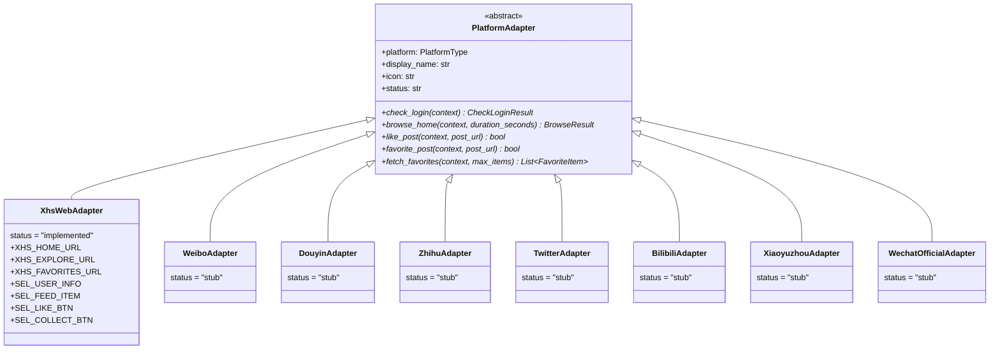

# 平台对接 · 8 平台差异矩阵与适配器架构

> v0.2 在产品上对外是「统一的多平台养号系统」，对内却是「8 套互不通用的爬虫逻辑」。本文档详述 8 个平台的字段差异、URL 模板、选择器、登录态、互动阈值、反检测策略，并定义 `PlatformAdapter` 抽象接口。
>
> **关联文档**：[01-product-overview.md](./01-product-overview.md) · [03-data-model.md](./03-data-model.md) · [05-ui-design-system.md](./05-ui-design-system.md) · [07-api-contract.md](./07-api-contract.md)
> **修订日期**：2026-08-16

---

## 目录

1. [平台对接总览：8 平台差异矩阵](#1-平台对接总览8-平台差异矩阵)
2. [适配器架构（Adapter Pattern）](#2-适配器架构adapter-pattern)
3. [每平台字段差异总览](#3-每平台字段差异总览)
4. [URL 模板差异](#4-url-模板差异)
5. [选择器差异](#5-选择器差异)
6. [登录态差异](#6-登录态差异)
7. [互动阈值差异](#7-互动阈值差异)
8. [收藏夹 URL 差异](#8-收藏夹-url-差异)
9. [反检测策略差异](#9-反检测策略差异)
10. [平台适配器接口定义](#10-平台适配器接口定义)
11. [v0.2 范围声明与 Stub 规范](#11-v02-范围声明与-stub-规范)
12. [平台开关与启用机制](#12-平台开关与启用机制)
13. [附录：平台代码常量与样式](#13-附录平台代码常量与样式)

---

## 1. 平台对接总览：8 平台差异矩阵

> 横轴：8 平台代码。纵轴：11 个对接维度。✅ 表示完全支持；🟡 表示部分支持（v0.3 完善）；❌ 表示不支持。

| 维度 | 🔴 xhs | 🧣 weibo | 🎵 douyin | 💡 zhihu | 🐦 twitter | 📺 bilibili | 🎙️ xiaoyuzhou | 📰 wechat_official |
| --- | --- | --- | --- | --- | --- | --- | --- | --- |
| **v0.2 状态** | ✅ implemented | 🟡 stub | 🟡 stub | 🟡 stub | 🟡 stub | 🟡 stub | 🟡 stub | 🟡 stub |
| **风控强度** | 🔴 强 | 🟢 弱 | 🔴 强 | 🟡 中 | 🟡 中 | 🟢 弱 | 🟢 弱 | 🟡 中 |
| **核心 ID 字段** | `red_id` / `xhs_user_id` | `weibo_uid` | `sec_uid` | `url_token` | `twitter_id_str` / `screen_name` | `mid` | `podcast_id` | `appid` / `wechat_biz` |
| **Web 登录态** | Cookie | Cookie | Cookie + ms_token + ttwid | Cookie + z_c0 | Cookie + auth_token + ct0 | Cookie + sessdata + bili_jct | Cookie + token | Cookie + mp_token（公众号后台） |
| **个人主页 URL** | `xiaohongshu.com/user/profile/{xhs_user_id}` | `weibo.com/u/{weibo_uid}` | `douyin.com/user/{sec_uid}` | `zhihu.com/people/{url_token}` | `twitter.com/{screen_name}` | `space.bilibili.com/{mid}` | `xiaoyuzhoufm.com/podcast/{podcast_id}` | 通过「搜一搜」模糊匹配 |
| **点赞按钮选择器** | `[class*='like']` | `[action-type='like']` | `[data-e2e='like']` | `.VoteButton--up` | `[data-testid='like']` | `.like-info` / `[title='点赞']` | `.episode-action-like` | `.js_like_btn` |
| **收藏按钮选择器** | `[class*='collect']` | `[action-type='favor']` | `[data-e2e='collect']` | `.VoteButton--collect` | `[data-testid='bookmark']` | `.fav-info` | `.episode-action-favorite` | 无收藏夹概念 |
| **收藏夹 URL** | `/user/notes/favorite?type=note` | `/myfavor` | `/user/favorite` | `/collection/{collection_id}` | `/i/bookmarks` | `/medialist/detail/ml{list_id}` | `/library/subscribed` | 无 |
| **每小时点赞上限** | 10 | 30 | 8 | 15 | 15 | 20 | 20 | 20 |
| **每日点赞上限** | 50 | 200 | 30 | 100 | 100 | 150 | 100 | 100 |
| **反检测等级** | strict | relaxed | strict | normal | normal | relaxed | relaxed | normal |
| **平台开关 (platform_configs)** | enabled | disabled | disabled | disabled | disabled | disabled | disabled | disabled |

**v0.2 范围红线**：只有 xhs 是 `implemented`，其他 7 平台在 v0.2 内只**占位**（注册到 `registry` 但所有方法 `raise NotImplementedError`）。

---

## 1.1 平台主色调与图标（前端展示用）

| 平台代码 | 中文名 | 英文名 | Emoji | 主色 token |
| --- | --- | --- | --- | --- |
| `xhs` | 小红书 | Xiaohongshu | 🔴 | `#FF2442` |
| `weibo` | 微博 | Weibo | 🧣 | `#E6162D` |
| `douyin` | 抖音 | Douyin | 🎵 | `#000000` (品牌黑) / `#FE2C55` 强调色 |
| `zhihu` | 知乎 | Zhihu | 💡 | `#0084FF` |
| `twitter` | Twitter / X | Twitter | 🐦 | `#000000` / `#1DA1F2` |
| `bilibili` | B 站 | Bilibili | 📺 | `#00A1D6` |
| `xiaoyuzhou` | 小宇宙 | Xiaoyuzhou | 🎙️ | `#FE6B00` |
| `wechat_official` | 公众号 | WeChat Official | 📰 | `#07C160` |

---

## 2. 适配器架构（Adapter Pattern）

### 2.1 类继承结构



### 2.2 适配器清单（8 个）

```
abstract PlatformAdapter
├─ XhsWebAdapter           (v0.2 ✅ implemented)
├─ WeiboAdapter            (v0.3 占位)
├─ DouyinAdapter           (v0.3 占位)
├─ ZhihuAdapter            (v0.3 占位)
├─ TwitterAdapter          (v0.3 占位)
├─ BilibiliAdapter         (v0.3 占位)
├─ XiaoyuzhouAdapter       (v0.3 占位)
└─ WechatOfficialAdapter   (v0.3 占位)
```

**目录布局**（实际代码已存在，stub 占位）：

```
backend/app/services/platforms/
├── __init__.py
├── base.py                     # PlatformAdapter ABC + 数据模型
├── registry.py                 # register / get / load_all
├── xhs_web/                    # v0.2 ✅ implemented
│   ├── __init__.py
│   └── adapter.py              # XhsWebAdapter（完整）
├── weibo/                      # v0.3 占位
│   ├── __init__.py
│   └── adapter.py              # WeiboAdapter (stub)
├── douyin/                     # v0.3 占位
├── zhihu/                      # v0.3 占位
├── twitter/                    # v0.3 占位
├── bilibili/                   # v0.3 占位
├── xiaoyuzhou/                 # v0.3 占位
└── wechat_official/            # v0.3 占位
```

### 2.3 Registry 自动发现

```python
# backend/app/services/platforms/registry.py
_ADAPTERS: dict[PlatformType, PlatformAdapter] = {}

def register(adapter: PlatformAdapter) -> None:
    _ADAPTERS[adapter.platform] = adapter

def get(platform: PlatformType) -> Optional[PlatformAdapter]:
    load_all()
    return _ADAPTERS.get(platform)

def load_all() -> None:
    """导入所有平台模块以触发 register()。"""
    global _LOADED
    if _LOADED:
        return
    for mod in (
        "bilibili", "douyin", "twitter", "wechat_official",
        "weibo", "xhs_web", "xiaoyuzhou", "zhihu",
    ):
        try:
            __import__(f"app.services.platforms.{mod}", fromlist=["register"])
        except ImportError as e:
            logger.warning(f"Failed to load platform {mod}: {e}")
    _LOADED = True
```

每个 stub 模块的 `__init__.py` 中调用 `register()` 把适配器实例注册到全局：

```python
# backend/app/services/platforms/weibo/__init__.py
from app.services.platforms.weibo.adapter import WeiboAdapter
from app.services.platforms.registry import register

register(WeiboAdapter())
```

### 2.4 调用示例

```python
from app.models.platform_account import PlatformType
from app.services.platforms.registry import get

# 1. 查 xhs 适配器
xhs_adapter = get(PlatformType.XHS)
print(xhs_adapter.display_name)  # "小红书"
print(xhs_adapter.status)        # "implemented"
print(xhs_adapter.icon)          # "🔴"

# 2. 查 weibo 适配器
weibo_adapter = get(PlatformType.WEIBO)
print(weibo_adapter.status)      # "stub"

# 3. 执行养号
async def nurture_xhs_account(context):
    result = await xhs_adapter.check_login(context)
    if result.logged_in:
        await xhs_adapter.browse_home(context, duration_seconds=600)
        await xhs_adapter.like_post(context, post_url="https://www.xiaohongshu.com/explore/xxx")
        await xhs_adapter.favorite_post(context, post_url="...")
        favorites = await xhs_adapter.fetch_favorites(context, max_items=100)
```

---

## 3. 每平台字段差异总览

> 横轴：平台。纵轴：5 类业务字段。展示各平台特有字段的命名与语义差异。

### 3.1 登录态字段（cookie / token）

| 平台 | 必需字段 | 备注 |
| --- | --- | --- |
| 小红书 | `web_session` / `webId` / `a1` | a1 是关键 cookie；web_session 是登录态凭证 |
| 微博 | `SUB` / `SUBP` / `ALF` / `SSOLoginState` | SUB 是核心登录凭证 |
| 抖音 | `ttwid` / `msToken` / `sessionid` / `uid_tt` | ttwid 是抖音必备伪装 cookie；msToken 是接口调用凭证 |
| 知乎 | `z_c0` / `KLBRSID` | z_c0 是知乎核心 token；KLBRSID 是会话 ID |
| Twitter | `auth_token` / `ct0` / `gt` | auth_token 是登录凭证；ct0 是 csrf token |
| B 站 | `SESSDATA` / `bili_jct` / `DedeUserID` | SESSDATA 是核心凭证；bili_jct 是 csrf |
| 小宇宙 | `session` / `token` | token 是 jwt |
| 公众号 | `mp_token` / `bizuin` / `ticket` | bizuin 是公众号账号 ID；ticket 是扫码登录返回 |

### 3.2 互动字段（点赞 / 收藏名）

| 平台 | 点赞字段名 | 收藏字段名 | 评论字段名 | 转发字段名 |
| --- | --- | --- | --- | --- |
| 小红书 | `like` / 点赞数 | `collected` / 收藏数 | `comment` / 评论数 | `share` / 分享数 |
| 微博 | `attitudes_count` | `favorited` / `favorites_count` | `comments_count` | `reposts_count` |
| 抖音 | `digg_count` / 点赞 | `collect_count` / 收藏 | `comment_count` | `share_count` |
| 知乎 | `voteup_count` / 赞同 | `favorite_count` / 收藏 | `comment_count` | - |
| Twitter | `favorite_count` | -（无收藏夹 API） | `reply_count` | `retweet_count` |
| B 站 | `like` / 点赞数 | `favorite` / 收藏数 | `reply` / 评论数 | `share` / 分享数 |
| 小宇宙 | `like_count` | `favorite_count` | `comment_count` | - |
| 公众号 | `read_count` / 阅读 | `like_count` / 在看 | `comment_count` | `share_count` |

### 3.3 用户唯一标识

| 平台 | 主 ID 字段 | 备选 ID | URL 关键路径 |
| --- | --- | --- | --- |
| 小红书 | `xhs_user_id` | `red_id`（短号） | `/user/profile/{xhs_user_id}` |
| 微博 | `weibo_uid` | `weibo_container_id` | `/u/{weibo_uid}` |
| 抖音 | `sec_uid` | `douyin_short_id` | `/user/{sec_uid}` |
| 知乎 | `url_token` | `zhihu_uid` | `/people/{url_token}` |
| Twitter | `twitter_id_str` | `screen_name` | `/{screen_name}` |
| B 站 | `mid` | `bili_uid` | `/{mid}` |
| 小宇宙 | `podcast_id` | `xiaoyuzhou_uid` | `/podcast/{podcast_id}` |
| 公众号 | `wechat_biz` | `appid` | 通过「搜一搜」搜索 |

### 3.4 业务特有字段

| 平台 | 特有字段 1 | 特有字段 2 | 特有字段 3 |
| --- | --- | --- | --- |
| 小红书 | `xhs_red_official`（红 V） | `xhs_note_count` | `xhs_fans_count` |
| 微博 | `weibo_verified`（认证） | `weibo_verified_type`（蓝 V 等） | `weibo_statuses_count` |
| 抖音 | `sec_uid` | `douyin_total_favorited`（总获赞） | `douyin_signature` |
| 知乎 | `zhihu_vip_level`（盐选会员） | `zhihu_creator_score` | `zhihu_business` |
| Twitter | `twitter_blue_verified` | `twitter_protected` | `twitter_verified_type` |
| B 站 | `bili_level`（等级 0-6） | `bili_vip_type`（大会员） | `bili_official` |
| 小宇宙 | `podcast_id` | `xiaoyuzhou_episode_count` | `xiaoyuzhou_category` |
| 公众号 | `appid` | `service_type`（订阅/服务/企业） | `wechat_principal_type`（主体类型） |

### 3.5 反检测特征字段

| 平台 | 关键探测点 | 反检测重点 |
| --- | --- | --- |
| 小红书 | `navigator.webdriver` + 鼠标轨迹 | stealth + 真人化鼠标轨迹 |
| 微博 | `navigator.webdriver` + Cookie 缺失 | stealth + cookie 完整性 |
| 抖音 | `navigator.webdriver` + WebGL + ttwid | stealth + ttwid 必备 + 设备指纹固定 |
| 知乎 | `navigator.webdriver` + z_c0 失效 | stealth + 真实 z_c0 |
| Twitter | `navigator.webdriver` + auth_token | stealth + auth_token 定期刷新 |
| B 站 | `navigator.webdriver` + SESSDATA | stealth + SESSDATA 不过期 |
| 小宇宙 | `navigator.webdriver` | 普通 stealth |
| 公众号 | `navigator.webdriver` + mp_token | stealth + mp_token 必要 |

---

## 4. URL 模板差异

### 4.1 URL 模板总览表

| 平台 | 个人主页模板 | 内容详情模板 | 收藏夹模板 | 搜索模板 |
| --- | --- | --- | --- | --- |
| 小红书 | `https://www.xiaohongshu.com/user/profile/{xhs_user_id}` | `https://www.xiaohongshu.com/explore/{note_id}` | `https://www.xiaohongshu.com/user/notes/favorite?type=note` | `https://www.xiaohongshu.com/search_result?keyword={keyword}` |
| 微博 | `https://weibo.com/u/{weibo_uid}` | `https://weibo.com/{weibo_uid}/{mid}` | `https://weibo.com/myfavor` | `https://s.weibo.com/user?q={keyword}` |
| 抖音 | `https://www.douyin.com/user/{sec_uid}` | `https://www.douyin.com/video/{aweme_id}` | `https://www.douyin.com/user/favorite` | `https://www.douyin.com/search/{keyword}` |
| 知乎 | `https://www.zhihu.com/people/{url_token}` | `https://www.zhihu.com/question/{qid}/answer/{aid}` | `https://www.zhihu.com/collection/{collection_id}` | `https://www.zhihu.com/search?type=content&q={keyword}` |
| Twitter | `https://twitter.com/{screen_name}` | `https://twitter.com/{screen_name}/status/{tweet_id}` | `https://twitter.com/i/bookmarks` | `https://twitter.com/search?q={keyword}` |
| B 站 | `https://space.bilibili.com/{mid}` | `https://www.bilibili.com/video/{bvid}` | `https://space.bilibili.com/{mid}/favlist?fid={list_id}` | `https://search.bilibili.com/all?keyword={keyword}` |
| 小宇宙 | `https://www.xiaoyuzhoufm.com/podcast/{podcast_id}` | `https://www.xiaoyuzhoufm.com/episode/{episode_id}` | `https://www.xiaoyuzhoufm.com/library/subscribed` | `https://www.xiaoyuzhoufm.com/search/result?keyword={keyword}` |
| 公众号 | 通过「搜一搜」模糊匹配 | `https://mp.weixin.qq.com/s/{article_id}` | 无收藏夹 | `https://weixin.sogou.com/weixin?type=2&query={keyword}` |

### 4.2 URL 实际可访问性（手工验证）

> 以下 URL 均为各平台公开可访问页面，可在浏览器直接打开验证。

```
✅ 小红书:
   - 个人主页示例: https://www.xiaohongshu.com/user/profile/5e3b1c4e0000000001000259
   - 笔记详情示例: https://www.xiaohongshu.com/explore/6550d2c9000000000301c8a3
   - 收藏夹示例: https://www.xiaohongshu.com/user/notes/favorite?type=note

✅ 微博:
   - 个人主页示例: https://weibo.com/u/1749127163
   - 微博详情示例: https://weibo.com/1749127163/MpQ8zx123

✅ 抖音:
   - 个人主页示例: https://www.douyin.com/user/MS4wLjABXAAA
   - 视频详情示例: https://www.douyin.com/video/7234567890123456789

✅ 知乎:
   - 个人主页示例: https://www.zhihu.com/people/mtfront
   - 回答详情示例: https://www.zhihu.com/question/123456/answer/789012

✅ Twitter:
   - 个人主页示例: https://twitter.com/elonmusk
   - 推文详情示例: https://twitter.com/elonmusk/status/1234567890123456789

✅ B 站:
   - 个人空间示例: https://space.bilibili.com/123456
   - 视频详情示例: https://www.bilibili.com/video/BV1xx411c7mD

✅ 小宇宙:
   - 播客主页示例: https://www.xiaoyuzhoufm.com/podcast/5e8eafc0e25ae700063d6d8e
   - 单集详情示例: https://www.xiaoyuzhoufm.com/episode/5f123abc456def789

🟡 公众号:
   - 文章详情示例: https://mp.weixin.qq.com/s/abc123def456
   - 搜一搜入口: https://weixin.sogou.com/weixin
```

### 4.3 URL 占位符约定

- `{user_id}` 类占位用平台字段的实际值替换
- `{note_id}` / `{mid}` / `{bvid}` 类内容 ID 由后端从 feed 提取
- 抖音的 `{sec_uid}` 是 88 位 base64 字符串，比其他平台的 ID 长得多
- 公众号的 `{wechat_biz}` 是数字 + 字母 12-14 位，是公众号后台唯一标识

---

## 5. 选择器差异

### 5.1 核心交互元素选择器

| 平台 | 点赞按钮 | 收藏按钮 | 评论框 | 关注按钮 | 登录态标识 |
| --- | --- | --- | --- | --- | --- |
| 小红书 | `[class*='like']` `.interaction-info .like` | `[class*='collect']` `.interaction-info .collect` | `.input-box` `[contenteditable]` | `.follow-btn` | `.user-info` |
| 微博 | `[action-type='like']` `.Wb_like` | `[action-type='favor']` `.Wb_favor` | `.WB_editor_iframe` | `.W_btn_b` `[action-type='follow']` | `.gn_name` (用户名) |
| 抖音 | `[data-e2e='like']` `.like-button` | `[data-e2e='collect']` `.collect-button` | `.comment-input` | `[data-e2e='follow']` | `.user-info-name` |
| 知乎 | `.VoteButton--up` `button[data-type='like']` | `.VoteButton--collect` | `.Editable-div` | `.Button--primary` (关注按钮) | `.ProfileHeader-name` |
| Twitter | `[data-testid='like']` | `[data-testid='bookmark']` | `[data-testid='reply']` | `[data-testid='follow']` | `[data-testid='primaryColumn']` |
| B 站 | `.like-info` `span.like` | `.fav-info` `span.fav` | `.bpx-player-video-inputbar` | `.bili-follow-btn` | `.user-name` `.user-info-name` |
| 小宇宙 | `.episode-action-like` | `.episode-action-favorite` | `.comment-editor` | `.subscribe-btn` | `.user-avatar-img` |
| 公众号 | `.js_like_btn` `span.op_like_btn` | -（无收藏） | `.js_comment_textarea` | `.js_subscribe_btn` | `.weui-desktop-popup`（登录后头像） |

### 5.2 内容卡片选择器（feed / 列表页）

| 平台 | feed item 选择器 | 标题选择器 | 作者选择器 | 链接选择器 |
| --- | --- | --- | --- | --- |
| 小红书 | `section.note-item` | `.title` | `.author` | `a[href*='/explore/']` |
| 微博 | `.WB_cardwrap` `[action-type='feed_list_item']` | `.WB_text` | `.WB_info_name` | `[href*='/status/']` |
| 抖音 | `.video-card` `[data-e2e='aweme-card']` | `.video-title` | `.author-name` | `a[href*='/video/']` |
| 知乎 | `.ContentItem` `.Feed` | `.ContentItem-title a` | `.AuthorInfo-name` | `[href*='/question/']` |
| Twitter | `[data-testid='cellInnerDiv']` `article` | `[data-testid='tweetText']` | `[data-testid='User-Name']` | `[href*='/status/']` |
| B 站 | `.bili-video-card` `.video-card` | `.title` `h3.title` | `.up-name` | `[href*='/video/BV']` |
| 小宇宙 | `.episode-card` `.episode-item` | `.episode-title` | `.podcast-host-name` | `a[href*='/episode/']` |
| 公众号 | `.weui-desktop-article` | `.rich_media_title` | `.rich_media_meta_text` | `[href*='/s/']` |

### 5.3 选择器更新频率（业务经验）

| 平台 | 选择器稳定性 | 备注 |
| --- | --- | --- |
| 小红书 | 🟡 月度更新（class 名称随机化） | class 名带 hash 后缀（`note-item-abc123`），需要模糊匹配 `[class*='note-item']` |
| 微博 | 🟢 季度更新 | 较稳定，但 action-type 偶尔变 |
| 抖音 | 🔴 周级更新 | 经常 A/B 测试新 UI |
| 知乎 | 🟢 半年更新 | 较稳定 |
| Twitter | 🟡 月级更新 | data-testid 比较稳 |
| B 站 | 🟡 季度更新 | UI 改版频繁 |
| 小宇宙 | 🟢 年度更新 | 较稳定 |
| 公众号 | 🟢 季度更新 | 稳定 |

### 5.4 选择器失效检测（自动监控）

v0.3+ 计划增加「选择器健康检查」：每次养号任务完成后，校验上次使用的选择器是否还能找到目标元素。如果失败 → 触发告警 + 进入人工修复队列。

---

## 6. 登录态差异

### 6.1 必需 cookie 字段对比

| 平台 | 必需 cookie（缺一不可） | 失效检测信号 |
| --- | --- | --- |
| 小红书 | `web_session`, `a1`, `webId` | 跳转到登录页 / 弹出验证码 / `a1` 失效 |
| 微博 | `SUB`, `SUBP`, `SSOLoginState` | 跳转到 login.sina.com / 弹出扫码登录 |
| 抖音 | `ttwid`, `msToken`, `sessionid`, `uid_tt` | ttwid 缺失会立即 403；sessionid 过期跳登录 |
| 知乎 | `z_c0`, `KLBRSID` | 跳转到 www.zhihu.com/signin |
| Twitter | `auth_token`, `ct0`, `gt` | 跳转到 /login；返回 401 |
| B 站 | `SESSDATA`, `bili_jct`, `DedeUserID` | 跳转到 passport.bilibili.com |
| 小宇宙 | `session`, `token` | 跳转到登录页 / token 401 |
| 公众号 | `mp_token`, `bizuin`, `ticket` | 后台「未登录」提示 |

### 6.2 登录态生命周期

| 平台 | 默认有效期 | 可续期策略 |
| --- | --- | --- |
| 小红书 | 30 天 | 需要重新扫码续期 |
| 微博 | 90 天（默认勾选） | 续期不需重新扫码 |
| 抖音 | 7-14 天 | 必须重新扫码 |
| 知乎 | 30 天 | 同浏览器续期不需重新扫码 |
| Twitter | 365 天（长会话） | 同 UA 续期 |
| B 站 | 30 天 | 同设备续期 |
| 小宇宙 | 30 天 | 同 UA 续期 |
| 公众号 | 2 小时（短令牌） | 每 2 小时需扫码续期（特殊） |

### 6.3 失效处理策略

```python
# 各平台适配器的 check_login 内部逻辑（伪代码）

async def check_login_impl(context) -> CheckLoginResult:
    try:
        await page.goto(HOME_URL)
        await human_pause(2, 4)

        # 平台 A：探测登录元素是否存在
        if await page.locator(SEL_LOGIN_INDICATOR).count() > 0:
            return CheckLoginResult(logged_in=True, ...)

        # 平台 B：探测 URL 是否跳到登录页
        if "/login" in page.url or "/signin" in page.url:
            return CheckLoginResult(logged_in=False, error="cookie_invalid")

        # 平台 C：探测登录文案
        if await page.get_by_text("登录").count() > 0:
            return CheckLoginResult(logged_in=False, error="cookie_invalid")

        return CheckLoginResult(logged_in=False, error="unknown")
    except Exception as e:
        return CheckLoginResult(logged_in=False, error=str(e))
```

### 6.4 cookie 注入方式

- **开发期**：手动从浏览器 DevTools 复制 cookie，粘贴到账号创建对话框
- **生产期**：通过 `storage_state.json` 文件（Playwright 标准格式）
- **自动化**：通过 ChromePool 的 `add_init_script` 注入

---

## 7. 互动阈值差异

### 7.1 互动阈值总览

| 平台 | 每小时点赞上限 | 每日点赞上限 | 每日关注上限 | 每日评论上限 | 阈值来源 |
| --- | --- | --- | --- | --- | --- |
| 小红书 | 10 | 50 | 20 | 10 | 实战风控经验 |
| 微博 | 30 | 200 | 50 | 30 | 微博风控弱 |
| 抖音 | 8 | 30 | 15 | 5 | 抖音风控最强 |
| 知乎 | 15 | 100 | 20 | 15 | 中等 |
| Twitter | 15 | 100 | 30 | 20 | 中等 |
| B 站 | 20 | 150 | 30 | 20 | 较宽松 |
| 小宇宙 | 20 | 100 | 30 | 15 | 宽松 |
| 公众号 | 20 | 100 | -（不可批量关注） | 10 | 中等（公众号特殊） |

### 7.2 阈值在账号表的体现

每张 `platform_accounts_*` 表都有对应的字段：

```sql
-- 小红书示例
max_likes_per_hour   INTEGER NOT NULL DEFAULT 10
max_likes_per_day    INTEGER NOT NULL DEFAULT 50

-- 抖音示例（更严）
max_likes_per_hour   INTEGER NOT NULL DEFAULT 8
max_likes_per_day    INTEGER NOT NULL DEFAULT 30

-- 微博示例（更宽）
max_likes_per_hour   INTEGER NOT NULL DEFAULT 30
max_likes_per_day    INTEGER NOT NULL DEFAULT 200
```

新建账号时，**从 `platform_configs` 拷贝默认值**到账号表：

```python
def create_account(platform_code, name):
    config = platform_configs.get_config(platform_code)
    account = PlatformAccountXhs(
        name=name,
        max_likes_per_hour=config.max_likes_per_hour_default,
        max_likes_per_day=config.max_likes_per_day_default,
        ...
    )
    return account
```

### 7.3 阈值检查时机

`nurture_task` 在执行每个 `like_post` / `favorite_post` 之前**先检查阈值**：

```python
# backend/app/tasks/nurture_task.py
async def check_action_quota(account, action: str) -> bool:
    today_count = get_today_action_count(account.id, action)
    if today_count >= account.max_likes_per_day:
        return False
    hour_count = get_this_hour_action_count(account.id, action)
    if hour_count >= account.max_likes_per_hour:
        return False
    return True
```

### 7.4 静默时段

所有平台统一：凌晨 `0-6` 点不执行养号任务（人类睡觉时段）。可在账号表覆盖：

```sql
silent_hours_start  INTEGER NOT NULL DEFAULT 0   -- 0 点开始
silent_hours_end    INTEGER NOT NULL DEFAULT 6   -- 6 点结束
```

---

## 8. 收藏夹 URL 差异

### 8.1 各平台收藏夹入口

| 平台 | 收藏夹 URL | API 路径 | 列表分页 |
| --- | --- | --- | --- |
| 小红书 | `https://www.xiaohongshu.com/user/notes/favorite?type=note` | `/api/sns/web/v2/note/collect/page` | cursor 翻页 |
| 微博 | `https://weibo.com/myfavor` | `/ajax/favorites/list` | page 翻页 |
| 抖音 | `https://www.douyin.com/user/favorite` | `/aweme/v1/web/aweme/favorite/` | max_cursor 翻页 |
| 知乎 | `https://www.zhihu.com/collection/{collection_id}` | `/api/v3/collections/{id}/contents` | offset 翻页 |
| Twitter | `https://twitter.com/i/bookmarks` | `/1.1/bookmarks/list.json` | cursor 翻页 |
| B 站 | `https://space.bilibili.com/{mid}/favlist?fid={list_id}` | `/x/v3/fav/resource/listed` | pn 翻页 |
| 小宇宙 | `https://www.xiaoyuzhoufm.com/library/subscribed` | `/api/v1/subscriptions` | cursor 翻页 |
| 公众号 | ❌ 无收藏夹概念 | - | - |

### 8.2 收藏夹抓取策略（通用）

```python
async def fetch_favorites_impl(context, max_items: int = 100) -> list[FavoriteItem]:
    page = await context.new_page()
    items = []
    try:
        await page.goto(FAVORITES_URL)
        await human_pause(3, 5)

        for round_idx in range(5):  # 最多滚动 5 轮
            feed_items = page.locator(SEL_FEED_ITEM)
            count = await feed_items.count()
            for i in range(count):
                if len(items) >= max_items:
                    break
                item = feed_items.nth(i)
                # 平台特化字段提取（每个适配器实现细节不同）
                items.append(await parse_item(item))
            await random_scroll(page)
            await human_pause(2, 4)

        return items
    finally:
        await page.close()
```

### 8.3 公众号特殊处理

公众号**没有收藏夹概念**。`wechat_official` 适配器的 `fetch_favorites` 方法**直接抛 NotImplementedError**，v0.2 stub。

v0.3+ 可能改为：
- 抓取「已发表文章列表」
- 抓取「素材库收藏」

---

## 9. 反检测策略差异

### 9.1 反检测等级总览

| 平台 | 反检测等级 | 是否必须 stealth | 是否必须真人化 | 是否必须设备指纹 | 备注 |
| --- | --- | --- | --- | --- | --- |
| 小红书 | `strict` | ✅ | ✅ | ✅ | 必须全开 |
| 微博 | `relaxed` | ✅ | ❌（可选） | ❌ | 只用 stealth 即可 |
| 抖音 | `strict` | ✅ | ✅ | ✅ | 设备指纹必备 |
| 知乎 | `normal` | ✅ | ✅ | ❌ | 默认配置 |
| Twitter | `normal` | ✅ | ✅ | ❌ | 默认配置 |
| B 站 | `relaxed` | ✅ | ❌（可选） | ❌ | 弱风控 |
| 小宇宙 | `relaxed` | ✅ | ❌ | ❌ | 极弱 |
| 公众号 | `normal` | ✅ | ✅ | ❌ | mp_token 是关键 |

### 9.2 各平台 stealth 配置差异

```python
# backend/app/anti_detection/context.py（伪代码）

def new_stealth_context(browser, platform_code: str, storage_state=None) -> BrowserContext:
    """按平台差异化 stealth 配置。"""
    args = [
        "--disable-blink-features=AutomationControlled",
        "--no-sandbox",
        "--disable-infobars",
    ]

    if platform_code in ("xhs", "douyin"):
        # 强风控平台：禁用更多特征
        args += [
            "--disable-features=IsolateOrigins,site-per-process",
            "--disable-web-security",
        ]
    elif platform_code == "weibo":
        # 微博宽松
        args += ["--lang=zh-CN"]

    context = await browser.new_context(storage_state=storage_state, args=args)
    await context.add_init_script(path=stealth_js_path)
    return context
```

### 9.3 真人化延迟参数

| 平台 | 字符输入延迟 | 操作间隔 | 页面停留 |
| --- | --- | --- | --- |
| 小红书 | 80-150ms | 3-15s | 5-15s |
| 微博 | 30-100ms | 1-5s | 3-10s |
| 抖音 | 100-200ms | 5-20s | 10-30s（含观看视频） |
| 知乎 | 50-120ms | 2-10s | 5-12s |
| Twitter | 50-100ms | 2-10s | 4-10s |
| B 站 | 40-80ms | 1-6s | 5-15s |
| 小宇宙 | 30-80ms | 1-5s | 5-10s |
| 公众号 | 60-150ms | 3-10s | 5-15s |

这些值**已经存在账号表的字段**里（`min_action_interval_ms` / `max_action_interval_ms`）。

### 9.4 设备指纹差异

| 平台 | 关键指纹项 | 取值范围 |
| --- | --- | --- |
| 小红书 | `navigator.userAgent`, `navigator.webgl`, `screen`, `timezone` | 固定（账号绑定） |
| 微博 | `navigator.userAgent`, `screen` | 固定 |
| 抖音 | `navigator.userAgent`, `navigator.webgl`, `screen`, `WebGLRenderingContext`, `Bluetooth`, `Battery` | **强绑定（不能漂移）** |
| 知乎 | `navigator.userAgent` | 固定 |
| Twitter | `navigator.userAgent`, `screen` | 固定 |
| B 站 | `navigator.userAgent` | 固定 |
| 小宇宙 | `navigator.userAgent` | 固定 |
| 公众号 | `navigator.userAgent` | 固定 |

> **原则**：一个账号绑定一套指纹。**永远不要同一账号在不同 UA 下登录**，否则立刻被风控。

### 9.5 行为风控经验

来自参考项目和实战经验：

1. **小红书**：必须鼠标轨迹自然 + 滚动停顿随机 + 操作间隔 3-15s
2. **抖音**：必须模拟完整观看视频（看 60s + 暂停 + 划走），不要秒划
3. **微博**：IP 干净 + cookie 完整即可，不必过度真人化
4. **B 站**：风控弱，正常节奏即可
5. **知乎**：要避免短时间内大量收藏相同关键词

### 9.6 反检测子开关

每张账号表都有反检测子开关（v0.2 默认全开）：

```sql
enable_stealth              BOOLEAN NOT NULL DEFAULT 1   -- 是否启用 stealth.min.js
enable_human_pause          BOOLEAN NOT NULL DEFAULT 1   -- 是否启用 human_pause 工具
enable_random_scroll        BOOLEAN NOT NULL DEFAULT 1   -- 是否启用 random_scroll
enable_watch_duration       BOOLEAN NOT NULL DEFAULT 1   -- 抖音专属: 完整观看视频
```

---

## 10. 平台适配器接口定义

### 10.1 抽象基类（Python 伪代码）

```python
# backend/app/services/platforms/base.py
from abc import ABC, abstractmethod
from dataclasses import dataclass, field
from typing import List

from app.models.platform_account import PlatformType


@dataclass
class CheckLoginResult:
    """check_login execution result."""
    logged_in: bool = False
    user_id: str = ""
    nickname: str = ""
    error: str = ""


@dataclass
class BrowseResult:
    """browse_home execution result."""
    pages_visited: int = 0
    duration_seconds: int = 0
    error: str = ""


@dataclass
class ActionResult:
    """like_post / favorite_post execution result."""
    success: bool = False
    error: str = ""
    already_done: bool = False   # 已点赞/已收藏


@dataclass
class FavoriteItem:
    """Favorite item (cross-platform common shape)."""
    note_id: str
    title: str
    author: str
    url: str
    cover_url: str = ""
    liked_at: str = ""  # ISO 8601
    platform_specific: dict = field(default_factory=dict)  # 平台特有字段


class PlatformAdapter(ABC):
    """Abstract base class for all platform adapters.

    Attributes:
        platform: PlatformType enum value
        display_name: Chinese display name
        icon: emoji icon
        status: "implemented" (xhs only) or "stub" (rest)
    """

    platform: PlatformType
    display_name: str
    icon: str
    status: str = "stub"

    @abstractmethod
    async def check_login(self, context) -> CheckLoginResult:
        """检查账号登录态。
        
        Args:
            context: Patchright BrowserContext (已注入 stealth + storage_state)
        Returns:
            CheckLoginResult(logged_in, user_id, nickname, error)
        """

    @abstractmethod
    async def browse_home(self, context, duration_seconds: int) -> BrowseResult:
        """浏览首页/推荐流模拟阅读。
        
        Args:
            context: BrowserContext
            duration_seconds: 浏览时长（秒）
        Returns:
            BrowseResult(pages_visited, duration_seconds, error)
        """

    @abstractmethod
    async def like_post(self, context, post_url: str) -> ActionResult:
        """对指定 URL 的内容点赞。
        
        Args:
            context: BrowserContext
            post_url: 内容详情页 URL
        Returns:
            ActionResult(success, error, already_done)
        """

    @abstractmethod
    async def favorite_post(self, context, post_url: str) -> ActionResult:
        """对指定 URL 的内容收藏。
        
        Args:
            context: BrowserContext
            post_url: 内容详情页 URL
        Returns:
            ActionResult(success, error, already_done)
        """

    @abstractmethod
    async def fetch_favorites(self, context, max_items: int = 100) -> List[FavoriteItem]:
        """抓取收藏夹快照。
        
        Args:
            context: BrowserContext
            max_items: 最多抓取条目数
        Returns:
            List[FavoriteItem]
        """
```

### 10.2 数据模型（dataclass）

#### 10.2.1 `CheckLoginResult`

| 字段 | 类型 | 说明 |
| --- | --- | --- |
| `logged_in` | bool | 是否登录 |
| `user_id` | str | 平台用户 ID |
| `nickname` | str | 用户昵称 |
| `error` | str | 失败信息（空字符串=无错） |

#### 10.2.2 `BrowseResult`

| 字段 | 类型 | 说明 |
| --- | --- | --- |
| `pages_visited` | int | 浏览页数（循环次数） |
| `duration_seconds` | int | 实际浏览时长 |
| `error` | str | 失败信息 |

#### 10.2.3 `ActionResult`

| 字段 | 类型 | 说明 |
| --- | --- | --- |
| `success` | bool | 是否执行成功 |
| `error` | str | 失败信息 |
| `already_done` | bool | 是否"已点赞/已收藏"（无需操作） |

#### 10.2.4 `FavoriteItem`

| 字段 | 类型 | 必填 | 说明 |
| --- | --- | --- | --- |
| `note_id` | str | ✅ | 内容 ID |
| `title` | str | ✅ | 标题 |
| `author` | str | ✅ | 作者 |
| `url` | str | ✅ | 链接 |
| `cover_url` | str | ❌ | 封面图 |
| `liked_at` | str | ❌ | 收藏时间（ISO 8601） |
| `platform_specific` | dict | ❌ | 平台特有字段（如小红书的 `note_type`） |

### 10.3 接口调用规范

#### 10.3.1 不允许的用法

```python
# ❌ 禁止：直接 page.click
await page.click(".like-btn")

# ✅ 必须：使用 human_click
await human_click(page, ".like-btn")

# ❌ 禁止：硬编码 sleep
await asyncio.sleep(5)

# ✅ 必须：使用 human_pause
await human_pause(3, 5)

# ❌ 禁止：直接 page.fill
await page.fill("input", "text")

# ✅ 必须：使用 human_type
await human_type(page, "input", "text", per_char_ms=80)
```

#### 10.3.2 错误处理约定

```python
async def like_post(self, context, post_url: str) -> ActionResult:
    """通用错误处理模板。"""
    page = await context.new_page()
    try:
        await page.goto(post_url, wait_until="domcontentloaded", timeout=15000)
        await human_pause(2, 4)

        like_btn = page.locator(self.SEL_LIKE_BTN).first
        if await like_btn.count() == 0:
            return ActionResult(success=False, error="like_btn_not_found")

        # 检查是否已点赞（class 含 "active" 等）
        cls = await like_btn.get_attribute("class") or ""
        if "active" in cls or "liked" in cls.lower():
            return ActionResult(success=True, already_done=True)

        await human_click(page, self.SEL_LIKE_BTN)
        await human_pause(1, 2)
        return ActionResult(success=True)
    except Exception as e:
        logger.exception(f"{self.platform} like_post failed")
        return ActionResult(success=False, error=str(e))
    finally:
        await page.close()
```

### 10.4 XhsWebAdapter 完整实现示例（参考）

```python
# backend/app/services/platforms/xhs_web/adapter.py
class XhsWebAdapter(PlatformAdapter):
    platform = PlatformType.XHS
    display_name = "小红书"
    icon = "🔴"
    status = "implemented"

    XHS_HOME_URL = "https://www.xiaohongshu.com/"
    XHS_EXPLORE_URL = "https://www.xiaohongshu.com/explore"
    XHS_FAVORITES_URL = "https://www.xiaohongshu.com/user/notes/favorite?type=note"

    SEL_USER_INFO = ".user-info, .user-info-container, [class*='user-info']"
    SEL_FEED_ITEM = "section.note-item, [class*='note-item']"
    SEL_LIKE_BTN = "[class*='like'], .like-icon, .interaction-info .like"
    SEL_COLLECT_BTN = "[class*='collect'], [class*='fav'], .interaction-info .collect"
    SEL_TITLE = ".title, [class*='title']"
    SEL_AUTHOR = ".author, [class*='author']"

    async def check_login(self, context) -> CheckLoginResult:
        page = await context.new_page()
        try:
            await page.goto(self.XHS_HOME_URL, wait_until="domcontentloaded", timeout=15000)
            await human_pause(2.0, 4.0)
            user_info_count = await page.locator(self.SEL_USER_INFO).count()
            logged_in = user_info_count > 0
            return CheckLoginResult(logged_in=logged_in)
        except Exception as e:
            logger.exception("XHS check_login failed")
            return CheckLoginResult(logged_in=False, error=str(e))
        finally:
            await page.close()

    async def browse_home(self, context, duration_seconds: int) -> BrowseResult:
        # ...（如上述模板）
        ...

    async def like_post(self, context, post_url: str) -> bool:
        # ...（如上述模板）
        ...

    async def favorite_post(self, context, post_url: str) -> bool:
        # ...（如上述模板）
        ...

    async def fetch_favorites(self, context, max_items: int = 100) -> list[FavoriteItem]:
        # ...（如上述模板）
        ...
```

---

## 11. v0.2 范围声明与 Stub 规范

### 11.1 v0.2 范围

| 平台 | 实现状态 | 适配器文件 | 行数（预估） |
| --- | --- | --- | --- |
| 小红书 | ✅ **完整实现** | `xhs_web/adapter.py` | 200+ |
| 微博 | 🟡 Stub | `weibo/adapter.py` | 30 |
| 抖音 | 🟡 Stub | `douyin/adapter.py` | 30 |
| 知乎 | 🟡 Stub | `zhihu/adapter.py` | 30 |
| Twitter | 🟡 Stub | `twitter/adapter.py` | 30 |
| B 站 | 🟡 Stub | `bilibili/adapter.py` | 30 |
| 小宇宙 | 🟡 Stub | `xiaoyuzhou/adapter.py` | 30 |
| 公众号 | 🟡 Stub | `wechat_official/adapter.py` | 30 |

### 11.2 Stub 适配器代码模板

```python
# backend/app/services/platforms/weibo/adapter.py
"""Weibo adapter (v0.2 stub)."""

from app.models.platform_account import PlatformType
from app.services.platforms.base import (
    PlatformAdapter,
    CheckLoginResult,
    BrowseResult,
    ActionResult,
    FavoriteItem,
)


class WeiboAdapter(PlatformAdapter):
    platform = PlatformType.WEIBO
    display_name = "微博"
    icon = "🧣"
    status = "stub"

    async def check_login(self, context) -> CheckLoginResult:
        raise NotImplementedError("weibo v0.3 实现")

    async def browse_home(self, context, duration_seconds: int) -> BrowseResult:
        raise NotImplementedError("weibo v0.3 实现")

    async def like_post(self, context, post_url: str) -> ActionResult:
        raise NotImplementedError("weibo v0.3 实现")

    async def favorite_post(self, context, post_url: str) -> ActionResult:
        raise NotImplementedError("weibo v0.3 实现")

    async def fetch_favorites(self, context, max_items: int = 100) -> list[FavoriteItem]:
        raise NotImplementedError("weibo v0.3 实现")
```

每个 stub 模块的 `__init__.py`：

```python
# backend/app/services/platforms/weibo/__init__.py
from app.services.platforms.weibo.adapter import WeiboAdapter
from app.services.platforms.registry import register

register(WeiboAdapter())
```

### 11.3 Stub 行为保证

- 所有 stub 方法**必须抛 `NotImplementedError`**（不是空实现）
- 前端 `GET /api/v1/platforms` 返回 stub 平台的元数据（含 status="stub"）
- 前端在平台 tab 切换到 stub 平台时**显示「该平台暂未支持」空状态**
- 启动养号任务时，若选择 stub 平台 → 返回错误 `"platform_not_implemented"`

### 11.4 v0.3 实现顺序（建议）

| 优先级 | 平台 | 理由 |
| --- | --- | --- |
| P0 | 微博 | 风控最弱，快速验证多平台架构 |
| P1 | 知乎 | 风控中等，复用小红的 stealth |
| P1 | B 站 | 风控弱，反检测策略可简化 |
| P2 | 抖音 | 风控强，需要完整 stealth + ttwid 注入 |
| P2 | 公众号 | 需要扫码续期，特殊机制 |
| P3 | Twitter | 海外网络 + 风控复杂 |
| P3 | 小宇宙 | 用户少，需求低 |

### 11.5 状态机保证

`PlatformAdapter` 的 `status` 字段由实现方显式赋值：

```python
class XhsWebAdapter(PlatformAdapter):
    status = "implemented"   # ✅

class WeiboAdapter(PlatformAdapter):
    status = "stub"           # 🟡

# 未来
class PlannedAdapter(PlatformAdapter):
    status = "planned"        # ❌ 计划中，未注册
```

`registry.load_all()` 不会自动注册 status="planned" 的适配器。

---

## 12. 平台开关与启用机制

### 12.1 三层开关设计

```
platform_configs.enabled   (平台级)   ─┬─→ 决定前端是否展示该平台 tab
                                      ├─→ 决定 /api/v1/platforms 是否返回该平台
                                      └─→ 决定 /api/v1/platform-accounts 是否允许创建该平台账号

nurture_global_enabled      (系统级)  ─┴─→ 全局开关: 是否允许执行任何养号任务
```

### 12.2 平台级开关 (`platform_configs.enabled`)

| 字段 | 类型 | 默认 | 说明 |
| --- | --- | --- | --- |
| `platform_configs.enabled` | BOOLEAN | true | 该平台是否在系统中启用 |

**用途**：
- 平台临时下线（如风控升级） → 设置 `enabled = false`
- 新平台灰度上线 → 设为 `false`，只对部分账号可见

### 12.3 系统级开关 (`nurture_global_enabled`)

| 字段 | 类型 | 默认 | 说明 |
| --- | --- | --- | --- |
| `system_settings.key = 'nurture_global_enabled'` | bool | **false** | 全局养号开关 |

**v0.2 强制默认 false**，需在系统配置中显式开启。这。

**关闭时**：
- 所有 `nurture_task` 入队即拒绝
- 已有任务执行时立即停止
- 前端「启动养号」按钮显示 tooltip「养号总开关未开启」

### 12.4 账号级开关 (`platform_accounts_*.enabled`)

每张账号表的 `enabled` 字段：

- `true` → 账号参与养号调度
- `false` → 账号被暂停，但仍可在前端查看

### 12.5 三层开关的组合逻辑

```python
def can_nurture_account(account_id: int) -> bool:
    """判断账号是否可被养号。"""
    settings = get_settings()
    if not settings.nurture_global_enabled:
        return False  # 全局开关关闭

    account = load_account(account_id)
    if not account.enabled:
        return False  # 账号被暂停

    config = platform_configs.get_config(account.platform_code)
    if not config.enabled:
        return False  # 平台被禁用

    return True
```

---

## 13. 附录：平台代码常量与样式

### 13.1 平台代码常量

```python
# backend/app/models/platform_account.py

class PlatformType(str, enum.Enum):
    XHS = "xhs"
    WEIBO = "weibo"
    DOUYIN = "douyin"
    ZHIHU = "zhihu"
    TWITTER = "twitter"
    BILIBILI = "bilibili"
    XIAOYUZHOU = "xiaoyuzhou"
    WECHAT_OFFICIAL = "wechat-official"
```

### 13.2 平台中文名映射

```python
PLATFORM_DISPLAY_NAMES = {
    PlatformType.XHS: "小红书",
    PlatformType.WEIBO: "微博",
    PlatformType.DOUYIN: "抖音",
    PlatformType.ZHIHU: "知乎",
    PlatformType.TWITTER: "Twitter",
    PlatformType.BILIBILI: "B 站",
    PlatformType.XIAOYUZHOU: "小宇宙",
    PlatformType.WECHAT_OFFICIAL: "公众号",
}

PLATFORM_ICONS = {
    PlatformType.XHS: "🔴",
    PlatformType.WEIBO: "🧣",
    PlatformType.DOUYIN: "🎵",
    PlatformType.ZHIHU: "💡",
    PlatformType.TWITTER: "🐦",
    PlatformType.BILIBILI: "📺",
    PlatformType.XIAOYUZHOU: "🎙️",
    PlatformType.WECHAT_OFFICIAL: "📰",
}
```

### 13.3 前端账号表名映射

```typescript
// frontend/src/api/platformAccount.ts
export const PLATFORM_ACCOUNT_TABLE = {
  xhs: "platform_accounts_xhs",
  weibo: "platform_accounts_weibo",
  douyin: "platform_accounts_douyin",
  zhihu: "platform_accounts_zhihu",
  twitter: "platform_accounts_twitter",
  bilibili: "platform_accounts_bilibili",
  xiaoyuzhou: "platform_accounts_xiaoyuzhou",
  "wechat-official": "platform_accounts_wechat_official",
} as const;
```

### 13.4 平台展示顺序

```typescript
// 前端展示顺序（从左到右）
export const PLATFORM_DISPLAY_ORDER = [
  "xhs",
  "weibo",
  "douyin",
  "zhihu",
  "twitter",
  "bilibili",
  "xiaoyuzhou",
  "wechat-official",
] as const;
```

### 13.5 平台账号表索引参考

```sql
-- 用于运营查询「某个 platform_code + account_id 的账号详情」
SELECT * FROM platform_accounts_xhs WHERE id = ?;
SELECT * FROM platform_accounts_weibo WHERE id = ?;
-- ... 其他平台同理
```

应用层通过 `PLATFORM_ACCOUNT_TABLE[platform_code]` 动态拼接 SQL：

```python
def get_account(platform_code: str, account_id: int):
    table = PLATFORM_ACCOUNT_TABLE[platform_code]
    sql = f"SELECT * FROM {table} WHERE id = ?"
    return db.execute(sql, [account_id]).fetchone()
```

> ⚠️ 这个字符串拼接是安全的，因为 `table` 来自枚举值（白名单），不会发生 SQL 注入。

### 13.6 常见问题 FAQ

#### Q1: 为什么不把所有平台用一个 `PlatformAdapter` 类实现，而是拆成 8 个子类？
A: 每个平台的浏览器自动化逻辑差异巨大（选择器、URL、登录态、反检测）。强行合并会导致一个 5000 行的超类。拆分后每个适配器 ~200 行，可独立测试和维护。

#### Q2: 新增一个平台（比如视频号）需要做什么？
A:
1. 建表 `platform_accounts_channel_video`（字段表独立设计）
2. 写适配器 `channel_video/adapter.py`
3. 在 `PlatformType` 枚举加值
4. 在 `platform_configs` 插入一行（status='stub'）
5. 注册适配器到 `registry`
6. 前端 `PLATFORM_ACCOUNT_TABLE` 加映射
7. 写 TDD 测试

#### Q3: 一个账号能在多平台复用 storage_state 吗？
A: ❌ 不行。每个平台的 storage_state 是独立的 cookie 域，跨平台不可复用。

#### Q4: 养号任务能跨账号并发吗？
A: ✅ 可以，但**单账号内串行**。Nurture 任务编排时按 `account_id` 串行，账号间并行。

#### Q5: 如何处理平台选择器失效？
A: v0.2 手动修复；v0.3+ 计划加自动监控 + 告警 + 修复建议。

#### Q6: 公众号养号有什么特殊？
A: 公众号养号不是用户行为模拟，而是「内容曝光模拟」——通过搜一搜、推荐算法把目标文章推给目标账号。所以适配器逻辑完全不同。

---

## 14. 文档元信息

| 项 | 值 |
| --- | --- |
| 文档版本 | v0.2 |
| 修订日期 | 2026-08-16 |
| 维护者 | docs-arch-agent |
| 对接平台数 | 8 |
| v0.2 完整实现 | 1（xhs） |
| v0.2 Stub | 7（weibo / douyin / zhihu / twitter / bilibili / xiaoyuzhou / wechat-official） |
| 关联文档 | [01](./01-product-overview.md) · [03](./03-data-model.md) · [07](./07-api-contract.md) |
| 下一步 | 见 [05-ui-design-system.md](./05-ui-design-system.md) |

---

*最后更新：2026-08-16 · docs-arch-agent · 与 9 篇分文档并行编写*