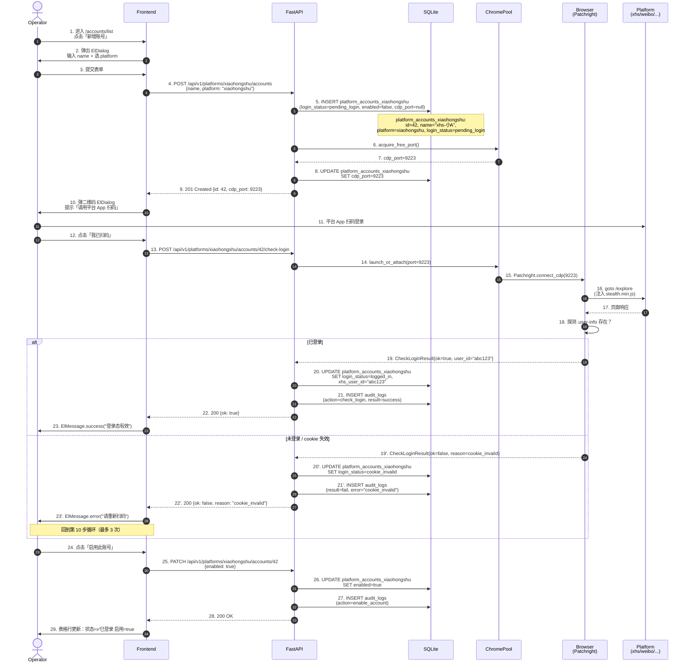
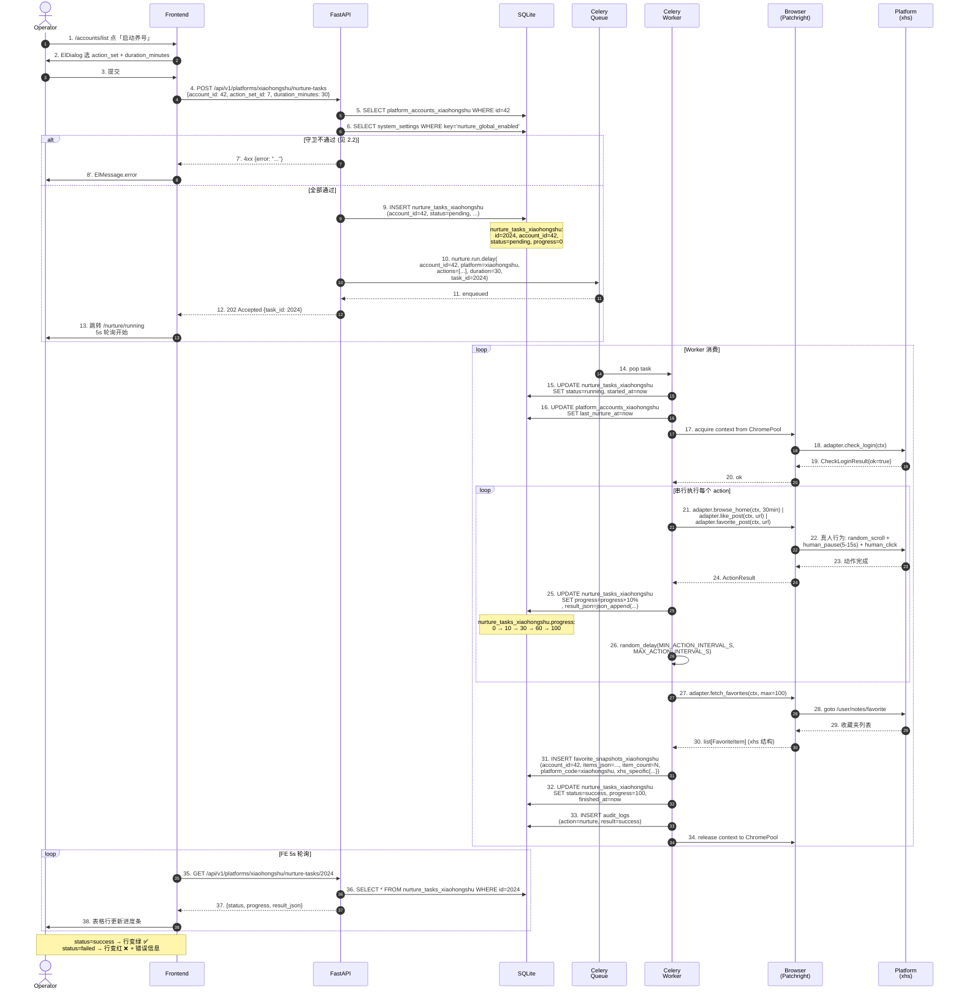
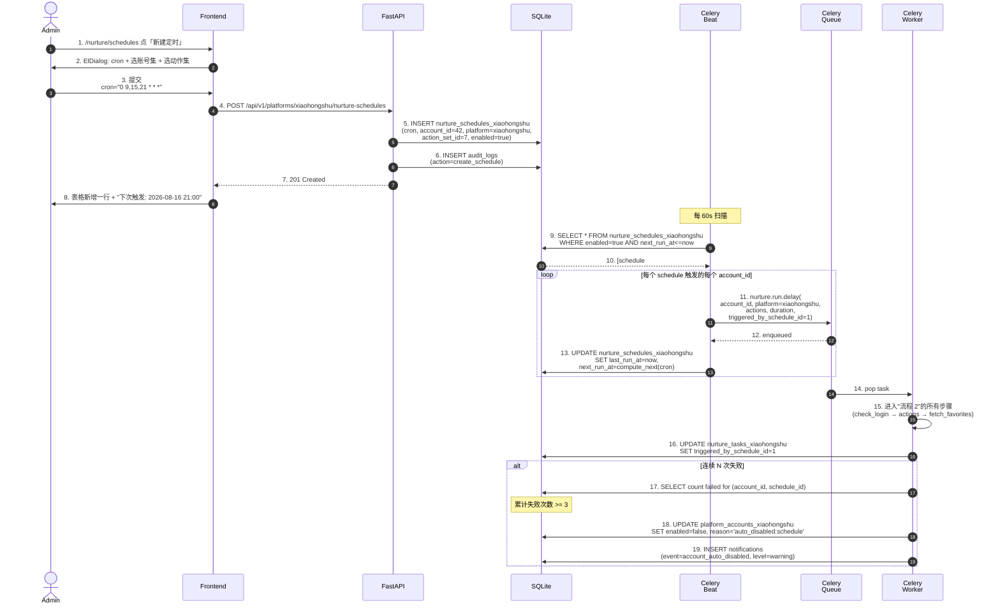
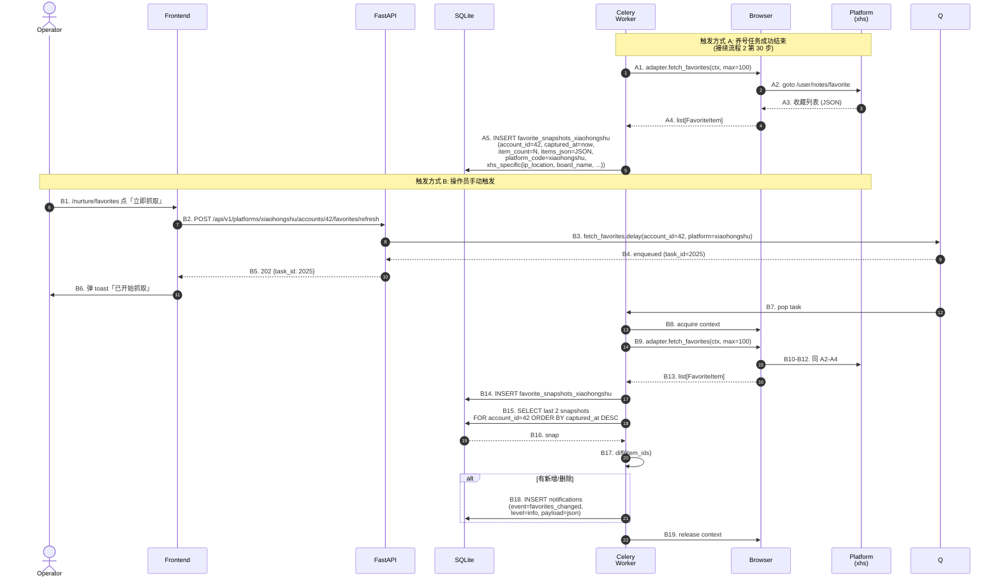
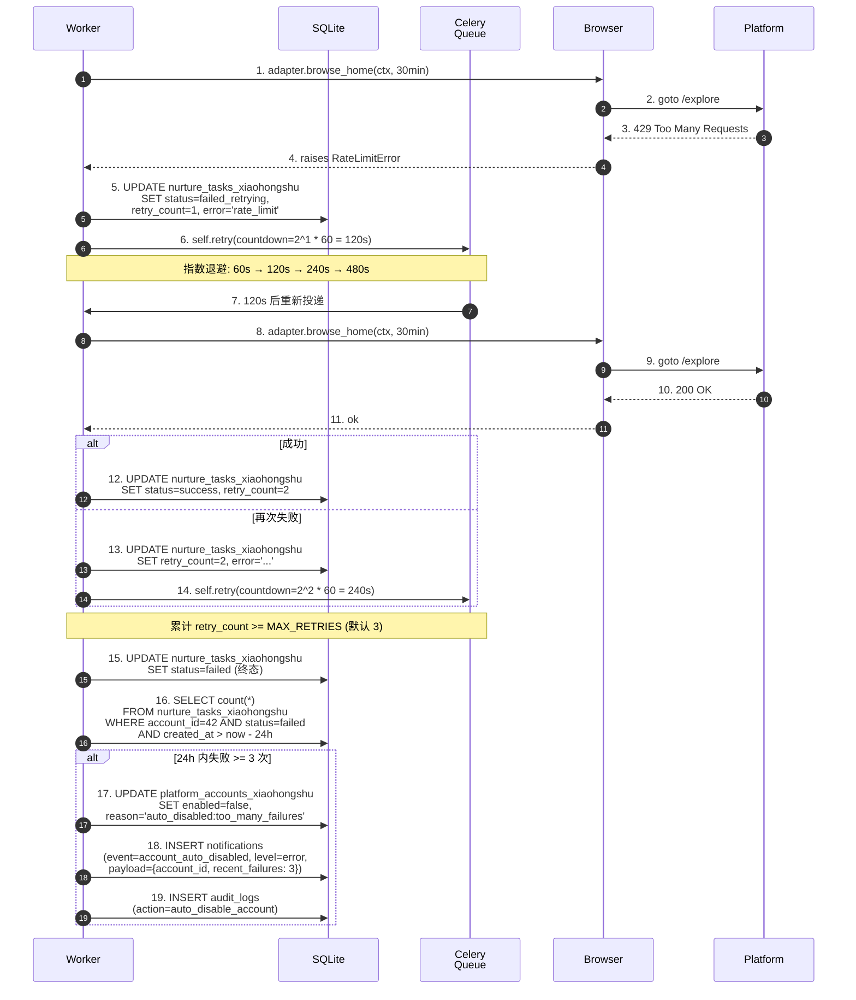
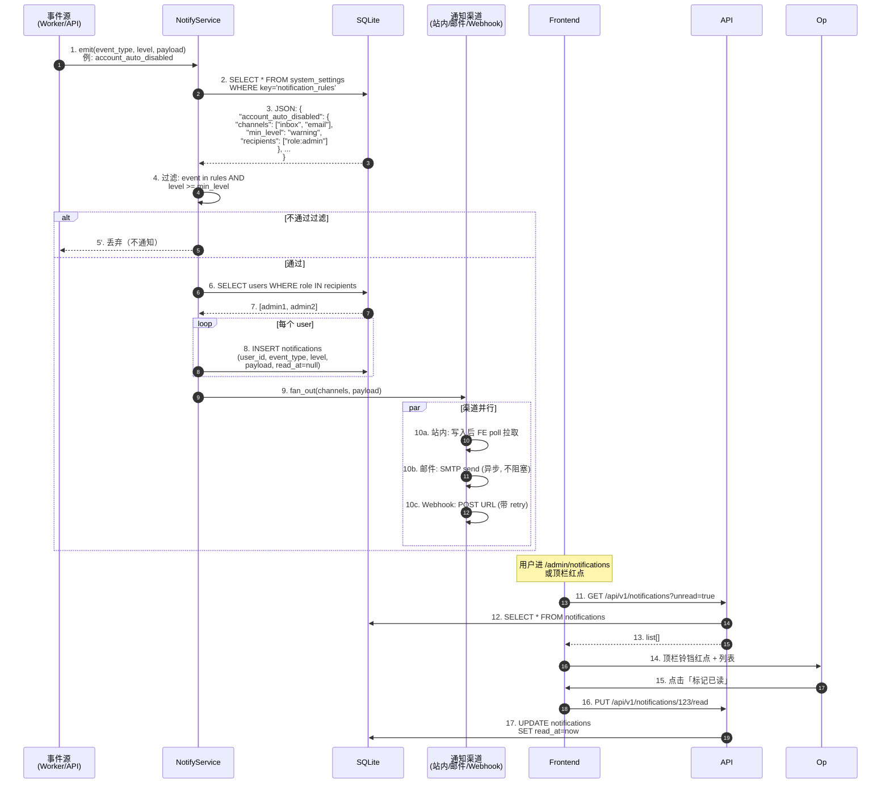
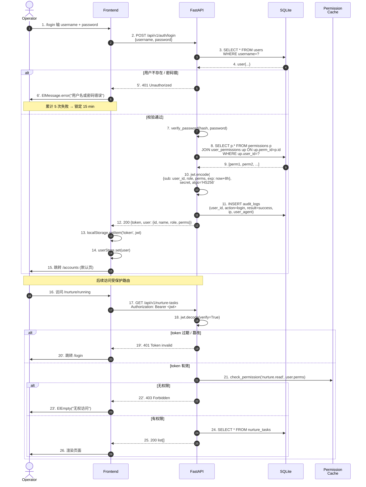

# 08 · 核心业务流程（Business Flows）

> 适用版本：**media-manager v0.2**
> 撰写日期：2026-08-16
> 关联文档：[`01-product-overview.md`](01-product-overview.md) · [`02-information-architecture.md`](02-information-architecture.md)
> 关联 spec：[`docs/superpowers/specs/2026-08-16-v02-account-management-design.md`](superpowers/specs/2026-08-16-v02-account-management-design.md)

## 重写说明（2026-08-16）

本次重写仅涉及养号相关流程（F1 / F2 / F3 / F4 / F5）的**表名与 HTTP API 路径**：

- 数据库从单表（`platform_accounts` + `nurture_tasks` + `nurture_schedules` + `favorite_snapshots` 共 19 张）改为每平台一张表（共 47 张），例如 `nurture_tasks_xiaohongshu` / `favorite_snapshots_xiaohongshu` / `platform_accounts_xiaohongshu`。
- API 路径全部按平台分（`/api/v1/platforms/{platform}/...`）。
- `favorite_snapshots_xiaohongshu.items_json` 字段按 xhs 结构序列化（`note_id` / `red_id` / `xhs_specific{ip_location, board_name, ...}`）。

**不动**：参与者角色、消息流顺序、状态机、失败矩阵、业务规则、跨流程依赖关系图、F6/F7 流程本身。

---

## 0. 阅读说明

本文用 **7 个 Mermaid 时序图** 描述 v0.2 端到端的业务核心流程。所有流程图统一使用以下约定：

- **横向泳道** = 系统参与者（角色 / 服务 / 数据表）
- **纵向箭头** = 一次调用 / 一次写入 / 一次事件
- **`alt` / `opt` / `loop`** = 条件分支
- **`Note over`** = 关键状态变化 / 数据持久化点
- **红色虚线 `-.->`** = 失败路径或异常事件
- **数据表标注** = 在写入点上方用 `Note over table` 注明 `INSERT / UPDATE <table>`

**关键角色**：

| 角色 | 简写 | 说明 |
|------|------|------|
| 操作员 / 管理员 | Operator / Admin | 浏览器中的人类用户 |
| Web 前端 | Frontend | Vue 3 SPA |
| API 服务 | API | FastAPI（uvicorn） |
| Celery Worker | Worker | 异步任务执行器（`nurture.run`） |
| Celery Beat | Beat | 定时调度器 |
| 浏览器自动化 | Browser | Patchright + OpenCLI + ChromePool |
| 数据表 | DB | SQLite（v0.2） |

**核心表**：

| 表（示例） | 关键字段 | 写入流程 |
|----|----------|----------|
| `platform_accounts_xiaohongshu` | id / name / login_status / enabled / cdp_port | F1 / F2 / F5 |
| `nurture_tasks_xiaohongshu` | id / account_id / status / progress / result_json / error | F2 / F3 / F5 |
| `nurture_schedules_xiaohongshu` | id / name / cron / account_id / action_set_id / enabled | F3 |
| `favorite_snapshots_xiaohongshu` | id / account_id / captured_at / item_count / items_json | F4 |
| `system_settings` | key / value | F2 / F6 |
| `notifications` | id / event_type / level / payload / read_at | F6 |
| `operators` | id / username / password_hash / role | F7 |
| `audit_logs` | id / user_id / action / target / result / created_at | F1 / F2 / F3 / F5 / F7 |

> 表命名规则：`<资源>_<platform_code>`，platform_code ∈ {xiaohongshu, weibo, douyin, zhihu, twitter, bilibili, xiaoyuzhou, wechat_official}。xhs 是唯一完整实现的平台，其他 7 平台表结构同上对应，文档示例统一用 xhs。

---

## 1. 流程 1：账号接入（创建账号 → 扫码登录 → 验证 → 启用）

> 入口：操作员在 `/accounts/list` 点击「新增账号」→ 填名字 + 选平台 → 提交后弹二维码 → 扫码 → 系统自动 check-login → 启用。
> 涉及表：`platform_accounts_xiaohongshu`（按 platform 路由到对应平台账号表）、`audit_logs`、`risk_events`（如有）。

### 1.1 时序图



### 1.2 关键状态机

```
                        ┌──────────────────┐
                        │   (新建/pending)  │
                        └─────────┬────────┘
                                  │ 创建账号
                                  ▼
                        ┌──────────────────┐
              ┌──────── │ pending_login    │ ────────┐
              │         └──────────────────┘        │
              │ scan_qr              check_login     │
              │ 失败                  失败           │
              ▼                                       ▼
   ┌──────────────────┐                  ┌──────────────────┐
   │  scan_expired    │                  │ cookie_invalid   │
   │ (二维码过期)      │                  │ (cookie 失效)     │
   └──────────────────┘                  └──────────────────┘
                                                   │
                                                   │ 重新扫码成功
                                                   ▼
                                        ┌──────────────────┐
                                        │  valid           │
                                        │  (有效登录态)     │
                                        └──────────────────┘
                                                   │
                                                   │ 平台风控
                                                   ▼
                                        ┌──────────────────┐
                                        │  banned          │
                                        │  (被风控)         │
                                        └──────────────────┘
```

### 1.3 失败分支

| 失败点 | 表现 | 处置 |
|--------|------|------|
| 第 5 步 INSERT 失败（DB 锁 / 唯一约束冲突） | 500 | 弹错误 toast，账号未创建，无需清理 |
| 第 6 步端口耗尽（> 100 账号） | 503 | 提示"账号数量已达上限"，让用户先停用部分 |
| 第 16 步 goto 超时（> 30s） | exception | 自动重试 1 次；仍失败 → 标记 `banned` |
| 第 18 步探测到验证码 | CheckLoginResult{ok=false, reason=captcha} | 标记 `cookie_invalid`，提示"需手动验证" |
| 第 19 步后用户没点"我已扫码"（超时 5 min） | 前端超时 | 二维码过期，提示重新发起 |
| 用户反复扫码失败 > 3 次 | 自动暂停 | 把 `enabled` 设为 `false`，需 admin 解锁 |

### 1.4 数据表字段变化摘要

```sql
-- 初始创建（按 platform 路由到对应平台账号表）
INSERT INTO platform_accounts_xiaohongshu (name, login_status, enabled, cdp_port, ...)
VALUES ('xhs-小A', 'pending_login', false, NULL, ...);
-- cdp_port: NULL → 9223
-- login_status: pending_login → logged_in | cookie_invalid | banned
-- enabled: false → true
-- xhs_user_id: NULL → 'abc123'
-- 其他平台对应表：platform_accounts_weibo / platform_accounts_douyin / ... 共 8 张
```

---

## 2. 流程 2：单次养号（启动 → 动作执行 → 进度上报 → 完成/失败）

> 入口：操作员在 `/accounts/list` 选中账号，点击「启动养号」→ 选动作集 + 时长 → 提交 → 跳转到 `/nurture/running` 看实时进度。
> 涉及表：`nurture_tasks_xiaohongshu`（按 platform 路由到对应平台任务表）、`platform_accounts_xiaohongshu`、`system_settings`、`audit_logs`。

### 2.1 时序图



### 2.2 启动前的守卫条件

任一不通过则 **不进入 Worker**，前端直接拿 4xx：

| 守卫 | 失败时返回 | 表 |
|------|-----------|-----|
| `nurture_global_enabled == true` | 403 `nurture_disabled` | `system_settings` |
| 账号 `enabled == true` | 400 `account_disabled` | `platform_accounts_xiaohongshu` |
| 账号 `login_status == logged_in` | 400 `login_invalid` | `platform_accounts_xiaohongshu` |
| 当前时间不在 `SILENT_HOURS` (0-6) | 400 `silent_hours` | `policy.SILENT_HOURS` |
| `nurture_tasks_xiaohongshu.today_used(account_id) < daily_quota_seconds` | 429 `quota_exceeded` | `nurture_tasks_xiaohongshu` 聚合 |

### 2.3 失败分支

| 失败点 | 表现 | 处置 |
|--------|------|------|
| 任一守卫不通过 | 启动阶段 4xx | 弹错误 toast，**不创建** `nurture_tasks_xiaohongshu` |
| 第 19 步 check_login 失败 | `platform_accounts_xiaohongshu.login_status=cookie_invalid` | 任务标记 `failed`、不重试；前端 toast 提示"请重新扫码" |
| 第 22 步某个 action 抛异常 | 该 action 失败但任务继续 | 记录到 `result_json.failed_actions`，任务最终 `success_with_warning` |
| 第 22 步连续 3 次异常 | 整任务终止 | 任务 `failed`，**不重试**（`max_retries=0`） |
| 第 28 步 fetch_favorites 失败 | 收藏夹抓取跳过 | 任务 `success`，`result_json.favorites_error="..."` |
| Worker 进程崩 | `nurture_tasks_xiaohongshu.status` 长期 `running` | admin 可手动标记 `failed`（`/nurture/history`） |

### 2.4 进度上报机制

| 方案 | 选型 | 备注 |
|------|------|------|
| WebSocket | ❌ 不用 | 增加运维复杂度 |
| SSE | ❌ 不用 | 单向即可，轮询够用 |
| **5s 轮询** | ✅ 采纳 | v0.2 简单可靠；按 task_id 拉取 |
| Redis pub/sub | v0.3 候选 | 多 worker 时避免 DB 频繁写 |

---

## 3. 流程 3：定时养号（配置 cron → beat 调度 → 触发任务 → 自动禁用）

> 入口：admin 在 `/nurture/schedules` 创建定时任务 → 配 cron + 绑账号集 + 绑动作集 → 启用 → Celery Beat 按节奏触发。
> 涉及表：`nurture_schedules_xiaohongshu`（按 platform 路由到对应平台调度表）、`nurture_tasks_xiaohongshu`、`platform_accounts_xiaohongshu`、`system_settings`。

### 3.1 时序图



### 3.2 cron 表达式约束

| 字段 | 约束 | 原因 |
|------|------|------|
| 最小粒度 | 5 min | `MIN_ACTION_INTERVAL_S=3` + 单账号 30min ≈ 至少 5 min 间隔 |
| 禁止字段 | 禁用 `*/1`（每分钟） | 防止账号被风控 |
| 静默时段 | 配置 cron 时 UI 提示"0-6 点不要配置" | 与 `SILENT_HOURS` 冲突时任务会被守卫拦下 |
| 推荐模板 | `0 9,15,21 * * *`（早 9 / 下午 3 / 晚 9） | 真人活跃时段 |

### 3.3 触发记录追溯

| 字段 | 来源表 | 作用 |
|------|--------|------|
| `nurture_tasks_xiaohongshu.triggered_by_schedule_id` | FK → `nurture_schedules_xiaohongshu.id` | 区分手动触发 vs 定时触发 |
| `nurture_schedules_xiaohongshu.last_run_at` | 每次 beat 触发更新 | 监控 beat 是否正常 |
| `nurture_schedules_xiaohongshu.next_run_at` | 由 cron 推算 | UI 显示"下次触发" |

### 3.4 失败分支

| 失败点 | 表现 | 处置 |
|--------|------|------|
| cron 表达式不合法 | 4xx | UI 校验，弹错 |
| 账号集为空 | 4xx | UI 校验，提示"至少选 1 个账号" |
| Beat 进程崩 | 不再触发 | admin 监控 last_run_at 缺失告警；手动 `celery -A beat` 重启 |
| Worker 任务失败（流程 2 失败） | 任务 failed，schedule 继续 | 累计失败 N 次后**自动禁用**该账号 |
| 调度被禁用后 beat 仍扫描 | DB 过滤 `enabled=true` | 不会触发 |

---

## 4. 流程 4：收藏夹抓取（养号结束 → 抓取 → 写 snapshot → 通知）

> 触发方式：**自动**（每次养号成功后自动抓取）/ **手动**（操作员在 `/nurture/favorites` 触发）。
> 涉及表：`favorite_snapshots_xiaohongshu`（按 platform 路由到对应平台收藏快照表）、`platform_accounts_xiaohongshu`、`notifications`。

### 4.1 时序图



### 4.2 数据格式

```json
{
  "account_id": 42,
  "platform_code": "xiaohongshu",
  "captured_at": "2026-08-16T21:35:12+08:00",
  "item_count": 87,
  "items_json": [
    {
      "note_id": "abc123",
      "red_id": "xhs_red_001",
      "title": "夏日穿搭分享",
      "author": "小红薯_xyz",
      "url": "https://www.xiaohongshu.com/explore/abc123",
      "favorited_at": "2026-08-15T10:23:00+08:00",
      "cover_url": "https://ci.xhs.com/.../cover.jpg",
      "xhs_specific": {
        "ip_location": "上海",
        "board_name": "穿搭",
        "note_type": "normal"
      }
    },
    ...
  ],
  "error": null
}
```

> 数据写入到 `favorite_snapshots_xiaohongshu`（按 platform 切表）。其他平台的 items_json 结构参见 `docs/06-pages-ui-spec.md` 第 10.4 节表格。

### 4.3 历史对比

| 对比项 | 字段 | 算法 |
|--------|------|------|
| 新增收藏 | `favorite_snapshots_xiaohongshu.items_json[N] - [N-1]` | set diff on `note_id` |
| 删除收藏 | `favorite_snapshots_xiaohongshu.items_json[N-1] - [N]` | set diff on `note_id` |
| 收藏总数变化 | `favorite_snapshots_xiaohongshu.item_count[N] - [N-1]` | int diff |

UI：网格视图分 3 列（新增 / 减少 / 不变），鼠标悬停看封面缩略图。

### 4.4 失败分支

| 失败点 | 表现 | 处置 |
|--------|------|------|
| 平台 `status == stub`（非 xhs） | 抓取时抛 `NotImplementedError` | 提前在 API 层返回 400，**不**入队 |
| 收藏夹页登录失效 | 跳转登录页 | 标记 `login_status=cookie_invalid`，通知 |
| 抓取超时（> 60s） | 任务失败 | 记录 `error="timeout"`，UI 显示部分结果 |
| 收藏夹为空 | 正常 | 写入 `item_count=0` 的 snapshot，不报错 |

---

## 5. 流程 5：失败重试（任务失败 → 指数退避 → 重试 N 次 → 标记 failed / 自动暂停账号）

> 关键决策：**v0.2 默认 `max_retries=0`，不重试**。重试仅在用户**显式开启**后生效。
> 涉及表：`nurture_tasks_xiaohongshu`（按 platform 路由到对应平台任务表）、`platform_accounts_xiaohongshu`、`notifications`、`audit_logs`。

### 5.1 时序图（重试开启的场景）



### 5.2 重试策略配置

| 配置项 | 默认值 | 配置文件位置 |
|--------|--------|--------------|
| `NURTURE_MAX_RETRIES` | 0（关闭） | `backend/app/core/config.py` |
| `NURTURE_RETRY_BACKOFF_BASE` | 60s | `config.py` |
| `NURTURE_AUTO_DISABLE_THRESHOLD` | 3 次/24h | `config.py` |
| `NURTURE_AUTO_DISABLE_ENABLED` | true | `config.py` |

### 5.3 重试 vs 不重试的判定矩阵

| 异常类型 | 是否重试 | 理由 |
|----------|----------|------|
| `RateLimitError` (429) | ✅ 重试 | 退避后大概率恢复 |
| `NetworkTimeout` | ✅ 重试 | 偶发网络抖动 |
| `LoginInvalid` (401) | ❌ 不重试 | cookie 真失效，重试无用 |
| `BannedError` (封号) | ❌ 不重试 | 触发风控，再试会雪上加霜 |
| `CaptchaRequired` | ❌ 不重试 | 需要人工介入 |
| `NotImplementedError` (stub 平台) | ❌ 不重试 | v0.3 才会实现 |

### 5.4 失败分支

| 失败点 | 表现 | 处置 |
|--------|------|------|
| `max_retries=0` | 任务直接 `failed` | 走自动禁用判定 |
| `max_retries=3` 全失败 | 任务 `failed` | 走自动禁用判定 |
| 自动禁用阈值未达 | 仅 `failed`，账号仍 enabled | admin 手动处置 |
| 自动禁用阈值已达 | `enabled=false` + 通知 + 审计 | 需 admin 手动 `PUT enabled=true` 恢复 |
| 自动禁用仍失败 | 仍 enabled | 不重试，避免雪球 |

---

## 6. 流程 6：通知触发（事件 → 查 system_settings → 过滤 → 写入 notifications → 发送渠道）

> 入口：业务事件（养号失败 / 账号禁用 / 收藏夹变化）→ 通知服务 → 写库 + 推渠道。
> 涉及表：`system_settings`、`notifications`、`users`、`audit_logs`。

### 6.1 时序图



### 6.2 事件类型清单

| event_type | 触发位置 | level | 默认渠道 |
|------------|----------|-------|----------|
| `account_login_invalid` | check_login 失败 | warning | 站内 |
| `account_auto_disabled` | 失败重试 5.x | error | 站内 + 邮件 |
| `nurture_task_failed` | 流程 2 失败 | warning | 站内 |
| `favorites_changed` | 流程 4 diff 非空 | info | 站内 |
| `schedule_disabled` | schedule.enabled 改 false | info | 站内 |
| `system_setting_changed` | 改风控配置 | info | 站内 |
| `user_login` | 流程 7 | info | 站内 |
| `risk_event_detected` | 反检测触发 | critical | 站内 + 邮件 + Webhook |

### 6.3 失败分支

| 失败点 | 表现 | 处置 |
|--------|------|------|
| `system_settings.notification_rules` 为空 | 全部事件丢弃 | 默认行为，**不报错**（首次部署时友好） |
| SMTP 失败 | 邮件未发 | 重试 3 次；最终失败写 `notifications.status='email_failed'` |
| Webhook 4xx/5xx | 投递失败 | 重试 3 次（指数退避）；最终失败记入 audit_logs |
| 用户表无匹配 recipients | 无通知 | 静默跳过（admin 不在线时不打扰） |
| 通知表写入失败 | 整个事件丢失 | 写 `audit_logs.error='notify_write_failed'` |

---

## 7. 流程 7：操作员登录（输入凭据 → JWT 签发 → 权限校验 → 记录 audit_log）

> 入口：`/login` 页输入用户名/密码 → 提交 → 后端校验 → 签发 JWT → 前端存 `localStorage.token` → 进入受保护路由。
> 涉及表：`users`、`permissions`、`audit_logs`、`system_settings`。

### 7.1 时序图



### 7.2 JWT Payload 结构

```json
{
  "sub": 42,
  "username": "operator1",
  "role": "operator",
  "perms": ["account.read", "nurture.run", "nurture.read"],
  "iat": 1723814112,
  "exp": 1723842912
}
```

| 字段 | 用途 |
|------|------|
| `sub` | user.id |
| `role` | 冗余字段（DB 可改 role 但 JWT 仍有效，**最长 8h**） |
| `perms` | 登录时快照，避免每次 API 调用查 DB |
| `exp` | 8 小时过期 |

### 7.3 失败分支

| 失败点 | 表现 | 处置 |
|--------|------|------|
| 用户不存在 | 401 | 不区分"用户不存在 / 密码错"（防枚举） |
| 密码错误 | 401 | 累计 5 次 → 写 `risk_events`，锁定 15 min |
| 账号被 admin 禁用 (`users.enabled=false`) | 403 `account_disabled` | 提示"请联系管理员" |
| token 过期 | 401 | 前端清 localStorage，跳 /login |
| token 篡改 | 401 | 同上 |
| 权限不足 | 403 | 页面级 ElEmpty；前端菜单不渲染 + 后端 API 拒绝双保险 |
| 凭据泄露 | — | 立即 `PUT /users/{id}/password` 重置，旧 JWT 由 exp 自然失效 |

### 7.4 审计写入点

| 操作 | audit_log.action | result |
|------|------------------|--------|
| 登录成功 | `login` | success |
| 登录失败 | `login_failed` | fail + error |
| 创建账号 | `create_account` | success/fail |
| 启动养号 | `nurture_start` | success/fail |
| 修改风控配置 | `update_settings` | success/fail |
| 创建定时任务 | `create_schedule` | success/fail |
| 自动禁用账号 | `auto_disable_account` | success（系统触发） |
| 重置密码 | `reset_password` | success（admin 触发） |

---

## 8. 流程间依赖关系

```
                ┌──────────┐
                │ F1 接入   │
                └─────┬────┘
                      │ 创建账号并启用
                      ▼
                ┌──────────┐
                │ F2 单次   │◀──────────┐
                └─────┬────┘           │
                      │ 成功后         │ 手动触发
                      │                │
                      ▼                │
        ┌──────────┐  ┌────────┐       │
        │ F4 收藏夹 │  │ F5 重试 │───────┘
        └─────┬────┘  └────┬───┘
              │ diff       │ 失败次数 >= 3
              ▼            ▼
        ┌────────────────────┐
        │     F6 通知        │
        └────────────────────┘
              ▲
              │
        ┌──────────┐
        │ F3 定时   │  (Beat 触发 → F2 → F4 → F6)
        └──────────┘

        ┌──────────┐
        │ F7 登录   │  (所有流程的前置)
        └──────────┘
```

**关键链**：
- `F7 登录` 是所有写操作的前置。
- `F2 单次` 成功后**自动**走 `F4 收藏夹`；失败后**自动**走 `F5 重试`（如开启）。
- `F3 定时` 是 `F2` 的"自动化包装"——beat 触发后等价于手动调用 `F2`。
- `F4 / F5 / F6` 是**事件消费者**，不直接被操作员触发。
- `F1` 是**起点**——没有账号就没有养号。

---

## 9. 异常事件流（横向补充）

下面这些事件不属于"主流程"，但在生产中必然发生，单独列出：

### 9.1 平台风控升级 → 全员暂停

```
平台官宣风控升级
  ↓
admin 在 /accounts/risk 调高 SILENT_HOURS / 降低 MAX_LIKES_PER_DAY
  ↓
PUT /api/v1/system-settings
  ↓
下次 beat 触发时守卫拒绝（quota_exceeded / silent_hours）
  ↓
可选：PATCH /api/v1/platforms/{platform}/accounts/{id} {enabled: false} 全停
  ↓
F6 通知: system_setting_changed → admin 收到站内通知
```

### 9.2 Worker 进程崩溃

```
celery worker 进程 kill -9
  ↓
nurture_tasks_xiaohongshu.status='running' 卡住
  ↓
60 min 后 admin 在 /nurture/running 发现无变化
  ↓
PATCH /api/v1/platforms/xiaohongshu/nurture-tasks/{id} {status: failed} (手动标记)
  ↓
F6 通知: worker_stuck
  ↓
scripts/dev-worker.sh 重启
```

### 9.3 浏览器被平台检测 → stealth 失效

```
adapter.check_login 返回 captcha_required
  ↓
platform_accounts_xiaohongshu.login_status='cookie_invalid'
  ↓
F2 任务失败 → F5 重试（如果开启）→ 仍失败
  ↓
F6 通知: risk_event_detected level=critical → 邮件 + Webhook
  ↓
admin 介入：手动换 stealth 版本 / 临时禁用该平台
```

---

## 10. 时序图索引

| 流程 | 图编号 | 关键表（以 xhs 为例） | 失败重试策略 |
|------|--------|----------------------|--------------|
| F1 账号接入 | §1.1 | platform_accounts_xiaohongshu, audit_logs | 扫码循环 ≤ 3 次 |
| F2 单次养号 | §2.1 | nurture_tasks_xiaohongshu, system_settings | `max_retries=0` 默认 |
| F3 定时养号 | §3.1 | nurture_schedules_xiaohongshu, nurture_tasks_xiaohongshu | 失败 N 次自动禁号 |
| F4 收藏夹抓取 | §4.1 | favorite_snapshots_xiaohongshu | 不重试（手动） |
| F5 失败重试 | §5.1 | nurture_tasks_xiaohongshu, platform_accounts_xiaohongshu | 指数退避 60/120/240/480s |
| F6 通知触发 | §6.1 | notifications, system_settings | 渠道 3 次重试 |
| F7 操作员登录 | §7.1 | operators, permissions, audit_logs | 5 次失败锁 15 min |

---

> **下一步**：每个流程在实施时按 TDD 落地：先写 `test_*.py`（基于本时序图的步骤），再写实现。流程的验收口径 = 时序图所有步骤可观测（API 可调用 / DB 字段可查 / 通知可收）。
