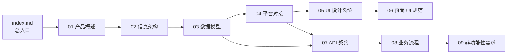

# Media Manager · 文档总入口

> 项目定位从「小红书采集工具」升级为「媒体账号管理系统」。
> v0.2 是一次系统性的架构重构，不是一次功能小补丁。

---

## 1. 文档元信息

| 项 | 值 |
|----|----|
| 项目名 | media-manager |
| 仓库路径 | `project/media-matrix/media-manager/` |
| 当前版本 | **v0.2** |
| 文档版本 | 2026-08-16 |
| 文档状态 | 🟡 编写中（9 篇主线文档 + 10 篇测试文档） |
| 维护者 | docs-arch-agent |
| 目标读者 | 新加入工程师 / 平台对接开发者 / 产品 / 测试 |

---

## 2. 文档目录结构

```
docs/
├── index.md                           ← 当前文档（总入口）
├── 01-product-overview.md             ← 产品定位与核心场景
├── 02-information-architecture.md     ← 导航与信息架构
├── 03-data-model.md                   ← 数据库设计（多平台解耦）
├── 04-platform-integration.md         ← 8 平台对接差异
├── 05-ui-design-system.md             ← Material Design 3 设计规范
├── 06-pages-ui-spec.md                ← 17 页 UI 详细规范
├── 07-api-contract.md                 ← API 契约
├── 08-business-flows.md               ← 业务流程时序
└── 09-non-functional.md               ← 非功能性需求
```

### 阅读顺序建议



---

## 3. 关键设计原则（必读）

下面这 6 条原则是整个 v0.2 文档的「纲领」，所有后续 9 篇文档都围绕它们展开：

### 3.1 项目重新定位
**media-manager 是一个媒体账号管理系统**，不是单平台采集工具。v0.2 起，系统在产品层面抽象「媒体账号」为统一管理对象，在数据层面将 8 个平台完全解耦。

### 3.2 4 块导航结构
主导航划分为 4 块一级菜单，每个块对应一个明确的能力域：

- 👤 **总览** —— 跨平台账号健康度与今日待办
- 📋 **媒体账号管理** —— 账号 CRUD、详情、绑定关系
- ⚡ **养号任务** —— 自动化养号流程、调度、历史
- ⚙️ **管理台配置** —— 系统设置、权限、操作日志

### 3.3 顶部 Tab：8 平台切换
进入「媒体账号管理」后，顶部提供 8 个平台 Tab，**互斥单选**：

> 🔴 小红书 ｜ 🧣 微博 ｜ 🎵 抖音 ｜ 💡 知乎 ｜ 🐦 Twitter ｜ 📺 B 站 ｜ 🎙️ 小宇宙 ｜ 📰 公众号

### 3.4 多平台数据库彻底解耦（核心架构决策）
v0.2 **取消** `platform_accounts.platform` 这种「单表 + 平台字段」的写法，改为**每平台一张独立的账号表**：

- `platform_accounts_xhs`（小红书）
- `platform_accounts_weibo`（微博）
- `platform_accounts_douyin`（抖音）
- `platform_accounts_zhihu`（知乎）
- `platform_accounts_twitter`（Twitter）
- `platform_accounts_bilibili`（B 站）
- `platform_accounts_xiaoyuzhou`（小宇宙）
- `platform_accounts_wechat_official`（公众号）

理由：每平台的字段语义差异巨大（小红书有「种草标签」、微博有「蓝 V 认证」、B 站有「粉丝勋章」等），强行塞进一张表会导致稀疏列与 JSON 字段泛滥。详见 `03-data-model.md`。

### 3.5 UI 严格遵循 Material Design 3
所有界面元素（颜色 token、字体层级、组件状态、动效曲线）必须符合 Material Design 3 规范。不引入 antd / element-plus 等风格的私有约定。详见 `05-ui-design-system.md`。

### 3.6 v0.2 范围：只完整实现小红书
其他 7 个平台在 v0.2 范围内**只做占位**：

- ✅ 小红书：完整采集、详情、养号任务、统计
- 🟡 其他 7 平台：导航可达、列表展示「该平台暂未支持」空状态
- 🔴 不实现：跨平台聚合分析（留给 v0.3）

---

## 4. 快速链接

- [产品概述](./01-product-overview.md)
- [信息架构](./02-information-architecture.md)
- [数据模型](./03-data-model.md)
- [平台对接](./04-platform-integration.md)
- [UI 设计规范](./05-ui-design-system.md)
- [页面 UI 规范](./06-pages-ui-spec.md)
- [API 契约](./07-api-contract.md)
- [业务流程](./08-business-flows.md)
- [非功能性需求](./09-non-functional.md)
- [测试策略总览](./tests/README.md)（含 10 篇测试案例文档）

---

## 5. 如何阅读（给新开发者）

如果你**刚加入项目**，建议按以下路径阅读，2 小时内建立全局心智模型：

1. **先读 [01-product-overview.md](./01-product-overview.md)** —— 15 分钟，搞清楚「我们在做什么、给谁用、成功长什么样」。
2. **再读 [02-information-architecture.md](./02-information-architecture.md)** —— 15 分钟，画出 4 块导航 + 顶部 8 Tab + 17 个页面在脑海里的地图。
3. **然后读 [03-data-model.md](./03-data-model.md)** —— 30 分钟，理解「为什么每平台一张表」以及表间关系，这是 v0.2 的架构核心。
4. **速览 [04-platform-integration.md](./04-platform-integration.md)** —— 20 分钟，了解 8 个平台在 anti-detection、登录方式、字段语义上的差异。
5. **根据角色选择：**
   - 🎨 **前端工程师** → [05 UI 设计规范](./05-ui-design-system.md) → [06 页面 UI 规范](./06-pages-ui-spec.md)
   - 🔧 **后端工程师** → [07 API 契约](./07-api-contract.md) → [08 业务流程](./08-business-flows.md)
   - 🧪 **测试 / QA** → [08 业务流程](./08-business-flows.md) → [09 非功能性需求](./09-non-functional.md)

> 💡 `06 + 07` 是日常开发的参考手册，写代码时随时翻阅，不必一次读完。

---

## 6. 变更日志：v0.1 → v0.2

| 维度 | v0.1（已废弃） | v0.2（当前） |
|------|---------------|-------------|
| **产品定位** | 小红书采集工具 | 媒体账号管理系统 |
| **一级导航** | 2 个顶级菜单（采集 / 设置） | 4 块结构（总览 / 账号 / 养号 / 配置） |
| **平台切换** | 单一小红书入口 | 顶部 8 平台 Tab |
| **数据库** | `platform_accounts` 单表 + `platform` 字段 | 每平台独立表（`platform_accounts_xhs` 等 8 张） |
| **前端 UI** | 自定义风格 | 严格 Material Design 3 |
| **页面数** | 6 页 | 17 页 |
| **平台支持范围** | 仅小红书 | 小红书完整 + 其他 7 平台占位 |
| **API 形态** | 单一 REST | REST + 平台子路径（`/api/v1/platforms/xhs/...`） |

> ⚠️ v0.1 文档已归档至 `reference/` 目录，仅供历史参考，不再维护。

---

## 7. Git 仓库信息

| 项 | 值 |
|----|----|
| 仓库地址 | https://github.com/your-org/media-manager |
| 默认分支 | `main`（生产环境） |
| 开发分支 | `develop`（集成测试） |
| 功能分支 | `feature/*`（个人功能，命名如 `feature/xhs-nurture-task`） |
| 修复分支 | `fix/*`（紧急修复，命名如 `fix/account-detail-404`） |
| 发布标签 | `v0.x.y`（语义化版本） |

### 分支流转
```
feature/* ──PR──▶ develop ──集成测试──▶ main ──tag──▶ v0.x.y
                                  │
                                  └──hotfix──▶ fix/* ──PR──▶ main
```

---

## 8. 贡献文档

如果发现文档缺失、错误或与代码不一致：

1. 在 `develop` 分支新建 `docs/*` 分支
2. 修改对应 `.md` 文件
3. 提交 PR，标题格式：`docs(<范围>): <一句话描述>`
4. 关联 Issue 标签：`documentation`

文档与代码同等重要，**任何接口字段变化必须同步更新 `03 / 07`**。

---

*最后更新：2026-08-16 · docs-arch-agent · 与 9 篇分文档并行编写*